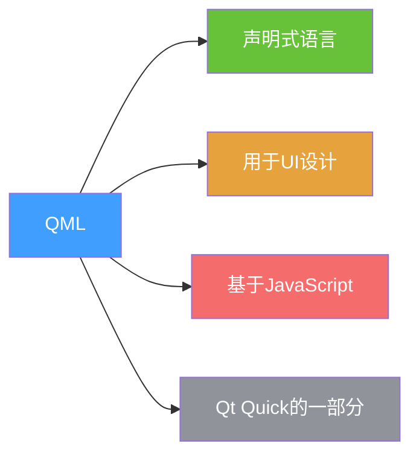
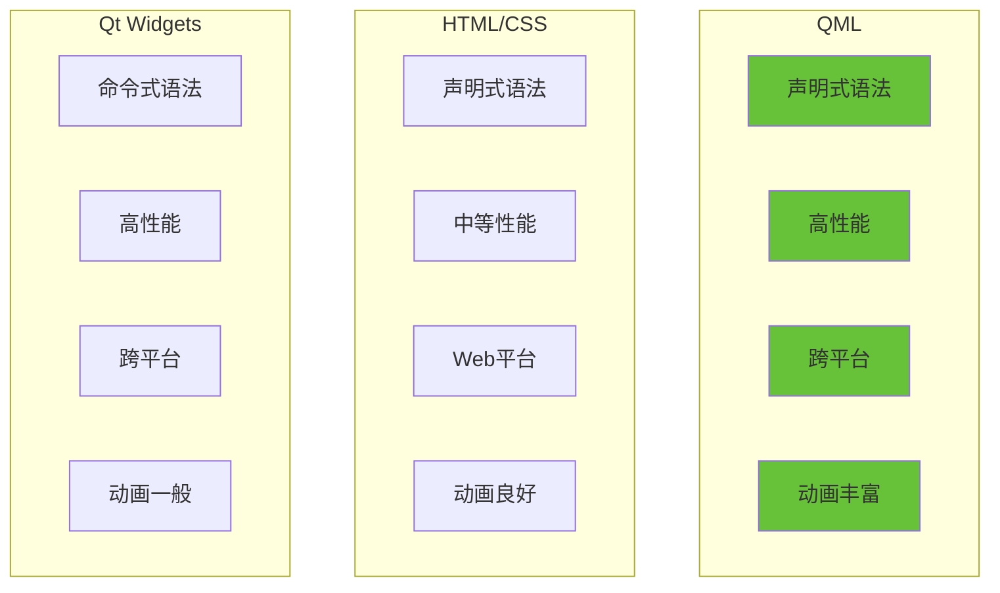
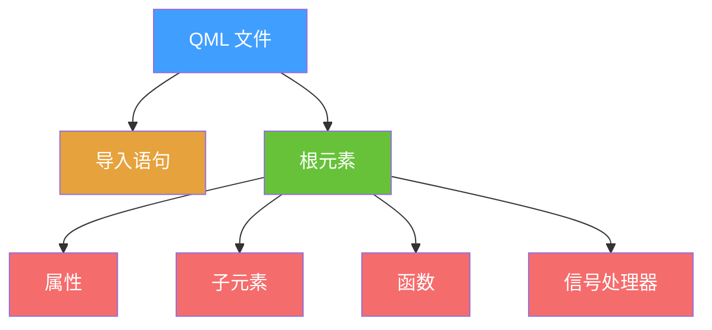
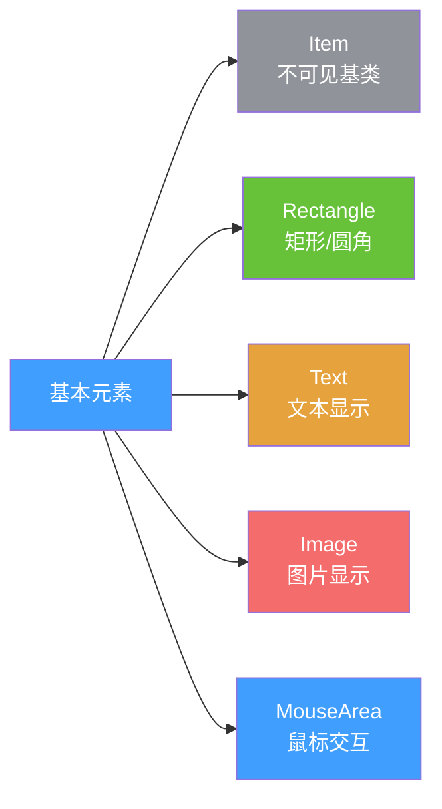
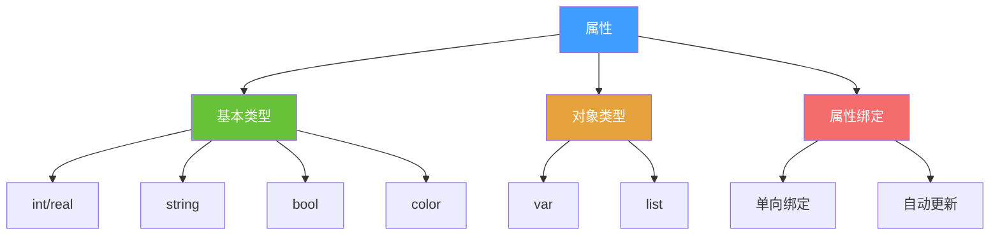
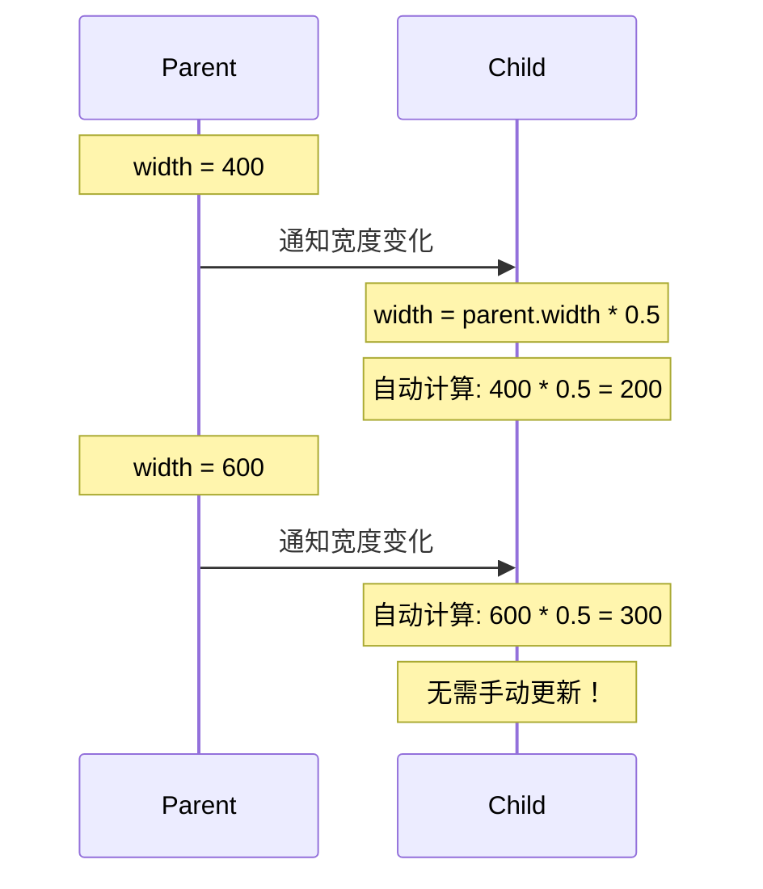
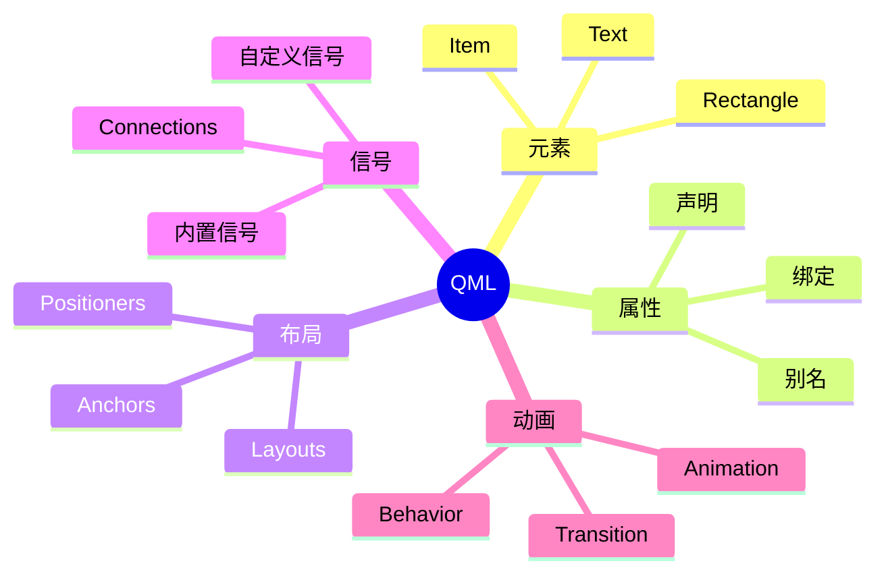
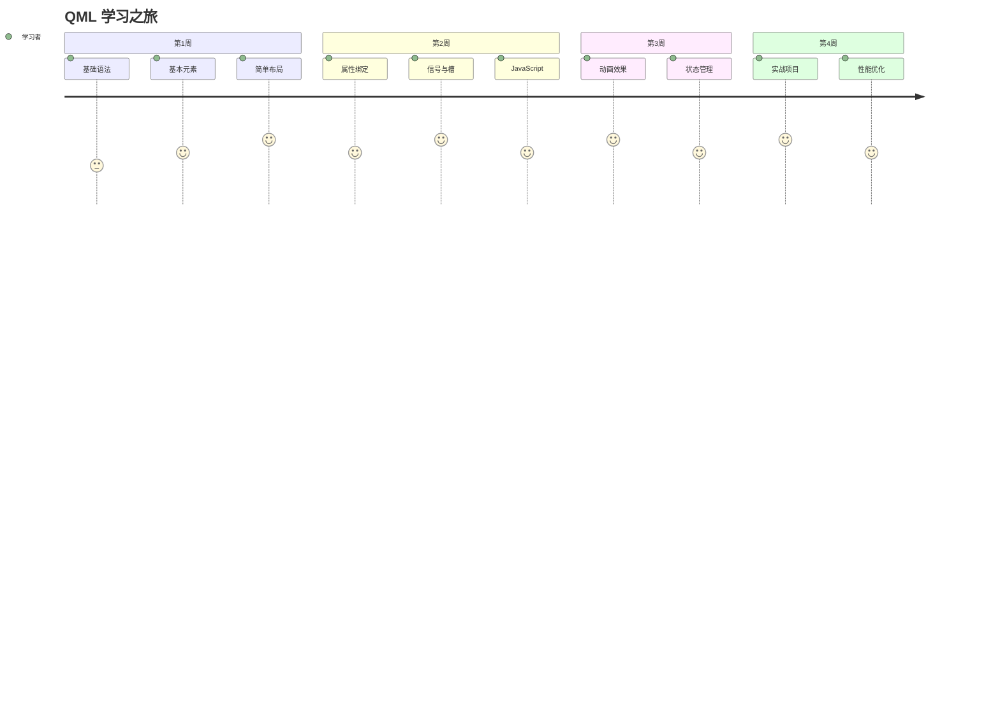
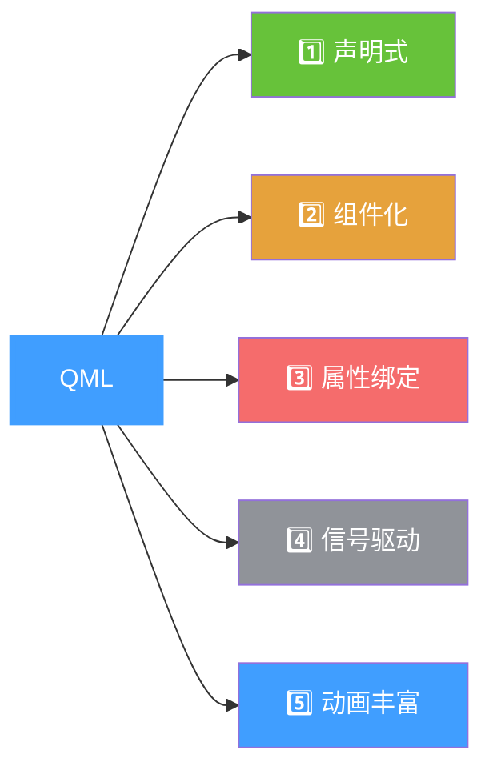

# QML 核心概念 - PPT 版 🎯

## 幻灯片 1: QML 是什么？



### 核心特点
- 🎨 **声明式** - 描述"是什么"而非"怎么做"
- ⚡ **高性能** - GPU 加速渲染
- 🔄 **动态绑定** - 属性自动更新
- 🧩 **组件化** - 易于复用

---

## 幻灯片 2: QML vs 其他技术



---

## 幻灯片 3: QML 文件结构



### 代码示例
```qml
import QtQuick 6.5          // 导入

Rectangle {                 // 根元素
    width: 400             // 属性
    height: 300
    color: "lightblue"
    
    Text {                 // 子元素
        text: "Hello"
        anchors.centerIn: parent
    }
    
    function sayHi() {     // 函数
        console.log("Hi!")
    }
    
    onClicked: sayHi()     // 信号处理器
}
```

---

## 幻灯片 4: 基本元素对比



### 使用场景
| 元素 | 用途 | 可见性 |
|------|------|--------|
| Item | 容器、布局 | ❌ |
| Rectangle | 背景、边框 | ✅ |
| Text | 文字显示 | ✅ |
| Image | 图片显示 | ✅ |
| MouseArea | 点击、拖拽 | ❌ |

---

## 幻灯片 5: 属性系统



### 示例对比

**❌ 静态赋值**
```qml
Rectangle {
    width: 200
    height: 100
}
```

**✅ 动态绑定**
```qml
Rectangle {
    width: parent.width * 0.5  // 自动跟随父元素
    height: width / 2          // 自动跟随宽度
}
```

---

## 幻灯片 6: 属性绑定原理



### 关键点
- 🔄 **自动更新** - 依赖变化时自动重新计算
- ⚡ **高效** - 只在需要时更新
- 🎯 **简洁** - 无需手动监听

---

## 幻灯片 7: 记忆口诀

### QML 五大核心



### 记忆技巧
1. **元素** = 积木块 🧱
2. **属性** = 积木的颜色和大小 🎨
3. **布局** = 积木的摆放方式 📐
4. **信号** = 积木之间的通信 📡
5. **动画** = 积木的移动方式 🎬

---

## 幻灯片 8: 快速参考卡

### 常用元素速查

| 图标 | 元素 | 一句话描述 |
|------|------|-----------|
| 📦 | Item | 万物之源，不可见容器 |
| 🟦 | Rectangle | 有颜色的矩形 |
| 📝 | Text | 显示文字 |
| 🖼️ | Image | 显示图片 |
| 👆 | MouseArea | 捕获鼠标事件 |
| ⬆️ | Column | 垂直排列 |
| ➡️ | Row | 水平排列 |
| 🔲 | Grid | 网格排列 |

---

## 幻灯片 9: 学习路线图



### 学习建议
- 📅 **每天 1-2 小时**
- 💻 **边学边练**
- 🎯 **做小项目**
- 👥 **加入社区**

---

## 幻灯片 10: 第一个程序

### Hello World 对比

**传统方式 (C++)**
```cpp
// 10+ 行代码
#include <QApplication>
#include <QLabel>
int main() {
    QApplication app;
    QLabel label("Hello");
    label.show();
    return app.exec();
}
```

**QML 方式**
```qml
// 3 行代码！
Text {
    text: "Hello World"
}
```

### 优势
- ✅ 代码更少
- ✅ 更易理解
- ✅ 更易维护

---

## 总结卡片

### 记住这 5 点



### 下一步
👉 学习布局系统
