# QML 实战案例图解 - PPT 版 🚀

## 幻灯片 1: 项目架构全景

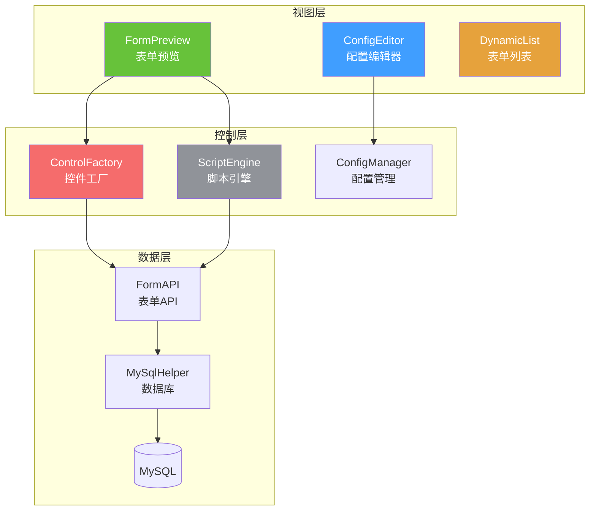

---

## 幻灯片 2: 工厂模式应用

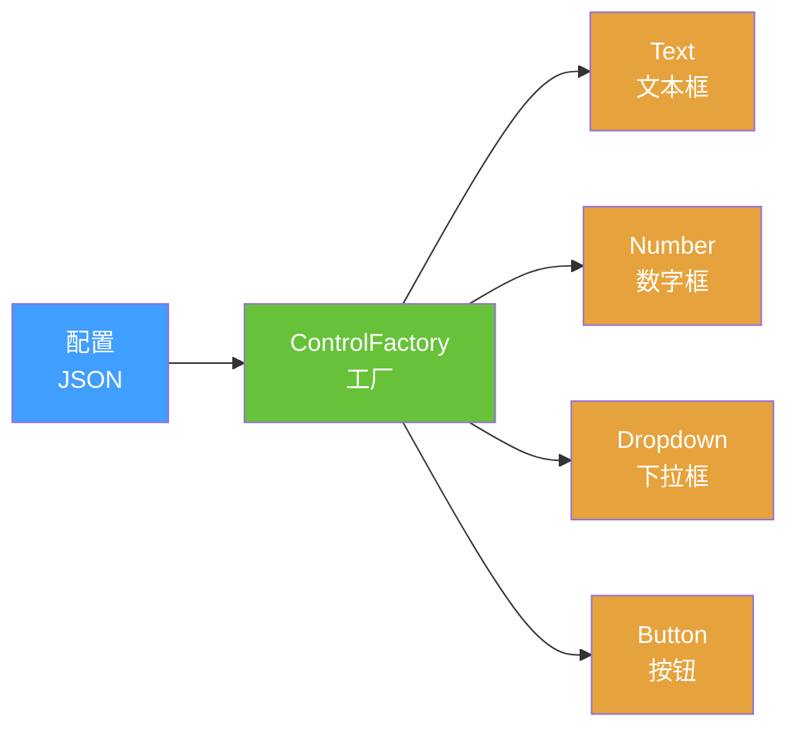

### 核心代码
```qml
function createControl(config) {
    switch(config.type) {
        case "text": return createTextField()
        case "number": return createSpinBox()
        case "dropdown": return createComboBox()
    }
}
```

---

## 幻灯片 3: 组件生命周期

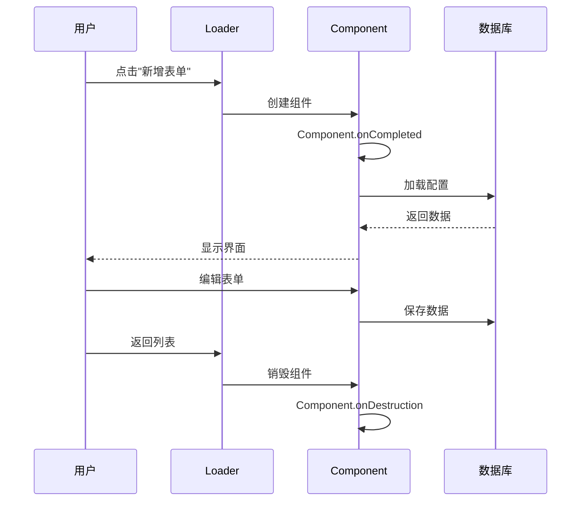

---

## 幻灯片 4: 数据流转图

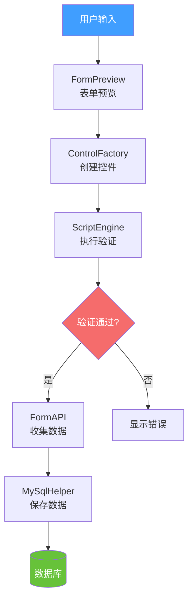

---

## 幻灯片 5: 动态表单系统核心流程

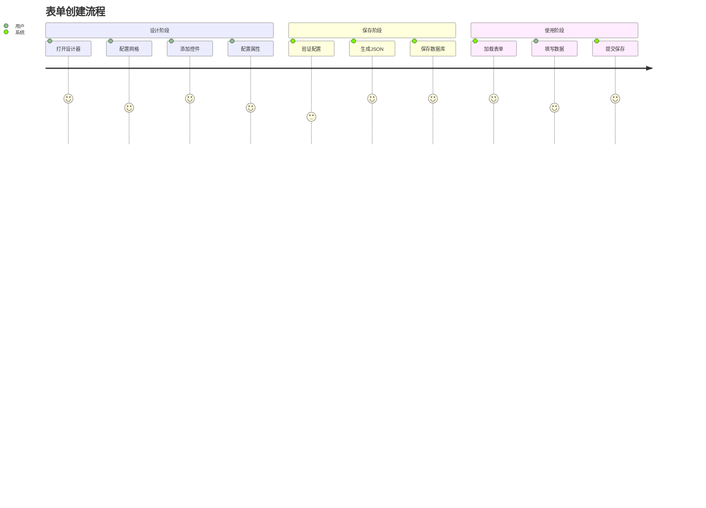

---

## 幻灯片 6: 控件创建流程

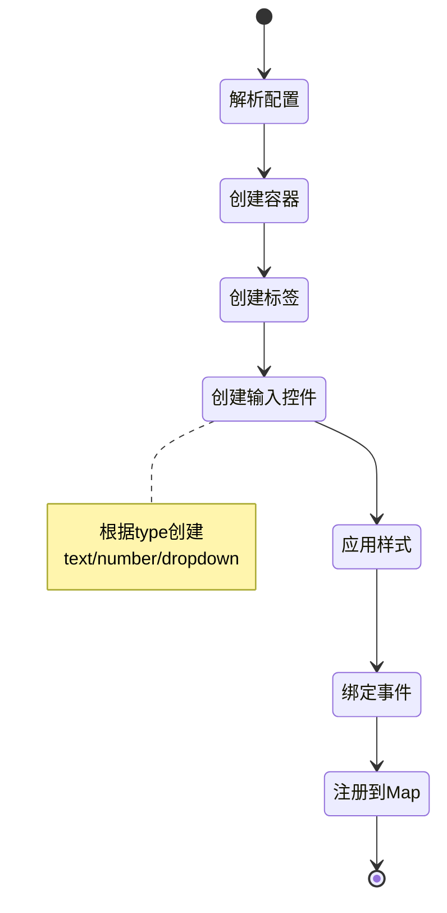

---

## 幻灯片 7: 事件处理机制

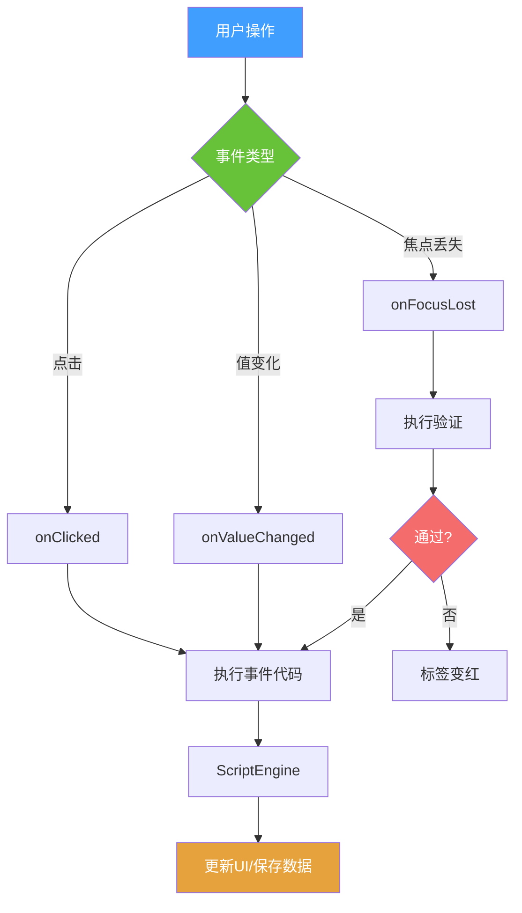

---

## 幻灯片 8: 组件通信模式

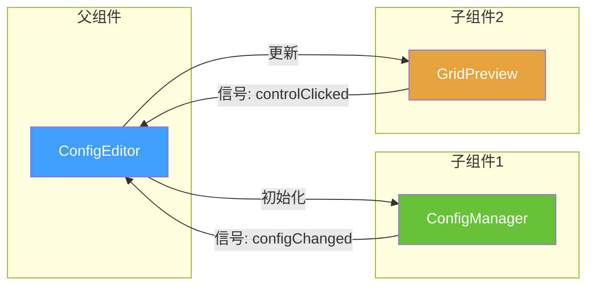

---

## 幻灯片 9: 性能优化策略

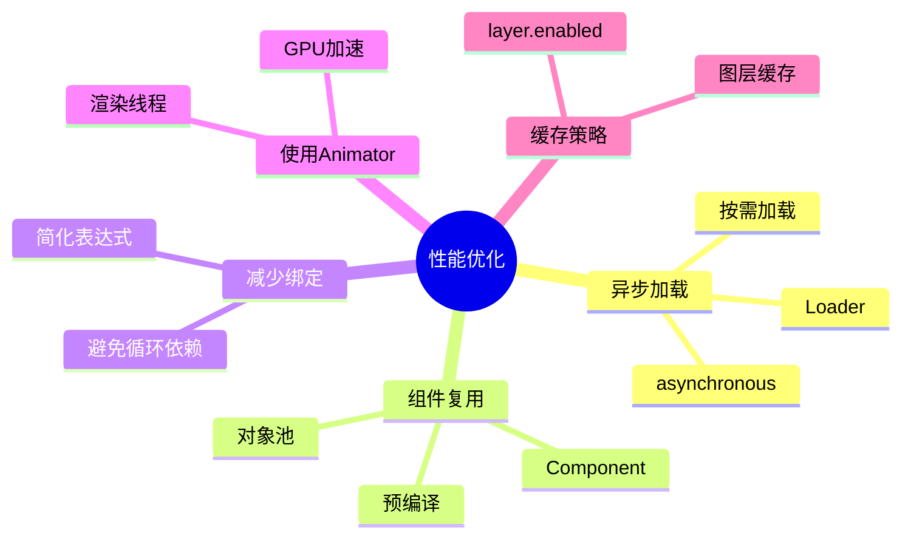

---

## 幻灯片 10: 常见问题解决

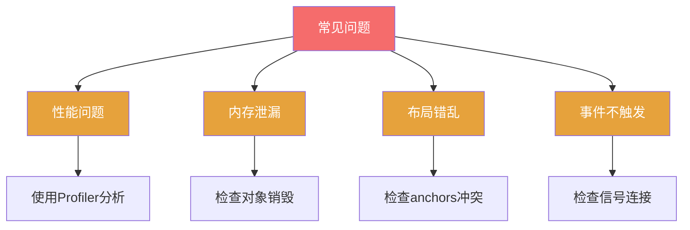

---

## 幻灯片 11: 项目文件结构

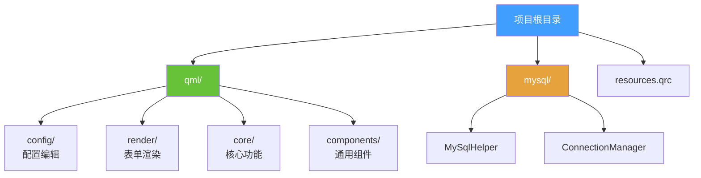

---

## 幻灯片 12: 设计模式应用

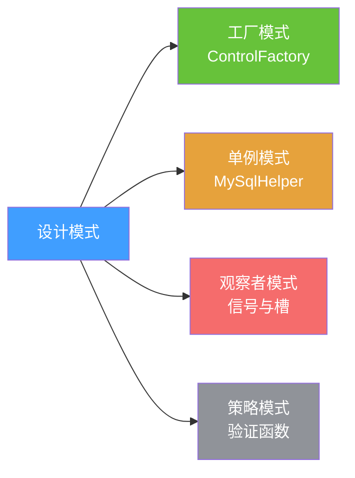

### 应用场景

| 模式 | 应用 | 优势 |
|------|------|------|
| 🏭 工厂 | 动态创建控件 | 解耦、易扩展 |
| 🔒 单例 | 数据库连接 | 资源共享 |
| 👀 观察者 | 配置变化通知 | 自动更新 |
| 🎯 策略 | 可插拔验证 | 灵活配置 |

---

## 幻灯片 13: 关键技术点

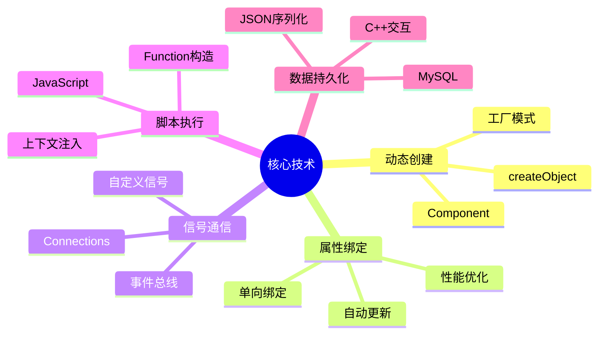

---

## 幻灯片 14: 开发流程

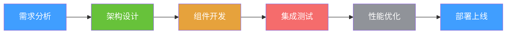

### 时间分配

| 阶段 | 占比 | 重点 |
|------|------|------|
| 需求分析 | 10% | 明确目标 |
| 架构设计 | 20% | 模块划分 |
| 组件开发 | 40% | 功能实现 |
| 集成测试 | 15% | 问题修复 |
| 性能优化 | 10% | 体验提升 |
| 部署上线 | 5% | 发布维护 |

---

## 幻灯片 15: 最佳实践总结

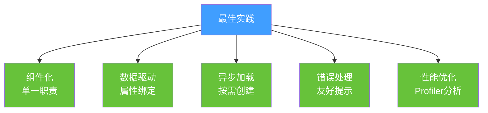

---

## 总结卡片

### 项目开发要点

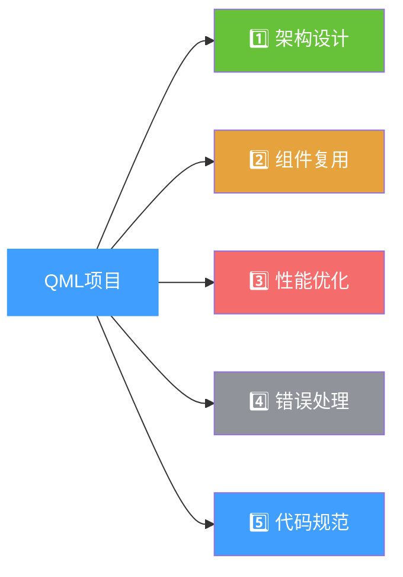

### 记住这些
- 🏗️ **架构** = 清晰分层
- 🧩 **组件** = 高内聚低耦合
- ⚡ **性能** = Profiler + Animator
- 🛡️ **错误** = try-catch + 提示
- 📝 **规范** = 注释 + 命名

### 下一步
👉 实战练习项目
