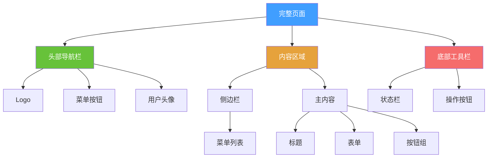
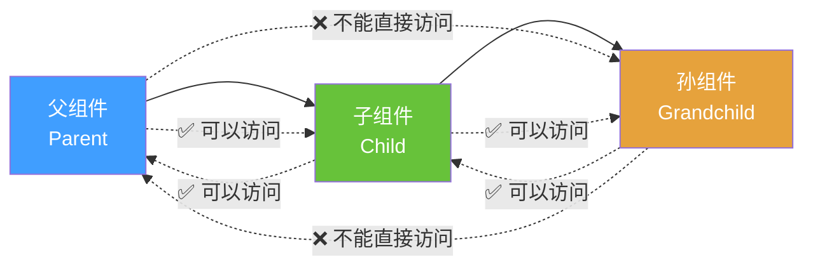
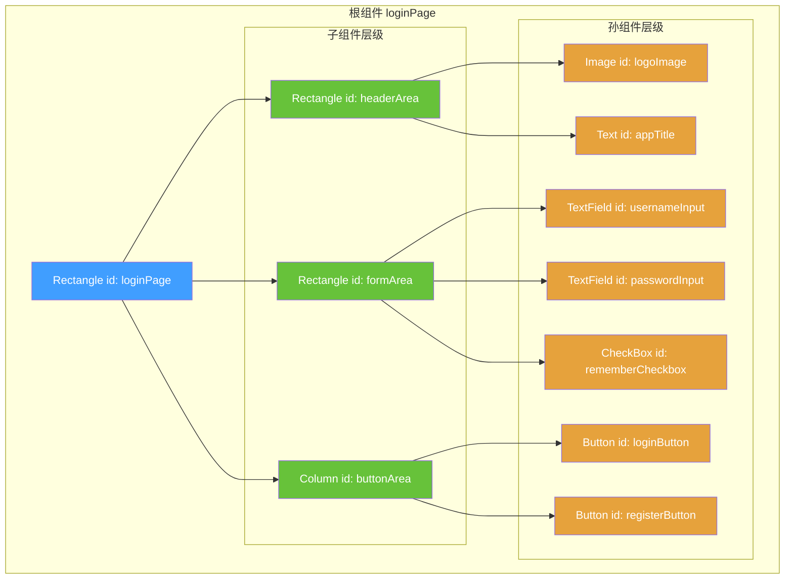
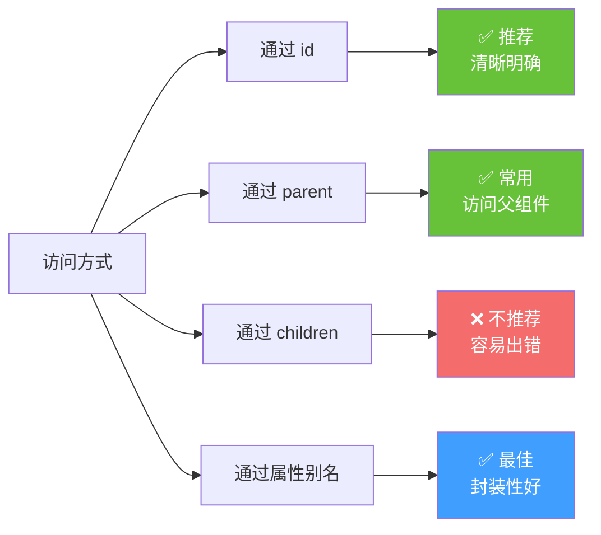
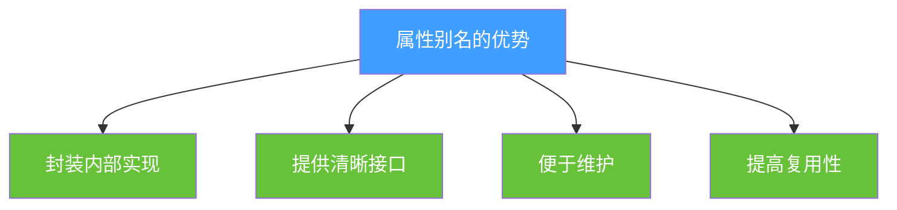
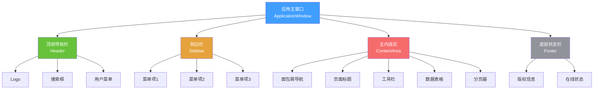
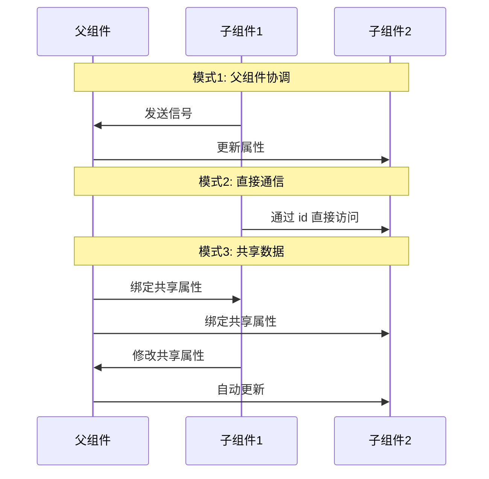
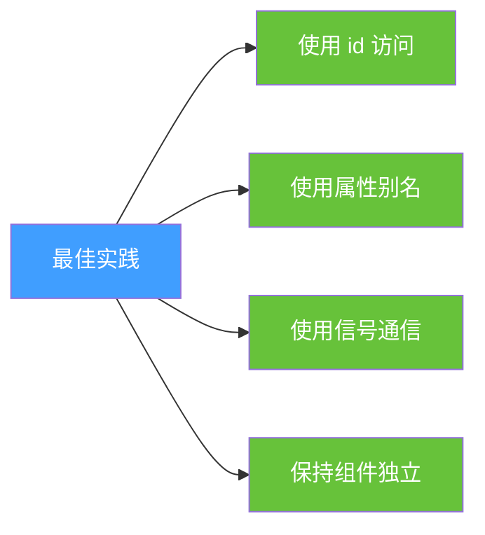

# QML 组件组合与父子访问详解 - PPT 版 🏗️

## 幻灯片 1: 组件组合概览

### 🎯 什么是组件组合？

组件组合就像搭积木，将多个小组件组合成复杂的界面。



### 📸 参考图片
- [Material Design 组件](https://material.io/components)
- [Ant Design 组件库](https://ant.design/components/overview-cn/)
- [Element UI 组件](https://element.eleme.io/#/zh-CN/component/layout)

---

## 幻灯片 2: 父子访问关系核心规则



### 🔑 访问规则总结

| 访问方向 | 是否可以 | 访问方式 | 示例 |
|----------|----------|----------|------|
| 父 → 子 | ✅ 可以 | 通过 id | `childItem.property` |
| 父 → 孙 | ❌ 不能直接 | 需要通过子 | `childItem.grandchild.property` |
| 子 → 父 | ✅ 可以 | parent 关键字 | `parent.property` |
| 孙 → 父 | ❌ 不能直接 | parent.parent | `parent.parent.property` |
| 兄弟 → 兄弟 | ✅ 可以 | 通过 id | `siblingItem.property` |

---

## 幻灯片 3: 实战示例 - 登录页面组合

### 完整页面结构

```qml
// LoginPage.qml - 完整登录页面
import QtQuick 2.15
import QtQuick.Controls 2.15
import QtQuick.Layouts 1.15

Rectangle {
    id: loginPage  // 根组件
    width: 400
    height: 600
    color: "#f5f5f5"
    
    // 📦 组件1: 顶部Logo区域
    Rectangle {
        id: headerArea
        anchors.top: parent.top
        anchors.horizontalCenter: parent.horizontalCenter
        width: parent.width
        height: 150
        color: "#409EFF"
        
        Column {
            anchors.centerIn: parent
            spacing: 10
            
            Image {
                id: logoImage
                source: "qrc:/images/logo.png"
                width: 80
                height: 80
                anchors.horizontalCenter: parent.horizontalCenter
            }
            
            Text {
                id: appTitle
                text: "欢迎登录"
                font.pixelSize: 24
                color: "white"
                anchors.horizontalCenter: parent.horizontalCenter
            }
        }
    }
    
    // 📦 组件2: 表单区域
    Rectangle {
        id: formArea
        anchors.top: headerArea.bottom
        anchors.topMargin: 30
        anchors.horizontalCenter: parent.horizontalCenter
        width: parent.width - 60
        height: 250
        color: "white"
        radius: 10
        
        ColumnLayout {
            anchors.fill: parent
            anchors.margins: 20
            spacing: 15
            
            // 用户名输入框
            Column {
                spacing: 5
                Layout.fillWidth: true
                
                Text {
                    text: "用户名"
                    font.pixelSize: 14
                    color: "#666"
                }
                
                TextField {
                    id: usernameInput
                    width: parent.width
                    placeholderText: "请输入用户名"
                    
                    // ✅ 子组件可以访问父组件
                    onTextChanged: {
                        // 访问父组件的父组件
                        loginPage.validateForm()
                    }
                }
            }
            
            // 密码输入框
            Column {
                spacing: 5
                Layout.fillWidth: true
                
                Text {
                    text: "密码"
                    font.pixelSize: 14
                    color: "#666"
                }
                
                TextField {
                    id: passwordInput
                    width: parent.width
                    placeholderText: "请输入密码"
                    echoMode: TextInput.Password
                }
            }
            
            // 记住密码选项
            Row {
                spacing: 10
                
                CheckBox {
                    id: rememberCheckbox
                    text: "记住密码"
                }
            }
        }
    }
    
    // 📦 组件3: 按钮区域
    Column {
        id: buttonArea
        anchors.top: formArea.bottom
        anchors.topMargin: 20
        anchors.horizontalCenter: parent.horizontalCenter
        width: parent.width - 60
        spacing: 15
        
        Button {
            id: loginButton
            width: parent.width
            height: 45
            text: "登录"
            
            background: Rectangle {
                color: loginButton.pressed ? "#3a8ee6" : "#409EFF"
                radius: 5
            }
            
            contentItem: Text {
                text: loginButton.text
                color: "white"
                horizontalAlignment: Text.AlignHCenter
                verticalAlignment: Text.AlignVCenter
            }
            
            onClicked: {
                // ✅ 访问兄弟组件的子组件
                console.log("用户名:", formArea.children[0].children[1].text)
                // ❌ 更好的方式：通过 id 访问
                console.log("用户名:", usernameInput.text)
                console.log("密码:", passwordInput.text)
                
                // ✅ 调用父组件的方法
                loginPage.performLogin()
            }
        }
        
        Button {
            id: registerButton
            width: parent.width
            height: 45
            text: "注册新账号"
            flat: true
        }
    }
    
    // 📦 根组件的方法
    function validateForm() {
        // ✅ 父组件可以访问子组件
        var isValid = usernameInput.text.length > 0 && 
                      passwordInput.text.length > 0
        loginButton.enabled = isValid
    }
    
    function performLogin() {
        // ✅ 父组件访问多个子组件
        console.log("执行登录...")
        console.log("用户名:", usernameInput.text)
        console.log("密码:", passwordInput.text)
        console.log("记住密码:", rememberCheckbox.checked)
    }
}
```

---

## 幻灯片 4: 父子访问详细图解



### 访问示例代码

```qml
// 在 loginPage (根组件) 中：
function example1() {
    // ✅ 访问直接子组件
    headerArea.color = "red"
    formArea.visible = false
    
    // ✅ 访问孙组件（通过 id）
    usernameInput.text = "admin"
    loginButton.enabled = true
    
    // ❌ 错误方式：通过层级访问
    // formArea.children[0].children[1].text = "admin"  // 不推荐
}

// 在 usernameInput (孙组件) 中：
onTextChanged: {
    // ✅ 访问父组件
    parent.color = "yellow"
    
    // ✅ 访问祖父组件
    parent.parent.color = "blue"
    
    // ✅ 访问根组件（通过 id）
    loginPage.validateForm()
    
    // ✅ 访问兄弟组件（通过 id）
    passwordInput.focus = true
}

// 在 loginButton (孙组件) 中：
onClicked: {
    // ✅ 访问其他孙组件（通过 id）
    console.log(usernameInput.text)
    console.log(passwordInput.text)
    
    // ✅ 访问根组件方法
    loginPage.performLogin()
}
```

---

## 幻灯片 5: 访问方式对比



### 代码对比

```qml
// ❌ 方式1: 通过 children 索引（不推荐）
formArea.children[0].children[1].text = "admin"
// 问题：索引可能变化，代码难以维护

// ✅ 方式2: 通过 id（推荐）
usernameInput.text = "admin"
// 优点：清晰明确，不会出错

// ✅ 方式3: 通过 parent（常用）
parent.width
parent.parent.color
// 优点：访问父组件很方便

// ✅ 方式4: 通过属性别名（最佳）
// 在组件定义中：
property alias username: usernameInput.text
property alias password: passwordInput.text

// 使用时：
loginPage.username = "admin"
console.log(loginPage.password)
// 优点：封装性好，接口清晰
```

---

## 幻灯片 6: 属性别名 - 最佳实践

### 🎯 为什么使用属性别名？



### 完整示例

```qml
// LoginForm.qml - 封装良好的登录表单组件
import QtQuick 2.15
import QtQuick.Controls 2.15

Rectangle {
    id: root
    width: 340
    height: 250
    color: "white"
    radius: 10
    
    // ✅ 对外暴露的属性（属性别名）
    property alias username: usernameInput.text
    property alias password: passwordInput.text
    property alias rememberMe: rememberCheckbox.checked
    property alias loginEnabled: loginButton.enabled
    
    // ✅ 对外暴露的信号
    signal loginClicked()
    signal registerClicked()
    
    Column {
        anchors.fill: parent
        anchors.margins: 20
        spacing: 15
        
        // 内部实现细节
        TextField {
            id: usernameInput
            width: parent.width
            placeholderText: "用户名"
        }
        
        TextField {
            id: passwordInput
            width: parent.width
            placeholderText: "密码"
            echoMode: TextInput.Password
        }
        
        CheckBox {
            id: rememberCheckbox
            text: "记住密码"
        }
        
        Button {
            id: loginButton
            width: parent.width
            text: "登录"
            onClicked: root.loginClicked()
        }
        
        Button {
            width: parent.width
            text: "注册"
            onClicked: root.registerClicked()
        }
    }
}
```

### 使用封装好的组件

```qml
// 在其他地方使用
LoginForm {
    id: loginForm
    anchors.centerIn: parent
    
    // ✅ 通过属性别名访问
    username: "admin"
    
    // ✅ 连接信号
    onLoginClicked: {
        console.log("用户名:", loginForm.username)
        console.log("密码:", loginForm.password)
        console.log("记住密码:", loginForm.rememberMe)
    }
}

// ✅ 外部访问也很方便
Button {
    text: "自动填充"
    onClicked: {
        loginForm.username = "test@example.com"
        loginForm.password = "123456"
    }
}
```

---

## 幻灯片 7: 复杂页面组合实战

### 📱 完整应用页面结构



### 完整代码示例

```qml
// MainWindow.qml
import QtQuick 2.15
import QtQuick.Controls 2.15
import QtQuick.Layouts 1.15

ApplicationWindow {
    id: mainWindow
    visible: true
    width: 1200
    height: 800
    title: "企业管理系统"
    
    // 对外属性
    property string currentUser: "管理员"
    property string currentPage: "dashboard"
    
    // 顶部导航栏
    header: Rectangle {
        id: headerBar
        height: 60
        color: "#409EFF"
        
        RowLayout {
            anchors.fill: parent
            anchors.margins: 10
            spacing: 20
            
            // Logo
            Image {
                source: "qrc:/images/logo.png"
                Layout.preferredWidth: 40
                Layout.preferredHeight: 40
            }
            
            Text {
                text: "企业管理系统"
                color: "white"
                font.pixelSize: 20
                font.bold: true
            }
            
            // 搜索框
            TextField {
                id: searchInput
                Layout.fillWidth: true
                Layout.preferredHeight: 35
                placeholderText: "搜索..."
            }
            
            // 用户菜单
            Button {
                text: mainWindow.currentUser
                onClicked: userMenu.open()
                
                Menu {
                    id: userMenu
                    y: parent.height
                    
                    MenuItem { text: "个人设置" }
                    MenuItem { text: "退出登录" }
                }
            }
        }
    }
    
    // 主内容区
    RowLayout {
        anchors.fill: parent
        spacing: 0
        
        // 侧边栏
        Rectangle {
            id: sidebar
            Layout.preferredWidth: 200
            Layout.fillHeight: true
            color: "#2c3e50"
            
            Column {
                anchors.fill: parent
                anchors.margins: 10
                spacing: 5
                
                Repeater {
                    model: ["仪表盘", "用户管理", "数据分析", "系统设置"]
                    
                    delegate: Button {
                        width: parent.width
                        height: 40
                        text: modelData
                        flat: true
                        
                        background: Rectangle {
                            color: mainWindow.currentPage === modelData ? 
                                   "#34495e" : "transparent"
                            radius: 5
                        }
                        
                        contentItem: Text {
                            text: parent.text
                            color: "white"
                            horizontalAlignment: Text.AlignLeft
                            verticalAlignment: Text.AlignVCenter
                            leftPadding: 10
                        }
                        
                        onClicked: {
                            mainWindow.currentPage = modelData
                            contentLoader.source = modelData + ".qml"
                        }
                    }
                }
            }
        }
        
        // 主内容区域
        Rectangle {
            Layout.fillWidth: true
            Layout.fillHeight: true
            color: "#ecf0f1"
            
            ColumnLayout {
                anchors.fill: parent
                anchors.margins: 20
                spacing: 15
                
                // 面包屑导航
                Row {
                    spacing: 10
                    
                    Text { text: "首页" }
                    Text { text: ">" }
                    Text { text: mainWindow.currentPage }
                }
                
                // 页面标题
                Text {
                    text: mainWindow.currentPage
                    font.pixelSize: 24
                    font.bold: true
                }
                
                // 动态加载的内容
                Loader {
                    id: contentLoader
                    Layout.fillWidth: true
                    Layout.fillHeight: true
                    source: "Dashboard.qml"
                }
            }
        }
    }
    
    // 底部状态栏
    footer: Rectangle {
        height: 30
        color: "#34495e"
        
        RowLayout {
            anchors.fill: parent
            anchors.margins: 5
            
            Text {
                text: "© 2024 企业管理系统"
                color: "white"
                font.pixelSize: 12
            }
            
            Item { Layout.fillWidth: true }
            
            Rectangle {
                width: 10
                height: 10
                radius: 5
                color: "#67C23A"
            }
            
            Text {
                text: "在线"
                color: "white"
                font.pixelSize: 12
            }
        }
    }
}
```

---

## 幻灯片 8: 组件通信模式



### 三种通信模式代码

```qml
// 模式1: 父组件协调（推荐）
Rectangle {
    id: parent
    
    Button {
        id: button1
        text: "按钮1"
        onClicked: parent.handleButton1Click()
    }
    
    Text {
        id: text1
    }
    
    function handleButton1Click() {
        text1.text = "按钮1被点击"
    }
}

// 模式2: 直接通信（简单场景）
Rectangle {
    Button {
        id: button2
        onClicked: text2.text = "直接更新"
    }
    
    Text {
        id: text2
    }
}

// 模式3: 共享数据（复杂场景）
Rectangle {
    id: parent
    property string sharedData: ""
    
    TextField {
        text: parent.sharedData
        onTextChanged: parent.sharedData = text
    }
    
    Text {
        text: parent.sharedData  // 自动同步
    }
}
```

---

## 幻灯片 9: 最佳实践总结

### ✅ 推荐做法



| 场景 | 推荐方式 | 原因 |
|------|----------|------|
| 访问子组件 | 通过 id | 清晰明确 |
| 访问父组件 | parent 关键字 | 简单直接 |
| 组件封装 | 属性别名 | 接口清晰 |
| 组件通信 | 信号机制 | 解耦合 |
| 跨层访问 | 避免或使用 id | 减少依赖 |

### ❌ 避免做法

| 错误做法 | 问题 | 正确做法 |
|----------|------|----------|
| `children[0].property` | 索引可能变化 | 使用 id |
| `parent.parent.parent` | 耦合度太高 | 使用信号或属性 |
| 直接修改内部组件 | 破坏封装 | 使用属性别名 |
| 循环引用 | 导致错误 | 重新设计结构 |

---

## 幻灯片 10: 参考资源

### 📚 在线图片资源

1. **UI 设计参考**
   - [Dribbble - UI Design](https://dribbble.com/tags/ui)
   - [Behance - Interface Design](https://www.behance.net/search/projects?search=interface)
   - [Pinterest - UI Components](https://www.pinterest.com/search/pins/?q=ui%20components)

2. **组件库参考**
   - [Material Design](https://material.io/design)
   - [Ant Design](https://ant.design/)
   - [Element UI](https://element.eleme.io/)
   - [Fluent UI](https://developer.microsoft.com/en-us/fluentui)

3. **图标资源**
   - [Font Awesome](https://fontawesome.com/)
   - [Material Icons](https://fonts.google.com/icons)
   - [Feather Icons](https://feathericons.com/)

4. **配色方案**
   - [Coolors](https://coolors.co/)
   - [Adobe Color](https://color.adobe.com/)
   - [Material Palette](https://www.materialpalette.com/)

### 🎨 设计工具
- Figma
- Sketch
- Adobe XD
- Qt Design Studio

---

<div align="center">

## 🎯 核心要点

**组件组合 = 搭积木**
**父子访问 = 有规则的沟通**
**属性别名 = 清晰的接口**

掌握这三点，你就能构建任何复杂的 QML 应用！ 🚀

</div>
