# QML 美观图表与资源大全 - PPT 版 🎨

## 幻灯片 1: 在线图片资源库

### 🖼️ 免费高质量图片网站

| 网站 | 特点 | 链接 | 适用场景 |
|------|------|------|----------|
| **Unsplash** | 高质量摄影作品 | [unsplash.com](https://unsplash.com) | 背景图、Banner |
| **Pexels** | 图片+视频 | [pexels.com](https://www.pexels.com) | 多媒体应用 |
| **Pixabay** | 多语言支持 | [pixabay.com](https://pixabay.com) | 通用素材 |
| **Freepik** | 矢量图+PSD | [freepik.com](https://www.freepik.com) | UI 设计 |
| **unDraw** | 插画素材 | [undraw.co](https://undraw.co) | 空状态页面 |

### 🎨 UI 设计参考

| 平台 | 特点 | 链接 | 用途 |
|------|------|------|------|
| **Dribbble** | 设计师作品展示 | [dribbble.com](https://dribbble.com) | 界面灵感 |
| **Behance** | Adobe 设计社区 | [behance.net](https://www.behance.net) | 完整项目 |
| **Pinterest** | 图片收藏 | [pinterest.com](https://www.pinterest.com) | 素材收集 |
| **Awwwards** | 优秀网站设计 | [awwwards.com](https://www.awwwards.com) | 交互设计 |
| **Mobbin** | 移动应用设计 | [mobbin.com](https://mobbin.com) | App 界面 |

---

## 幻灯片 2: 图标资源库

### ⭐ 免费图标库

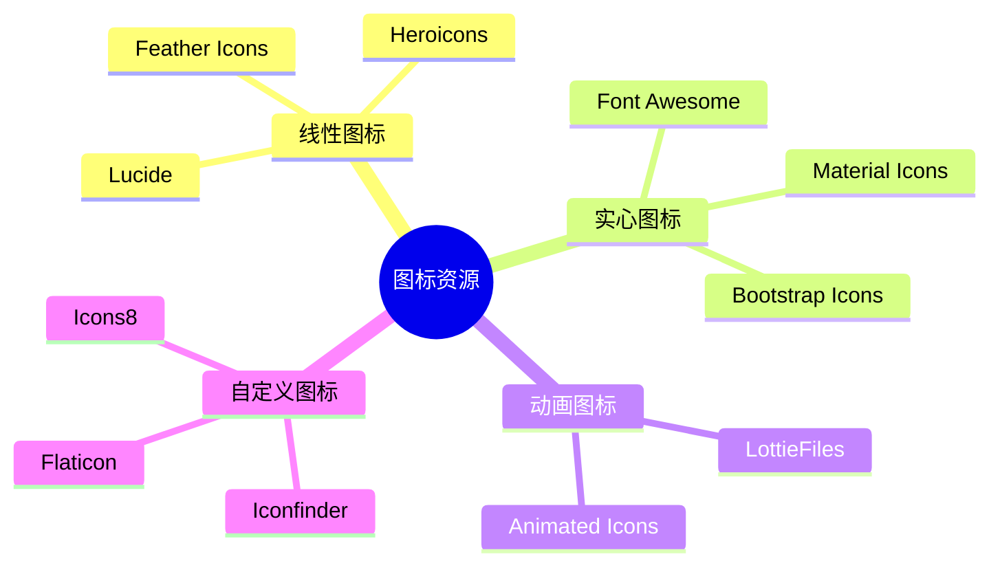

### 推荐图标库详情

| 图标库 | 数量 | 格式 | 链接 | 特点 |
|--------|------|------|------|------|
| **Font Awesome** | 2000+ | SVG, Web Font | [fontawesome.com](https://fontawesome.com) | 最流行 |
| **Material Icons** | 2000+ | SVG, PNG | [fonts.google.com/icons](https://fonts.google.com/icons) | Google 官方 |
| **Feather Icons** | 280+ | SVG | [feathericons.com](https://feathericons.com) | 简洁美观 |
| **Heroicons** | 230+ | SVG | [heroicons.com](https://heroicons.com) | Tailwind 团队 |
| **Lucide** | 1000+ | SVG | [lucide.dev](https://lucide.dev) | Feather 分支 |
| **Bootstrap Icons** | 1800+ | SVG, Web Font | [icons.getbootstrap.com](https://icons.getbootstrap.com) | Bootstrap 官方 |
| **Ionicons** | 1300+ | SVG, Web Font | [ionic.io/ionicons](https://ionic.io/ionicons) | 移动优先 |

---

## 幻灯片 3: 配色方案工具

### 🎨 配色工具对比

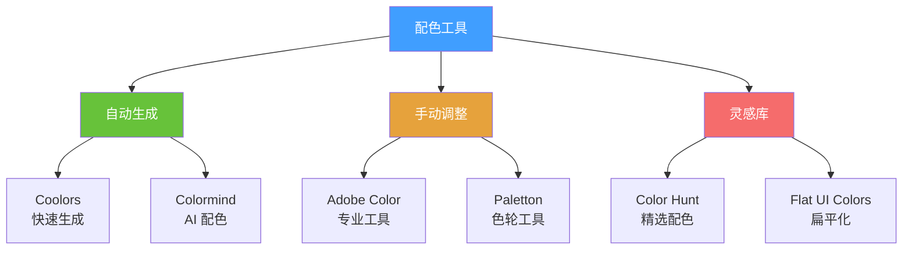

### 常用配色方案

#### 1. 商务风格
```
主色: #2C3E50 (深蓝灰)
辅色: #3498DB (亮蓝)
强调: #E74C3C (红色)
背景: #ECF0F1 (浅灰)
文字: #2C3E50 (深色)
```

#### 2. 清新风格
```
主色: #1ABC9C (青绿)
辅色: #16A085 (深青)
强调: #F39C12 (橙色)
背景: #FFFFFF (白色)
文字: #34495E (深灰)
```

#### 3. 科技风格
```
主色: #9B59B6 (紫色)
辅色: #8E44AD (深紫)
强调: #3498DB (蓝色)
背景: #2C3E50 (深色)
文字: #ECF0F1 (浅色)
```

#### 4. 温暖风格
```
主色: #E67E22 (橙色)
辅色: #D35400 (深橙)
强调: #F39C12 (黄橙)
背景: #FFF8DC (米色)
文字: #5D4037 (棕色)
```

---

## 幻灯片 4: 字体资源

### 📝 免费字体推荐

| 字体 | 类型 | 适用场景 | 下载链接 |
|------|------|----------|----------|
| **Roboto** | 无衬线 | 通用界面 | [Google Fonts](https://fonts.google.com/specimen/Roboto) |
| **Open Sans** | 无衬线 | 正文阅读 | [Google Fonts](https://fonts.google.com/specimen/Open+Sans) |
| **Lato** | 无衬线 | 现代设计 | [Google Fonts](https://fonts.google.com/specimen/Lato) |
| **Montserrat** | 无衬线 | 标题 | [Google Fonts](https://fonts.google.com/specimen/Montserrat) |
| **Source Code Pro** | 等宽 | 代码显示 | [Google Fonts](https://fonts.google.com/specimen/Source+Code+Pro) |
| **思源黑体** | 中文 | 中文界面 | [Adobe Fonts](https://source.typekit.com/source-han-sans/) |
| **阿里巴巴普惠体** | 中文 | 商业免费 | [Alibaba Fonts](https://www.alibabafonts.com/) |

### 字体搭配建议

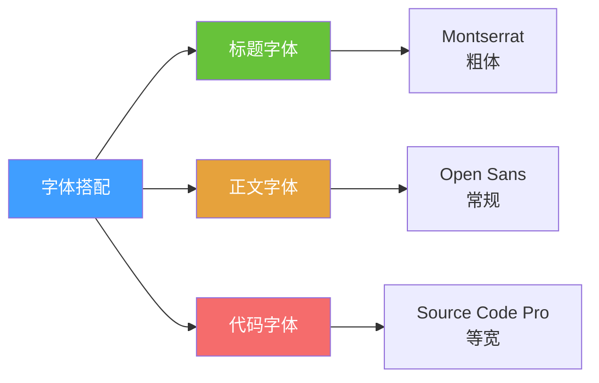

---

## 幻灯片 5: UI 组件库参考

### 🧩 主流 UI 框架对比

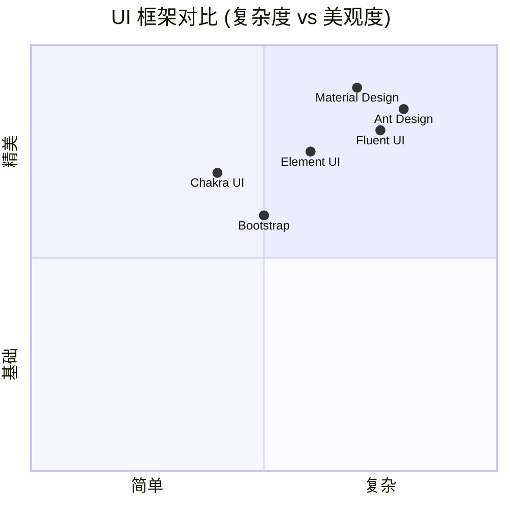

### 组件库详情

| 框架 | 风格 | 组件数 | 文档 | 适用 |
|------|------|--------|------|------|
| **Material Design** | Google 风格 | 50+ | ⭐⭐⭐⭐⭐ | 通用应用 |
| **Ant Design** | 企业级 | 60+ | ⭐⭐⭐⭐⭐ | 后台系统 |
| **Element UI** | 简洁 | 50+ | ⭐⭐⭐⭐ | 管理系统 |
| **Fluent UI** | Microsoft 风格 | 40+ | ⭐⭐⭐⭐ | 办公应用 |
| **Bootstrap** | 经典 | 30+ | ⭐⭐⭐⭐⭐ | 快速原型 |

### 参考链接
- [Material Design](https://material.io/design)
- [Ant Design](https://ant.design/)
- [Element UI](https://element.eleme.io/)
- [Fluent UI](https://developer.microsoft.com/en-us/fluentui)
- [Bootstrap](https://getbootstrap.com/)

---

## 幻灯片 6: 动画效果参考

### 🎬 动画库和工具

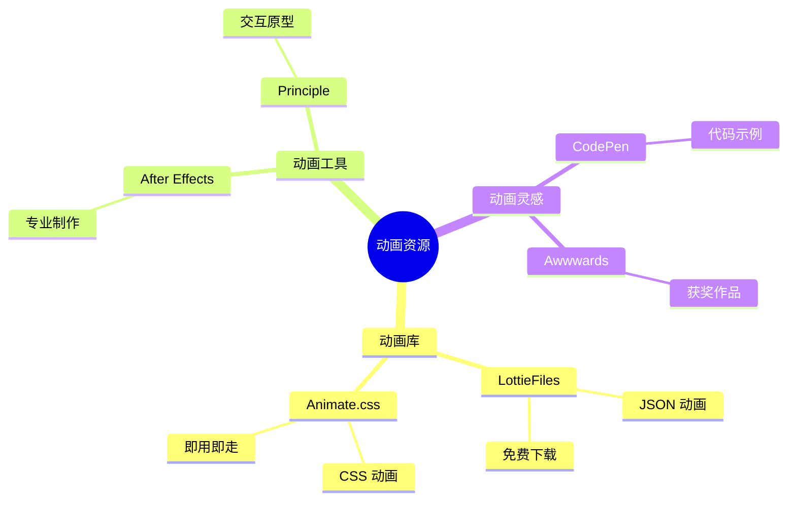

### 推荐动画资源

| 资源 | 类型 | 链接 | 用途 |
|------|------|------|------|
| **LottieFiles** | JSON 动画 | [lottiefiles.com](https://lottiefiles.com) | 加载动画、图标动画 |
| **Animate.css** | CSS 动画库 | [animate.style](https://animate.style) | 入场动画 |
| **Animista** | CSS 动画生成 | [animista.net](https://animista.net) | 自定义动画 |
| **Cubic-bezier** | 缓动函数 | [cubic-bezier.com](https://cubic-bezier.com) | 动画曲线 |
| **Easings** | 缓动参考 | [easings.net](https://easings.net) | 缓动效果 |

---

## 幻灯片 7: 渐变色生成器

### 🌈 渐变工具推荐

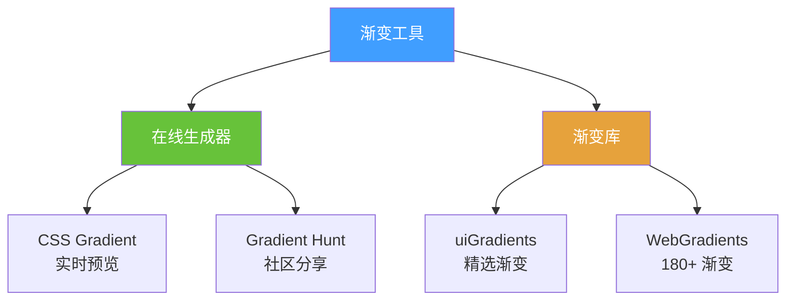

### 精选渐变配色

#### 1. 日出渐变
```qml
Rectangle {
    width: 300
    height: 200
    gradient: Gradient {
        GradientStop { position: 0.0; color: "#FF512F" }
        GradientStop { position: 1.0; color: "#F09819" }
    }
}
```

#### 2. 海洋渐变
```qml
Rectangle {
    gradient: Gradient {
        GradientStop { position: 0.0; color: "#2E3192" }
        GradientStop { position: 1.0; color: "#1BFFFF" }
    }
}
```

#### 3. 紫色梦幻
```qml
Rectangle {
    gradient: Gradient {
        GradientStop { position: 0.0; color: "#8E2DE2" }
        GradientStop { position: 1.0; color: "#4A00E0" }
    }
}
```

#### 4. 绿色清新
```qml
Rectangle {
    gradient: Gradient {
        GradientStop { position: 0.0; color: "#56AB2F" }
        GradientStop { position: 1.0; color: "#A8E063" }
    }
}
```

### 渐变资源链接
- [uiGradients](https://uigradients.com/)
- [WebGradients](https://webgradients.com/)
- [Gradient Hunt](https://gradienthunt.com/)
- [CSS Gradient](https://cssgradient.io/)

---

## 幻灯片 8: 插画和图形资源

### 🎨 插画资源库

| 资源 | 风格 | 格式 | 链接 | 特点 |
|------|------|------|------|------|
| **unDraw** | 扁平插画 | SVG | [undraw.co](https://undraw.co) | 可自定义颜色 |
| **Storyset** | 动画插画 | SVG, GIF | [storyset.com](https://storyset.com) | 可编辑动画 |
| **DrawKit** | 手绘风格 | SVG | [drawkit.com](https://drawkit.com) | 免费+付费 |
| **Humaaans** | 人物插画 | SVG | [humaaans.com](https://humaaans.com) | 可组合 |
| **Open Peeps** | 人物库 | SVG | [openpeeps.com](https://www.openpeeps.com) | 手绘风格 |
| **Blush** | 多风格 | PNG, SVG | [blush.design](https://blush.design) | Figma 插件 |

### 插画使用场景

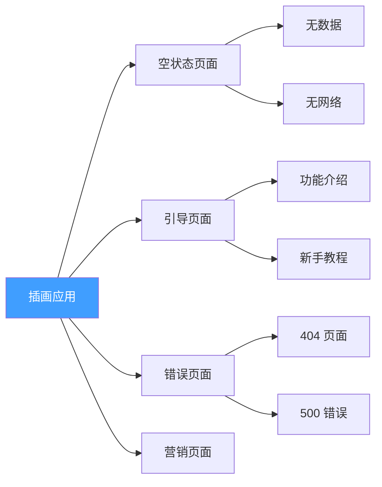

---

## 幻灯片 9: 3D 图标和模型

### 🎲 3D 资源库

| 资源 | 类型 | 链接 | 用途 |
|------|------|------|------|
| **Sketchfab** | 3D 模型 | [sketchfab.com](https://sketchfab.com) | 完整模型 |
| **3D Icons** | 3D 图标 | [3dicons.co](https://3dicons.co) | UI 图标 |
| **Iconscout 3D** | 3D 插画 | [iconscout.com/3ds](https://iconscout.com/3ds) | 商业使用 |
| **Poly Pizza** | 低多边形 | [poly.pizza](https://poly.pizza) | 简约风格 |

### 3D 效果在 QML 中的应用

```qml
// 3D 旋转效果
Rectangle {
    width: 200
    height: 200
    color: "#409EFF"
    
    transform: Rotation {
        id: rotation
        origin.x: 100
        origin.y: 100
        axis { x: 1; y: 1; z: 0 }
        angle: 0
        
        NumberAnimation on angle {
            from: 0
            to: 360
            duration: 3000
            loops: Animation.Infinite
        }
    }
}
```

---

## 幻灯片 10: 设计系统参考

### 📐 知名设计系统

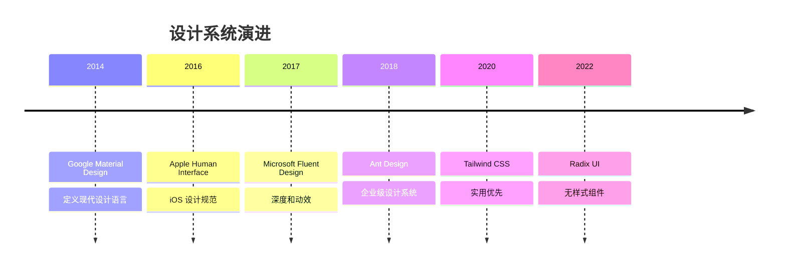

### 设计系统对比

| 系统 | 公司 | 特点 | 文档链接 |
|------|------|------|----------|
| **Material Design** | Google | 纸片隐喻、阴影 | [material.io](https://material.io) |
| **Human Interface** | Apple | 简洁、优雅 | [developer.apple.com/design](https://developer.apple.com/design/) |
| **Fluent Design** | Microsoft | 亚克力、深度 | [microsoft.com/design/fluent](https://www.microsoft.com/design/fluent/) |
| **Carbon Design** | IBM | 企业级、数据 | [carbondesignsystem.com](https://carbondesignsystem.com) |
| **Atlassian Design** | Atlassian | 协作工具 | [atlassian.design](https://atlassian.design) |

---

## 幻灯片 11: 原型设计工具

### 🛠️ 设计工具对比

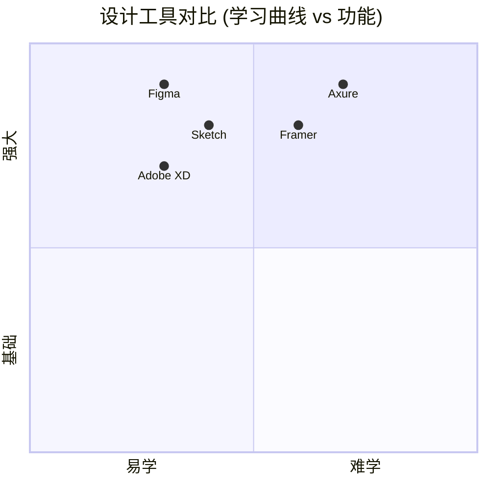

### 工具详情

| 工具 | 平台 | 价格 | 特点 | 链接 |
|------|------|------|------|------|
| **Figma** | Web, 桌面 | 免费+付费 | 协作、插件丰富 | [figma.com](https://www.figma.com) |
| **Sketch** | macOS | 付费 | Mac 专属、插件多 | [sketch.com](https://www.sketch.com) |
| **Adobe XD** | Win, Mac | 免费+付费 | Adobe 生态 | [adobe.com/xd](https://www.adobe.com/products/xd.html) |
| **Framer** | Web | 免费+付费 | 代码+设计 | [framer.com](https://www.framer.com) |
| **Axure** | Win, Mac | 付费 | 高保真原型 | [axure.com](https://www.axure.com) |

---

## 幻灯片 12: 学习资源汇总

### 📚 在线学习平台

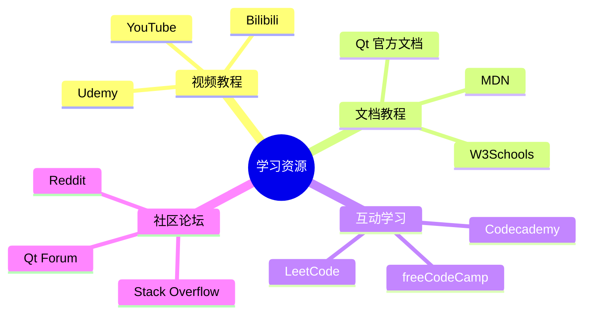

### 推荐学习路径

| 阶段 | 资源类型 | 推荐平台 | 时间投入 |
|------|----------|----------|----------|
| **入门** | 视频教程 | YouTube, Bilibili | 1-2周 |
| **基础** | 官方文档 | Qt Documentation | 2-4周 |
| **进阶** | 实战项目 | GitHub, CodePen | 1-2月 |
| **精通** | 源码阅读 | Qt Source Code | 持续学习 |

---

## 幻灯片 13: API 和数据服务

### 🌐 免费 API 资源

| API | 类型 | 链接 | 用途 |
|-----|------|------|------|
| **JSONPlaceholder** | 测试数据 | [jsonplaceholder.typicode.com](https://jsonplaceholder.typicode.com) | 开发测试 |
| **OpenWeatherMap** | 天气数据 | [openweathermap.org](https://openweathermap.org) | 天气应用 |
| **Random User** | 用户数据 | [randomuser.me](https://randomuser.me) | 用户列表 |
| **REST Countries** | 国家信息 | [restcountries.com](https://restcountries.com) | 地理数据 |
| **CoinGecko** | 加密货币 | [coingecko.com/api](https://www.coingecko.com/en/api) | 金融应用 |
| **News API** | 新闻数据 | [newsapi.org](https://newsapi.org) | 新闻应用 |

### API 使用示例

```qml
// QML 中调用 API
import QtQuick 2.15

Item {
    function fetchWeather(city) {
        var xhr = new XMLHttpRequest()
        var url = "https://api.openweathermap.org/data/2.5/weather?q=" + 
                  city + "&appid=YOUR_API_KEY"
        
        xhr.onreadystatechange = function() {
            if (xhr.readyState === XMLHttpRequest.DONE) {
                if (xhr.status === 200) {
                    var data = JSON.parse(xhr.responseText)
                    console.log("温度:", data.main.temp)
                }
            }
        }
        
        xhr.open("GET", url)
        xhr.send()
    }
}
```

---

## 幻灯片 14: 开发工具插件

### 🔌 VS Code 插件推荐

| 插件 | 功能 | 链接 |
|------|------|------|
| **QML** | 语法高亮 | VS Code Marketplace |
| **Qt tools** | Qt 开发支持 | VS Code Marketplace |
| **Prettier** | 代码格式化 | VS Code Marketplace |
| **GitLens** | Git 增强 | VS Code Marketplace |
| **Color Highlight** | 颜色预览 | VS Code Marketplace |

### Qt Creator 插件

- **QML Profiler** - 性能分析
- **Qt Quick Designer** - 可视化设计
- **Clang Code Model** - 代码补全
- **Beautifier** - 代码美化

---

## 幻灯片 15: 资源整合清单

### ✅ 完整资源清单

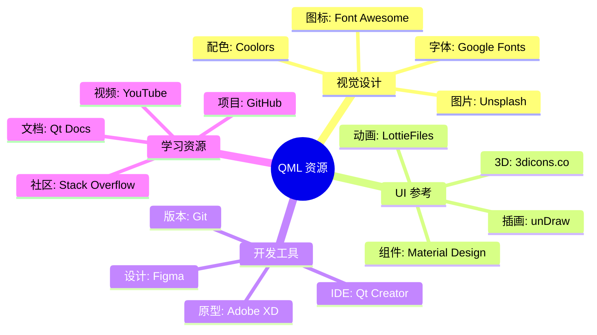

---

<div align="center">

## 🎯 资源使用建议

**收藏常用资源**
**建立自己的素材库**
**持续关注新资源**

好的资源能让你的开发事半功倍！ 🚀

### 快速访问链接

📸 [Unsplash](https://unsplash.com) | 🎨 [Figma](https://figma.com) | ⭐ [Font Awesome](https://fontawesome.com)  
🎨 [Coolors](https://coolors.co) | 📚 [Qt Docs](https://doc.qt.io) | 💻 [GitHub](https://github.com)

</div>
