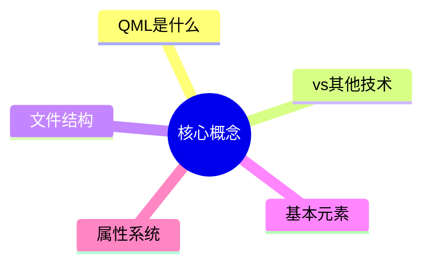
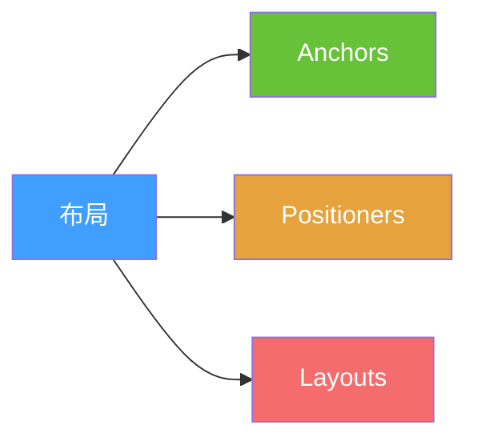
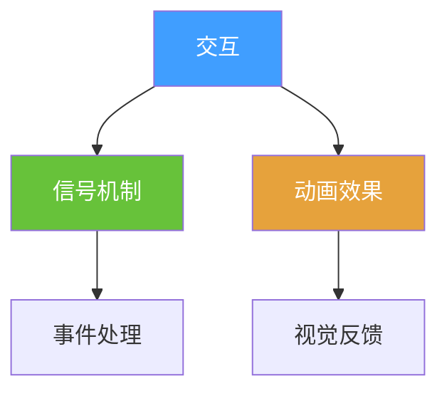
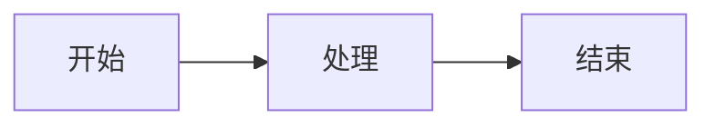
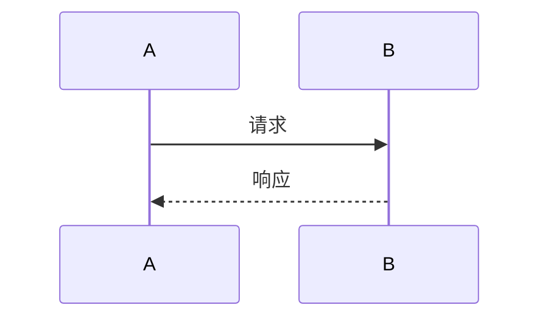
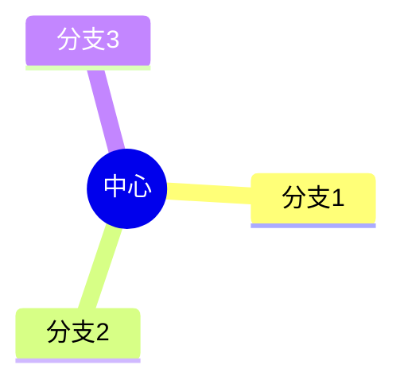
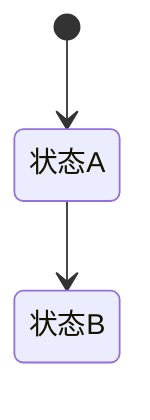
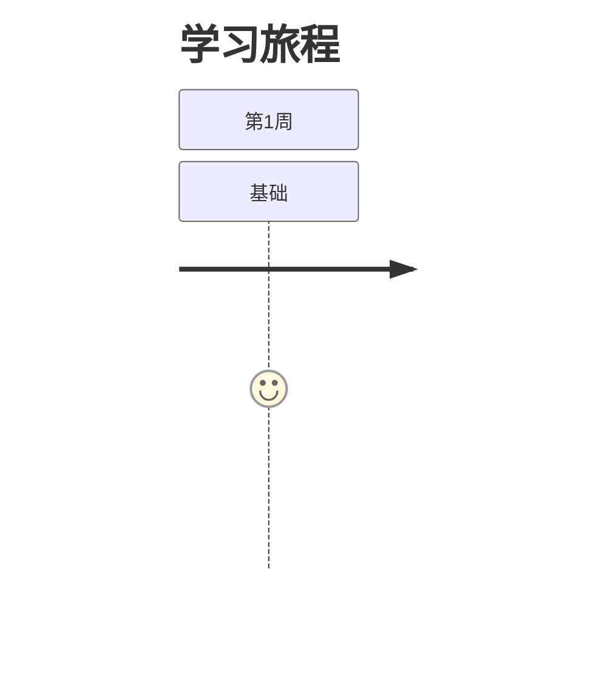
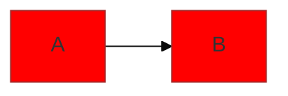

# QML 教程 PPT 版 🎯

> 适合制作演示文稿的可视化学习材料

## 📊 特点

- ✅ **Mermaid 图表** - 可直接在 Markdown 中渲染
- ✅ **简洁要点** - 每页只讲一个核心概念
- ✅ **可视化对比** - 图表 > 文字
- ✅ **记忆口诀** - 易于记忆
- ✅ **速查表格** - 快速参考

---

## 📚 PPT 章节

### [01 - QML 核心概念](PPT版-01-QML核心概念.md)
**10 张幻灯片 | 15 分钟**



**包含内容:**
- QML 定义和特点
- 与 HTML/Qt Widgets 对比
- 文件结构图解
- 基本元素对比
- 属性绑定原理
- 记忆口诀

---

### [02 - 布局系统对比](PPT版-02-布局系统对比.md)
**10 张幻灯片 | 15 分钟**



**包含内容:**
- 三大布局方式对比
- Anchors 锚点系统
- Positioners 定位器
- Layouts 布局管理器
- 选择决策树
- 常见布局模式

---

### [03 - 信号与动画](PPT版-03-信号与动画.md)
**13 张幻灯片 | 20 分钟**



**包含内容:**
- 信号与槽机制
- 信号处理方式
- 动画类型全景
- 缓动函数效果
- 状态与过渡
- 性能优化

---

## 🎨 如何使用

### 方式 1: 直接查看 Markdown
- 在支持 Mermaid 的编辑器中打开
- 推荐: VS Code + Markdown Preview Mermaid Support
- 或使用 Typora、Obsidian 等

### 方式 2: 导出为 PPT
1. 使用 Marp (Markdown Presentation)
2. 使用 reveal.js
3. 使用 Slidev

### 方式 3: 复制到 PPT
1. 截图 Mermaid 图表
2. 复制表格和要点
3. 添加到 PowerPoint/Keynote

---

## 🎯 Mermaid 图表类型说明

### 流程图 (graph)

**用途**: 展示流程、关系

### 时序图 (sequenceDiagram)

**用途**: 展示交互过程

### 思维导图 (mindmap)

**用途**: 展示知识结构

### 状态图 (stateDiagram)

**用途**: 展示状态变化

### 旅程图 (journey)

**用途**: 展示学习路径

---

## 📊 图表配色方案

### 主题色
```
主色: #409EFF (蓝色)
成功: #67C23A (绿色)
警告: #E6A23C (橙色)
危险: #F56C6C (红色)
信息: #909399 (灰色)
```

### 使用建议
- 🔵 **蓝色** - 主要概念、标题
- 🟢 **绿色** - 推荐方式、正确示例
- 🟠 **橙色** - 次要概念、注意事项
- 🔴 **红色** - 错误示例、重要警告
- ⚫ **灰色** - 辅助信息、补充说明

---

## 💡 制作 PPT 建议

### 1. 每页一个重点
- ❌ 不要: 一页塞满内容
- ✅ 要: 一页一个核心概念

### 2. 图表优先
- ❌ 不要: 大段文字描述
- ✅ 要: 用图表可视化

### 3. 对比学习
- ❌ 不要: 只讲一种方式
- ✅ 要: 对比多种方式的优劣

### 4. 记忆口诀
- ❌ 不要: 死记硬背
- ✅ 要: 用口诀和类比

### 5. 实例说明
- ❌ 不要: 纯理论讲解
- ✅ 要: 配合代码示例

---

## 🛠️ 推荐工具

### Markdown 编辑器
1. **VS Code** + Markdown Preview Mermaid Support
   - 免费开源
   - 实时预览
   - 支持所有 Mermaid 图表

2. **Typora**
   - 所见即所得
   - 原生支持 Mermaid
   - 界面美观

3. **Obsidian**
   - 知识管理
   - 支持 Mermaid
   - 双向链接

### PPT 制作工具
1. **Marp**
   - Markdown 转 PPT
   - 支持 Mermaid
   - 主题丰富

2. **Slidev**
   - 开发者友好
   - Vue 驱动
   - 代码高亮

3. **reveal.js**
   - Web 演示
   - 交互性强
   - 可嵌入代码

---

## 📖 学习路径

### 快速浏览 (30 分钟)
```
01 核心概念 (10分钟)
  ↓
02 布局系统 (10分钟)
  ↓
03 信号动画 (10分钟)
```

### 深入学习 (1 小时)
```
01 核心概念 (15分钟)
  ↓
02 布局系统 (15分钟)
  ↓
03 信号动画 (20分钟)
  ↓
实践练习 (10分钟)
```

### 制作 PPT (2 小时)
```
阅读所有章节 (50分钟)
  ↓
提取关键图表 (30分钟)
  ↓
制作演示文稿 (40分钟)
```

---

## 🎓 使用场景

### 1. 个人学习
- 快速浏览图表
- 理解核心概念
- 建立知识体系

### 2. 团队分享
- 制作培训 PPT
- 技术分享会
- 新人培训

### 3. 教学演示
- 课堂教学
- 在线课程
- 视频教程

### 4. 面试准备
- 快速复习
- 知识梳理
- 要点记忆

---

## 📝 自定义建议

### 添加公司 Logo
```markdown

```

### 修改配色


### 添加动画
使用 reveal.js 或 Slidev 的动画功能

---

## 🔗 相关资源

### Mermaid 文档
- [官方文档](https://mermaid.js.org/)
- [在线编辑器](https://mermaid.live/)
- [示例库](https://mermaid.js.org/ecosystem/integrations.html)

### PPT 模板
- [Marp 主题](https://github.com/marp-team/marp)
- [Slidev 主题](https://sli.dev/themes/gallery.html)
- [reveal.js 主题](https://revealjs.com/themes/)

---

## 💬 反馈建议

如果你有任何建议:
- 📊 需要更多图表类型
- 🎨 需要不同的配色方案
- 📝 需要更多示例
- 🎯 需要特定主题的 PPT

欢迎提出!

---

## 📊 内容统计

| 项目 | 数量 |
|------|------|
| PPT 章节 | 3 个 |
| 幻灯片总数 | 33 张 |
| Mermaid 图表 | 40+ 个 |
| 代码示例 | 30+ 个 |
| 对比表格 | 20+ 个 |
| 记忆口诀 | 10+ 个 |

---

## 🚀 开始使用

1. 选择一个章节
2. 在 Markdown 编辑器中打开
3. 查看 Mermaid 图表渲染
4. 提取需要的内容到 PPT

**祝你制作出精彩的演示文稿!** 🎉

---

<div align="center">

### 让学习更直观，让记忆更深刻！

[核心概念](PPT版-01-QML核心概念.md) | [布局系统](PPT版-02-布局系统对比.md) | [信号动画](PPT版-03-信号与动画.md)

</div>
