# QML 布局系统对比 - PPT 版 📐

## 幻灯片 1: 三大布局方式

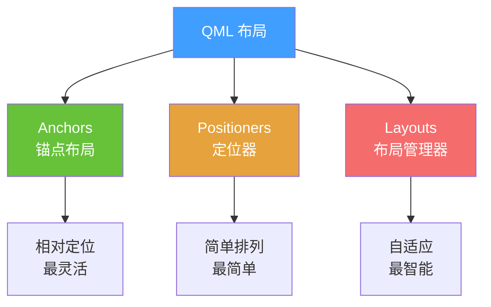

---

## 幻灯片 2: Anchors 锚点系统

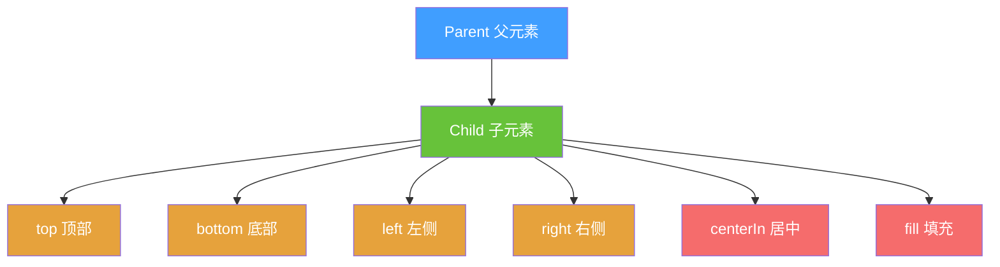

### 可视化示例

```
┌─────────────────────────────┐
│  Parent                     │
│  ┌─────────────────────┐   │ ← anchors.top
│  │  anchors.top        │   │
│  └─────────────────────┘   │
│                             │
│      ┌──────────┐           │
│      │ centerIn │           │ ← anchors.centerIn
│      └──────────┘           │
│                             │
│  ┌─────────────────────┐   │
│  │  anchors.bottom     │   │ ← anchors.bottom
│  └─────────────────────┘   │
└─────────────────────────────┘
```

---

## 幻灯片 3: Anchors 常用组合

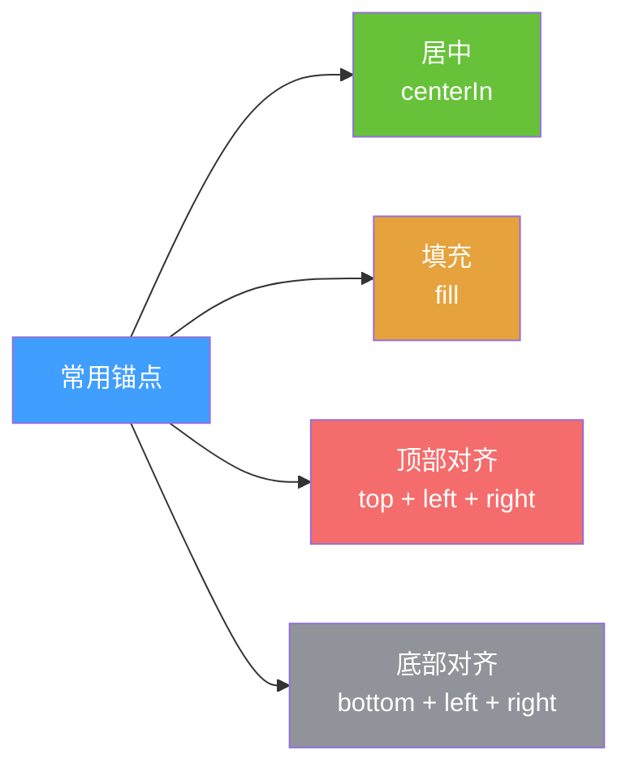

### 代码速查

| 效果 | 代码 |
|------|------|
| 🎯 居中 | `anchors.centerIn: parent` |
| 📦 填充 | `anchors.fill: parent` |
| ⬆️ 顶部 | `anchors.top: parent.top` |
| ⬇️ 底部 | `anchors.bottom: parent.bottom` |
| ⬅️ 左侧 | `anchors.left: parent.left` |
| ➡️ 右侧 | `anchors.right: parent.right` |

---

## 幻灯片 4: Positioners 定位器家族

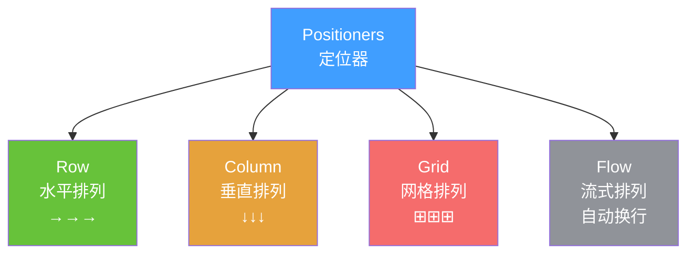

### 可视化对比

**Row (水平)**
```
┌───┐ ┌───┐ ┌───┐
│ 1 │ │ 2 │ │ 3 │
└───┘ └───┘ └───┘
```

**Column (垂直)**
```
┌───┐
│ 1 │
└───┘
┌───┐
│ 2 │
└───┘
┌───┐
│ 3 │
└───┘
```

**Grid (网格)**
```
┌───┐ ┌───┐ ┌───┐
│ 1 │ │ 2 │ │ 3 │
└───┘ └───┘ └───┘
┌───┐ ┌───┐ ┌───┐
│ 4 │ │ 5 │ │ 6 │
└───┘ └───┘ └───┘
```

---

## 幻灯片 5: Layouts 布局管理器

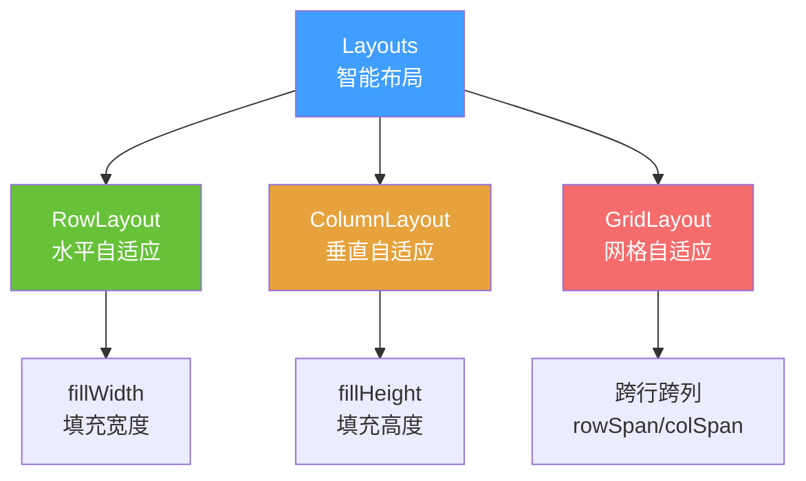

### 关键属性

| 属性 | 作用 | 示例 |
|------|------|------|
| `Layout.fillWidth` | 填充剩余宽度 | ✅ |
| `Layout.fillHeight` | 填充剩余高度 | ✅ |
| `Layout.preferredWidth` | 首选宽度 | 200 |
| `Layout.minimumWidth` | 最小宽度 | 100 |
| `Layout.maximumWidth` | 最大宽度 | 400 |

---

## 幻灯片 6: 三种布局方式对比

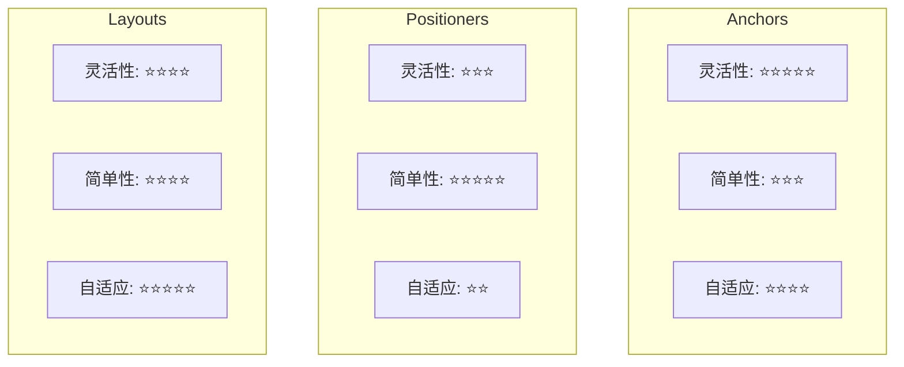

### 选择建议

| 场景 | 推荐 | 原因 |
|------|------|------|
| 简单排列 | Positioners | 代码最少 |
| 相对定位 | Anchors | 最灵活 |
| 响应式布局 | Layouts | 自动计算 |
| 复杂表单 | Layouts | 对齐整齐 |

---

## 幻灯片 7: 实战案例 - 三栏布局

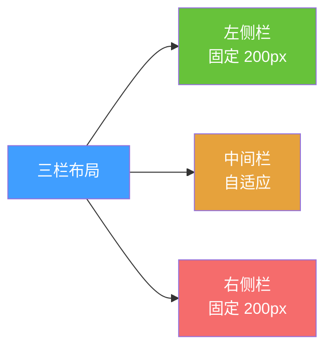

### 可视化

```
┌────────────────────────────────────┐
│ ┌────┐ ┌──────────────┐ ┌────┐   │
│ │左侧│ │   中间内容   │ │右侧│   │
│ │200 │ │   自适应     │ │200 │   │
│ │px  │ │              │ │px  │   │
│ └────┘ └──────────────┘ └────┘   │
└────────────────────────────────────┘
```

### 代码对比

**❌ 复杂方式 (Anchors)**
```qml
// 需要 15+ 行代码
```

**✅ 简单方式 (RowLayout)**
```qml
RowLayout {
    Rectangle { Layout.preferredWidth: 200 }  // 左
    Rectangle { Layout.fillWidth: true }      // 中
    Rectangle { Layout.preferredWidth: 200 }  // 右
}
```

---

## 幻灯片 8: 布局决策树

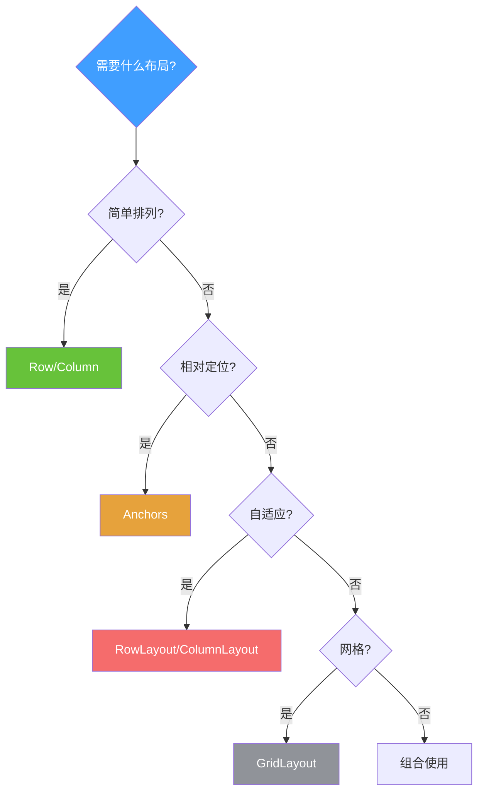

---

## 幻灯片 9: 常见布局模式

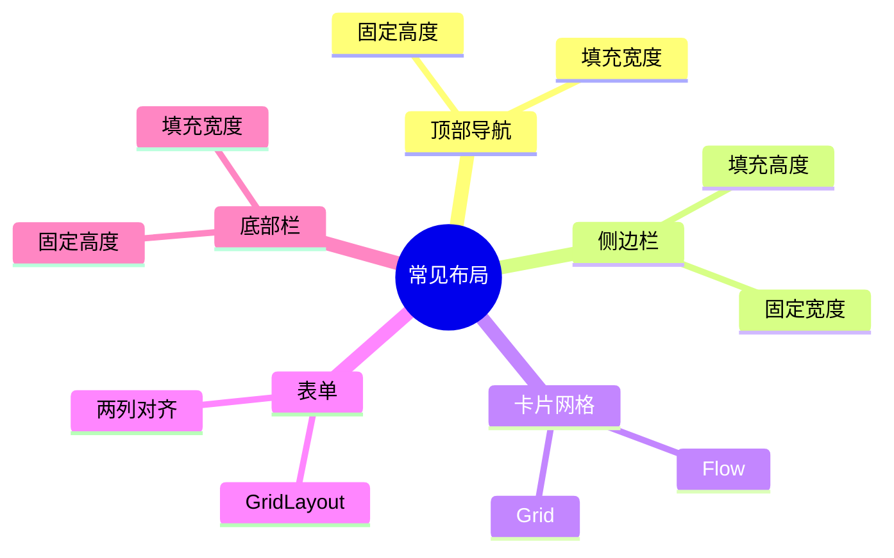

---

## 幻灯片 10: 记忆口诀

### 布局三字经

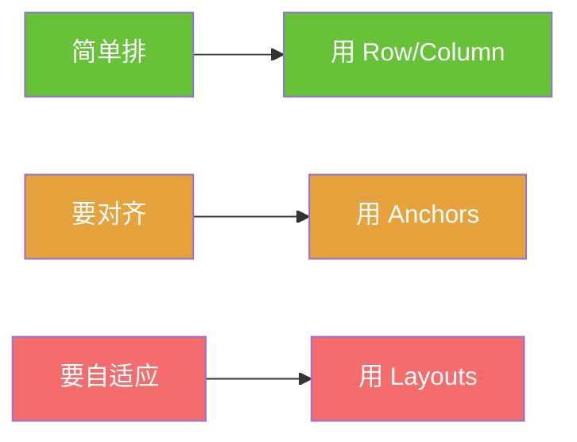

### 快速记忆

| 口诀 | 含义 | 使用 |
|------|------|------|
| 📏 **排排站** | 简单排列 | Row/Column |
| 🎯 **锚定位** | 相对定位 | Anchors |
| 📐 **智能算** | 自适应 | Layouts |

---

## 总结卡片

### 布局选择速查表

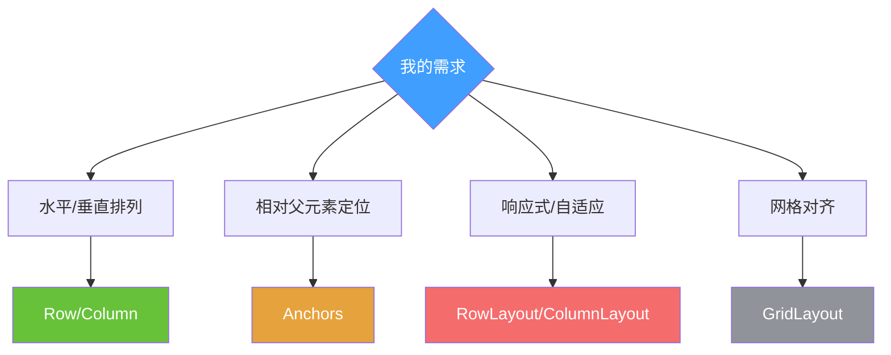

### 下一步
👉 学习信号与槽
