# QML 信号与动画 - PPT 版 🎬

## 幻灯片 1: 信号与槽机制

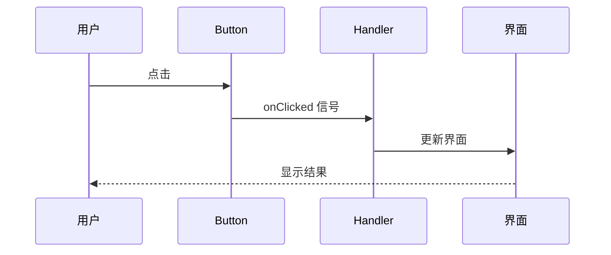

### 核心概念
- 📡 **信号** = 事件通知
- 🎯 **槽** = 事件处理
- 🔄 **自动连接** = 无需手动绑定

---

## 幻灯片 2: 常见信号类型

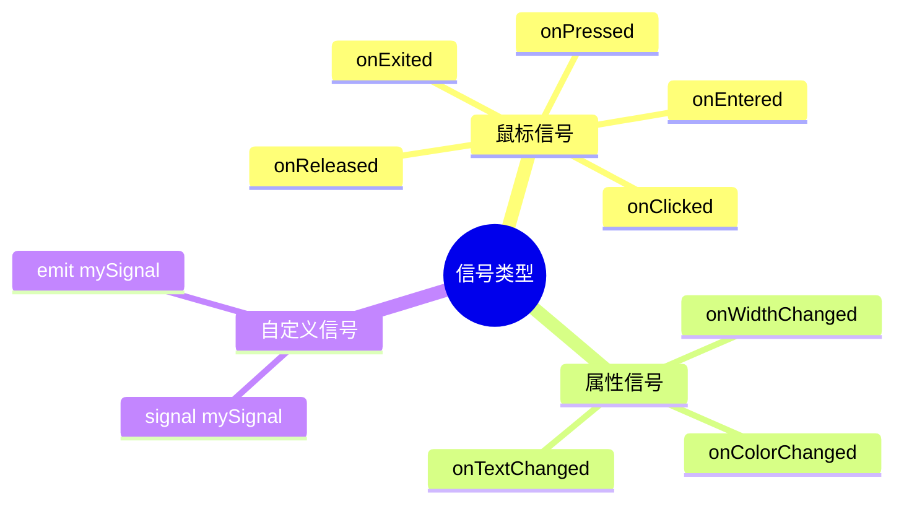

---

## 幻灯片 3: 信号处理方式对比

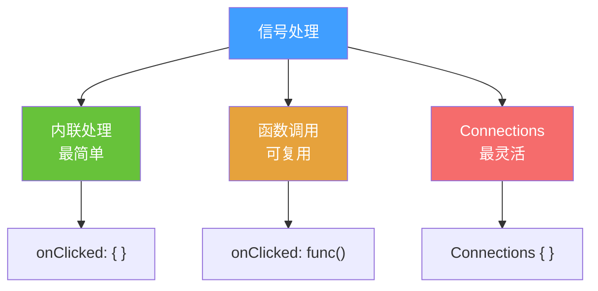

### 代码对比

**方式 1: 内联**
```qml
Button {
    onClicked: { count++ }
}
```

**方式 2: 函数**
```qml
Button {
    onClicked: handleClick()
    function handleClick() { count++ }
}
```

**方式 3: Connections**
```qml
Connections {
    target: button
    onClicked: { count++ }
}
```

---

## 幻灯片 4: 自定义信号流程

```mermaid
graph LR
    A[1️⃣ 定义信号<br/>signal clicked] --> B[2️⃣ 发出信号<br/>clicked.emit]
    B --> C[3️⃣ 处理信号<br/>onClicked: {}]
    
    style A fill:#67C23A,color:#fff
    style B fill:#E6A23C,color:#fff
    style C fill:#F56C6C,color:#fff
```

### 完整示例
```qml
Rectangle {
    // 1. 定义
    signal customClicked(int x, int y)
    
    MouseArea {
        anchors.fill: parent
        onClicked: function(mouse) {
            // 2. 发出
            parent.customClicked(mouse.x, mouse.y)
        }
    }
    
    // 3. 处理
    onCustomClicked: function(x, y) {
        console.log("点击位置:", x, y)
    }
}
```

---

## 幻灯片 5: 动画类型全景


---

## 幻灯片 6: Behavior 自动动画

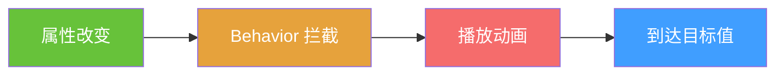

### 对比

**❌ 没有动画**
```qml
Rectangle {
    x: 0
    MouseArea {
        onClicked: parent.x = 300  // 瞬间移动
    }
}
```

**✅ 有动画**
```qml
Rectangle {
    x: 0
    Behavior on x {
        NumberAnimation { duration: 500 }  // 平滑移动
    }
    MouseArea {
        onClicked: parent.x = 300
    }
}
```

---

## 幻灯片 7: 缓动函数效果

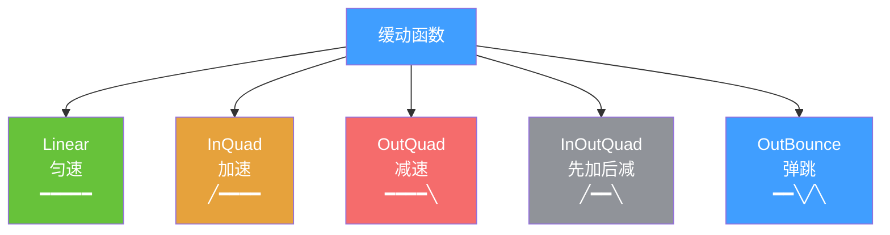

### 视觉对比

```
Linear:     ━━━━━━━━━━━━━━━━
InQuad:     ╱━━━━━━━━━━━━━━
OutQuad:    ━━━━━━━━━━━━━━╲
InOutQuad:  ╱━━━━━━━━━━━━╲
OutBounce:  ━━━━━━━━╲╱╲╱╲
```

---

## 幻灯片 8: 动画组合

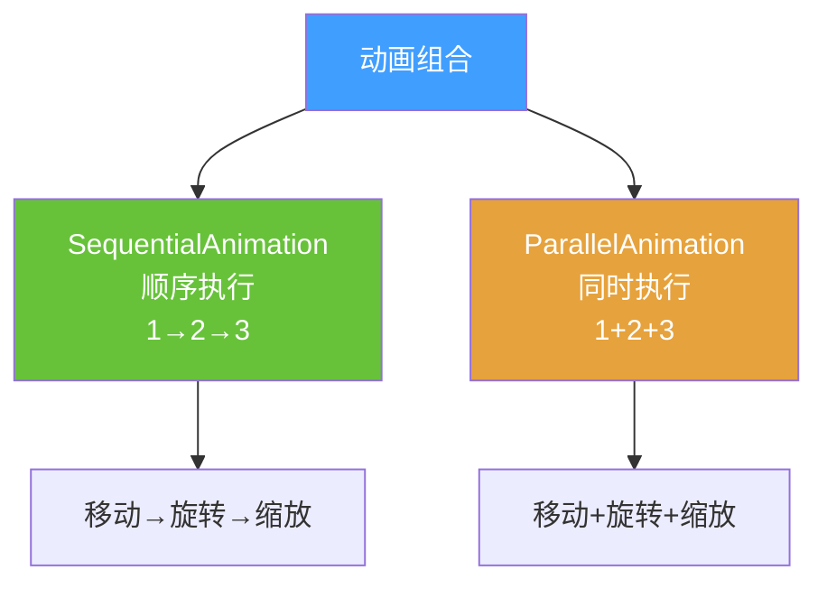

### 可视化

**Sequential (顺序)**
```
时间轴: ━━━━━━━━━━━━━━━━━━━━
动画1:  ████
动画2:      ████
动画3:          ████
```

**Parallel (并行)**
```
时间轴: ━━━━━━━━━━━━━━━━━━━━
动画1:  ████████████
动画2:  ████████████
动画3:  ████████████
```

---

## 幻灯片 9: 状态与过渡

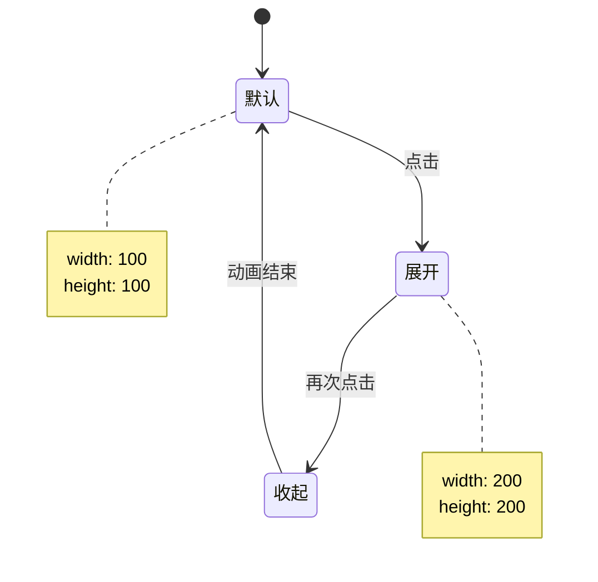

### 代码结构
```qml
Rectangle {
    states: [
        State { name: "expanded" }
    ]
    
    transitions: [
        Transition {
            from: ""; to: "expanded"
            NumberAnimation { duration: 500 }
        }
    ]
}
```

---

## 幻灯片 10: 动画性能优化

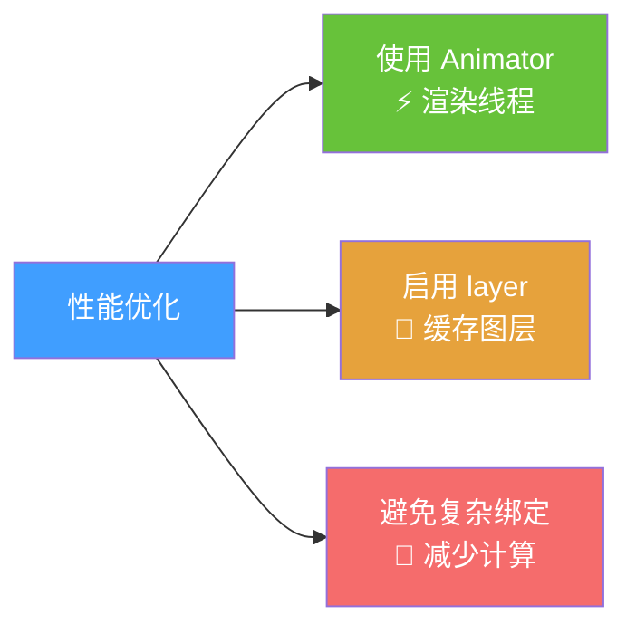

### 对比

| 方式 | 性能 | 使用 |
|------|------|------|
| NumberAnimation | ⭐⭐⭐ | 主线程 |
| OpacityAnimator | ⭐⭐⭐⭐⭐ | 渲染线程 |
| XAnimator | ⭐⭐⭐⭐⭐ | 渲染线程 |

---

## 幻灯片 11: 常用动画速查

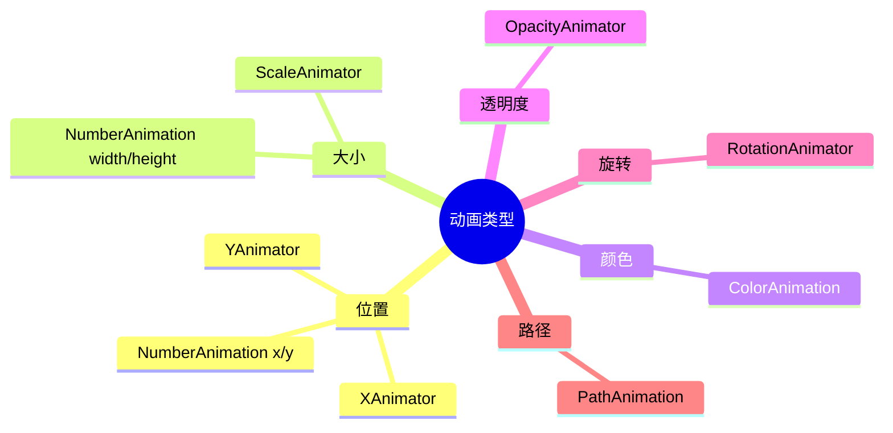

---

## 幻灯片 12: 实战案例 - 加载动画

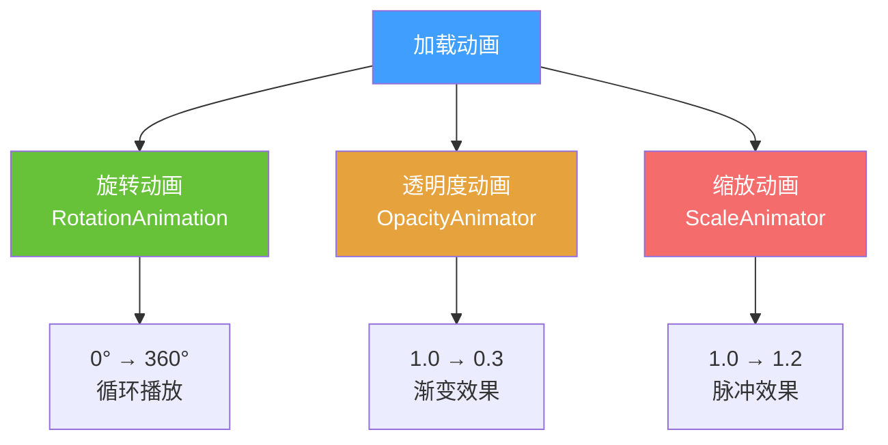

---

## 幻灯片 13: 记忆口诀

### 动画三字经

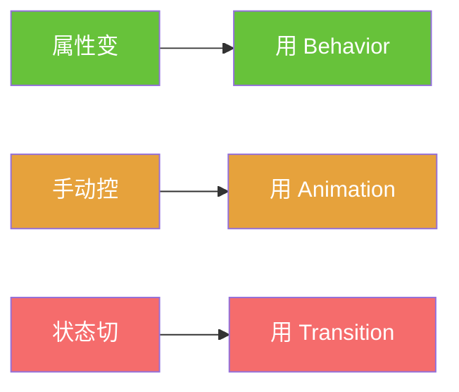

### 快速记忆

| 场景 | 使用 | 特点 |
|------|------|------|
| 🔄 属性自动变化 | Behavior | 最简单 |
| 🎮 手动控制播放 | Animation | 最灵活 |
| 🎯 状态切换 | Transition | 最优雅 |

---

## 总结卡片

### 信号与动画速查

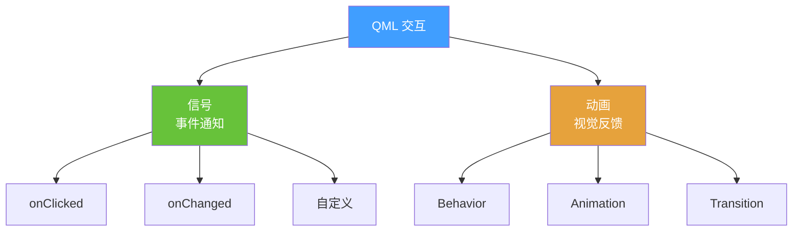

### 关键点
- 📡 信号 = 通知机制
- 🎬 动画 = 平滑过渡
- ⚡ Animator = 高性能

### 下一步
👉 实战项目开发
