# QML 实战项目图解 - PPT 版 🚀

## 幻灯片 1: 项目架构总览

### 🏗️ 典型 QML 应用架构

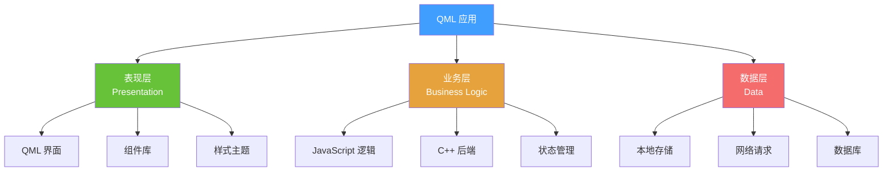

### 📸 参考架构图
- [Clean Architecture](https://blog.cleancoder.com/uncle-bob/2012/08/13/the-clean-architecture.html)
- [MVVM Pattern](https://en.wikipedia.org/wiki/Model%E2%80%93view%E2%80%93viewmodel)

---

## 幻灯片 2: 项目目录结构

```
MyQMLApp/
├── qml/
│   ├── main.qml              # 应用入口
│   ├── components/           # 通用组件
│   │   ├── Button.qml
│   │   ├── Card.qml
│   │   └── Dialog.qml
│   ├── pages/                # 页面
│   │   ├── HomePage.qml
│   │   ├── LoginPage.qml
│   │   └── SettingsPage.qml
│   ├── layouts/              # 布局
│   │   ├── MainLayout.qml
│   │   └── SidebarLayout.qml
│   ├── styles/               # 样式
│   │   ├── Theme.qml
│   │   └── Colors.qml
│   └── utils/                # 工具
│       ├── API.qml
│       └── Storage.qml
├── src/                      # C++ 源码
│   ├── main.cpp
│   └── models/
├── resources/                # 资源文件
│   ├── images/
│   ├── fonts/
│   └── icons/
└── CMakeLists.txt
```

---

## 幻灯片 3: 项目1 - 待办事项应用

### 功能流程图

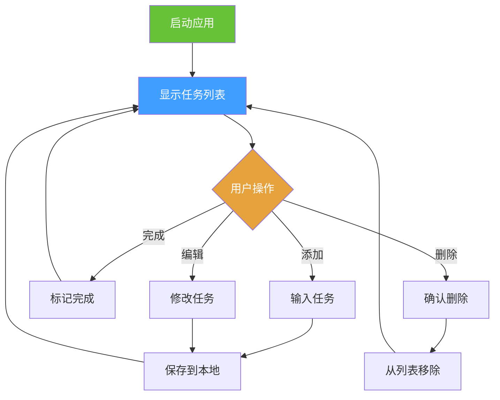


### 核心代码实现

```qml
// TodoApp.qml
import QtQuick 2.15
import QtQuick.Controls 2.15
import QtQuick.Layouts 1.15
import Qt.labs.settings 1.0

ApplicationWindow {
    id: window
    visible: true
    width: 400
    height: 600
    title: "待办事项"
    
    // 数据模型
    ListModel {
        id: todoModel
    }
    
    // 本地存储
    Settings {
        id: settings
        property string todos: ""
    }
    
    // 加载数据
    Component.onCompleted: {
        loadTodos()
    }
    
    ColumnLayout {
        anchors.fill: parent
        anchors.margins: 20
        spacing: 15
        
        // 标题
        Text {
            text: "我的待办"
            font.pixelSize: 28
            font.bold: true
            Layout.alignment: Qt.AlignHCenter
        }
        
        // 输入区域
        RowLayout {
            Layout.fillWidth: true
            spacing: 10
            
            TextField {
                id: inputField
                Layout.fillWidth: true
                placeholderText: "添加新任务..."
                onAccepted: addTodo()
            }
            
            Button {
                text: "添加"
                onClicked: addTodo()
            }
        }
        
        // 任务列表
        ListView {
            Layout.fillWidth: true
            Layout.fillHeight: true
            model: todoModel
            spacing: 10
            
            delegate: Rectangle {
                width: ListView.view.width
                height: 60
                color: "#f5f5f5"
                radius: 8
                
                RowLayout {
                    anchors.fill: parent
                    anchors.margins: 10
                    spacing: 10
                    
                    CheckBox {
                        checked: model.completed
                        onClicked: {
                            todoModel.setProperty(index, "completed", checked)
                            saveTodos()
                        }
                    }
                    
                    Text {
                        Layout.fillWidth: true
                        text: model.text
                        font.strikeout: model.completed
                        color: model.completed ? "#999" : "#333"
                    }
                    
                    Button {
                        text: "删除"
                        flat: true
                        onClicked: {
                            todoModel.remove(index)
                            saveTodos()
                        }
                    }
                }
            }
        }
        
        // 统计信息
        Text {
            text: "共 " + todoModel.count + " 项任务"
            color: "#666"
            Layout.alignment: Qt.AlignHCenter
        }
    }
    
    // 添加任务
    function addTodo() {
        if (inputField.text.trim() !== "") {
            todoModel.append({
                text: inputField.text,
                completed: false
            })
            inputField.text = ""
            saveTodos()
        }
    }
    
    // 保存到本地
    function saveTodos() {
        var todos = []
        for (var i = 0; i < todoModel.count; i++) {
            todos.push({
                text: todoModel.get(i).text,
                completed: todoModel.get(i).completed
            })
        }
        settings.todos = JSON.stringify(todos)
    }
    
    // 从本地加载
    function loadTodos() {
        if (settings.todos) {
            var todos = JSON.parse(settings.todos)
            for (var i = 0; i < todos.length; i++) {
                todoModel.append(todos[i])
            }
        }
    }
}
```

---

## 幻灯片 4: 项目2 - 天气应用

### 数据流图

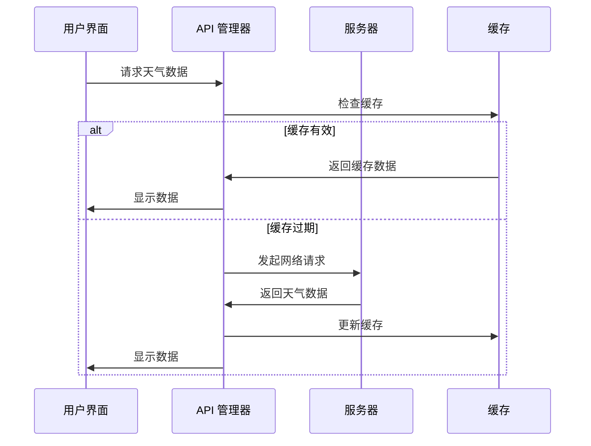

### 界面布局

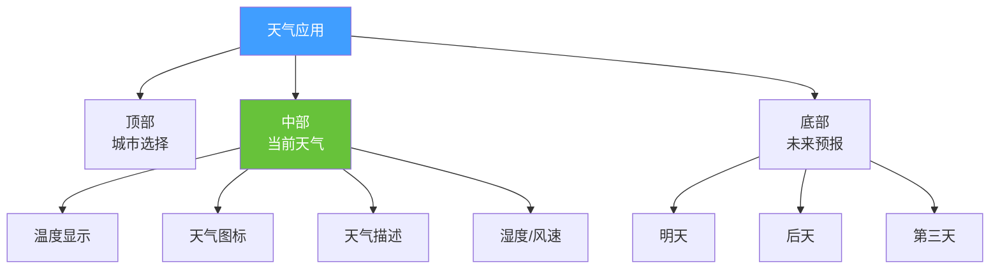

---

## 幻灯片 5: 项目3 - 音乐播放器

### 状态机图

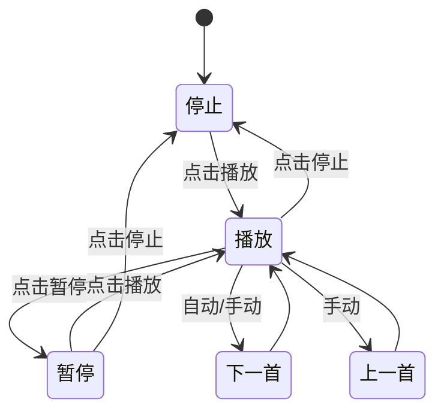

### 组件结构

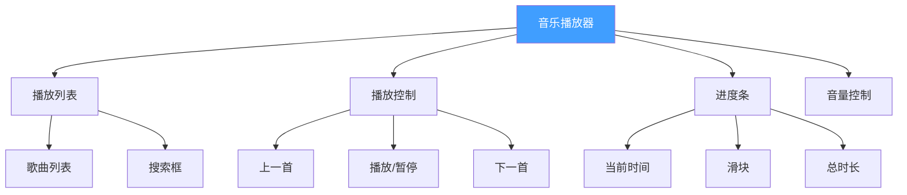

---

## 幻灯片 6: 项目4 - 聊天应用

### 实时通信流程

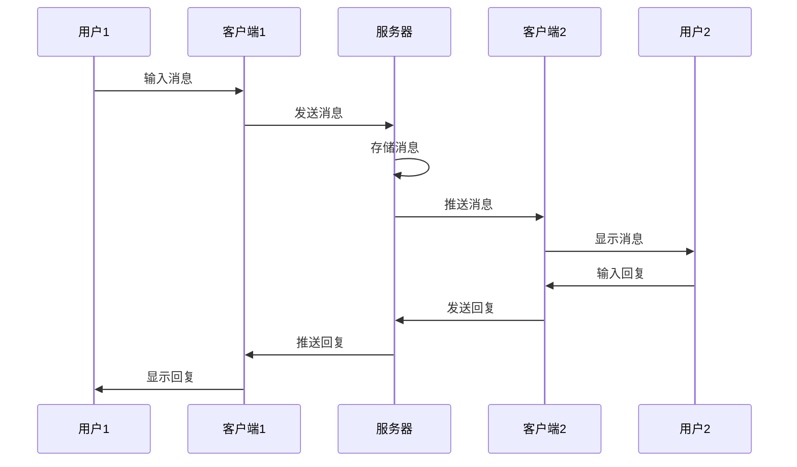

### 界面布局

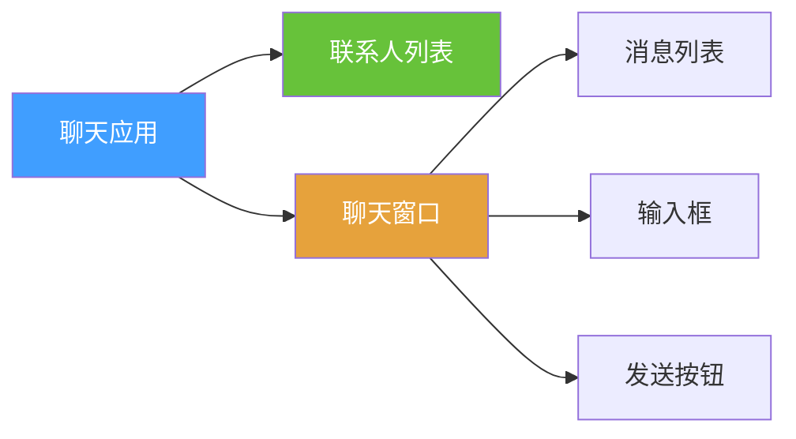

---

## 幻灯片 7: 项目5 - 数据可视化仪表板

### 仪表板布局

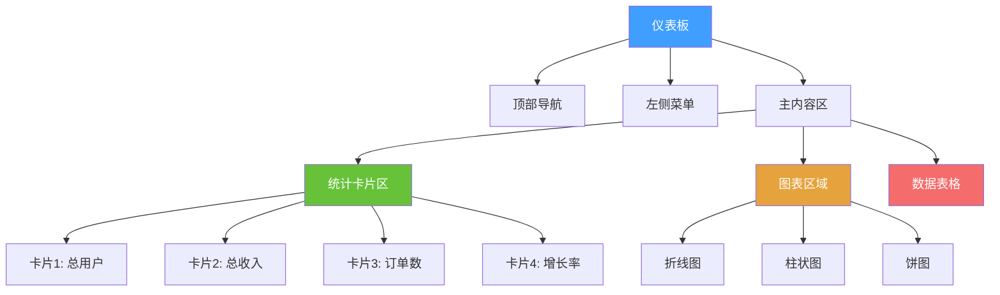

### 数据流

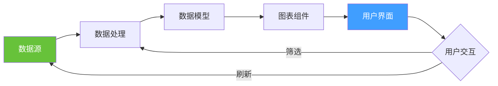

---

## 幻灯片 8: 性能优化策略

### 优化技术对比

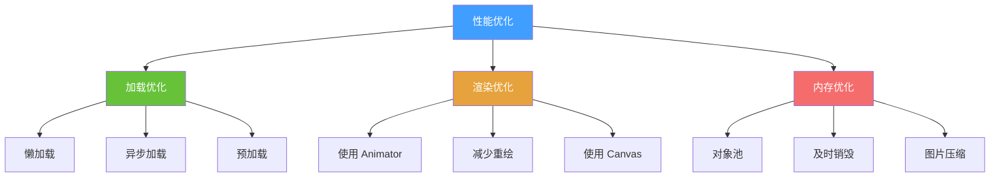

### 性能指标

| 指标 | 目标值 | 优化方法 |
|------|--------|----------|
| 启动时间 | < 2秒 | 懒加载、预编译 |
| 帧率 | 60 FPS | 使用 Animator |
| 内存占用 | < 100MB | 对象池、压缩 |
| 响应时间 | < 100ms | 异步处理 |

---

## 幻灯片 9: 调试技巧

### 调试工具链

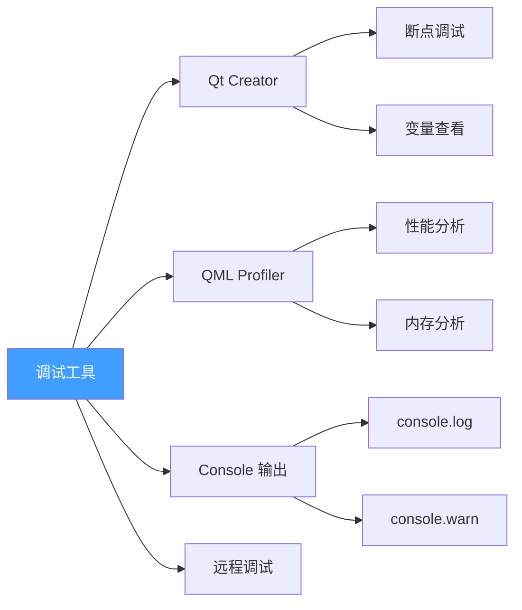

### 常用调试代码

```qml
// 1. 输出调试信息
console.log("变量值:", myVariable)
console.warn("警告信息")
console.error("错误信息")

// 2. 性能计时
console.time("操作名称")
// ... 执行操作
console.timeEnd("操作名称")

// 3. 对象检查
console.log(JSON.stringify(myObject, null, 2))

// 4. 组件边界可视化
Rectangle {
    border.color: "red"  // 调试时显示边界
    border.width: 1
}

// 5. 属性变化监听
onWidthChanged: console.log("宽度变化:", width)
```

---

## 幻灯片 10: 部署流程

### 部署步骤

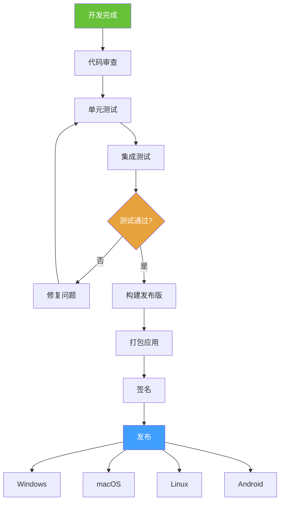

### 平台特定配置

| 平台 | 打包工具 | 注意事项 |
|------|----------|----------|
| Windows | windeployqt | 包含 VC++ 运行库 |
| macOS | macdeployqt | 代码签名 |
| Linux | linuxdeployqt | 依赖库 |
| Android | androiddeployqt | 权限配置 |

---

## 幻灯片 11: 项目实战清单

### 🎯 学习路径

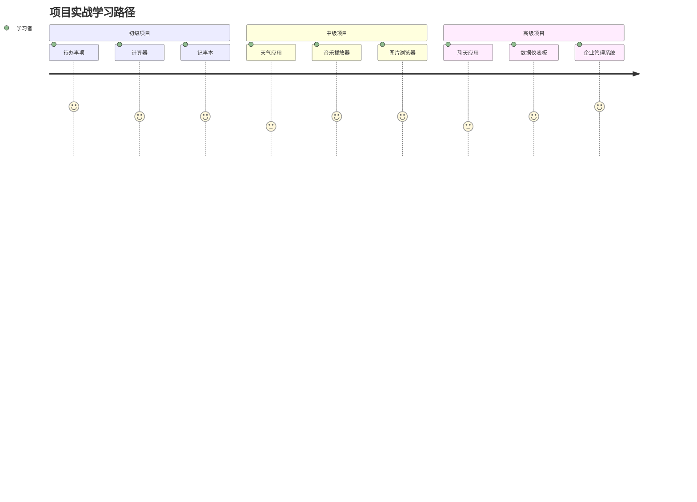

### 项目难度评估

| 项目 | 难度 | 时间 | 技能点 |
|------|------|------|--------|
| 待办事项 | ⭐ | 1天 | 基础组件、本地存储 |
| 计算器 | ⭐ | 1天 | 布局、事件处理 |
| 天气应用 | ⭐⭐ | 2-3天 | 网络请求、JSON |
| 音乐播放器 | ⭐⭐⭐ | 3-5天 | 多媒体、状态管理 |
| 聊天应用 | ⭐⭐⭐⭐ | 1-2周 | WebSocket、数据库 |
| 企业系统 | ⭐⭐⭐⭐⭐ | 1个月+ | 架构设计、性能优化 |

---

## 幻灯片 12: 参考资源

### 📚 开源项目参考

1. **GitHub 优秀项目**
   - [Cute-Sorrow/QML-Examples](https://github.com/topics/qml-examples)
   - [Qt Official Examples](https://doc.qt.io/qt-6/qtexamplesandtutorials.html)

2. **UI 设计灵感**
   - [Dribbble - Dashboard](https://dribbble.com/tags/dashboard)
   - [Behance - Mobile App](https://www.behance.net/search/projects?search=mobile%20app)
   - [UI8 - Design Systems](https://ui8.net/)

3. **图标和素材**
   - [Flaticon](https://www.flaticon.com/)
   - [Unsplash](https://unsplash.com/) - 免费图片
   - [Pexels](https://www.pexels.com/) - 免费视频和图片

4. **API 服务**
   - [OpenWeatherMap](https://openweathermap.org/api) - 天气 API
   - [JSONPlaceholder](https://jsonplaceholder.typicode.com/) - 测试 API
   - [Random User API](https://randomuser.me/) - 用户数据

---

<div align="center">

## 🎯 实战是最好的老师

**从简单项目开始**
**逐步挑战复杂应用**
**在实践中成长**

动手做起来，你就是下一个 QML 专家！ 🚀

</div>
