# Qt/QML 学习分享会 - 学习路线图 🚀

<div align="center">

## 从零到精通的实战指南

**不讲细节，只讲方法**  
**授人以鱼不如授人以渔**

</div>

---

## 📋 分享会大纲

1. Qt/QML 是什么？为什么要学？
2. 学习路线图（核心）
3. 学习方法论
4. 常见误区
5. 资源推荐
6. Q&A

---

## 🎯 一、Qt/QML 是什么？

### 快速定位

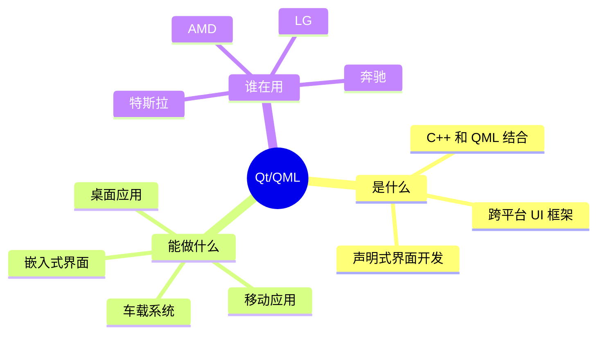

### 一句话总结

> **Qt 是 C++ 框架，QML 是声明式 UI 语言**  
> 就像 HTML+CSS+JavaScript，但更强大，可以做桌面应用

### 为什么要学？

| 优势 | 说明 |
|------|------|
| 🌍 **真跨平台** | 一套代码，Windows/Mac/Linux/Android/iOS 都能跑 |
| ⚡ **高性能** | 基于 C++，性能接近原生 |
| 🎨 **界面美观** | QML 声明式开发，像写 CSS 一样简单 |
| 💼 **就业前景** | 汽车、工业、嵌入式领域需求大 |
| 📚 **生态成熟** | 20+ 年历史，文档完善 |

---

## 🗺️ 二、学习路线图（核心）

### 整体路线（4 个阶段）

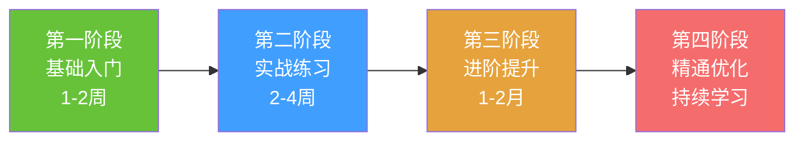

---

### 第一阶段：基础入门（1-2周）

#### 🎯 学习目标
能写出简单的界面，理解 QML 基本语法

#### 📚 学什么？

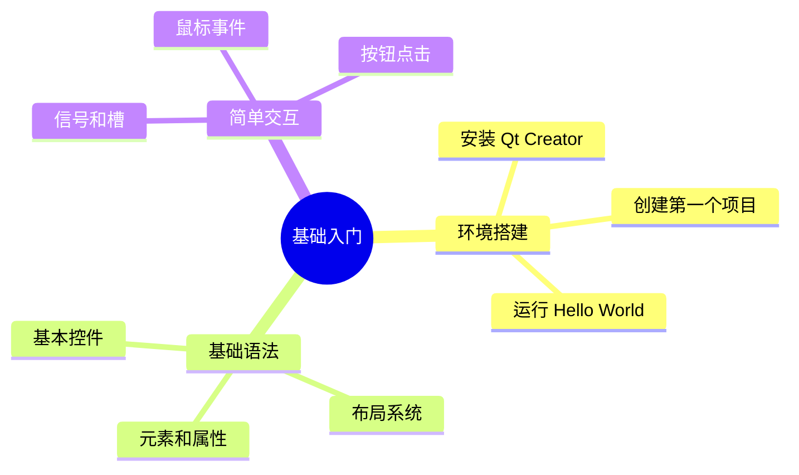

#### ✅ 学习任务清单

- [ ] 安装 Qt Creator，创建第一个 QML 项目
- [ ] 理解 Rectangle、Text、Button 等基本元素
- [ ] 掌握 anchors 和 Row/Column 布局
- [ ] 实现一个简单的计数器（按钮+文本）
- [ ] 理解信号和槽的基本概念

#### 🎓 学习方式
- **看视频** - YouTube/Bilibili 搜索 "QML 入门"
- **看文档** - Qt 官方文档的 Getting Started
- **动手做** - 每天写 1-2 个小 demo

#### 📝 阶段成果
完成一个 **简单计算器** 或 **待办事项列表**

---

### 第二阶段：实战练习（2-4周）

#### 🎯 学习目标
能独立完成中等复杂度的应用

#### 📚 学什么？

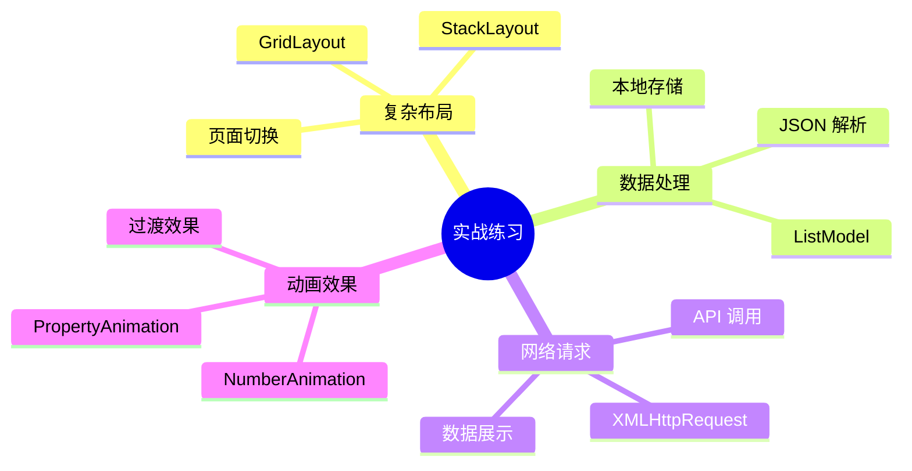

#### ✅ 学习任务清单

- [ ] 完成一个多页面应用（至少 3 个页面）
- [ ] 实现列表数据的增删改查
- [ ] 调用一个真实的 API（如天气 API）
- [ ] 添加页面切换动画
- [ ] 实现数据的本地持久化

#### 🎓 学习方式
- **做项目** - 选择 2-3 个实战项目
- **看源码** - GitHub 搜索 QML 项目，学习别人的代码
- **解决问题** - 遇到问题先 Google，再问 ChatGPT

#### 📝 阶段成果
完成以下项目之一：
- **天气应用** - 调用天气 API，显示天气信息
- **音乐播放器** - 播放本地音乐，显示列表
- **笔记应用** - 支持增删改查，本地存储

---

### 第三阶段：进阶提升（1-2月）

#### 🎯 学习目标
理解架构设计，能做复杂应用

#### 📚 学什么？

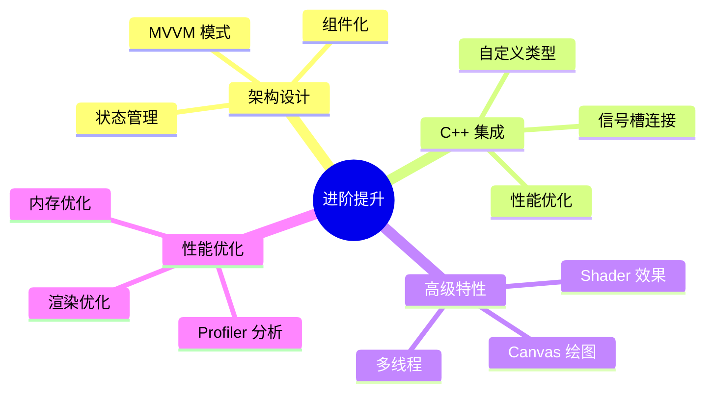

#### ✅ 学习任务清单

- [ ] 理解 MVVM 架构模式
- [ ] 学习如何封装可复用组件
- [ ] 学习 C++ 和 QML 的交互
- [ ] 使用 QML Profiler 分析性能
- [ ] 优化一个现有项目的性能

#### 🎓 学习方式
- **读文章** - 搜索 "QML 架构设计"、"QML 性能优化"
- **看源码** - 研究开源项目的架构
- **重构代码** - 把之前的项目重构成更好的架构

#### 📝 阶段成果
完成一个 **企业级应用**：
- 聊天应用
- 数据可视化仪表板
- 管理系统

---

### 第四阶段：精通优化（持续学习）

#### 🎯 学习目标
成为 Qt/QML 专家

#### 📚 学什么？

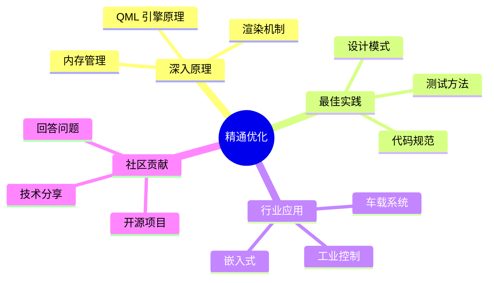

#### ✅ 学习任务清单

- [ ] 阅读 Qt 源码
- [ ] 参与开源项目
- [ ] 写技术博客
- [ ] 在 Stack Overflow 回答问题
- [ ] 做技术分享

#### 🎓 学习方式
- **读源码** - Qt 框架源码
- **做贡献** - 给开源项目提 PR
- **教别人** - 最好的学习方式

---

## 💡 三、学习方法论

### 1. 项目驱动学习法 ⭐⭐⭐⭐⭐

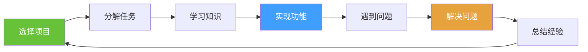

**核心思想**：不要为了学而学，而是为了做项目而学

**具体步骤**：
1. 选一个你感兴趣的项目（如音乐播放器）
2. 列出需要实现的功能
3. 遇到不会的就去学
4. 学完立即用到项目中
5. 项目完成 = 知识掌握

### 2. 费曼学习法

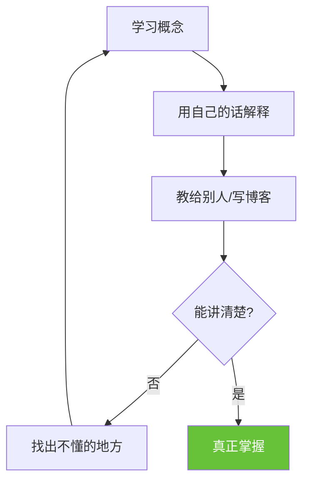

**实践方式**：
- 学完一个知识点，写一篇博客
- 给同事/朋友讲解
- 在论坛回答别人的问题

### 3. 刻意练习

| 练习类型 | 频率 | 目的 |
|----------|------|------|
| **每日小练习** | 每天 30 分钟 | 保持手感 |
| **周末项目** | 每周 1 个 | 综合应用 |
| **月度挑战** | 每月 1 个 | 突破舒适区 |

### 4. 学习金字塔

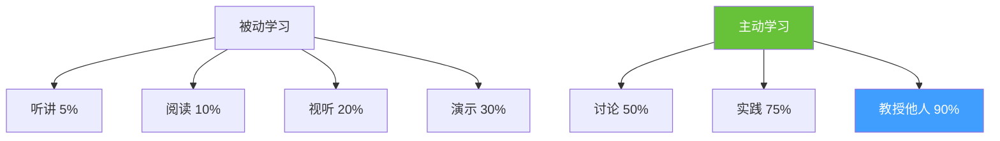

**结论**：多动手，多教人，少看视频

---

## ⚠️ 四、常见误区

### ❌ 误区 1：只看不练

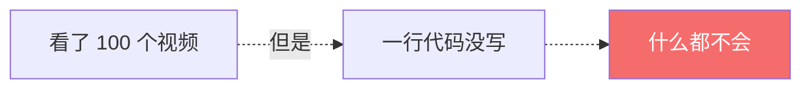

**正确做法**：看一个视频，立即动手实践

---

### ❌ 误区 2：追求完美

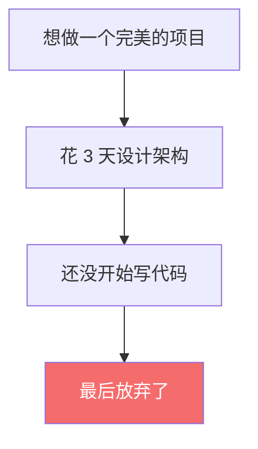

**正确做法**：先做出来，再优化

---

### ❌ 误区 3：跳跃式学习

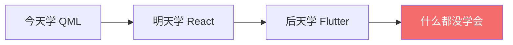

**正确做法**：专注一个技术栈，学深学透

---

### ❌ 误区 4：不敢问问题

**错误想法**：这个问题太简单了，不好意思问

**正确做法**：
- Google 搜索 15 分钟
- 问 ChatGPT
- 在论坛提问
- 问同事/老师

---

### ❌ 误区 5：收藏从未停止，学习从未开始

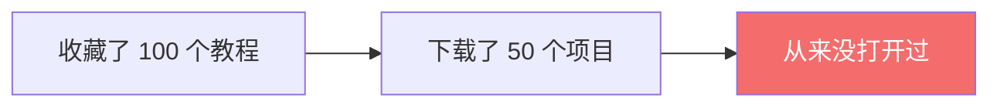

**正确做法**：只收藏 3 个最好的，然后认真学完

---

## 📚 五、资源推荐

### 🎯 精选资源（只推荐最好的）

#### 1. 官方文档（必看）
- **Qt Documentation** - https://doc.qt.io
- **QML 类型参考** - https://doc.qt.io/qt-6/qmltypes.html

#### 2. 视频教程（选一个）
- **YouTube**: "Qt Quick and QML Tutorial"
- **Bilibili**: 搜索 "QML 教程"

#### 3. 实战项目（GitHub）
- 搜索关键词：`qml example`, `qt quick project`
- 找 star 数多的项目学习

#### 4. 问答社区
- **Stack Overflow** - 搜索 QML 相关问题
- **Qt Forum** - https://forum.qt.io

#### 5. 辅助工具
- **ChatGPT** - 问问题、解释代码
- **GitHub Copilot** - 代码补全

### 📖 学习资源优先级

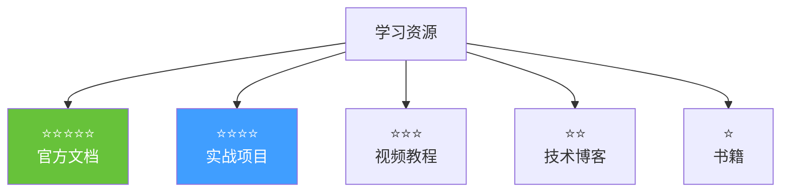

**建议**：
- 80% 时间：看文档 + 做项目
- 15% 时间：看视频教程
- 5% 时间：看博客/书籍

---

## 🎯 六、学习计划模板

### 30 天学习计划

| 周 | 学习内容 | 实战项目 | 时间投入 |
|----|----------|----------|----------|
| **第 1 周** | 基础语法、布局 | 计数器、计算器 | 每天 2 小时 |
| **第 2 周** | 列表、数据绑定 | 待办事项 | 每天 2 小时 |
| **第 3 周** | 网络请求、JSON | 天气应用 | 每天 2 小时 |
| **第 4 周** | 动画、状态管理 | 音乐播放器 | 每天 2 小时 |

### 每日学习流程

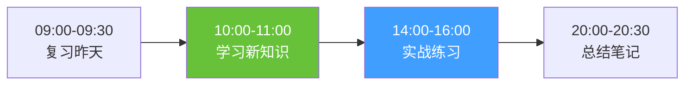

---

## 🚀 七、行动建议

### 立即开始的 3 件事

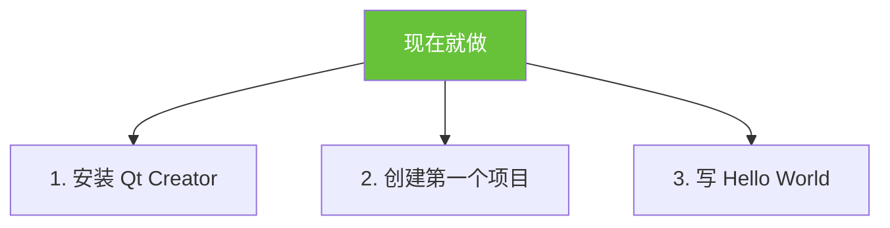

### 本周完成的 3 个任务

- [ ] 完成一个计数器应用
- [ ] 完成一个简单计算器
- [ ] 完成一个待办事项列表

### 本月目标

- [ ] 完成 5 个小项目
- [ ] 完成 1 个中型项目
- [ ] 写 3 篇学习笔记

---

## 💬 八、Q&A 环节

### 常见问题

#### Q1: 我没有编程基础，能学 Qt/QML 吗？
**A**: 可以！QML 比传统编程语言简单，类似 HTML+CSS。建议先学 JavaScript 基础。

#### Q2: 学 Qt 需要先学 C++ 吗？
**A**: 不需要！可以先学 QML，等需要性能优化时再学 C++。

#### Q3: 学习 Qt 需要多长时间？
**A**: 
- 入门：1-2 周
- 能做项目：1-2 月
- 精通：1 年+

#### Q4: Qt 的就业前景如何？
**A**: 
- 汽车行业（车载系统）
- 工业控制
- 嵌入式设备
- 桌面应用

#### Q5: 学习过程中遇到问题怎么办？
**A**: 
1. Google 搜索（英文关键词）
2. 问 ChatGPT
3. Stack Overflow
4. Qt 官方论坛

---

## 🎯 总结：学习的本质

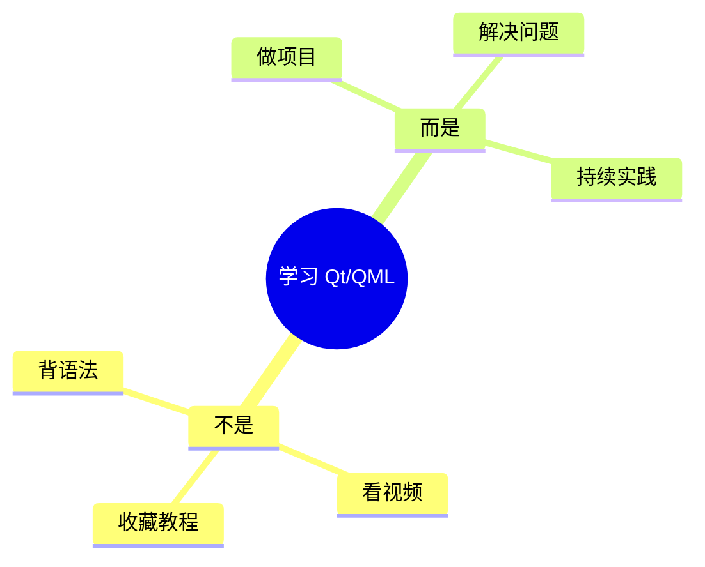

### 核心原则

1. **项目驱动** - 为了做项目而学习
2. **立即实践** - 学完立即动手
3. **持续迭代** - 不断优化改进
4. **教授他人** - 最好的学习方式

### 最后的建议

> **不要想太多，现在就开始！**  
> **第一个项目不需要完美，只需要完成！**  
> **学习的最大敌人是拖延，不是能力！**

---

<div align="center">

## 🚀 现在就开始你的 Qt/QML 之旅！

**记住：行动 > 完美**

### 下一步行动

1. 打开 Qt Creator
2. 创建第一个项目
3. 写下第一行代码

**祝你学习愉快！** 🎉

</div>

---

## 📎 附录：快速参考

### 学习路线图（一页纸版本）

```
第 1 周：基础语法 → 计数器
第 2 周：列表数据 → 待办事项
第 3 周：网络请求 → 天气应用
第 4 周：动画效果 → 音乐播放器
第 2 月：架构设计 → 聊天应用
第 3 月：性能优化 → 企业项目
```

### 必备技能清单

- [ ] QML 基础语法
- [ ] 布局系统（anchors, Row, Column）
- [ ] 信号和槽
- [ ] ListModel 和 ListView
- [ ] 网络请求（XMLHttpRequest）
- [ ] JSON 解析
- [ ] 动画（Animation）
- [ ] 状态管理（State）
- [ ] C++ 集成（进阶）
- [ ] 性能优化（进阶）

### 项目难度梯度

```
⭐ 计数器、计算器
⭐⭐ 待办事项、记事本
⭐⭐⭐ 天气应用、音乐播放器
⭐⭐⭐⭐ 聊天应用、数据仪表板
⭐⭐⭐⭐⭐ 企业管理系统
```
