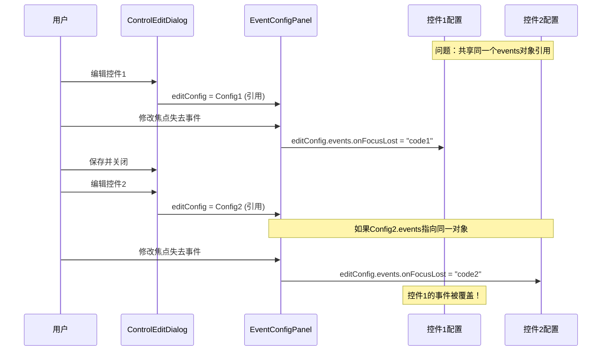

# 事件覆盖问题修复方案

## 问题描述

当修改一个输入框的焦点失去事件后，再去修改另一个输入框的事件时，第一个输入框的事件被覆盖了。

## 问题原因

在 `ControlEditDialog.qml` 中，`editConfig` 属性接收的是对原始控件配置对象的**引用**，而不是**深拷贝**。

当 `EventConfigPanel.updateEvent()` 方法直接修改 `editConfig.events` 时：

```javascript
function updateEvent(eventType, code) {
    if (!editConfig.events) {
        editConfig.events = {};  // 这里创建的对象会被所有控件共享
    }
    // ...
}
```

由于JavaScript对象是引用类型，所有控件的 `events` 属性可能指向同一个对象引用，导致修改一个控件的事件时影响到其他控件。

## 问题流程图



## 解决方案

### 方案1：在打开对话框时深拷贝配置（推荐）

修改打开编辑对话框的代码，确保传入的是配置的深拷贝。

**修改位置：** `qml/config/ConfigEditor.qml` 或调用 `editDialog` 的地方

```javascript
// 修改前（错误）
function editControl(index) {
    var control = configManager.currentConfig.controls[index];
    editDialog.editIndex = index;
    editDialog.editConfig = control;  // 直接引用，会导致问题
    editDialog.open();
}

// 修改后（正确）
function editControl(index) {
    var control = configManager.currentConfig.controls[index];
    editDialog.editIndex = index;
    editDialog.editConfig = deepCopy(control);  // 深拷贝，避免引用问题
    editDialog.open();
}

// 深拷贝函数
function deepCopy(obj) {
    if (obj === null || typeof obj !== 'object') {
        return obj;
    }
    
    if (Array.isArray(obj)) {
        var arrCopy = [];
        for (var i = 0; i < obj.length; i++) {
            arrCopy[i] = deepCopy(obj[i]);
        }
        return arrCopy;
    }
    
    var objCopy = {};
    for (var key in obj) {
        if (obj.hasOwnProperty(key)) {
            objCopy[key] = deepCopy(obj[key]);
        }
    }
    return objCopy;
}
```

### 方案2：使用JSON序列化深拷贝（简单但有限制）

```javascript
function editControl(index) {
    var control = configManager.currentConfig.controls[index];
    editDialog.editIndex = index;
    // 使用JSON序列化实现深拷贝
    editDialog.editConfig = JSON.parse(JSON.stringify(control));
    editDialog.open();
}
```

**注意：** 这种方法无法复制函数和特殊对象，但对于纯数据配置是足够的。

### 方案3：在EventConfigPanel中创建新对象（不推荐）

修改 `EventConfigPanel.qml` 的 `updateEvent` 方法：

```javascript
function updateEvent(eventType, code) {
    // 创建新的events对象，而不是修改现有引用
    var newEvents = {};
    
    // 复制现有事件
    if (editConfig.events) {
        for (var key in editConfig.events) {
            newEvents[key] = editConfig.events[key];
        }
    }
    
    // 更新指定事件
    switch (eventType) {
    case "focusLost":
        if (code.trim() !== "") {
            newEvents.onFocusLost = code.trim();
        } else {
            delete newEvents.onFocusLost;
        }
        break;
    // ... 其他case
    }
    
    // 替换整个events对象
    editConfig.events = newEvents;
}
```

**缺点：** 这种方法治标不治本，因为 `editConfig` 本身仍然是引用。

## 推荐实现

### 完整的修复代码

**1. 在 ConfigEditor.qml 中添加深拷贝函数：**

```javascript
// 在 ConfigEditor.qml 的 Item 中添加
function deepCopy(obj) {
    if (obj === null || typeof obj !== 'object') {
        return obj;
    }
    
    if (Array.isArray(obj)) {
        var arrCopy = [];
        for (var i = 0; i < obj.length; i++) {
            arrCopy[i] = deepCopy(obj[i]);
        }
        return arrCopy;
    }
    
    var objCopy = {};
    for (var key in obj) {
        if (obj.hasOwnProperty(key)) {
            objCopy[key] = deepCopy(obj[key]);
        }
    }
    return objCopy;
}
```

**2. 修改 GridPreview.qml 中打开编辑对话框的代码：**

找到 `GridPreview.qml` 中的 `editControl` 函数或类似的打开编辑对话框的代码：

```javascript
// 修改前
function editControl(control, index) {
    if (editDialog) {
        editDialog.editIndex = index;
        editDialog.editConfig = control;  // 问题所在
        editDialog.gridConfig = gridConfig;
        editDialog.open();
    }
}

// 修改后
function editControl(control, index) {
    if (editDialog) {
        editDialog.editIndex = index;
        editDialog.editConfig = JSON.parse(JSON.stringify(control));  // 深拷贝
        editDialog.gridConfig = gridConfig;
        editDialog.open();
    }
}
```

**3. 或者在 ControlEditDialog.qml 中接收时深拷贝：**

```javascript
// 在 ControlEditDialog.qml 中
property var editConfig: ({})

// 添加一个设置函数
function setEditConfig(config) {
    editConfig = JSON.parse(JSON.stringify(config));
}

// 然后在调用处使用
editDialog.setEditConfig(control);
```

## 验证修复

修复后，测试以下场景：

1. 创建两个文本框控件
2. 编辑第一个文本框，设置焦点失去事件为：`console.log("控件1失去焦点")`
3. 保存并关闭
4. 编辑第二个文本框，设置焦点失去事件为：`console.log("控件2失去焦点")`
5. 保存并关闭
6. 再次打开第一个文本框的编辑对话框
7. 检查焦点失去事件是否仍然是：`console.log("控件1失去焦点")`

如果第7步显示的仍然是控件1的事件，说明修复成功。

## 其他注意事项

### 为什么会出现这个问题？

JavaScript中对象是引用类型：

```javascript
var obj1 = { events: {} };
var obj2 = obj1;  // obj2和obj1指向同一个对象

obj2.events.onFocusLost = "code";
console.log(obj1.events.onFocusLost);  // 输出 "code"，因为是同一个对象
```

### 深拷贝 vs 浅拷贝

```javascript
// 浅拷贝（不够）
var copy = Object.assign({}, original);
// 或
var copy = {...original};

// 问题：嵌套对象仍然是引用
copy.events === original.events  // true，仍然是同一个对象

// 深拷贝（正确）
var copy = JSON.parse(JSON.stringify(original));
// 或使用递归函数
copy.events === original.events  // false，是不同的对象
```

### 性能考虑

深拷贝会有一定的性能开销，但对于表单配置这种小对象来说，影响可以忽略不计。如果配置对象非常大，可以考虑只深拷贝 `events` 属性：

```javascript
function editControl(control, index) {
    var configCopy = Object.assign({}, control);
    if (control.events) {
        configCopy.events = JSON.parse(JSON.stringify(control.events));
    }
    editDialog.editConfig = configCopy;
    // ...
}
```

## 总结

**问题根源：** JavaScript对象引用导致多个控件共享同一个 `events` 对象

**解决方案：** 在打开编辑对话框时对配置进行深拷贝

**推荐方法：** 使用 `JSON.parse(JSON.stringify(obj))` 进行深拷贝

**修改位置：** 打开编辑对话框的地方（GridPreview.qml 或 ConfigEditor.qml）

修复后，每个控件的事件配置将完全独立，互不影响。
