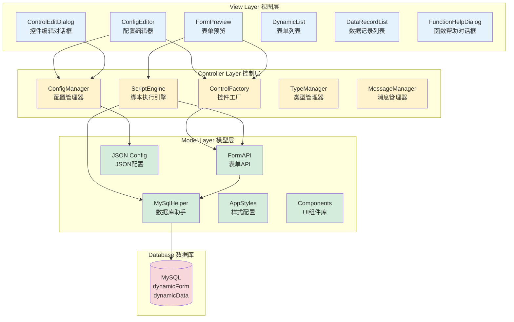
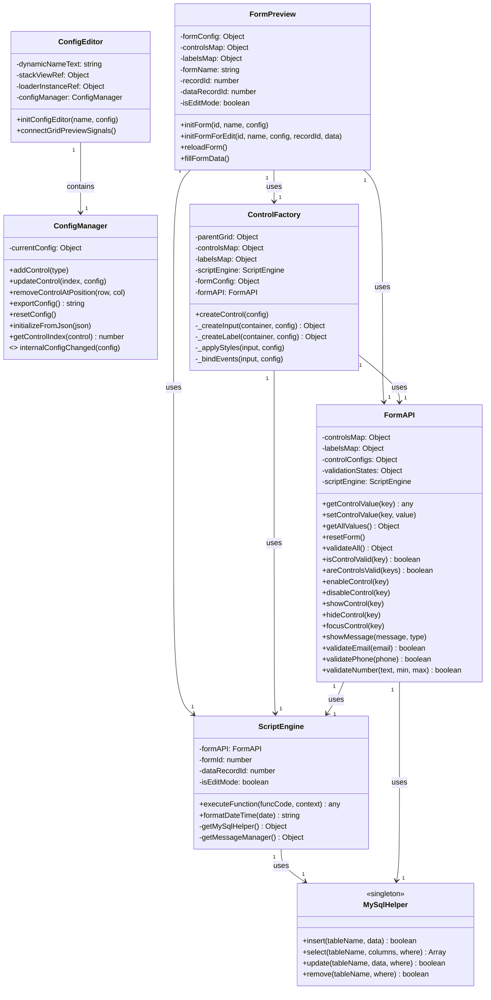
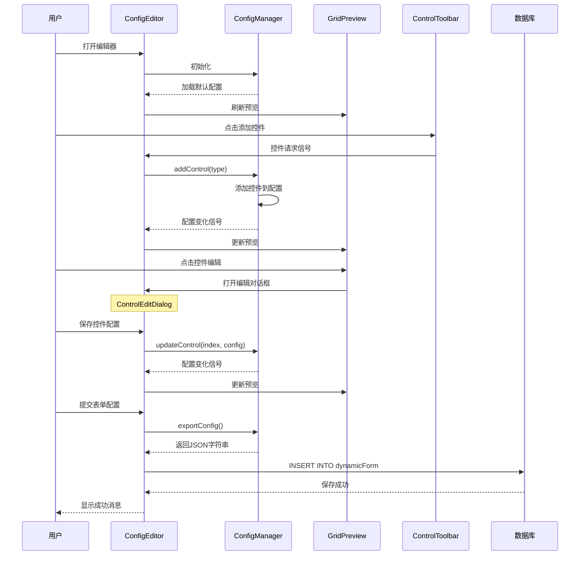
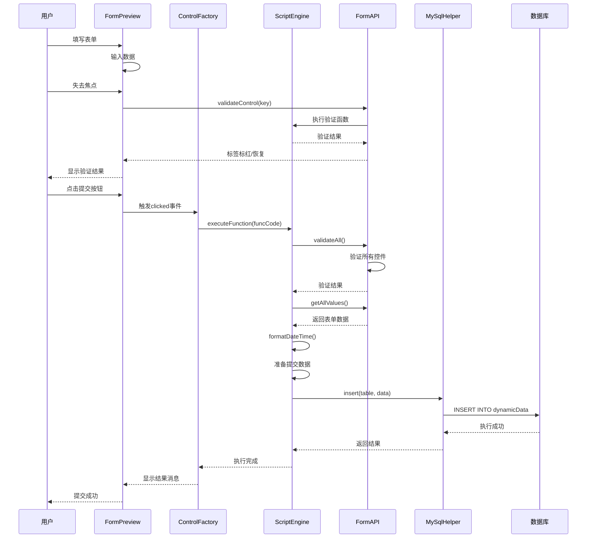
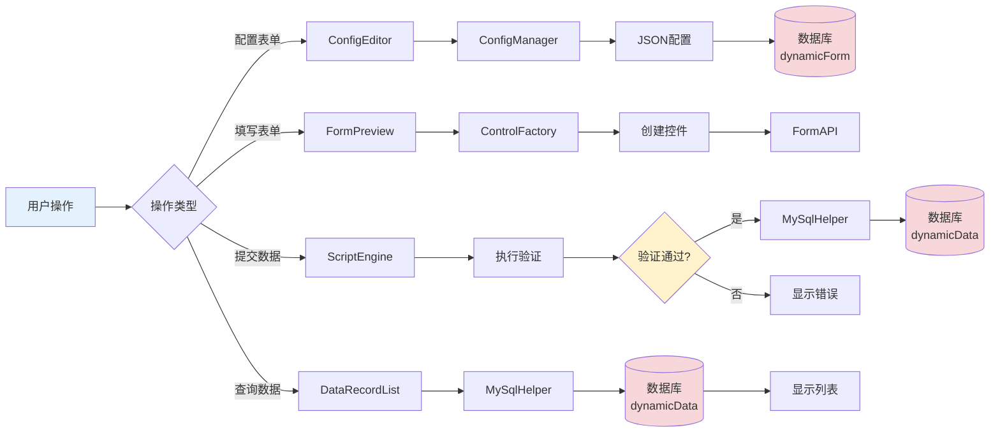
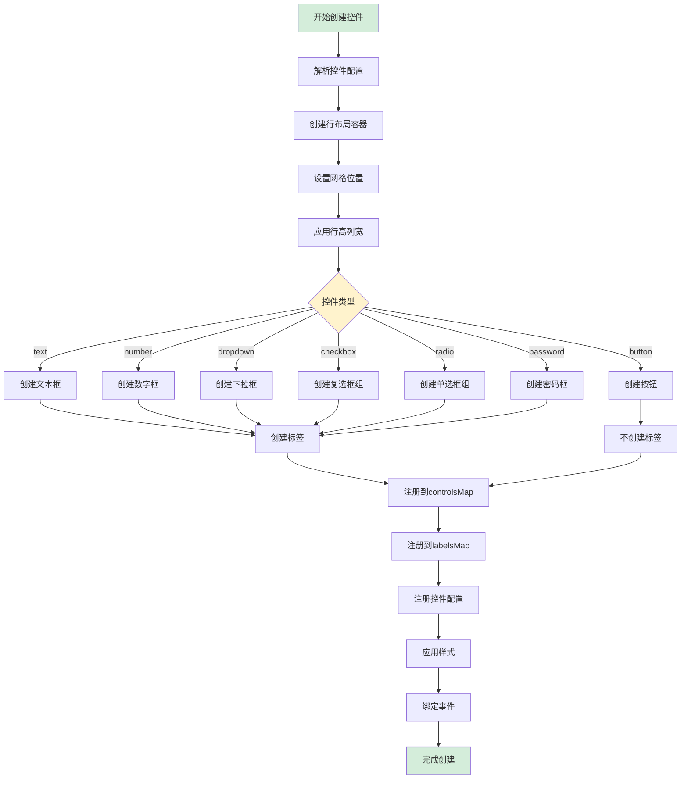
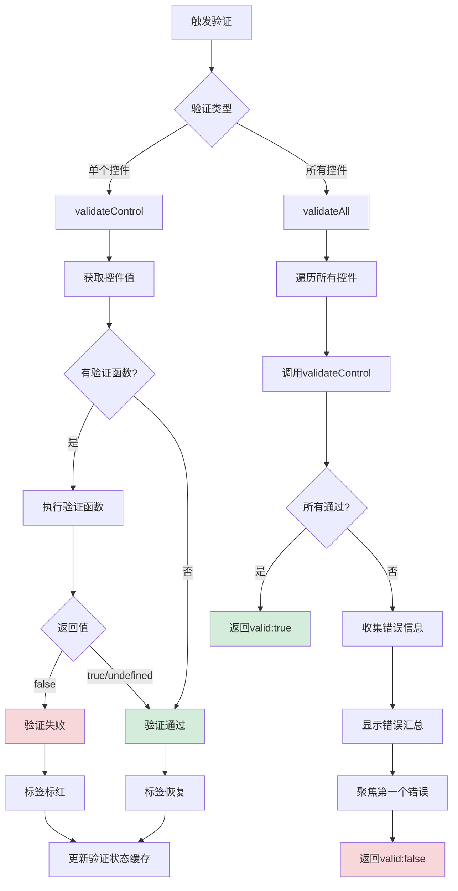
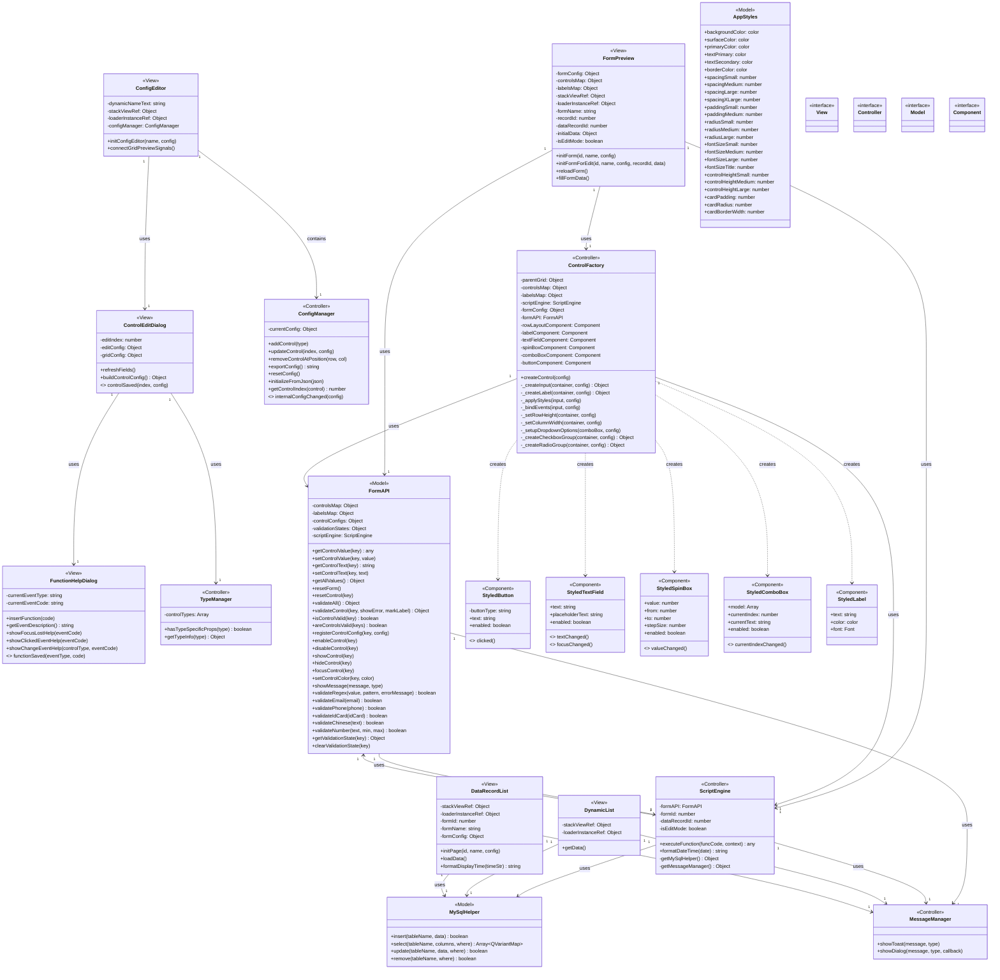

# 动态表单系统完整使用手册 v3.0

## 目录
1. [系统概述](#系统概述)
2. [快速开始](#快速开始)
3. [创建表单](#创建表单)
4. [控件类型详解](#控件类型详解)
5. [事件函数配置](#事件函数配置)
6. [验证功能](#验证功能)
7. [数据库操作](#数据库操作)
8. [QML 技术详解](#qml技术详解)
9. [设计思路与架构](#设计思路与架构)
10. [完整示例](#完整示例)

---

## 系统概述

### 什么是动态表单系统？

动态表单系统是一个基于 Qt QML 开发的可视化表单配置和渲染平台。它允许用户通过图形界面设计表单，无需编写代码即可创建复杂的数据录入界面。

### 核心特性

- **可视化设计**：拖拽式表单设计，实时预览
- **多种控件类型**：支持文本框、数字框、下拉框、复选框、单选框、按钮等
- **灵活布局**：网格布局系统，支持自定义行列数、间距、跨度
- **事件驱动**：支持焦点丢失、值变化、按钮点击等事件
- **自定义验证**：内置常用验证函数，支持自定义验证逻辑
- **数据库集成**：直接操作 MySQL 数据库，支持增删改查
- **JavaScript 支持**：事件处理函数使用 JavaScript 编写，灵活强大

### 技术栈

- **前端框架**：Qt Quick 6.5 (QML)
- **数据库**：MySQL
- **脚本语言**：JavaScript
- **设计模式**：工厂模式、观察者模式、MVC 架构

---

## 快速开始

### 第一步：启动应用

运行应用后，您将看到表单列表界面，显示所有已创建的表单。

### 第二步：创建新表单

1. 点击**"新增表单"**按钮
2. 进入表单配置编辑器界面

### 第三步：配置表单基本信息

1. 输入**表单名称**（必填）
2. 配置网格布局（行数、列数、间距等）

### 第四步：添加控件

1. 从控件工具栏选择需要的控件类型
2. 点击控件按钮，控件将自动添加到表单中
3. 点击控件进行编辑配置

### 第五步：保存表单

1. 点击**"提交表单配置"**按钮
2. 表单配置将保存到数据库

### 第六步：使用表单

1. 返回表单列表
2. 点击**"新增"**按钮填写数据
3. 点击**"查询"**按钮查看已提交的数据

---

## 创建表单

### 表单配置界面说明

表单配置编辑器包含以下几个部分：

#### 1. 表单基本配置
- **表单名称**：用于标识表单，必填项

#### 2. 网格配置面板
配置表单的布局结构：

- **行数（Rows）**：表单的行数，默认 4 行
- **列数（Columns）**：表单的列数，默认 2 列
- **行间距（Row Spacing）**：行与行之间的间距，单位像素
- **列间距（Column Spacing）**：列与列之间的间距，单位像素
- **行高比例（Row Heights）**：每行的高度比例，用逗号分隔，如 `1,1,1,2`
- **列宽比例（Column Widths）**：每列的宽度比例，用逗号分隔，如 `1,2`

**示例配置：**
```
行数: 5
列数: 2
行间距: 10
列间距: 15
行高比例: 1,1,1,1,2
列宽比例: 1,2
```

这将创建一个 5 行 2 列的表单，前 4 行高度相同，最后一行高度是前面的 2 倍；第一列宽度是第二列的一半。

#### 3. 控件工具栏
提供多种控件类型供选择：

- 📝 **文本框（Text）**：单行文本输入
- 🔢 **数字框（Number）**：数字输入，支持增减按钮
- 🔽 **下拉框（Dropdown）**：下拉选择列表
- ☑️ **复选框（Checkbox）**：多选框组
- 🔘 **单选框（Radio）**：单选按钮组
- 🔘 **按钮（Button）**：操作按钮
- 🔒 **密码框（Password）**：密码输入框

#### 4. 控件预览区域
实时显示表单的布局和控件配置效果。

**操作说明：**
- **左键点击控件**：打开编辑对话框
- **右键点击控件**：删除该控件

---


## QML 技术详解

### QML 简介

QML (Qt Modeling Language) 是一种声明式语言，用于设计以用户界面为中心的应用程序。它是 Qt Quick 的一部分，提供了一种简洁的方式来构建流畅的用户界面。

### 数据绑定

#### 属性绑定

QML 的核心特性之一是属性绑定，当绑定的属性值发生变化时，依赖它的属性会自动更新。

```qml
Rectangle {
    id: rect
    width: 100
    height: width * 2  // height 自动绑定到 width，当 width 变化时 height 自动更新
}

Text {
    text: "宽度: " + rect.width  // text 绑定到 rect.width
}
```

#### 双向绑定

使用 `Binding` 对象可以实现更复杂的绑定：

```qml
TextField {
    id: nameInput
    text: ""
}

Text {
    id: displayText
    text: ""
}

Binding {
    target: displayText
    property: "text"
    value: "你好, " + nameInput.text
}
```

#### 动态属性绑定

在本系统中，控件的值与 controlsMap 绑定：

```qml
// FormPreview.qml
property var controlsMap: ({})

// 当控件创建时，注册到 controlsMap
controlsMap[controlKey] = input

// FormAPI 可以通过 controlsMap 访问所有控件
function getControlValue(key) {
    if (controlsMap[key]) {
        return controlsMap[key].text  // 自动获取最新值
    }
}
```

### 信号与槽机制

#### 信号定义

```qml
// ConfigManager.qml
QtObject {
    signal internalConfigChanged(var newConfig)
    
    function updateConfig() {
        // 配置变化时发出信号
        internalConfigChanged(currentConfig)
    }
}
```

#### 信号连接

```qml
// ConfigEditor.qml
Connections {
    target: configManagerLoader
    function onLoaded() {
        // 连接配置变化信号
        item.internalConfigChanged.connect(function (newConfig) {
            // 更新预览
            gridPreviewLoader.item.controls = newConfig.controls
            gridPreviewLoader.item.refresh()
        })
    }
}
```

#### 自定义信号

```qml
Dialog {
    id: editDialog
    
    // 定义自定义信号
    signal controlSaved(int index, var config)
    
    onAccepted: {
        var newConfig = buildControlConfig()
        // 发出信号
        controlSaved(editIndex, newConfig)
    }
}

// 使用信号
editDialog.controlSaved.connect(function(index, config) {
    configManager.updateControl(index, config)
})
```

### 数据库交互

#### C++ 端实现

```cpp
// MySqlHelper.h
class MySqlHelper : public QObject {
    Q_OBJECT
public:
    Q_INVOKABLE bool insert(const QString& tableName, const QMap<QString, QVariant>& data);
    Q_INVOKABLE QVector<QVariantMap> select(const QString& tableName, 
                                             const QStringList& columns, 
                                             const QString& where);
    Q_INVOKABLE bool update(const QString& tableName, 
                            const QMap<QString, QVariant>& data, 
                            const QString& where);
    Q_INVOKABLE bool remove(const QString& tableName, const QString& where);
};
```

**关键点：**
- `Q_OBJECT` 宏：启用 Qt 元对象系统
- `Q_INVOKABLE` 宏：使方法可以从 QML 调用
- 参数类型必须是 Qt 元类型系统支持的类型

#### QML 端调用

```qml
import mysqlhelper 1.0

Item {
    Component.onCompleted: {
        // 插入数据
        var data = {
            username: "张三",
            age: 25
        }
        var result = MySqlHelper.insert("users", data)
        
        // 查询数据
        var users = MySqlHelper.select("users", ["*"], "age > 18")
        console.log("查询结果:", JSON.stringify(users))
    }
}
```

### QML 与 C++ 交互

#### 注册 C++ 类型到 QML

```cpp
// main.cpp
#include <QQmlContext>
#include "MySqlHelper.h"

int main(int argc, char *argv[]) {
    QGuiApplication app(argc, argv);
    QQmlApplicationEngine engine;
    
    // 方式1：注册类型（可以在 QML 中实例化）
    qmlRegisterType<MySqlHelper>("mysqlhelper", 1, 0, "MySqlHelper");
    
    // 方式2：注册单例（全局唯一实例）
    qmlRegisterSingletonType<MySqlHelper>("mysqlhelper", 1, 0, "MySqlHelper",
        [](QQmlEngine *engine, QJSEngine *scriptEngine) -> QObject * {
            return new MySqlHelper();
        });
    
    // 方式3：设置上下文属性（直接可用）
    MySqlHelper *helper = new MySqlHelper();
    engine.rootContext()->setContextProperty("MySqlHelper", helper);
    
    engine.load(QUrl(QStringLiteral("qrc:/main.qml")));
    return app.exec();
}
```

#### 从 QML 调用 C++ 方法

```qml
// 调用 C++ 方法
Button {
    text: "保存"
    onClicked: {
        // 调用 C++ 的 insert 方法
        var success = MySqlHelper.insert("users", {
            name: nameInput.text,
            age: ageInput.value
        })
        
        if (success) {
            console.log("保存成功")
        }
    }
}
```

#### 从 C++ 调用 QML 方法

```cpp
// C++ 端
QObject *rootObject = engine.rootObjects().first();
QMetaObject::invokeMethod(rootObject, "showMessage",
    Q_ARG(QString, "Hello from C++"),
    Q_ARG(QString, "info"));
```

```qml
// QML 端
Item {
    function showMessage(message, type) {
        console.log(message, type)
    }
}
```

### 动态对象创建

#### 使用 Component

```qml
Component {
    id: buttonComponent
    Button {
        text: "动态按钮"
    }
}

Item {
    function createButton() {
        var button = buttonComponent.createObject(parent, {
            "text": "新按钮",
            "x": 100,
            "y": 100
        })
        return button
    }
}
```

#### 使用 Qt.createQmlObject

```qml
function createDynamicControl(type) {
    var qmlString = 'import QtQuick.Controls 6.5; ' + type + ' { }'
    var control = Qt.createQmlObject(qmlString, parent, "dynamicControl")
    return control
}
```

#### 本系统中的应用

```qml
// ControlFactory.qml
function _createInput(container, config) {
    var input = null
    
    switch(config.type) {
        case "text":
            input = textFieldComponent.createObject(container)
            input.text = config.value || ""
            break
        case "number":
            input = spinBoxComponent.createObject(container)
            input.value = config.value || 0
            break
    }
    
    return input
}
```

### Loader 动态加载

#### 基本用法

```qml
Loader {
    id: pageLoader
    source: "Page1.qml"
    
    onLoaded: {
        // 页面加载完成后的处理
        item.initialize()
    }
}

// 切换页面
Button {
    text: "切换到 Page2"
    onClicked: {
        pageLoader.source = "Page2.qml"
    }
}
```

#### 本系统中的应用

```qml
// ConfigEditor.qml
Loader {
    id: configManagerLoader
    source: "managers/ConfigManager.qml"
    onLoaded: {
        // 连接信号
        item.internalConfigChanged.connect(function (newConfig) {
            gridPreviewLoader.item.controls = newConfig.controls
            gridPreviewLoader.item.refresh()
        })
    }
}

property var configManager: configManagerLoader.item
```

### 状态管理

#### 使用 State

```qml
Rectangle {
    id: rect
    width: 100
    height: 100
    color: "blue"
    
    states: [
        State {
            name: "expanded"
            PropertyChanges {
                target: rect
                width: 200
                height: 200
                color: "red"
            }
        }
    ]
    
    transitions: [
        Transition {
            from: ""
            to: "expanded"
            PropertyAnimation {
                properties: "width,height,color"
                duration: 300
            }
        }
    ]
    
    MouseArea {
        anchors.fill: parent
        onClicked: {
            rect.state = rect.state === "expanded" ? "" : "expanded"
        }
    }
}
```

### JavaScript 集成

#### 在 QML 中使用 JavaScript

```qml
Item {
    // 内联 JavaScript
    function calculateTotal(price, quantity) {
        return price * quantity
    }
    
    // 使用 JavaScript 对象
    property var userData: ({
        name: "张三",
        age: 25,
        email: "zhangsan@example.com"
    })
    
    Component.onCompleted: {
        // 使用 JSON
        var jsonString = JSON.stringify(userData)
        console.log(jsonString)
        
        var parsed = JSON.parse(jsonString)
        console.log(parsed.name)
    }
}
```

#### 本系统中的 ScriptEngine

```qml
// ScriptEngine.qml
function executeFunction(funcCode, context) {
    try {
        // 创建函数执行环境
        var func = new Function(
            'self', 'formAPI', 'formId', 'formData',
            funcCode
        )
        
        // 执行函数
        var result = func(
            context.self,
            formAPI,
            formId,
            formData
        )
        
        return result
    } catch (error) {
        console.error("执行错误:", error)
    }
}
```

### 最佳实践

#### 1. 避免循环依赖

```qml
// 错误示例
Rectangle {
    width: height + 10
    height: width - 10  // 循环依赖！
}

// 正确示例
Rectangle {
    width: 100
    height: width * 2
}
```

#### 2. 使用 Loader 延迟加载

```qml
// 对于复杂组件，使用 Loader 延迟加载
Loader {
    id: complexComponentLoader
    active: false  // 初始不加载
    source: "ComplexComponent.qml"
}

Button {
    text: "显示复杂组件"
    onClicked: {
        complexComponentLoader.active = true
    }
}
```

#### 3. 合理使用信号

```qml
// 使用信号而不是直接调用
Item {
    signal dataChanged(var newData)
    
    function updateData(data) {
        // 处理数据
        dataChanged(data)  // 发出信号
    }
}
```

#### 4. 性能优化

```qml
// 使用 ListView 而不是 Repeater 处理大量数据
ListView {
    model: 1000
    delegate: Rectangle {
        width: parent.width
        height: 50
    }
    
    // 启用缓存
    cacheBuffer: 500
}
```

---


## 系统架构图（Mermaid）

### 整体架构图



### 核心类图



### 创建表单配置时序图



### 表单提交数据时序图



### 数据流转图



### 控件创建流程图



### 验证流程图



---


## 完整类图（Mermaid）



---

## API 完整参考手册

### 1. 基础变量

| 变量名 | 类型 | 作用域 | 说明 | 示例 |
|--------|------|--------|------|------|
| `self` | Object | 事件函数 | 当前触发事件的控件对象 | `self.value` |
| `value` | any | 验证函数 | 当前控件的值 | `if (value.length < 3) { ... }` |
| `formId` | number | 事件函数 | 表单ID，用于标识当前表单 | `formId` |
| `formData` | Object | 事件函数 | 表单所有数据的JSON对象 | `formData.username` |
| `isEditMode` | boolean | 事件函数 | 是否为编辑模式 | `if (isEditMode) { ... }` |
| `dataRecordId` | number | 事件函数 | 数据记录ID（仅编辑模式有效） | `dataRecordId` |

### 2. 获取控件值函数

#### getAllValues()

**功能**：获取表单中所有控件的值（不包括按钮）

**参数**：无

**返回值**：`Object` - 键值对对象，key 为控件的 key，value 为控件的值

**示例**：
```javascript
var allData = getAllValues();
console.log('表单数据:', JSON.stringify(allData));
// 输出: {"username":"张三","age":25,"email":"zhangsan@example.com"}
```

#### getControlValue(key)

**功能**：获取指定控件的值

**参数**：
- `key` (string) - 控件的唯一标识符

**返回值**：`any` - 控件的值，如果控件不存在返回空字符串

**示例**：
```javascript
var username = getControlValue('username');
var age = getControlValue('age');
console.log('用户名:', username, '年龄:', age);
```

### 3. 设置控件值函数

#### setControlValue(key, value)

**功能**：设置指定控件的值

**参数**：
- `key` (string) - 控件的唯一标识符
- `value` (any) - 要设置的值

**返回值**：无

**示例**：
```javascript
setControlValue('username', '张三');
setControlValue('age', 25);
setControlValue('gender', 'male'); // 下拉框会自动选中对应的选项
```

#### resetControl(key)

**功能**：将指定控件重置为默认值

**参数**：
- `key` (string) - 控件的唯一标识符

**返回值**：无

**说明**：
- 文本框重置为空字符串
- 数字框重置为 0
- 复选框重置为未选中
- 下拉框重置为第一项

**示例**：
```javascript
resetControl('username'); // 清空用户名输入框
```

#### resetForm()

**功能**：重置表单中所有控件（不包括按钮）

**参数**：无

**返回值**：无

**示例**：
```javascript
// 提交成功后重置表单
MySqlHelper.insert('users', userData);
showMessage('提交成功！', 'success');
resetForm(); // 清空所有输入框
```

### 4. 控件状态控制函数

#### enableControl(key)

**功能**：启用控件（可编辑/可点击）

**参数**：
- `key` (string) - 控件的唯一标识符

**返回值**：无

**示例**：
```javascript
enableControl('submit_btn');
```

#### disableControl(key)

**功能**：禁用控件（不可编辑/不可点击）

**参数**：
- `key` (string) - 控件的唯一标识符

**返回值**：无

**示例**：
```javascript
// 根据复选框状态启用/禁用提交按钮
var agreed = getControlValue('agree_checkbox');
if (agreed) {
    enableControl('submit_btn');
} else {
    disableControl('submit_btn');
}
```

#### showControl(key)

**功能**：显示控件

**参数**：
- `key` (string) - 控件的唯一标识符

**返回值**：无

**示例**：
```javascript
showControl('university');
```

#### hideControl(key)

**功能**：隐藏控件

**参数**：
- `key` (string) - 控件的唯一标识符

**返回值**：无

**示例**：
```javascript
// 根据学历显示/隐藏相关字段
var education = getControlValue('education');
if (education === 'high_school') {
    hideControl('university');
    hideControl('major');
} else {
    showControl('university');
    showControl('major');
}
```

#### focusControl(key)

**功能**：让指定控件获得焦点

**参数**：
- `key` (string) - 控件的唯一标识符

**返回值**：无

**示例**：
```javascript
// 验证失败后聚焦到错误字段
if (!validateEmail(getControlValue('email'))) {
    focusControl('email');
    return false;
}
```

### 5. 验证函数

#### validateAll()

**功能**：验证表单中所有配置了验证函数的控件

**参数**：无

**返回值**：`Object` - `{valid: boolean, errors: Array}`
- `valid`: 是否全部通过
- `errors`: 错误列表，每个错误包含 `{key, label, message}`

**说明**：
- 验证失败的控件标签会自动标红
- 自动显示错误提示消息
- 自动聚焦到第一个错误字段

**示例**：
```javascript
var validation = validateAll();
if (!validation.valid) {
    // 验证失败，已自动提示错误
    return;
}
// 验证通过，继续提交
MySqlHelper.insert('users', formData);
```

#### formAPI.isControlValid(key)

**功能**：检查单个控件是否验证通过

**参数**：
- `key` (string) - 控件的唯一标识符

**返回值**：`boolean` - true 表示验证通过，false 表示验证失败或未验证

**说明**：必须先执行过验证（焦点丢失或 validateAll）才有效

**示例**：
```javascript
if (formAPI.isControlValid('email')) {
    console.log('邮箱验证通过');
} else {
    showMessage('请先验证邮箱', 'warning');
}
```

#### formAPI.areControlsValid(keys)

**功能**：检查多个控件是否都验证通过

**参数**：
- `keys` (Array<string>) - 控件 key 的数组

**返回值**：`boolean` - 所有指定的控件都验证通过才返回 true

**示例**：
```javascript
// 检查必填项是否都验证通过
if (formAPI.areControlsValid(['name', 'age', 'email'])) {
    // 所有必填项都验证通过，可以查询数据库
    var result = MySqlHelper.select('users', ['*'], 'name="' + getControlValue('name') + '"');
} else {
    showMessage('请先完成所有必填项', 'warning');
}
```

#### validateEmail(email)

**功能**：验证邮箱格式是否正确

**参数**：
- `email` (string) - 要验证的邮箱地址

**返回值**：`boolean` - true 表示格式正确，false 表示格式错误

**说明**：验证失败自动显示错误消息"请输入有效的邮箱地址"

**示例**：
```javascript
// 在验证函数中使用
if (!validateEmail(value)) {
    return false;
}
```

#### validatePhone(phone)

**功能**：验证中国大陆手机号格式（11位，1开头）

**参数**：
- `phone` (string) - 要验证的手机号

**返回值**：`boolean` - true 表示格式正确，false 表示格式错误

**说明**：验证失败自动显示错误消息"请输入有效的手机号码"

**示例**：
```javascript
if (!validatePhone(value)) {
    return false;
}
```

#### validateIdCard(idCard)

**功能**：验证中国大陆身份证号格式（18位）

**参数**：
- `idCard` (string) - 要验证的身份证号

**返回值**：`boolean` - true 表示格式正确，false 表示格式错误

**说明**：验证失败自动显示错误消息"请输入有效的身份证号码"

**示例**：
```javascript
if (!validateIdCard(value)) {
    return false;
}
```

#### validateNumber(text, min, max)

**功能**：验证数字是否在指定范围内

**参数**：
- `text` (string) - 要验证的数字字符串
- `min` (number, 可选) - 最小值
- `max` (number, 可选) - 最大值

**返回值**：`boolean` - true 表示验证通过，false 表示验证失败

**说明**：验证失败自动显示相应的错误消息

**示例**：
```javascript
// 验证年龄在 18-65 之间
if (!validateNumber(value, 18, 65)) {
    return false;
}
```

#### validateRegex(value, pattern, errorMessage)

**功能**：使用正则表达式验证

**参数**：
- `value` (string) - 要验证的值
- `pattern` (string) - 正则表达式模式（JavaScript 语法）
- `errorMessage` (string) - 验证失败时的提示消息

**返回值**：`boolean` - true 表示匹配成功，false 表示匹配失败

**示例**：
```javascript
// 验证邮政编码（6位数字）
if (!validateRegex(value, '^\\d{6}$', '请输入6位数字的邮政编码')) {
    return false;
}
```

### 6. 消息提示函数

#### showMessage(message, type)

**功能**：在界面上显示消息提示

**参数**：
- `message` (string) - 消息内容
- `type` (string) - 消息类型，可选值：
  - `'info'` - 信息提示（蓝色）
  - `'success'` - 成功提示（绿色）
  - `'warning'` - 警告提示（黄色）
  - `'error'` - 错误提示（红色）

**返回值**：无

**示例**：
```javascript
showMessage('这是一条信息', 'info');
showMessage('操作成功！', 'success');
showMessage('请注意检查', 'warning');
showMessage('操作失败', 'error');
```

### 7. 工具函数

#### formatDateTime(date)

**功能**：将 JavaScript Date 对象格式化为 MySQL DATETIME 格式

**参数**：
- `date` (Date, 可选) - Date 对象，如果不传则使用当前时间

**返回值**：`string` - 格式化后的日期时间字符串，格式为 `'YYYY-MM-DD HH:MM:SS'`

**说明**：提交到数据库的 DATETIME 字段必须使用此函数格式化

**示例**：
```javascript
// 获取当前时间
var now = formatDateTime();
console.log(now); // 输出: '2025-11-18 13:31:33'

// 格式化指定日期
var customDate = new Date('2025-01-01');
var formatted = formatDateTime(customDate);
console.log(formatted); // 输出: '2025-01-01 00:00:00'

// 提交到数据库
var submitData = {
    username: getControlValue('username'),
    email: getControlValue('email'),
    createTime: formatDateTime() // 使用格式化的当前时间
};
MySqlHelper.insert('users', submitData);
```

### 8. 数据库操作函数

#### MySqlHelper.insert(tableName, data)

**功能**：向数据库表插入一条新记录

**参数**：
- `tableName` (string) - 表名
- `data` (Object) - 要插入的数据（键值对）

**返回值**：`boolean` - true 表示插入成功，false 表示失败

**注意**：DATETIME 字段必须使用 `formatDateTime()` 格式化

**示例**：
```javascript
var userData = {
    username: getControlValue('username'),
    email: getControlValue('email'),
    age: getControlValue('age'),
    createTime: formatDateTime()
};

try {
    var result = MySqlHelper.insert('users', userData);
    if (result) {
        showMessage('注册成功！', 'success');
        resetForm();
    } else {
        showMessage('注册失败', 'error');
    }
} catch(e) {
    showMessage('注册失败: ' + e, 'error');
    console.error('Insert error:', e);
}
```

#### MySqlHelper.select(tableName, columns, where)

**功能**：从数据库表查询数据

**参数**：
- `tableName` (string) - 表名
- `columns` (Array) - 要查询的列，`['*']` 表示查询所有列
- `where` (string) - WHERE 条件，空字符串 `""` 表示无条件

**返回值**：`Array` - 查询结果数组，每个元素是一个对象，表示一行数据

**示例**：
```javascript
// 查询所有用户
var allUsers = MySqlHelper.select('users', ['*'], '');
console.log('所有用户:', JSON.stringify(allUsers));

// 根据条件查询
var username = getControlValue('username');
var result = MySqlHelper.select('users', ['*'], 'username="' + username + '"');
if (result.length > 0) {
    var user = result[0];
    showMessage('找到用户：' + user.email, 'success');
} else {
    showMessage('用户不存在', 'warning');
}

// 查询特定列
var result = MySqlHelper.select('users', ['id', 'username', 'email'], 'age > 18');
```

#### MySqlHelper.update(tableName, data, where)

**功能**：更新数据库表中的记录

**参数**：
- `tableName` (string) - 表名
- `data` (Object) - 要更新的数据（键值对）
- `where` (string) - WHERE 条件，指定要更新哪些记录

**返回值**：`boolean` - true 表示更新成功，false 表示失败

**示例**：
```javascript
var updateData = {
    email: getControlValue('email'),
    age: getControlValue('age')
};

var userId = 1;
var where = 'id=' + userId;

try {
    var result = MySqlHelper.update('users', updateData, where);
    if (result) {
        showMessage('更新成功！', 'success');
    } else {
        showMessage('更新失败', 'error');
    }
} catch(e) {
    showMessage('更新失败: ' + e, 'error');
}
```

#### MySqlHelper.remove(tableName, where)

**功能**：从数据库表删除记录

**参数**：
- `tableName` (string) - 表名
- `where` (string) - WHERE 条件，指定要删除哪些记录

**返回值**：`boolean` - true 表示删除成功，false 表示失败

**警告**：如果 where 为空，会删除表中所有数据

**示例**：
```javascript
var userId = getControlValue('user_id');
var where = 'id=' + userId;

try {
    var result = MySqlHelper.remove('users', where);
    if (result) {
        showMessage('删除成功！', 'success');
    } else {
        showMessage('删除失败', 'error');
    }
} catch(e) {
    showMessage('删除失败: ' + e, 'error');
}
```

---

**文档版本**：v3.0  
**最后更新**：2025-11-18  
**作者**：Dynamic Form QML Team  
**适用于**：开发文档、技术汇报、用户手册
