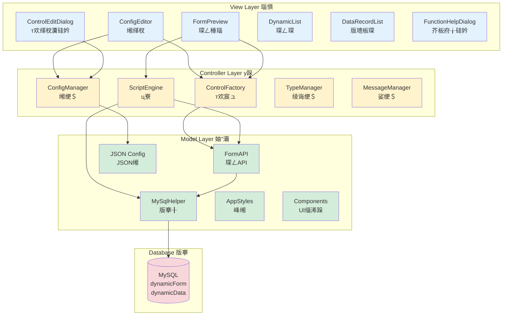
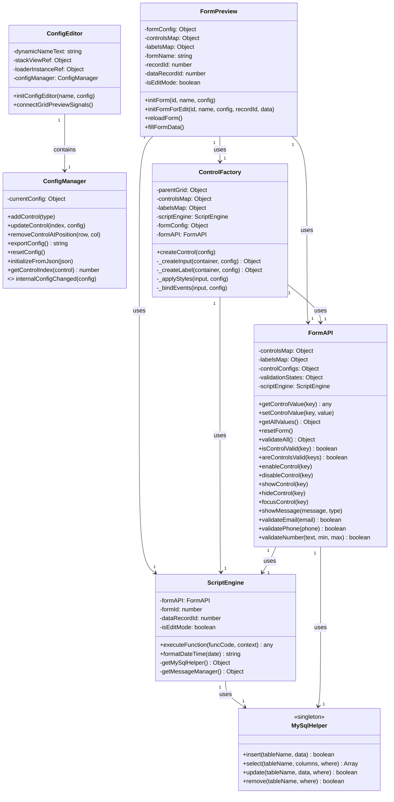
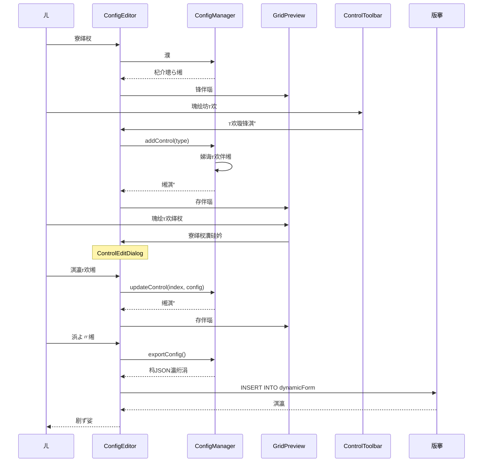
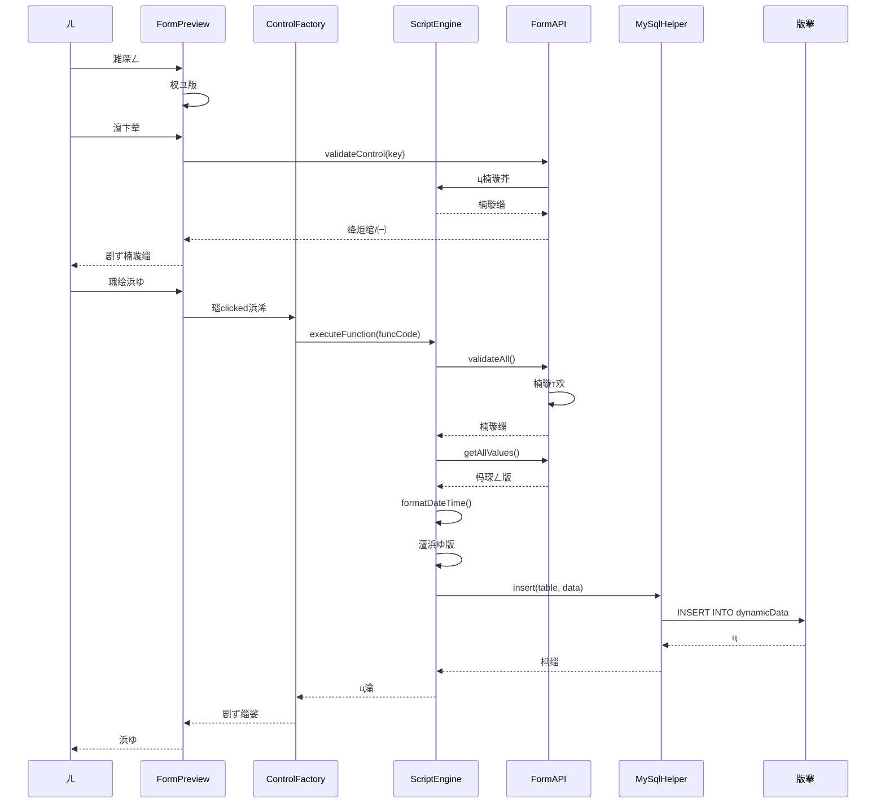

锘# ㄦ琛ㄥ绯荤瀹翠娇ㄦ锟?

## 褰
1. [绯荤姒杩](#绯荤姒杩)
2. [蹇寮濮](#蹇寮锟?
3. [寤鸿〃](#寤鸿〃)
4. [т欢绫诲璇瑙](#т欢绫诲璇瑙)
5. [浜浠跺芥伴缃](#浜浠跺芥伴缃)
6. [楠璇](#楠璇)
7. [版搴浣](#版搴锟?
8. [璁捐℃璺涓舵](#璁捐℃璺涓讹拷?
9. [瀹寸ず渚](#瀹寸ず渚)

---

## 绯荤姒杩

### 浠涔ㄦ琛ㄥ绯荤锛

ㄦ琛ㄥ绯荤涓涓猴拷?Qt QML 寮瑙琛ㄥ缃娓叉骞冲般瀹璁哥ㄦ烽杩惧舰㈣捐¤〃锛缂浠ｇ冲寤哄版褰ョ锟?

### 稿癸拷?

- **瑙璁撅拷?*锛藉琛ㄥ璁捐★瀹堕锟?
- **澶绉т欢绫诲**锛妗板妗涓妗澶妗妗绛
- **垫椿甯灞**锛缃煎灞绯荤锛瀹涔琛般磋璺锟?
- **浜浠堕┍**锛逛涪澶便煎瑰荤浜浠
- **瀹涔楠锟?*锛缃甯哥ㄩ璇芥帮瀹涔楠璇昏
- **版搴锟?*锛存ユ锟?MySQL 版搴锛澧规
- **JavaScript **锛浜浠跺芥颁娇锟?JavaScript 缂锛垫椿寮猴拷?

### 

- **绔妗**锛Qt Quick 6.5 (QML)
- **版锟?*锛MySQL
- **璇瑷**锛JavaScript
- **璁捐℃ā寮**锛宸ュ妯″瑙瀵妯″MVC 舵

---

## 蹇寮锟?

### 绗涓姝ワㄥ

杩琛搴ㄥ锛ㄥ拌〃琛ㄧ锛剧ず宸插寤虹琛ㄥ锟?


### 绗浜姝ワ寤烘拌〃锟?

1. 瑰**"板琛ㄥ"**
2. 杩ヨ〃缃缂杈ㄧ锟?

### 绗涓姝ワ缃琛ㄥ烘淇℃

1. 杈**琛ㄥ绉**锛蹇濉锛
2. 缃缃煎灞锛琛般般磋绛锟?

### 绗姝ワ娣诲т欢

1. 浠т欢宸ュ锋╅瑕т欢绫诲
2. 瑰绘т欢锛т欢灏ㄦ坊拌〃涓
3. 瑰绘т欢杩琛缂杈缃

### 绗浜姝ワ淇瀛琛ㄥ

1. 瑰**"浜よ〃缃"**
2. 琛ㄥ缃灏淇瀛版版锟?

### 绗姝ワ浣跨ㄨ〃

1. 杩琛ㄥ琛
2. 瑰**"板"**濉版
3. 瑰**"ヨ"**ョ宸叉浜ょ版

---

## 寤鸿〃

### 琛ㄥ缃㈣存

琛ㄥ缃缂杈ㄥ浠ヤ涓ㄥ锛

#### 1. 琛ㄥ烘缃
- **琛ㄥ绉**锛ㄤ璇琛ㄥ锛蹇濉锟?

#### 2. 缃奸缃㈡
缃琛ㄥ甯灞缁锟?


- **琛帮Rows锟?*锛琛ㄥ琛帮榛锟?4 锟?
- **帮Columns锟?*锛琛ㄥ帮榛锟?2 锟?
- **琛磋锛Row Spacing锟?*锛琛涓琛涔寸磋锛浣绱
- **磋锛Column Spacing锟?*锛涓涔寸磋锛浣绱
- **琛楂姣渚锛Row Heights锟?*锛姣琛楂搴姣渚锛ㄩ峰锛濡 `1,1,1,2`
- **瀹芥渚锛Column Widths锟?*锛姣瀹藉害姣渚锛ㄩ峰锛濡 `1,2`

**绀轰缃锟?*
```
琛: 5
: 2
琛达拷? 10
达拷? 15
琛楂姣渚: 1,1,1,1,2
瀹芥渚: 1,2
```

杩灏寤轰锟?5 锟?2 琛ㄥ锛 4 琛楂搴稿锛涓琛楂搴锟?2 锛绗涓瀹藉害绗浜涓锟?

#### 3. т欢宸ュ凤拷?
渚澶绉т欢绫诲渚╋拷?

-  **妗锛Text锟?*锛琛杈锟?
-  **板妗锛Number锟?*锛板杈ワ澧
-  **涓妗锛Dropdown锟?*锛涓╁琛
- 锔 **澶妗锛Checkbox锟?*锛澶妗锟?
-  **妗锛Radio锟?*锛缁
-  **锛Button锟?*锛浣锟?
-  **瀵妗锛Password锟?*锛瀵杈ユ

#### 4. т欢棰瑙哄
瀹舵剧ず琛ㄥ甯灞т欢缃锟?

**浣璇存锟?*
- **宸瑰绘т欢**锛寮缂杈瀵硅锟?
- **抽瑰绘т欢**锛よユт欢

---

## т欢绫诲璇瑙

### 1. 妗锛Text锟?

**锟?*锛杈ュ琛锛濡濮板绛锟?

**烘灞э**
- **Key**锛т欢涓璇绗锛ㄤㄤ唬涓寮
- **Label**锛т欢绛炬锟?
- **Placeholder**锛浣绗绀烘瀛
- **Default Value**锛榛璁わ拷?


**浣缃灞э**
- **Row**锛ㄨ锛浠 0 寮濮锛
- **Column**锛ㄥ锛浠 0 寮濮锛
- **Row Span**锛璺ㄨ琛
- **Column Span**锛璺ㄨ

**峰灞э**
- **Label Ratio**锛绛惧藉害姣渚锛0-1 涔达拷?
- **Label Color**锛绛炬瀛棰锟?
- **Label Bold**锛绛炬锟?
- **Input Color**锛杈ユ瀛棰
- **Input Font Size**锛杈ユ瀛浣澶у

**缃绀轰锟?*
```
Key: name
Label: 濮
Placeholder: 璇疯ュ锟?
Row: 0, Column: 0
Label Ratio: 0.3
```

### 2. 板妗锛Number锟?

**锟?*锛杈ユ板锛濡骞撮伴绛锟?

**规灞э**
- **Minimum**锛灏锟?
- **Maximum**锛澶э拷?
- **Step**锛姝ヨ硷瑰诲剁锛
- **Default Value**锛榛璁ゆ帮拷?

**缃绀轰锟?*
```
Key: age
Label: 骞撮
Minimum: 0
Maximum: 150
Step: 1
Default Value: 18
```

### 3. 涓妗锛Dropdown锟?

**锟?*锛浠棰瀹涔椤逛腑╀涓硷拷?

**椤归缃煎锟?*

瑰涓锛绠瀛绗涓叉扮
```json
["椤1", "椤2", "椤3"]
```

瑰浜锛Label-Value 煎锛ㄨ锛
```json
[
  {"label": "锟?, "value": "male"},
  {"label": "锟?, "value": "female"}
]
```

浣跨 Label-Value 煎濂藉锛
- 剧ず濂界涓锟?
- 瀛ㄨ辨锟?
- 渚夸版搴ヨ㈠介锟?


**缃绀轰锟?*
```
Key: gender
Label: у
Options: [{"label": "锟?, "value": "male"}, {"label": "锟?, "value": "female"}]
Default Value: male
```

### 4. 澶妗锛Checkbox锟?

**锟?*锛澶锛浠ュ堕╁涓椤癸拷?

**规灞э**
- **Direction**锛甯灞瑰锛horizontal 姘村钩 / vertical 达拷?
- **Options**锛椤瑰琛锛绠瀛绗涓诧拷?Label-Value 煎锟?

**缃绀轰锟?*
```
Key: hobbies
Label: 卞ソ
Direction: horizontal
Options: [
  {"label": "璇", "value": "reading"},
  {"label": "杩", "value": "sports"},
  {"label": "充", "value": "music"}
]
```

**峰硷**
澶妗杩涓涓扮锛涓椤圭 value 硷拷?
```javascript
var hobbies = getControlValue('hobbies');
// 缁: ["reading", "sports"]
```

### 5. 妗锛Radio锟?

**锟?*锛锛介╀涓椤癸拷?

**缃绀轰锟?*
```
Key: education
Label: 瀛
Options: [
  {"label": "楂涓", "value": "high_school"},
  {"label": "绉", "value": "bachelor"},
  {"label": "纭澹", "value": "master"},
  {"label": "澹", "value": "doctor"}
]
Default Value: bachelor
```

### 6. 锛Button锟?

**锟?*锛瑙浣锛濡浜よ〃缃琛ㄥヨ㈡版绛锟?

**规灞э**
- **Button Text**锛剧ず锟?
- **Button Type**锛绫伙拷?
  - `submit`锛浜ゆ锛瑰绘惰ㄩ璇т欢锛
  - `reset`锛缃锛瑰绘惰ㄦ绌烘т欢锛
  - `normal`锛锛浠ц瀹涔浜浠讹拷?


**缃绀轰锟?*
```
Key: submit_button
Label: 浜
Button Text: 浜よ〃
Button Type: submit
Row: 4, Column: 0
Column Span: 2
```

### 7. 瀵妗锛Password锟?

**锟?*锛杈ュ锛杈ュ瀹逛琚锟?

**缃绀轰锟?*
```
Key: password
Label: 瀵
Placeholder: 璇疯ュ锟?
Row: 2, Column: 0
```

---

## 浜浠跺芥伴缃

### 浜浠剁被

绯荤涓绉涓昏浜浠剁被锟?

#### 1. 逛涪澶变浠讹Focus Lost锟?

**瑙舵**锛褰т欢澶卞荤规惰Е锟?

**ㄦт欢**锛妗板妗瀵妗

**稿锟?*锟?
- 楠璇杈ュ瀹
- 规杈ヨㄥ～朵瀛娈
- 瀹朵瀛版

**绀轰锛规韬浠借疯ㄥ～骞达拷?*
```javascript
// 浠韬浠借锋虹骞达拷?
var idCard = value;
if (idCard.length === 18) {
    var year = idCard.substring(6, 10);
    var birthYear = parseInt(year);
    var currentYear = new Date().getFullYear();
    var age = currentYear - birthYear;
    
    // ㄥ～骞撮瀛娈
    setControlValue('age', age);
    showMessage('宸茶ㄨ＄骞撮锛' + age, 'info');
}
```

#### 2. 煎浜浠讹Value Changed锟?

**瑙舵**锛褰т欢煎剁宠Е

**ㄦт欢**锛杈ユэ拷?

**稿锟?*锟?
- 瀹堕璇
- ㄥ朵т欢
- ㄦ璁★拷?


**绀轰锛规浠峰伴璁＄讳环**
```javascript
// 峰浠峰帮拷?
var price = getControlValue('price');
var quantity = getControlValue('quantity');

// 璁＄讳环
var total = price * quantity;

// 存版讳环瀛娈
setControlValue('total', total);
```

#### 3. 瑰讳浠讹Clicked锟?

**瑙舵**锛褰琚瑰绘惰Е

**ㄦт欢**锛锟?

**规璇存**锟?
- 濡绫诲锟?`submit`锛瑰绘朵ㄩ璇т欢锛楠璇杩ц瀹涔浜锟?
- 濡绫诲锟?`reset`锛瑰绘朵ㄦ绌烘т欢锟?

**稿锟?*锟?
- 浜よ〃版版版搴
- ヨ㈡版
- ц澶涓￠昏

**绀轰锛浜よ〃版版锟?*
```javascript
// 1. 楠璇瀛锟?
var validation = validateAll();
if (!validation.valid) {
    return; // 楠璇澶辫触锛宸茶ㄦ绀
}

// 2. 澶浜ゆ版
var submitData = {
    dynamicId: formId,
    data: JSON.stringify(formData),
    createTime: formatDateTime()
};

// 3. 浜ゅ版版搴
try {
    MySqlHelper.insert('dynamicData', submitData);
    showMessage('浜ゆ锟?, 'success');
    resetForm();
} catch(e) {
    showMessage('浜ゅけ璐: ' + e, 'error');
}
```

### 锟?API 芥

ㄤ浠跺芥颁腑锛ㄥ浠ヤ娇ㄤ互涓 API锟?

#### 1. 虹

| 锟?| 绫诲 | 璇存 | 绀轰 |
|--------|------|------|------|
| `self` | Object | 褰瑙浜浠剁т欢瀵癸拷?| `self.value` |
| `value` | any | 褰т欢硷涓昏ㄤ楠璇芥帮拷?| `if (value.length < 3) { ... }` |
| `formId` | number | 琛ㄥID锛ㄤ璇褰琛锟?| `formId` |
| `formData` | Object | 琛ㄥ版JSON瀵硅薄 | `formData.username` |
| `isEditMode` | boolean | 涓虹杈妯★拷?| `if (isEditMode) { ... }` |
| `dataRecordId` | number | 版璁板ID锛浠缂杈妯″锟?| `dataRecordId` |


#### 2. 峰т欢煎斤拷?

| 芥帮拷?|  | 杩锟?| 璇存 | 绀轰 |
|--------|------|--------|------|------|
| `getAllValues()` | 锟?| Object | 峰т欢硷涓锛 | `var data = getAllValues();` |
| `getControlValue(key)` | key: string | any | 峰瀹т欢锟?| `var name = getControlValue('username');` |

**璇缁璇存锟?*

**getAllValues()**
- 杩涓涓瀵硅薄锛key 涓烘т欢 key锛value 涓烘т欢锟?
- ㄦゆ绫诲э拷?
- 杈ユт欢绫诲锛妗板妗涓妗澶妗妗绛锛

```javascript
// 绀轰锛峰琛ㄥ帮拷?
var allData = getAllValues();
console.log('琛ㄥ版:', JSON.stringify(allData));
// 杈: {"username":"寮涓","age":25,"email":"zhangsan@example.com"}
```

**getControlValue(key)**
- 规т欢 key 峰涓т欢锟?
- 濡т欢涓瀛锛杩绌哄绗涓
- 绉т欢绫诲艰凤拷?

```javascript
// 绀轰锛峰涓т欢锟?
var username = getControlValue('username');
var age = getControlValue('age');
console.log('ㄦ凤拷?', username, '骞撮:', age);
```

#### 3. 璁剧疆т欢煎斤拷?

| 芥帮拷?|  | 杩锟?| 璇存 | 绀轰 |
|--------|------|--------|------|------|
| `setControlValue(key, value)` | key: string, value: any | void | 璁剧疆瀹т欢锟?| `setControlValue('age', 25);` |
| `resetControl(key)` | key: string | void | 缃涓т欢涓洪璁わ拷?| `resetControl('username');` |
| `resetForm()` | 锟?| void | 缃翠釜琛ㄥэ拷?| `resetForm();` |

**璇缁璇存锟?*

**setControlValue(key, value)**
- 璁剧疆瀹т欢锟?
- ㄩ涓绫诲т欢锛妗板妗涓妗绛锛
- 瀵逛涓妗锛浼ㄦユ惧归椤

```javascript
// 绀轰锛璁剧疆т欢锟?
setControlValue('username', '寮涓');
setControlValue('age', 25);
setControlValue('gender', 'male'); // 涓妗浼ㄩ涓瀵瑰椤
```

**resetControl(key)**
- 灏瀹т欢缃涓洪璁わ拷?
- 妗缃涓虹┖瀛绗涓
- 板妗缃涓 0
- 澶妗缃涓烘涓
- 涓妗缃涓虹涓锟?

```javascript
// 绀轰锛缃涓э拷?
resetControl('username'); // 娓绌虹ㄦ峰杈ユ
```

**resetForm()**
- 缃琛ㄥ涓т欢锛涓锛
- 甯哥ㄤ浜ゆ娓绌鸿〃

```javascript
// 绀轰锛浜ゆ缃琛ㄥ
MySqlHelper.insert('users', userData);
showMessage('浜ゆ锟?, 'success');
resetForm(); // 娓绌烘杈ユ
```

#### 4. т欢舵у跺斤拷?

| 芥帮拷?|  | 杩锟?| 璇存 | 绀轰 |
|--------|------|--------|------|------|
| `enableControl(key)` | key: string | void | ㄦт欢锛缂杈/瑰伙 | `enableControl('submit_btn');` |
| `disableControl(key)` | key: string | void | 绂ㄦт欢锛涓缂锟?涓瑰伙拷?| `disableControl('submit_btn');` |
| `showControl(key)` | key: string | void | 剧ずт欢 | `showControl('email');` |
| `hideControl(key)` | key: string | void | т欢 | `hideControl('email');` |
| `focusControl(key)` | key: string | void | 璁╂т欢峰锟?| `focusControl('username');` |

**璇缁璇存锟?*

**enableControl(key) / disableControl(key)**
- у舵т欢ㄧ讹拷?
- 绂ㄧт欢剧ず涓虹拌诧娉缂杈瑰
- 甯哥ㄤ′欢у讹濡锛鹃璁芥锟?

```javascript
// 绀轰锛规澶妗舵锟?绂ㄦ浜ゆ
var agreed = getControlValue('agree_checkbox');
if (agreed) {
    enableControl('submit_btn');
} else {
    disableControl('submit_btn');
}
```

**showControl(key) / hideControl(key)**
- у舵т欢撅拷?
- т欢涓ㄧ┖
- 甯哥ㄤ′欢剧ず锛濡锛规瀛剧ず涓瀛锟?

```javascript
// 绀轰锛规瀛撅拷?稿冲娈
var education = getControlValue('education');
if (education === 'high_school') {
    hideControl('university');
    hideControl('major');
} else {
    showControl('university');
    showControl('major');
}
```

**focusControl(key)**
- 璁╂瀹т欢峰锟?
- 甯哥ㄤ楠璇澶辫触锛ㄨ扮涓涓璇瀛锟?

```javascript
// 绀轰锛楠璇澶辫触伴璇瀛锟?
if (!validateEmail(getControlValue('email'))) {
    focusControl('email');
    return false;
}
```

#### 6. 娑绀哄芥

| 芥帮拷?|  | 杩锟?| 璇存 | 绀轰 |
|--------|------|--------|------|------|
| `showMessage(message, type)` | message: string, type: string | void | 剧ず娑绀 | `showMessage('浣', 'success');` |

**璇缁璇存锟?*

**showMessage(message, type)**
- ㄧ涓剧ず娑绀
- type 板冲娑峰炬
  - `'info'`锛淇℃绀猴诧拷?
  - `'success'`锛绀猴缁胯诧拷?
  - `'warning'`锛璀绀猴榛诧拷?
  - `'error'`锛璇绀猴绾㈣诧拷?

```javascript
// 绀轰锛涓绫诲娑绀
showMessage('杩涓′俊锟?, 'info');
showMessage('浣锟?, 'success');
showMessage('璇锋敞妫锟?, 'warning');
showMessage('浣澶辫触', 'error');
```

#### 7. 宸ュ峰芥

| 芥帮拷?|  | 杩锟?| 璇存 | 绀轰 |
|--------|------|--------|------|------|
| `formatDateTime(date)` | date: Date (锟? | string | 煎ユ堕翠负 MySQL DATETIME 煎 | `var now = formatDateTime();` |

**璇缁璇存锟?*

**formatDateTime(date)**
- 锟?JavaScript Date 瀵硅薄煎涓 MySQL DATETIME 煎
- 濡涓浼帮浣跨ㄥ讹拷?
- 杩煎锛`'YYYY-MM-DD HH:MM:SS'`锛濡 `'2025-11-18 13:31:33'`
- **瑕**锛浜ゅ版版搴 DATETIME 瀛娈靛椤讳娇ㄦゅ芥版煎

```javascript
// 绀轰1锛峰褰讹拷?
var now = formatDateTime();
console.log(now); // 杈: '2025-11-18 13:31:33'

// 绀轰2锛煎瀹ユ
var customDate = new Date('2025-01-01');
var formatted = formatDateTime(customDate);
console.log(formatted); // 杈: '2025-01-01 00:00:00'

// 绀轰3锛浜ゅ版版锟?
var submitData = {
    username: getControlValue('username'),
    email: getControlValue('email'),
    createTime: formatDateTime() // 浣跨ㄦ煎褰堕
};
MySqlHelper.insert('users', submitData);
```

#### 5. 楠璇芥

| 芥帮拷?|  | 杩锟?| 璇存 | 绀轰 |
|--------|------|--------|------|------|
| `validateAll()` | 锟?| {valid: boolean, errors: Array} | 楠璇э拷?| `var result = validateAll();` |
| `formAPI.isControlValid(key)` | key: string | boolean | 妫ュ涓т欢楠璇杩 | `if (formAPI.isControlValid('email')) { ... }` |
| `formAPI.areControlsValid(keys)` | keys: Array<string> | boolean | 妫ュ涓т欢介璇杩 | `if (formAPI.areControlsValid(['name', 'age'])) { ... }` |
| `validateEmail(email)` | email: string | boolean | 楠璇绠辨煎 | `if (!validateEmail(value)) { return false; }` |
| `validatePhone(phone)` | phone: string | boolean | 楠璇哄锋硷拷?| `if (!validatePhone(value)) { return false; }` |
| `validateIdCard(idCard)` | idCard: string | boolean | 楠璇韬浠借锋煎 | `if (!validateIdCard(value)) { return false; }` |
| `validateNumber(text, min, max)` | text: string, min: number, max: number | boolean | 楠璇板 | `if (!validateNumber(value, 0, 100)) { return false; }` |
| `validateRegex(value, pattern, msg)` | value: string, pattern: string, msg: string | boolean | 姝ｅ琛ㄨ揪寮楠锟?| `validateRegex(value, '^\\d{6}$', '璇疯锟?浣帮拷?)` |

**璇缁璇存锟?*

**validateAll()**
- 楠璇琛ㄥ涓缃浜楠璇芥扮э拷?
- 杩瀵硅薄 `valid`锛ㄩㄩ杩锛 `errors`锛璇琛锛
- 楠璇澶辫触т欢绛句ㄦ绾
- ㄦ剧ず璇绀烘

```javascript
// 绀轰锛浜ゅ楠璇瀛锟?
var validation = validateAll();
if (!validation.valid) {
    // 楠璇澶辫触锛宸茶ㄦ绀洪璇
    return;
}
// 楠璇杩锛缁х画锟?
MySqlHelper.insert('users', formData);
```

**formAPI.isControlValid(key)**
- 妫ュ涓т欢楠璇杩
- 蹇椤诲ц杩楠璇锛逛涪澶辨 validateAll锛
- 杩 true 琛ㄧず楠璇杩锛false 琛ㄧず楠璇澶辫触楠璇

```javascript
// 绀轰锛妫ラ绠辨楠璇杩
if (formAPI.isControlValid('email')) {
    console.log('绠遍璇杩');
} else {
    showMessage('璇峰楠璇绠', 'warning');
}
```

**formAPI.areControlsValid(keys)**
- 妫ュ涓т欢介璇杩
- 甯哥ㄤ瑰诲妫ュ濉椤
- 瀹т欢介璇杩杩锟?true

```javascript
// 绀轰锛妫ュ濉椤规介璇杩
if (formAPI.areControlsValid(['name', 'age', 'email'])) {
    // 蹇濉椤归介璇杩锛浠ユヨ㈡版搴
    var result = MySqlHelper.select('users', ['*'], 'name="' + getControlValue('name') + '"');
} else {
    showMessage('璇峰瀹蹇濉椤', 'warning');
}
```

**validateEmail(email)**
- 楠璇绠辨煎姝ｇ‘
- 楠璇澶辫触ㄦ剧ず璇娑
- 杩 false 琛ㄧず楠璇澶辫触

```javascript
// 绀轰锛ㄩ璇芥颁腑浣匡拷?
if (!validateEmail(value)) {
    return false; // ㄦ剧ず"璇疯ユ绠卞板"
}
```

**validatePhone(phone)**
- 楠璇涓藉ぇ哄锋煎锛11浣锛1寮澶达
- 楠璇澶辫触ㄦ剧ず璇娑

```javascript
// 绀轰锛楠璇哄
if (!validatePhone(value)) {
    return false; // ㄦ剧ず"璇疯ユ哄风"
}
```

**validateNumber(text, min, max)**
- 楠璇板ㄦ瀹村
- min 锟?max 板锟?
- 楠璇澶辫触ㄦ剧ず璇娑

```javascript
// 绀轰锛楠璇骞撮 18-65 涔
if (!validateNumber(value, 18, 65)) {
    return false; // ㄦ剧ず"板间藉锟?8"锟?板间藉ぇ锟?5"
}
```

**validateRegex(value, pattern, errorMessage)**
- 浣跨ㄦｅ琛ㄨ揪寮楠锟?
- pattern 浣跨 JavaScript 姝ｅ璇娉
- errorMessage 涓洪璇澶辫触剁绀烘锟?

```javascript
// 绀轰锛楠璇跨锛6浣板锛
if (!validateRegex(value, '^\\d{6}$', '璇疯锟?浣板跨')) {
    return false;
}
```

#### 楠璇舵ヨ㈠斤拷?
- `formAPI.isControlValid(key)`锛妫ュ涓т欢楠璇杩
- `formAPI.areControlsValid([key1, key2, ...])`锛妫ュ涓т欢介璇杩

**浣跨ㄧず渚锟?*
```javascript
// 妫ュ骞撮绠辨介璇杩
if (formAPI.areControlsValid(['name', 'age', 'email'])) {
    // 瀛娈甸介璇杩锛浠ユц版搴ヨ
    var result = MySqlHelper.select('users', ['*'], 'name="' + getControlValue('name') + '"');
    console.log('ヨ㈢:', JSON.stringify(result));
} else {
    showMessage('璇峰瀹蹇濉椤', 'warning');
}
```

#### 8. 版搴浣斤拷?

| 芥帮拷?|  | 杩锟?| 璇存 | 绀轰 |
|--------|------|--------|------|------|
| `MySqlHelper.insert(tableName, data)` | tableName: string, data: Object | boolean | ユ版 | `MySqlHelper.insert('users', data);` |
| `MySqlHelper.select(tableName, columns, where)` | tableName: string, columns: Array, where: string | Array | ヨ㈡版 | `MySqlHelper.select('users', ['*'], 'id=1');` |
| `MySqlHelper.update(tableName, data, where)` | tableName: string, data: Object, where: string | boolean | 存版版 | `MySqlHelper.update('users', data, 'id=1');` |
| `MySqlHelper.remove(tableName, where)` | tableName: string, where: string | boolean | ゆ版 | `MySqlHelper.remove('users', 'id=1');` |

**璇缁璇存锟?*

**MySqlHelper.insert(tableName, data)**
- 版搴琛ㄦヤ℃拌板
- tableName锛琛ㄥ锛瀛绗涓诧
- data锛瑕ョ版锛瀵硅薄锛煎癸拷?
- 杩 true 琛ㄧずユ锛false 琛ㄧず澶辫触
- **瑕**锛DATETIME 瀛娈靛椤讳娇 `formatDateTime()` 煎锟?

```javascript
// 绀轰锛ョㄦ锋帮拷?
var userData = {
    username: getControlValue('username'),
    email: getControlValue('email'),
    age: getControlValue('age'),
    createTime: formatDateTime() // 浣跨 formatDateTime 煎讹拷?
};

try {
    var result = MySqlHelper.insert('users', userData);
    if (result) {
        showMessage('娉ㄥ锟?, 'success');
        resetForm();
    } else {
        showMessage('娉ㄥ澶辫触', 'error');
    }
} catch(e) {
    showMessage('娉ㄥ澶辫触: ' + e, 'error');
    console.error('Insert error:', e);
}
```

**MySqlHelper.select(tableName, columns, where)**
- 浠版搴琛ㄦヨ㈡帮拷?
- tableName锛琛ㄥ锛瀛绗涓诧
- columns锛瑕ヨ㈢锛扮锛锛`['*']` 琛ㄧずヨ㈡
- where锛WHERE ′欢锛瀛绗涓诧锛绌哄绗涓 `""` 琛ㄧず★拷?
- 杩扮锛姣涓绱涓涓瀵硅薄锛琛ㄧず涓琛帮拷?

```javascript
// 绀轰1锛ヨ㈡锟?
var allUsers = MySqlHelper.select('users', ['*'], '');
console.log('锟?', JSON.stringify(allUsers));

// 绀轰2锛规′欢ワ拷?
var username = getControlValue('username');
var result = MySqlHelper.select('users', ['*'], 'username="' + username + '"');
if (result.length > 0) {
    var user = result[0];
    showMessage('惧扮ㄦ凤拷? + user.email, 'success');
} else {
    showMessage('ㄦ蜂瀛锟?, 'warning');
}

// 绀轰3锛ヨ㈢瑰
var result = MySqlHelper.select('users', ['id', 'username', 'email'], 'age > 18');
```

**MySqlHelper.update(tableName, data, where)**
- 存版版搴琛ㄤ腑璁板
- tableName锛琛ㄥ锛瀛绗涓诧
- data锛瑕存扮版锛瀵硅薄锛煎癸拷?
- where锛WHERE ′欢锛瀛绗涓诧锛瀹瑕存板浜璁帮拷?
- 杩 true 琛ㄧず存版锛false 琛ㄧず澶辫触

```javascript
// 绀轰锛存扮ㄦ蜂俊锟?
var updateData = {
    email: getControlValue('email'),
    age: getControlValue('age')
};

var userId = 1; // 瑕存扮ㄦID
var where = 'id=' + userId;

try {
    var result = MySqlHelper.update('users', updateData, where);
    if (result) {
        showMessage('存版锟?, 'success');
    } else {
        showMessage('存板け璐', 'error');
    }
} catch(e) {
    showMessage('存板け璐: ' + e, 'error');
}
```

**MySqlHelper.remove(tableName, where)**
- 浠版搴琛ㄥよ帮拷?
- tableName锛琛ㄥ锛瀛绗涓诧
- where锛WHERE ′欢锛瀛绗涓诧锛瀹瑕ゅ浜璁帮拷?
- 杩 true 琛ㄧずゆ锛false 琛ㄧず澶辫触
- **璀**锛濡锟?where 涓虹┖锛浼よ〃涓帮拷?

```javascript
// 绀轰锛ゆ瀹锟?
var userId = getControlValue('user_id');
var where = 'id=' + userId;

try {
    var result = MySqlHelper.remove('users', where);
    if (result) {
        showMessage('ゆ锟?, 'success');
    } else {
        showMessage('ゅけ璐', 'error');
    }
} catch(e) {
    showMessage('ゅけ璐: ' + e, 'error');
}
```


---

## 楠璇

### ㄩ璇哄

绯荤渚浜寮哄ぇㄩ璇斤拷?

1. **逛涪澶辨惰ㄩ锟?*锛褰ㄦ风诲杈ユ讹ㄦц楠璇斤拷?
2. **楠璇澶辫触绾**锛楠璇澶辫触讹绛炬瀛ㄥ锟?
3. **楠璇杩㈠**锛楠璇杩讹绛鹃茶ㄦ㈠
4. **浜ゅ缁涓楠璇**锛浜ゆ锛submit 绫诲锛瑰绘惰ㄩ璇э拷?

### 缃楠璇芥

ㄦт欢缂杈瀵硅妗涓锛惧**"楠璇缃"**㈡匡拷?

1. 瑰**"缂楠璇芥"**
2. ㄤ唬缂杈ㄤ腑缂楠璇昏
3. 楠璇芥拌 `false` 琛ㄧず楠璇澶辫触锛杩锟?`true` 涓杩琛ㄧず楠璇杩

### 楠璇芥扮ず渚

#### 绀轰 1锛楠璇绠辨硷拷?
```javascript
// 浣跨ㄥ缃绠遍璇斤拷?
if (!validateEmail(value)) {
    return false; // ㄦ剧ず璇娑
}
```

#### 绀轰 2锛楠璇哄锋煎
```javascript
// 浣跨ㄥ缃哄烽璇芥
if (!validatePhone(value)) {
    return false; // ㄦ剧ず璇娑
}
```

#### 绀轰 3锛楠璇骞撮锟?
```javascript
// 楠璇骞撮蹇椤伙拷?18-65 涔
if (!validateNumber(value, 18, 65)) {
    return false; // ㄦ剧ず璇娑
}
```

#### 绀轰 4锛瀹涔姝ｅ楠璇
```javascript
// 楠璇跨锟?浣板锛
if (!validateRegex(value, '^\\d{6}$', '璇疯锟?浣板跨')) {
    return false;
}
```

#### 绀轰 5锛澶涓￠锟?
```javascript
// 楠璇ㄦ峰宸插
var username = value;

// 妫ョㄦ峰垮害
if (username.length < 3 || username.length > 20) {
    showMessage('ㄦ峰垮害蹇椤诲3-20涓瀛绗涔锟?, 'error');
    return false;
}

// 妫ョㄦ峰煎锛藉瀛姣板涓绾匡拷?
if (!validateRegex(username, '^[a-zA-Z0-9_]+$', 'ㄦ峰藉瀛姣板涓锟?)) {
    return false;
}

// ヨ㈡版搴妫ョㄦ峰宸插锟?
try {
    var result = MySqlHelper.select('users', ['id'], 'username="' + username + '"');
    if (result.length > 0) {
        showMessage('ㄦ峰宸插锛璇锋存', 'error');
        return false;
    }
} catch(e) {
    showMessage('楠璇澶辫触: ' + e, 'error');
    return false;
}

// 楠璇杩
return true;
```


### 楠璇舵ワ拷?

ㄦ瑰讳浠朵腑锛ㄥ浠ユヨ㈡т欢楠璇舵锛

```javascript
// 妫ュ涓т欢楠璇杩
if (formAPI.isControlValid('email')) {
    console.log('绠遍璇杩');
}

// 妫ュ涓т欢介璇杩
if (formAPI.areControlsValid(['name', 'age', 'email'])) {
    // 瀛娈甸介璇杩锛浠ョ户缁锟?
    showMessage('蹇濉椤归璇杩', 'success');
} else {
    showMessage('璇峰瀹蹇濉椤', 'warning');
}
```

---

## 版搴锟?

### 版搴琛ㄧ

绯荤浣跨ㄤ袱涓涓昏版琛锛

#### 1. dynamicForm 琛锛琛ㄥ缃琛锛
```sql
CREATE TABLE dynamicForm (
    id INT PRIMARY KEY AUTO_INCREMENT,
    dynamicName VARCHAR(255) NOT NULL,
    dynamicConfig TEXT NOT NULL
);
```

#### 2. dynamicData 琛锛琛ㄥ版琛锛
```sql
CREATE TABLE dynamicData (
    id INT PRIMARY KEY AUTO_INCREMENT,
    dynamicId INT NOT NULL,
    data TEXT NOT NULL,
    createTime DATETIME
);
```

### ユ版锛INSERT锟?

**璇娉锟?*
```javascript
MySqlHelper.insert(tableName, data)
```

**帮拷?*
- `tableName`锛琛ㄥ锛瀛绗涓诧
- `data`锛版瀵硅薄锛煎癸拷?

**绀轰 1锛浜よ〃版 dynamicData 锟?*
```javascript
var submitData = {
    dynamicId: formId,
    data: JSON.stringify(formData),
    createTime: formatDateTime()
};

try {
    var result = MySqlHelper.insert('dynamicData', submitData);
    if (result) {
        showMessage('浜ゆ锟?, 'success');
        resetForm();
    } else {
        showMessage('浜ゅけ璐', 'error');
    }
} catch(e) {
    showMessage('浜ゅけ璐: ' + e, 'error');
}
```

**绀轰 2锛浜ゅ拌瀹涔琛**
```javascript
var userData = {
    username: getControlValue('username'),
    email: getControlValue('email'),
    age: getControlValue('age'),
    gender: getControlValue('gender')
};

try {
    MySqlHelper.insert('users', userData);
    showMessage('ㄦ锋敞锟?, 'success');
} catch(e) {
    showMessage('娉ㄥ澶辫触: ' + e, 'error');
}
```


### ヨ㈡版锛SELECT锟?

**璇娉锟?*
```javascript
MySqlHelper.select(tableName, columns, where)
```

**帮拷?*
- `tableName`锛琛ㄥ锛瀛绗涓诧
- `columns`锛瑕ヨ㈢锛扮锛锛浼 `['*']` 琛ㄧずヨ㈡
- `where`锛WHERE ′欢锛瀛绗涓诧锛浼绌哄绗锟?`""` 琛ㄧず★拷?

**杩硷**
杩涓涓扮锛姣涓绱涓涓瀵硅薄锛琛ㄧず涓琛版锟?

**绀轰 1锛ヨ㈡帮拷?*
```javascript
var result = MySqlHelper.select('users', ['*'], '');
console.log('ヨ㈢:', JSON.stringify(result));
// 缁: [{"id":1,"username":"寮涓","email":"zhangsan@example.com"}, ...]
```

**绀轰 2锛规′欢ワ拷?*
```javascript
var username = getControlValue('username');
var result = MySqlHelper.select('users', ['*'], 'username="' + username + '"');

if (result.length > 0) {
    showMessage('惧扮ㄦ凤拷? + result[0].email, 'success');
} else {
    showMessage('ㄦ蜂瀛锟?, 'warning');
}
```

**绀轰 3锛ヨ㈢瑰**
```javascript
var result = MySqlHelper.select('users', ['id', 'username', 'email'], 'age > 18');
console.log('骞寸ㄦ:', JSON.stringify(result));
```

**绀轰 4锛ㄦ瑰讳浠朵腑ヨ㈠苟濉琛ㄥ**
```javascript
// 规ㄦ峰ヨ㈢ㄦ蜂俊骞惰ㄥ～琛ㄥ
var username = getControlValue('search_username');

if (!username) {
    showMessage('璇疯ョㄦ峰', 'warning');
    return;
}

try {
    var result = MySqlHelper.select('users', ['*'], 'username="' + username + '"');
    
    if (result.length > 0) {
        var user = result[0];
        
        // ㄥ～琛ㄥ
        setControlValue('email', user.email);
        setControlValue('age', user.age);
        setControlValue('gender', user.gender);
        
        showMessage('ヨ㈡', 'success');
    } else {
        showMessage('惧拌ョㄦ', 'warning');
    }
} catch(e) {
    showMessage('ヨ㈠け璐: ' + e, 'error');
}
```

### 存版版锛UPDATE锟?

**璇娉锟?*
```javascript
MySqlHelper.update(tableName, data, where)
```

**帮拷?*
- `tableName`锛琛ㄥ锛瀛绗涓诧
- `data`锛瑕存扮版瀵硅薄锛煎癸拷?
- `where`锛WHERE ′欢锛瀛绗涓诧拷?


**绀轰 1锛存扮ㄦ蜂俊锟?*
```javascript
var updateData = {
    email: getControlValue('email'),
    age: getControlValue('age')
};

var userId = 1; // 璁捐达拷?ID 锟?1 锟?
var where = 'id=' + userId;

try {
    MySqlHelper.update('users', updateData, where);
    showMessage('存版锟?, 'success');
} catch(e) {
    showMessage('存板け璐: ' + e, 'error');
}
```

**绀轰 2锛缂杈妯″涓存版版璁板**
```javascript
// ㄧ杈妯″涓锛dataRecordId 褰璁板锟?ID
if (isEditMode) {
    var submitData = {
        data: JSON.stringify(formData)
    };
    
    var where = 'id=' + dataRecordId;
    
    try {
        MySqlHelper.update('dynamicData', submitData, where);
        showMessage('存版锟?, 'success');
    } catch(e) {
        showMessage('存板け璐: ' + e, 'error');
    }
}
```

### ゆ版锛DELETE锟?

**璇娉锟?*
```javascript
MySqlHelper.remove(tableName, where)
```

**帮拷?*
- `tableName`锛琛ㄥ锛瀛绗涓诧
- `where`锛WHERE ′欢锛瀛绗涓诧拷?

**绀轰锟?*
```javascript
var userId = getControlValue('user_id');
var where = 'id=' + userId;

try {
    MySqlHelper.remove('users', where);
    showMessage('ゆ锟?, 'success');
} catch(e) {
    showMessage('ゅけ璐: ' + e, 'error');
}
```

---

## 璁捐℃璺涓讹拷?

### 翠舵

绯荤 **MVC锛Model-View-Controller锟?* 舵妯″锟?

```
锟?
锟?                  View Layer                     锟?
锟? (ConfigEditor, FormPreview, ControlEditDialog)  锟?
锟?
                  锟?
尖锟?
锟?               Controller Layer                  锟?
锟? (ConfigManager, ControlFactory, ScriptEngine)   锟?
锟?
                  锟?
尖锟?
锟?                 Model Layer                     锟?
锟?        (FormAPI, MySqlHelper, JSON Config)      锟?
锟?
```


### 稿璁捐℃ā寮

#### 1. 宸ュ妯″锛Factory Pattern锟?

**搴ㄥ烘**锛`ControlFactory.qml` 规т欢绫诲ㄦ寤轰т欢瀹渚锟?

**浼**锟?
- 瑙ｈт欢寤洪昏
- 浜╁扮т欢绫诲
- 缁涓寤烘ワ拷?

**浠ｇ绀轰锟?*
```javascript
function _createInput(container, config) {
    var input = null;
    
    switch(config.type) {
        case "text":
            input = textFieldComponent.createObject(container);
            break;
        case "number":
            input = spinBoxComponent.createObject(container);
            break;
        case "dropdown":
            input = comboBoxComponent.createObject(container);
            break;
        // ... 朵绫诲
    }
    
    return input;
}
```

#### 2. 瑙瀵妯″锛Observer Pattern锟?

**搴ㄥ烘**锛缃惰ㄦ存伴瑙锟?

**瀹版瑰**锛浣匡拷?Qt 淇″锋Ы哄讹拷?

**浠ｇ绀轰锟?*
```javascript
// ConfigManager 洪缃淇″
signal internalConfigChanged(var newConfig)

// ConfigEditor 淇″峰苟存伴锟?
item.internalConfigChanged.connect(function (newConfig) {
    if (gridPreviewLoader.item) {
        gridPreviewLoader.item.controls = newConfig.controls;
        gridPreviewLoader.item.gridConfig = newConfig.grid;
        gridPreviewLoader.item.refresh();
    }
});
```

#### 3. 绛ユā寮锛Strategy Pattern锟?

**搴ㄥ烘**锛涓楠璇绛ワ绠遍璇哄烽璇瀹涔楠璇绛锛锟?

**浼**锟?
- 楠璇昏锟?
- 浜娣诲扮楠璇瑙
- 楠璇芥板澶锟?

#### 4. 渚妯″锛Singleton Pattern锟?

**搴ㄥ烘**锛`MySqlHelper``MessageManager` 绛ㄥ★拷?

**浼**锟?
- ㄥ涓瀹渚
- 缁涓璁块
- 璧婧变韩


### 稿缁浠惰存

#### 1. ConfigEditor锛缃缂杈锟?
- **璐**锛渚琛ㄥ缃瑙缂杈锟?
- ****锛缃奸缃т欢娣诲瀹堕瑙缃淇锟?
- **璁捐″**锛涓璐ｏ灏涓芥板缁浠

#### 2. ControlFactory锛т欢宸ュ锛
- **璐**锛癸拷?JSON 缃ㄦ寤烘э拷?
- ****锛т欢寤恒峰搴ㄣ浜浠剁锟?
- **璁捐℃ā寮**锛宸ュ妯★拷?

#### 3. FormAPI锛琛锟?API锟?
- **璐**锛渚缁涓琛ㄥ浣ワ拷?
- ****锛凤拷?璁剧疆т欢笺楠璇缃绛
- **璁捐″**锛灏瑁澶э渚绠娲 API

#### 4. ScriptEngine锛寮锛
- **璐**锛цㄦ疯瀹涔锟?JavaScript 浠ｇ
- ****锛渚涓板 API 澧璇澶锟?
- **瀹锟?*锛娌绠辨ц锛叉㈡舵浠ｇ

#### 5. FormPreview锛琛ㄥ棰瑙锛
- **璐**锛娓叉琛ㄥ骞跺ㄦ蜂氦浜
- ****锛琛ㄥ娓叉版濉浜浠跺锟?
- **妯″**锛板妯″缂杈妯★拷?

### 版娴杞

```
ㄦ锋浣 锟?ConfigEditor 锟?ConfigManager 锟?JSON 缃
                                              锟?
                                         版搴淇锟?
                                              锟?
                                         FormPreview
                                              锟?
                                      ControlFactory
                                              锟?
                                         娓叉т欢
                                              锟?
                                         ㄦ蜂氦浜
                                              锟?
                                      ScriptEngine
                                              锟?
                                         FormAPI
                                              锟?
                                      版搴锟?
```

---

## 瀹寸ず渚

### 绀轰 1锛ㄦ锋敞琛锟?

**姹锛**
寤轰涓ㄦ锋敞琛ㄥ锛ㄦ峰瀵绠便骞撮у绛瀛娈碉骞跺颁互涓斤
1. ㄦ峰楠璇锛3-20涓瀛绗锛藉瀛姣板涓绾匡拷?
2. 绠辨煎楠璇
3. 骞撮撮璇锟?8-65宀锛
4. 浜ゅ版版搴


**姝ラ 1锛缃缃煎灞**
```
琛: 6
: 2
琛达拷? 10
达拷? 15
琛楂姣渚: 1,1,1,1,1,1
瀹芥渚: 1,2
```

**姝ラ 2锛娣诲э拷?*

| т欢绫诲 | Key | Label | Row | Column | 缃 |
|---------|-----|-------|-----|--------|------|
| 锟?| username | ㄦ凤拷?| 0 | 0 | Placeholder: 璇疯ョㄦ峰 |
| 瀵锟?| password | 瀵 | 1 | 0 | Placeholder: 璇疯ュ锟?|
| 锟?| email | 绠 | 2 | 0 | Placeholder: 璇疯ラ锟?|
| 板锟?| age | 骞撮 | 3 | 0 | Min: 18, Max: 65 |
| 涓锟?| gender | у | 4 | 0 | Options: [{"label":"锟?,"value":"male"},{"label":"锟?,"value":"female"}] |
|  | submit | 浜 | 5 | 0 | Button Type: submit, Column Span: 2 |

**姝ラ 3锛缃楠璇斤拷?*

**ㄦ峰楠璇锛**
```javascript
// 妫ョㄦ峰垮害
if (value.length < 3 || value.length > 20) {
    showMessage('ㄦ峰垮害蹇椤诲3-20涓瀛绗涔锟?, 'error');
    return false;
}

// 妫ョㄦ峰煎
if (!validateRegex(value, '^[a-zA-Z0-9_]+$', 'ㄦ峰藉瀛姣板涓锟?)) {
    return false;
}

// 妫ョㄦ峰宸插锟?
try {
    var result = MySqlHelper.select('users', ['id'], 'username="' + value + '"');
    if (result.length > 0) {
        showMessage('ㄦ峰宸插', 'error');
        return false;
    }
} catch(e) {
    console.error('楠璇澶辫触:', e);
}

return true;
```

**绠遍璇锟?*
```javascript
if (!validateEmail(value)) {
    return false;
}
```

**骞撮楠璇锟?*
```javascript
if (!validateNumber(value, 18, 65)) {
    return false;
}
```

**姝ラ 4锛缃浜ゆ瑰讳锟?*
```javascript
// 1. 楠璇瀛娈碉submit 绫诲浼ㄩ璇锛
var validation = validateAll();
if (!validation.valid) {
    return;
}

// 2. 澶浜ゆ版
var userData = {
    username: getControlValue('username'),
    password: getControlValue('password'),
    email: getControlValue('email'),
    age: getControlValue('age'),
    gender: getControlValue('gender'),
    createTime: formatDateTime()
};

// 3. 浜ゅ版版搴
try {
    var result = MySqlHelper.insert('users', userData);
    if (result) {
        showMessage('娉ㄥ锟?, 'success');
        resetForm();
    } else {
        showMessage('娉ㄥ澶辫触锛璇烽璇', 'error');
    }
} catch(e) {
    showMessage('娉ㄥ澶辫触: ' + e, 'error');
    console.error('Insert error:', e);
}
```


### 绀轰 2锛璁㈠璁＄琛锟?

**姹锛**
寤轰涓璁㈠琛ㄥ锛规浠峰伴ㄨ＄讳环锟?

**姝ラ 1锛娣诲э拷?*

| т欢绫诲 | Key | Label | Row | Column |
|---------|-----|-------|-----|--------|
| 锟?| product_name | 绉 | 0 | 0 |
| 板锟?| price | 浠 | 1 | 0 |
| 板锟?| quantity | 伴 | 2 | 0 |
| 板锟?| total | 讳环 | 3 | 0 |
|  | submit | 浜よ㈠ | 4 | 0 |

**姝ラ 2锛缃浠风煎浜锟?*
```javascript
// 褰浠峰讹ㄨ＄讳环
var price = value;
var quantity = getControlValue('quantity');
var total = price * quantity;
setControlValue('total', total);
```

**姝ラ 3锛缃伴煎浜锟?*
```javascript
// 褰伴讹ㄨ＄讳环
var quantity = value;
var price = getControlValue('price');
var total = price * quantity;
setControlValue('total', total);
```

**姝ラ 4锛缃浜ゆ锟?*
```javascript
// 楠璇骞舵浜よ锟?
var validation = validateAll();
if (!validation.valid) {
    return;
}

var orderData = {
    productName: getControlValue('product_name'),
    price: getControlValue('price'),
    quantity: getControlValue('quantity'),
    total: getControlValue('total'),
    orderTime: formatDateTime()
};

try {
    MySqlHelper.insert('orders', orderData);
    showMessage('璁㈠浜ゆ锟?, 'success');
    resetForm();
} catch(e) {
    showMessage('浜ゅけ璐: ' + e, 'error');
}
```

### 绀轰 3锛ㄦ锋ヨ㈣〃锟?

**姹锛**
规ㄦ峰ヨ㈢ㄦ蜂俊锛骞惰ㄥ～拌〃涓锟?

**姝ラ 1锛娣诲э拷?*

| т欢绫诲 | Key | Label | Row | Column |
|---------|-----|-------|-----|--------|
| 锟?| search_username | ヨ㈢ㄦ凤拷?| 0 | 0 |
|  | search_btn | ヨ | 0 | 1 |
| 锟?| email | 绠 | 1 | 0 |
| 板锟?| age | 骞撮 | 2 | 0 |
| 涓锟?| gender | у | 3 | 0 |


**姝ラ 2锛缃ヨ㈡瑰讳锟?*
```javascript
// 峰ヨ㈡′欢
var username = getControlValue('search_username');

if (!username) {
    showMessage('璇疯ョㄦ峰', 'warning');
    return;
}

// ヨ㈡版锟?
try {
    var result = MySqlHelper.select('users', ['*'], 'username="' + username + '"');
    
    if (result.length > 0) {
        var user = result[0];
        
        // ㄥ～琛ㄥ
        setControlValue('email', user.email);
        setControlValue('age', user.age);
        setControlValue('gender', user.gender);
        
        showMessage('ヨ㈡', 'success');
    } else {
        showMessage('惧拌ョㄦ', 'warning');
        
        // 娓绌鸿〃
        setControlValue('email', '');
        setControlValue('age', 0);
        setControlValue('gender', '');
    }
} catch(e) {
    showMessage('ヨ㈠け璐: ' + e, 'error');
    console.error('Select error:', e);
}
```

### 绀轰 4锛′欢ㄨ〃锟?

**姹锛**
规瀛╋ㄦ撅拷?稿冲娈碉拷?

**姝ラ 1锛娣诲э拷?*

| т欢绫诲 | Key | Label | Row | Column |
|---------|-----|-------|-----|--------|
| 涓锟?| education | 瀛 | 0 | 0 |
| 锟?| university | 姣涓㈡ | 1 | 0 |
| 锟?| major | 涓涓 | 2 | 0 |

**姝ラ 2锛缃瀛涓妗煎浜锟?*
```javascript
// 规瀛剧ず/稿冲娈
var education = value;

if (education === 'high_school') {
    // 楂涓瀛锛澶у涓涓瀛娈
    hideControl('university');
    hideControl('major');
} else {
    // 澶у浠ヤ瀛锛剧ず澶у涓涓瀛锟?
    showControl('university');
    showControl('major');
}
```

---

## 甯歌棰

### Q1锛濡浣ㄤ浠跺芥颁腑璁块朵т欢硷

**A锟?* 浣跨 `getControlValue(key)` 芥帮拷?

```javascript
var username = getControlValue('username');
var age = getControlValue('age');
```

### Q2锛濡浣瀹版т欢涔寸锟?

**A锟?* ㄤ涓т欢煎浜浠朵腑锛浣匡拷?`setControlValue()` 淇瑰朵т欢硷拷?

```javascript
// ㄧ浠戒妗煎浜浠朵腑
var province = value;

// 规浠藉杞藉甯琛锛绀轰锛
if (province === 'guangdong') {
    // 杩浠ユヨ㈡版搴峰甯锟?
    // 跺存板甯涓妗椤
}
```


### Q3锛楠璇芥颁涔跺ц锛

**A锟?* 楠璇芥板ㄤ互涓典ц锟?
1. т欢澶卞荤规讹ㄦц锟?
2. 瑰 submit 绫诲讹ㄩ璇т欢锛
3. ㄨ `validateAll()` 锟?`validateControl(key)` 锟?

### Q4锛濡浣ㄦ浜ゅ妫ユ浜瀛娈垫楠璇杩锟?

**A锟?* 浣跨 `formAPI.areControlsValid()` 芥帮拷?

```javascript
// 妫ュ骞撮绠辨介璇杩
if (formAPI.areControlsValid(['name', 'age', 'email'])) {
    // 瀛娈甸介璇杩锛浠ョ户缁锟?
    var result = MySqlHelper.select('users', ['*'], 'name="' + getControlValue('name') + '"');
} else {
    showMessage('璇峰瀹蹇濉椤', 'warning');
}
```

### Q5锛濡浣瀹扮杈妯″锛

**A锟?* 绯荤ㄦ缂杈妯″ㄧ杈妯″涓锛
- `isEditMode` 锟?`true`
- `dataRecordId` 褰璁板锟?ID
- 琛ㄥ浼ㄥ～濮帮拷?

ㄦ浜ゆ浜浠朵腑ゆ妯″锟?

```javascript
if (isEditMode) {
    // 缂杈妯″锛存版帮拷?
    var submitData = {
        data: JSON.stringify(formData)
    };
    var where = 'id=' + dataRecordId;
    MySqlHelper.update('dynamicData', submitData, where);
    showMessage('存版锟?, 'success');
} else {
    // 板妯″锛ユ帮拷?
    var submitData = {
        dynamicId: formId,
        data: JSON.stringify(formData)
    };
    MySqlHelper.insert('dynamicData', submitData);
    showMessage('浜ゆ锟?, 'success');
}
```

### Q6锛濡浣璋璇浜浠跺芥帮

**A锟?* 浣跨 `console.log()` 杈鸿璇淇℃锟?

```javascript
console.log('褰锟?', value);
console.log('琛ㄥ版:', JSON.stringify(formData));

var result = MySqlHelper.select('users', ['*'], '');
console.log('ヨ㈢:', JSON.stringify(result));
```

璋璇淇℃浼杈哄板ㄧ搴у跺帮拷?

### Q7锛版搴ヨ㈠け璐ユ涔锛

**A锟?* 浣跨 try-catch 烽璇锟?

```javascript
try {
    var result = MySqlHelper.select('users', ['*'], 'id=1');
    console.log('ヨ㈡:', JSON.stringify(result));
} catch(e) {
    showMessage('ヨ㈠け璐: ' + e, 'error');
    console.error('版搴锟?', e);
}
```

### Q8锛濡浣瀹板涓￠昏锟?

**A锟?* 灏澶昏澶涓姝ラわ浣跨ㄥ芥板瑁锟?

```javascript
// 浜ゆ瑰讳浠
// 姝ラ1锛楠锟?
var validation = validateAll();
if (!validation.valid) {
    return;
}

// 姝ラ2锛妫ョㄦ峰瀛
var username = getControlValue('username');
var existingUsers = MySqlHelper.select('users', ['id'], 'username="' + username + '"');
if (existingUsers.length > 0) {
    showMessage('ㄦ峰宸插', 'error');
    return;
}

// 姝ラ3锛澶帮拷?
var userData = {
    username: username,
    email: getControlValue('email'),
    age: getControlValue('age')
};

// 姝ラ4锛浜ゅ版版锟?
try {
    MySqlHelper.insert('users', userData);
    showMessage('娉ㄥ锟?, 'success');
    resetForm();
} catch(e) {
    showMessage('娉ㄥ澶辫触: ' + e, 'error');
}
```


---

## 浣冲锟?

### 1. 藉瑙

**т欢 Key 藉锟?*
- 浣跨ㄥ瀛姣涓绾
- 璇涔斤拷?
- 垮浣跨ㄤ腑

```javascript
// ㄨ
username, email, phone_number, birth_date

// 涓锟?
ㄦ凤拷? e, pn, date1
```

**琛ㄥ藉锟?*
- 浣跨ㄥ板舰寮
- 灏瀛姣涓绾
- 璇涔娓

```javascript
// ㄨ
users, orders, products

// 涓锟?
user, Order, product_table
```

### 2. 楠璇绛

**锟?*
- 绔楠璇涓轰富锛绔楠璇涓猴拷?
- 楠璇澶辫触剁烘纭璇绀
- 浣跨ㄥ缃楠璇芥帮灏澶浠ｏ拷?

**绀轰锟?*
```javascript
// 濂界楠璇
if (!validateEmail(value)) {
    return false; // ㄦ剧ず"璇疯ユ绠卞板"
}

// 涓濂界楠锟?
if (value.indexOf('@') === -1) {
    showMessage('绠辨煎璇', 'error');
    return false;
}
```

### 3. 璇澶

**锟?*
- 版搴浣借浣跨 try-catch
- 缁ㄦ峰濂界璇绀
- 璁板璇缁璇ワ拷?

**绀轰锟?*
```javascript
try {
    MySqlHelper.insert('users', userData);
    showMessage('娉ㄥ锟?, 'success');
} catch(e) {
    showMessage('娉ㄥ澶辫触锛璇风璇', 'error');
    console.error('Insert error:', e);
    console.error('User data:', JSON.stringify(userData));
}
```

### 4. ц戒

**锟?*
- 垮ㄥ煎浜浠朵腑ц舵浣
- 浣跨ㄩ叉锛debounce锛灏版搴ヨ
- 缂瀛ヨ㈢

**绀轰锟?*
```javascript
// 涓ㄨ锛姣娆¤ラ芥ヨ㈡版搴
// ㄦ妗煎浜浠朵腑
var result = MySqlHelper.select('users', ['*'], 'username="' + value + '"');

// ㄨ锛ㄧ逛涪澶辨舵ワ拷?
// ㄦ妗逛涪澶变浠朵腑
var result = MySqlHelper.select('users', ['*'], 'username="' + value + '"');
```

### 5. 浠ｇ澶

**锟?*
- 稿楠璇昏浣跨ㄥ缃芥
- 稿涓￠昏扮绔芥
- 浣跨ㄥ瀛ㄩ澶浣跨ㄧ锟?

**绀轰锟?*
```javascript
// 涓ㄨ锛澶浠ｇ
var username = getControlValue('username');
var email = getControlValue('email');
var age = getControlValue('age');

// ㄨ锛浣匡拷?getAllValues()
var formData = getAllValues();
var username = formData.username;
var email = formData.email;
var age = formData.age;
```

### 6. ㄦ蜂楠

**锟?*
- 楠璇澶辫触舵绛炬绾锛绀烘纭
- 浣缁浜锟?
- 挎堕存浣剧ず杞芥锟?
- 瑕浣杩琛纭锟?

**绀轰锟?*
```javascript
// 浜ゆ棣
MySqlHelper.insert('users', userData);
showMessage('娉ㄥ锟?, 'success');
resetForm(); // 娓绌鸿〃锛逛究涓娆¤锟?

// ゅ纭璁わ瑕ㄧ㈠瀹帮
// MessageManager.showDialog('纭瀹瑕ゅ锟?, 'warning', callback);
```

---

## 褰

### A. 瀹达拷?API 锟?

#### 琛ㄥ浣 API
| 芥 |  | 杩锟?| 璇存 |
|------|------|--------|------|
| getAllValues() | 锟?| Object | 峰т欢锟?|
| getControlValue(key) | key: string | any | 峰瀹т欢锟?|
| setControlValue(key, value) | key: string, value: any | void | 璁剧疆瀹т欢锟?|
| resetForm() | 锟?| void | 缃翠釜琛ㄥ |
| resetControl(key) | key: string | void | 缃瀹т欢 |
| validateAll() | 锟?| {valid: boolean, errors: Array} | 楠璇э拷?|


#### т欢讹拷?API
| 芥 |  | 杩锟?| 璇存 |
|------|------|--------|------|
| enableControl(key) | key: string | void | ㄦт欢 |
| disableControl(key) | key: string | void | 绂ㄦт欢 |
| showControl(key) | key: string | void | 剧ずт欢 |
| hideControl(key) | key: string | void | т欢 |
| focusControl(key) | key: string | void | 璁╂т欢峰锟?|
| setControlColor(key, color) | key: string, color: string | void | 璁剧疆т欢瀛棰 |

#### 楠璇 API
| 芥 |  | 杩锟?| 璇存 |
|------|------|--------|------|
| validateEmail(email) | email: string | boolean | 楠璇绠辨煎 |
| validatePhone(phone) | phone: string | boolean | 楠璇哄锋硷拷?|
| validateIdCard(idCard) | idCard: string | boolean | 楠璇韬浠借锋煎 |
| validateChinese(text) | text: string | boolean | 楠璇涓轰腑锟?|
| validateNumber(text, min, max) | text: string, min: number, max: number | boolean | 楠璇板 |
| validateRegex(value, pattern, errorMessage) | value: string, pattern: string, errorMessage: string | boolean | 姝ｅ琛ㄨ揪寮楠锟?|
| formAPI.isControlValid(key) | key: string | boolean | 妫ュ涓т欢楠璇杩 |
| formAPI.areControlsValid(keys) | keys: Array<string> | boolean | 妫ュ涓т欢介璇杩 |

#### 版锟?API
| 芥 |  | 杩锟?| 璇存 |
|------|------|--------|------|
| MySqlHelper.insert(tableName, data) | tableName: string, data: Object | boolean | ユ版 |
| MySqlHelper.update(tableName, data, where) | tableName: string, data: Object, where: string | boolean | 存版版 |
| MySqlHelper.select(tableName, columns, where) | tableName: string, columns: Array, where: string | Array | ヨ㈡版 |
| MySqlHelper.remove(tableName, where) | tableName: string, where: string | boolean | ゆ版 |

#### 娑绀 API
| 芥 |  | 杩锟?| 璇存 |
|------|------|--------|------|
| showMessage(message, type) | message: string, type: string | void | 剧ず娑绀 |

type 硷`'info'`, `'success'`, `'warning'`, `'error'`

### B. т欢缃 JSON 煎

```json
{
  "grid": {
    "rows": 4,
    "columns": 2,
    "rowSpacing": 10,
    "columnSpacing": 15,
    "rowHeights": [1, 1, 1, 2],
    "columnWidths": [1, 2]
  },
  "controls": [
    {
      "type": "text",
      "key": "username",
      "label": "ㄦ凤拷?,
      "placeholder": "璇疯ョㄦ峰",
      "value": "",
      "row": 0,
      "column": 0,
      "rowSpan": 1,
      "colSpan": 1,
      "labelRatio": 0.3,
      "style": {
        "labelColor": "#000000",
        "labelBold": false,
        "inputColor": "#000000",
        "inputFontSize": 12
      },
      "validationFunction": "if (value.length < 3) { showMessage('ㄦ峰筹拷?涓瀛锟?, 'error'); return false; }",
      "events": {
        "onFocusLost": "console.log('澶卞荤:', value);",
        "onTextChanged": "console.log(':', value);"
      }
    }
  ]
}
```

### C. 版搴琛ㄧ

#### dynamicForm 锟?
```sql
CREATE TABLE `dynamicForm` (
  `id` int NOT NULL AUTO_INCREMENT,
  `dynamicName` varchar(255) NOT NULL COMMENT '琛ㄥ绉',
  `dynamicConfig` text NOT NULL COMMENT '琛ㄥ缃JSON',
  PRIMARY KEY (`id`)
) ENGINE=InnoDB DEFAULT CHARSET=utf8mb4;
```

#### dynamicData 锟?
```sql
CREATE TABLE `dynamicData` (
  `id` int NOT NULL AUTO_INCREMENT,
  `dynamicId` int NOT NULL COMMENT '琛ㄥID',
  `data` text NOT NULL COMMENT '琛ㄥ版JSON',
  `createTime` datetime DEFAULT NULL COMMENT '寤烘堕',
  PRIMARY KEY (`id`),
  KEY `idx_dynamicId` (`dynamicId`)
) ENGINE=InnoDB DEFAULT CHARSET=utf8mb4;
```

---

## 荤

ㄦ琛ㄥ绯荤涓涓藉己澶с浜浣跨ㄧ琛ㄥ缃娓叉骞冲般杩锛ㄥ璇ヨ藉锛

1. 锟?寤哄缃琛锟?
2. 锟?浣跨ㄥ绉绫诲э拷?
3. 锟?缂浜浠跺芥
4. 锟?瀹版版楠璇
5. 锟?浣版锟?
6. 锟?瑙ｇ郴缁舵璁捐℃ā锟?

濡ㄥㄤ娇ㄨ绋涓伴棰锛璇峰稿崇锛ョ绯荤甯绀轰琛ㄥ锟?

绁ㄤ娇ㄦ蹇锟?

---

**妗ｇ**锛v1.0  
**达拷?*锟?025-11-18  
**浣锟?*锛Dynamic Form QML Team


---

## 褰 D. 绯荤舵璇瑙ｏㄤ姹ワ

### D.1 绯荤翠舵

```

                          ㄦ风㈠ (View Layer)                          
        
   ConfigEditor    FormPreview     ControlEditDialog              
   缃缂杈       琛ㄥ棰瑙娓叉     т欢缂杈瀵硅妗                  
                                                                  
    缃奸缃        ㄦ娓叉        烘灞ч缃                  
    т欢娣诲        浜浠跺        绫诲瑰灞                  
    瀹堕瑙        版濉        浜浠跺芥扮                  
    缃瀵煎        楠璇ц        楠璇芥伴缃                  
        
        
   DynamicList    DataRecordList   FunctionHelpDialog             
   琛ㄥ琛         版璁板琛     芥板府╁硅妗                  
        

                              ㄦ蜂氦浜
尖
                        涓￠昏灞 (Controller Layer)                       
        
  ConfigManager   ControlFactory   ScriptEngine                   
   缃绠＄       т欢宸ュ         ц寮                    
                                                                  
    缃澧      т欢寤        JavaScript ц              
    缃楠璇        峰搴        API 澧娉ㄥ                 
    JSON 瀵煎ュ煎衡   浜浠剁瀹        璇澶                     
    淇″烽        甯灞绠＄        瀹ㄦ绠                     
        
                                         
   TypeManager    MessageManager                                     
   绫诲绠＄       娑绠＄                                         
                                         

                              版浣
尖
                         版妯″灞 (Model Layer)                          
        
     FormAPI        MySqlHelper      JSON Config                  
   琛ㄥ浣API      版搴╂        JSON缃瀛                   
                                                                  
    峰/璁剧疆     INSERT         缃奸缃                     
    т欢舵        SELECT         т欢缃                     
    琛ㄥ楠璇        UPDATE         峰缃                     
    缃琛ㄥ        DELETE         浜浠堕缃                     
        
                                         
     AppStyles      Components                                       
    峰缃         UI缁浠跺                                          
                                         

                             
                             
                    
                       MySQL 版搴   
                                     
                      dynamicForm   
                      dynamicData   
                      瀹涔涓¤〃   
                    
```

### D.2 稿绫诲崇郴

```

                         ConfigEditor                             
  璐ｏ琛ㄥ缃缂杈ㄤ富                                        

 灞э                                                            
  - dynamicNameText: string          // 琛ㄥ绉                   
  - stackViewRef: Object             // 椤甸㈡寮                 
  - loaderInstanceRef: Object        // 杞藉ㄥ渚寮             
  - configManager: ConfigManager     // 缃绠＄                 

 规锛                                                            
  + initConfigEditor(name, config)   // 濮缂杈               
  + connectGridPreviewSignals()      // 杩ラ瑙淇″               

              1:1 
             

                        ConfigManager                             
  璐ｏ绠＄琛ㄥ缃澧规                                      

 灞э                                                            
  - currentConfig: Object            // 褰缃瀵硅薄               

 规锛                                                            
  + addControl(type)                 // 娣诲т欢                   
  + updateControl(index, config)     // 存版т欢                   
  + removeControlAtPosition(row,col) // ゆт欢                   
  + exportConfig()                   // 瀵煎JSON缃               
  + resetConfig()                    // 缃缃                   
  + initializeFromJson(json)         // 浠JSON濮               
  + getControlIndex(control)         // 峰т欢绱㈠               

 淇″凤                                                            
  signal internalConfigChanged(config) // 缃淇″             


                         FormPreview                              
  璐ｏ规缃ㄦ娓叉琛ㄥ                                        

 灞э                                                            
  - formConfig: Object               // 琛ㄥ缃                   
  - controlsMap: Object              // т欢灏琛                 
  - labelsMap: Object                // 绛炬灏琛                 
  - formName: string                 // 琛ㄥ绉                   
  - recordId: number                 // 琛ㄥ璁板ID                 
  - dataRecordId: number             // 版璁板ID                 
  - isEditMode: boolean              // 缂杈妯″               

 规锛                                                            
  + initForm(id, name, config)       // 濮板琛ㄥ             
  + initFormForEdit(...)             // 濮缂杈琛ㄥ             
  + reloadForm()                     // 板杞借〃               
  + fillFormData()                   // 濉琛ㄥ版               

              1:1 浣跨
             

                       ControlFactory                             
  璐ｏ规缃寤烘т欢瀹渚锛宸ュ妯″锛                            

 灞э                                                            
  - parentGrid: Object               // 剁煎瑰                 
  - controlsMap: Object              // т欢灏琛                 
  - labelsMap: Object                // 绛炬灏琛                 
  - scriptEngine: ScriptEngine       // 寮                   
  - formConfig: Object               // 琛ㄥ缃                   
  - formAPI: FormAPI                 // 琛ㄥAPI                    

 规锛                                                            
  + createControl(config)            // 寤烘т欢锛辨ュｏ        
  - _createInput(container, config)  // 寤鸿ユт欢               
  - _createLabel(container, config)  // 寤烘绛                   
  - _applyStyles(input, config)      // 搴ㄦ峰                   
  - _bindEvents(input, config)       // 缁瀹浜浠                   
  - _setRowHeight(container, config) // 璁剧疆琛楂                   
  - _setColumnWidth(container,config)// 璁剧疆瀹                   


                          FormAPI                                 
  璐ｏ渚缁涓琛ㄥ浣ュ                                      

 灞э                                                            
  - controlsMap: Object              // т欢灏琛                 
  - labelsMap: Object                // 绛炬灏琛                 
  - controlConfigs: Object           // т欢缃灏               
  - validationStates: Object         // 楠璇舵缂瀛               
  - scriptEngine: ScriptEngine       // 寮寮               

 规锛                                                            
  + getControlValue(key): any        // 峰т欢                 
  + setControlValue(key, value)      // 璁剧疆т欢                 
  + getAllValues(): Object           // 峰                 
  + resetForm()                      // 缃琛ㄥ                   
  + resetControl(key)                // 缃т欢                   
  + validateAll()                    // 楠璇т欢               
  + validateControl(key,...)         // 楠璇涓т欢               
  + isControlValid(key): boolean     // 妫ラ璇舵               
  + areControlsValid(keys): boolean  // 妫ュ涓楠璇舵           
  + enableControl(key)               // ㄦт欢                   
  + disableControl(key)              // 绂ㄦт欢                   
  + showControl(key)                 // 剧ずт欢                   
  + hideControl(key)                 // т欢                   
  + focusControl(key)                // т欢                   
  + showMessage(message, type)       // 剧ず娑                   
  + validateEmail(email): boolean    // 楠璇绠                   
  + validatePhone(phone): boolean    // 楠璇哄                 
  + validateNumber(text,min,max)     // 楠璇板               
  + validateRegex(value,pattern,msg) // 姝ｅ楠璇                   


                       ScriptEngine                               
  璐ｏцㄦ疯瀹涔JavaScript浠ｇ                             

 灞э                                                            
  - formAPI: FormAPI                 // 琛ㄥAPI寮                
  - formId: number                   // 琛ㄥID                     
  - dataRecordId: number             // 版璁板ID                 
  - isEditMode: boolean              // 缂杈妯″               

 规锛                                                            
  + executeFunction(funcCode,context)// ц芥                   
  + formatDateTime(date): string     // 煎ユ堕             
  - getMySqlHelper(): Object         // 峰版搴╂             
  - getMessageManager(): Object      // 峰娑绠＄             


                        MySqlHelper                               
  璐ｏ灏瑁版搴浣锛渚妯″锛                                  

 规锛                                                            
  + insert(tableName, data): boolean // ユ版                   
  + select(tableName,columns,where)  // ヨ㈡版                   
  + update(tableName,data,where)     // 存版版                   
  + remove(tableName, where): boolean// ゆ版                   

```


### D.3 版娴杞

#### 琛ㄥ缃娴绋

```
ㄦ锋浣                ConfigEditor              ConfigManager           版搴
                                                                        
     1. 瑰"板琛ㄥ"                                                   
   >                                             
                             2. 濮缃                               
                           >                    
                                                                        
     3. 娣诲т欢                                                         
   >  4. addControl(type)                        
                           >                    
                             5. 缃淇″                             
                           <                    
                             6. 存伴瑙                                 
     7. 瀹堕瑙存                                                     
   <                                             
                                                                        
     8. 瑰"浜ら缃"                                                   
   >  9. exportConfig()                          
                           >                    
                             10. 杩JSON瀛绗涓                          
                           <                    
                             11. INSERT INTO dynamicForm                 
                           >
                             12. 淇瀛                                
     13. 剧ず娑       <
   <                                             
```

#### 琛ㄥ娓叉娴绋

```
ㄦ锋浣              FormPreview          ControlFactory        FormAPI
                                                                 
     1. 瑰"板璁板"                                            
   >                                        
                           2. 瑙ｆJSON缃                        
                                                                 
                           3. т欢缃                        
                           createControl(cfg)                    
                         >                  
                                                 4. 寤烘т欢瀹渚  
                                                 5. 搴ㄦ峰      
                                                 6. 缁瀹浜浠      
                                                 7. 娉ㄥMap     
                                               >
                           8. т欢寤哄                        
                         <                  
     9. 琛ㄥ娓叉瀹                                              
   <                                        
                                                                 
     10. ㄦ疯ユ版                                             
   >                                        
                           11. 澶卞荤硅Е楠璇                   
                           validateControl()                     
                         >
                           12. ц楠璇芥                       
                           13. 绛炬绾/㈠                      
     14. 剧ず楠璇缁     <
   <                                        
```

#### 浜浠舵ц娴绋

```
ㄦ锋浣            ControlFactory      ScriptEngine        FormAPI        MySqlHelper
                                                                           
     1. 瑰绘                                                            
   >                                                    
                         2. 瑙clicked                                    
                         executeFunction()                                 
                       >                                 
                                            3. 娉ㄥAPI澧                  
                                            - formAPI                      
                                            - MySqlHelper                  
                                            - formData                     
                                            4. цㄦ蜂唬                 
                                            validateAll()                  
                                          >                
                                            5. 楠璇т欢                 
                                          <                
                                            6. 澶版                     
                                            getAllValues()                 
                                          >                
                                            7. 杩琛ㄥ版                 
                                          <                
                                            8. 浜ゆ版搴                   
                                            insert(table,data)              
                                          >
                                            9. цSQL                      
                                            10. 杩缁                    
                                          <
                         11. ц瀹                                      
                       <                                 
     12. 剧ず缁娑                                                       
   <                                                    
```

### D.4 缁浠朵氦浜跺

#### 寤鸿〃缃跺

```
ㄦ    ConfigEditor    ConfigManager    GridPreview    ControlToolbar    版搴
                                                                      
   寮缂杈ㄢ                                                          
 >                                                          
              濮                                                   
            >                                           
              杞介璁ら缃                                              
            <                                           
              锋伴瑙                                                  
            >                            
                                                                      
   瑰绘坊т欢                                                          
 >                                                          
              т欢璇锋淇″                                              
            <            
              娣诲т欢                                                  
            >                                           
              缃淇″                                              
            <                                           
              存伴瑙                                                  
            >                            
                                                                      
   瑰绘т欢缂杈                                                          
 >                                                          
              寮缂杈瀵硅妗                                             
              (ControlEditDialog)                                      
                                                                      
   淇瀛т欢缃                                                          
 >                                                          
              存版т欢                                                  
            >                                           
              缃淇″                                              
            <                                           
              存伴瑙                                                  
            >                            
                                                                      
   浜よ〃缃                                                          
 >                                                          
              瀵煎JSON                                                 
            >                                           
              杩JSON瀛绗涓                                            
            <                                           
              INSERT INTO dynamicForm                                   
            >
              淇瀛                                                  
            <
   剧ず娑                                                          
 <                                                          
```

#### 琛ㄥ浜ゆ版跺

```
ㄦ    FormPreview    ControlFactory    ScriptEngine    FormAPI    MySqlHelper    版搴
                                                                              
   濉琛ㄥ                                                                    
 >                                                                   
             杈ユ版                                                          
                                                                              
   澶卞荤                                                                    
 >                                                                   
             瑙楠璇                                                          
           >                        
             validateControl()                                                 
             ц楠璇芥                                                       
           <                        
   剧ず楠璇缁                                                                   
 <                                                                   
                                                                              
   瑰绘浜ゆ                                                                   
 >                                                                   
             瑙clicked                                                       
           >                                                    
             executeFunction()                                                 
                          >                                    
                            validateAll()                                     
                          >                        
                            楠璇т欢                                       
                          <                        
                            getAllValues()                                    
                          >                        
                            杩琛ㄥ版                                       
                          <                        
                            formatDateTime()                                   
                            澶浜ゆ版                                       
                            insert(table,data)                                 
                          >            
                            INSERT INTO dynamicData                            
                                                                  >
                            ц                                           
                          <            
                            showMessage()                                     
                            resetForm()                                       
                          >                        
                            娓绌烘т欢                                       
             ц瀹      <                        
           <                                                    
   剧ず娑                                                                   
 <                                                                   
```

### D.5 璁捐℃ā寮搴ㄦ荤

| 璁捐℃ā寮 | 搴ㄥ烘 | 瀹扮被/缁浠 | 浼 |
|---------|---------|-----------|------|
| **宸ュ妯″** | 规绫诲寤轰т欢瀹渚 | ControlFactory |  瑙ｈт欢寤洪昏<br> 浜╁版т欢绫诲<br> 缁涓寤烘ュ |
| **瑙瀵妯″** | 缃惰ㄦ存伴瑙 | ConfigManager (淇″锋Ы) |  捐<br> ㄥ姝<br> 浜缁存 |
| **绛ユā寮** | 涓楠璇绛 | FormAPI (楠璇芥) |  楠璇昏<br> 浜娣诲拌<br> 芥板澶 |
| **渚妯″** | ㄥ | MySqlHelper, MessageManager |  ㄥ涓瀹渚<br> 缁涓璁块<br> 璧婧变韩 |
| **MVC妯″** | 翠舵 | View-Controller-Model 涓灞 |  璐ｅ绂<br> 浜娴璇<br> 缁存ゆч |
| **缁妯″** | т欢褰㈢ | GridLayout + Controls |  缁涓澶涓缁瀵硅薄<br> 垫椿灞娆＄ |
| **妯℃挎规妯″** | т欢寤烘绋 | ControlFactory._createControl |  哄绠娉楠ㄦ<br> 瀛姝ラゅ瀹 |

### D.6 绯荤圭逛浼

#### 圭

1. **ㄦ缃椹卞**
   - 琛ㄥ瀹ㄧ JSON 缃椹卞
   - 缂浠ｇ冲寤鸿〃
   - 缃瀵煎ュ煎猴渚夸澶

2. **瀹堕瑙**
   - 缃绔冲伴瑙
   - 瑙虫寰璁捐′楠
   - 浣璁捐￠璇

3. **垫椿浜浠剁郴缁**
   - 澶绉浜浠剁被
   - JavaScript 辩
   - 涓板 API 

4. **寮哄ぇ楠璇哄**
   - ㄩ璇
   - 瀹涔楠璇芥
   - 瀹跺棣

5. **版搴磋**
   - 存ユ浣 MySQL
   - 绔ュ
   - 绠寮娴绋

#### 涓′

1. **蹇寮**
   - 瑙璁捐★缂
   - 澶у缂╃寮ㄦ
   - 浣ㄦ

2. **浜缁存**
   - 缃绠＄
   - 淇规扮璇
   - у跺濂

3. **楂搴╁**
   - 浜娣诲版т欢绫诲
   - 瀹涔楠璇瑙
   - 绗涓规

4. **ㄦ蜂楠濂**
   - 缇瑙
   - 娴浜や
   - 濂界璇绀

---

**妗ｇ**锛v2.0  
**存**锛2025-11-18  
**浣**锛Dynamic Form QML Team  
**ㄤ**锛姹ャ绯荤璁捐℃妗ｃ寮妗


---

## QML 娣卞害瀛涔

### QML 绠浠涓瀛涔

#### 浠涔 QML锛

QML (Qt Modeling Language) 涓绉澹版寮璇瑷锛涓ㄧㄤ璁捐＄ㄦ风瀹 Qt Quick 妗剁稿ㄥ锛渚浜涓绉绠娲磋瑰ユ寤虹颁唬ㄦ风

#### 瀛涔璇浼

| 瀛涔舵 | 堕存 | 惧害 | 璇存 |
|---------|---------|------|------|
| **虹璇娉** | 1-2澶 | 猸 | 绫讳技 JSON锛浜涓 |
| **虹т欢** | 3-5澶 | 猸猸 | ″父ㄦт欢浣跨 |
| **甯灞绯荤** | 5-7澶 | 猸猸猸 | 瑙ｉ广甯灞绠＄ |
| **灞х瀹** | 3-5澶 | 猸猸 | QML 稿规 |
| **淇″锋Ы哄** | 5-7澶 | 猸猸猸 | 浜浠跺缁浠堕淇 |
| **JavaScript ** | 3-5澶 | 猸猸 |  QML 涓浣跨 JS |
| **C++ 浜や** | 7-10澶 | 猸猸猸猸 | 瑕 C++  Qt 虹 |
| **楂绾х规** | 15-30澶 | 猸猸猸猸猸 | 瀹涔缁浠躲ц戒 |

**讳璇浼**锛
- **ラㄩ惧害**锛猸猸 (杈浣)
- **绮鹃惧害**锛猸猸猸猸 (涓楂)
- **瀛涔茬嚎**锛骞崇锛浣娣卞ラ瑕堕
- **缃ヨ**锛JavaScript 虹锛蹇锛C++ 虹锛锛

#### QML 浼

| 浼 | 璇存 | ㄥ烘 |
|------|------|---------|
| **澹版寮璇娉** | 浠ｇ绠娲锛璇绘 | 蹇寮 |
| **瀹堕瑙** | 淇瑰冲版 | UI 璁捐¤凯浠 |
| **璺ㄥ钩** | 涓娆＄锛澶骞冲拌琛 | 妗绉诲ㄣ宓ュ |
| **楂ц** | 轰 OpenGL/Vulkan 娓叉 | ㄧ汇娓告澶濯浣 |
| **缁浠跺** | 浜澶ㄥ缁存 | 澶у椤圭 |
| **灞х瀹** | ㄦ存帮灏浠ｇ | 版椹卞ㄧ UI |
| **涓板т欢搴** | Qt Quick Controls 2 | 浼涓搴 |
| **C++ ** | 璋 C++ 浠ｇ | ц藉抽ㄥ |

#### QML ｅ

| ｅ | 璇存 | 瑙ｅ虫规 |
|------|------|---------|
| **瀛涔茬嚎** | 瑕瑙ｅ０寮缂绋 | 寰搴娓杩瀛涔 |
| **璋璇伴** | 璇淇℃朵澶娓 | 浣跨 console.log  Qt Creator 璋璇 |
| **ц藉** | 姣绾 C++ 绋 | 抽ㄥ C++ 瀹 |
| **绯荤** | 告 Web 杈灏 | ╃ Qt 瀹硅婧 |
| **妗ｈ川** | ㄥ妗ｄ澶璇缁 | 绀轰浠ｇ绀惧 |
| **煎** | 涓璇娉宸寮 | 哄 Qt  |

#### 涓朵瀵规

| 规 | QML | HTML/CSS/JS | React Native | Flutter |
|------|-----|-------------|--------------|---------|
| **瀛涔惧害** | 涓绛 | 浣 | 涓绛 | 涓绛 |
| **ц** | 楂 | 涓 | 涓 | 楂 |
| **璺ㄥ钩** |  |  |  |  |
| **妗㈠** |  |  |  |  |
| **绉诲ㄥ** |  |  |  |  |
| **宓ュ** |  |  |  |  |
| **绯荤** | 涓 | 澶 | 澶 | 澶 |
| **浼涓** | Qt Company | 澶瀹 | Meta | Google |

---

### QML 虹璇娉

#### 1. 烘缁

QML 浠剁卞硅薄缁锛姣涓瀵硅薄芥涓涓绫诲瀹渚锛

```qml
import QtQuick 6.5
import QtQuick.Controls 6.5

// 瑰硅薄
Rectangle {
    // 灞
    width: 400
    height: 300
    color: "lightblue"
    
    // 瀛瀵硅薄
    Text {
        text: "Hello, QML!"
        anchors.centerIn: parent
        font.pixelSize: 24
    }
}
```

**璇娉瑙**锛
- 姣涓 QML 浠跺椤绘涓涓瑰硅薄
- 瀵硅薄绫诲棣瀛姣澶у锛濡 `Rectangle``Text`锛
- 灞у棣瀛姣灏锛濡 `width``color`锛
- 浣跨ㄥ `:` 璁剧疆灞у
- 浣跨ㄨ辨 `{}` 瀹涔瀵硅薄浠ｇ

#### 2. 瀵煎ヨ

```qml
// 瀵煎 Qt Quick 妯″
import QtQuick 6.5

// 瀵煎 Qt Quick Controls 妯″
import QtQuick.Controls 6.5

// 瀵煎 Qt Quick Layouts 妯″
import QtQuick.Layouts 1.4

// 瀵煎ヨ瀹涔妯″
import "../components"

// 瀵煎ュ苟藉绌洪
import "../config" as Config

// 瀵煎 C++ 娉ㄥ妯″
import mysqlhelper 1.0
```

#### 3. 娉ㄩ

```qml
// 琛娉ㄩ

/*
 * 澶琛娉ㄩ
 * 浠ヨ法瓒澶琛
 */

/**
 * 妗ｆ敞
 * ㄤ妗
 */
```

---

### QML 稿绱绫诲

#### 瑙绱

| 绱绫诲 | ㄩ | 甯哥ㄥ | 绀轰 |
|---------|------|---------|------|
| **Item** | 虹瀹瑰锛涓瑙 | `width`, `height`, `x`, `y`, `visible` | 甯灞瀹瑰 |
| **Rectangle** | ╁舰锛璁剧疆棰插杈规 | `color`, `border`, `radius` | ＄ |
| **Text** | 剧ず | `text`, `font`, `color` | 绛俱棰 |
| **Image** | 剧ず剧 | `source`, `fillMode` | 炬 |
| **MouseArea** | 榧浜や哄 | `onClicked`, `onPressed` | 瑰讳浠 |

**绀轰锛**
```qml
Rectangle {
    width: 200
    height: 100
    color: "#3498db"
    border.color: "#2980b9"
    border.width: 2
    radius: 8
    
    Text {
        text: "瑰绘"
        anchors.centerIn: parent
        color: "white"
        font.pixelSize: 16
    }
    
    MouseArea {
        anchors.fill: parent
        onClicked: {
            console.log("琚瑰讳锛")
        }
    }
}
```

#### т欢绱 (Qt Quick Controls)

| т欢 | ㄩ | 涓昏灞 | 涓昏淇″ |
|------|------|---------|---------|
| **Button** |  | `text`, `enabled` | `clicked()` |
| **TextField** | 琛杈 | `text`, `placeholderText` | `textChanged()`, `editingFinished()` |
| **TextArea** | 澶琛杈 | `text`, `wrapMode` | `textChanged()` |
| **ComboBox** | 涓妗 | `model`, `currentIndex`, `currentText` | `currentIndexChanged()` |
| **CheckBox** | 澶妗 | `checked`, `text` | `toggled()` |
| **RadioButton** |  | `checked`, `text` | `toggled()` |
| **Slider** | 婊 | `value`, `from`, `to` | `valueChanged()` |
| **SpinBox** | 板杈ユ | `value`, `from`, `to` | `valueChanged()` |
| **Switch** | 寮 | `checked` | `toggled()` |
| **ProgressBar** | 杩搴 | `value`, `from`, `to` | - |

**绀轰锛**
```qml
import QtQuick.Controls 6.5

Column {
    spacing: 10
    
    TextField {
        id: nameInput
        placeholderText: "璇疯ュ"
        onTextChanged: {
            console.log("杈:", text)
        }
    }
    
    ComboBox {
        model: ["椤1", "椤2", "椤3"]
        onCurrentIndexChanged: {
            console.log("涓:", currentText)
        }
    }
    
    Button {
        text: "浜"
        onClicked: {
            console.log("濮:", nameInput.text)
        }
    }
}
```

#### 甯灞绱

| 甯灞绫诲 | ㄩ | 圭 | ㄥ烘 |
|---------|------|------|---------|
| **Row** | 姘村钩 | 瀛绱浠宸板虫 | 宸ュ锋缁 |
| **Column** | 存 | 瀛绱浠涓颁 | 琛ㄥ琛 |
| **Grid** | 缃煎灞 | 哄琛 | 炬缃 |
| **Flow** | 娴寮甯灞 | ㄦ㈣ | 绛句 |
| **RowLayout** | 姘村钩甯灞锛寸垫椿锛 | 浼搞瀵归 | 澶甯灞 |
| **ColumnLayout** | 村灞锛寸垫椿锛 | 浼搞瀵归 | 澶甯灞 |
| **GridLayout** | 缃煎灞锛寸垫椿锛 | 璺ㄨ | 琛ㄥ甯灞 |

**绀轰锛**
```qml
import QtQuick.Layouts 1.4

ColumnLayout {
    spacing: 10
    
    RowLayout {
        spacing: 5
        
        Text { text: "濮:" }
        TextField { 
            Layout.fillWidth: true
            placeholderText: "璇疯"
        }
    }
    
    RowLayout {
        spacing: 5
        
        Text { text: "骞撮:" }
        SpinBox { 
            from: 0
            to: 150
        }
    }
    
    Button {
        text: "浜"
        Layout.alignment: Qt.AlignRight
    }
}
```

---

### QML 灞х郴缁

#### 1. 灞у涔

```qml
Rectangle {
    // 缃灞
    width: 100
    height: 100
    color: "red"
    
    // 瀹涔灞
    property int count: 0
    property string userName: "寮涓"
    property bool isActive: true
    property real percentage: 0.5
    property color bgColor: "#3498db"
    property var data: ({name: "test", value: 123})
    property list<Item> items: []
    
    // 璇诲
    readonly property int maxCount: 100
    
    // 榛璁ゅэ瀛绱浼ㄦ坊拌涓灞э
    default property alias content: container.children
}
```

#### 2. 灞х被

| 绫诲 | 璇存 | 绀轰 |
|------|------|------|
| **int** | 存 | `property int age: 25` |
| **real** | 娴规 | `property real price: 99.99` |
| **bool** | 甯灏 | `property bool isVisible: true` |
| **string** | 瀛绗涓 | `property string name: "寮涓"` |
| **color** | 棰 | `property color bg: "#ff0000"` |
| **date** | ユ | `property date today: new Date()` |
| **var** | 浠绘绫诲 | `property var data: {x: 1, y: 2}` |
| **list<Type>** | 琛 | `property list<Item> items: []` |
| **Type** | 瀵硅薄绫诲 | `property Rectangle rect: null` |

#### 3. 灞х瀹

```qml
Rectangle {
    id: rect1
    width: 100
    height: width * 2  // height 缁瀹 width
    
    Rectangle {
        id: rect2
        width: rect1.width / 2  // 缁瀹扮跺绱 width
        height: parent.height   // 缁瀹扮跺绱 height
    }
    
    Text {
        text: "瀹藉害: " + rect1.width  // 缁瀹琛ㄨ揪寮
    }
}
```

**缁瀹瑙**锛
- 褰缁瀹灞у讹渚璧瀹灞цㄦ存
- 缁瀹锛浠冲板乏锛
- 浠ヤ娇ㄥ琛ㄨ揪寮
- 垮寰缁瀹

#### 4. 灞у

```qml
Rectangle {
    id: container
    
    // 寤哄锛撮插ㄥ绱灞
    property alias textContent: innerText.text
    property alias textColor: innerText.color
    
    Text {
        id: innerText
        text: "Hello"
        color: "black"
    }
}

// 浣跨ㄥ
Container {
    textContent: "World"  // 瀹璁剧疆 innerText.text
    textColor: "red"      // 瀹璁剧疆 innerText.color
}
```

---

### QML 瑰灞 (Anchors)

#### 圭郴缁

规 QML 涓寮哄ぇ甯灞哄朵涓锛璁稿绱稿逛朵绱瀹浣

```qml
Rectangle {
    id: parent
    width: 400
    height: 300
    
    Rectangle {
        id: child
        width: 100
        height: 50
        
        // 瑰扮跺绱
        anchors.left: parent.left
        anchors.top: parent.top
        anchors.margins: 10
        
        // 浣跨 fill
        // anchors.fill: parent
        
        // 灞涓
        // anchors.centerIn: parent
    }
}
```

#### 甯哥ㄩ瑰

| 瑰 | 璇存 | 绀轰 |
|---------|------|------|
| **left** | 宸杈圭 | `anchors.left: parent.left` |
| **right** | 宠竟缂 | `anchors.right: parent.right` |
| **top** | 涓杈圭 | `anchors.top: parent.top` |
| **bottom** | 涓杈圭 | `anchors.bottom: parent.bottom` |
| **horizontalCenter** | 姘村钩涓蹇 | `anchors.horizontalCenter: parent.horizontalCenter` |
| **verticalCenter** | 翠腑蹇 | `anchors.verticalCenter: parent.verticalCenter` |
| **centerIn** | 灞涓 | `anchors.centerIn: parent` |
| **fill** | 濉 | `anchors.fill: parent` |
| **margins** | 杈硅 | `anchors.margins: 10` |
| **leftMargin** | 宸杈硅 | `anchors.leftMargin: 5` |

#### 瑰灞绀轰

```qml
Rectangle {
    width: 400
    height: 300
    color: "lightgray"
    
    // 椤堕ㄦ
    Rectangle {
        id: topBar
        height: 50
        color: "blue"
        anchors.left: parent.left
        anchors.right: parent.right
        anchors.top: parent.top
    }
    
    // 宸渚ф
    Rectangle {
        id: leftBar
        width: 100
        color: "green"
        anchors.left: parent.left
        anchors.top: topBar.bottom
        anchors.bottom: parent.bottom
    }
    
    // 瀹瑰哄
    Rectangle {
        color: "white"
        anchors.left: leftBar.right
        anchors.right: parent.right
        anchors.top: topBar.bottom
        anchors.bottom: parent.bottom
        anchors.margins: 10
    }
}
```

**娉ㄦ浜椤**锛
- 涓藉 RowColumnGrid 绛甯灞涓浣跨ㄩ
- 垮寰癸A 瑰 B锛B 瑰 A锛
- 浣跨 `anchors.fill` 朵瑕惰剧疆 width  height

---

### QML 淇″蜂妲

#### 1. 淇″峰涔

```qml
Rectangle {
    id: myRect
    
    // 瀹涔瀹涔淇″
    signal clicked()
    signal dataChanged(string newData)
    signal itemAdded(int index, var item)
    
    MouseArea {
        anchors.fill: parent
        onClicked: {
            // 轰俊
            myRect.clicked()
            myRect.dataChanged("版版")
            myRect.itemAdded(0, {name: "test"})
        }
    }
}
```

#### 2. 淇″疯

```qml
// 瑰1锛 QML 涓杩
Rectangle {
    id: sender
    signal mySignal(string msg)
}

Rectangle {
    id: receiver
    
    Component.onCompleted: {
        // 杩ヤ俊
        sender.mySignal.connect(function(msg) {
            console.log("跺版:", msg)
        })
    }
}

// 瑰2锛浣跨 Connections 瀵硅薄
Connections {
    target: sender
    function onMySignal(msg) {
        console.log("跺版:", msg)
    }
}
```

#### 3. 缃淇″峰

```qml
Button {
    text: "瑰绘"
    
    // 淇″峰ㄥ藉瑙锛on + 淇″峰锛棣瀛姣澶у锛
    onClicked: {
        console.log("琚瑰")
    }
    
    onPressed: {
        console.log("琚涓")
    }
    
    onReleased: {
        console.log("琚")
    }
}

TextField {
    onTextChanged: {
        console.log(":", text)
    }
    
    onEditingFinished: {
        console.log("缂杈瀹")
    }
}
```

#### 4. 灞у淇″

姣涓灞ч芥涓涓瀵瑰淇″凤

```qml
Rectangle {
    width: 100
    
    // 灞у淇″凤on + 灞у锛棣瀛姣澶у锛 + Changed
    onWidthChanged: {
        console.log("瀹藉害涓:", width)
    }
    
    onColorChanged: {
        console.log("棰插涓:", color)
    }
}
```

---

### QML 涓 JavaScript

#### 1.  JavaScript

```qml
Rectangle {
    width: 100
    height: 100
    
    // 灞т腑琛ㄨ揪寮
    color: width > 50 ? "red" : "blue"
    
    // 淇″峰ㄤ腑浠ｇ
    MouseArea {
        anchors.fill: parent
        onClicked: {
            // JavaScript 浠ｇ
            var result = calculateSomething()
            console.log("缁:", result)
            parent.color = "green"
        }
    }
    
    // 芥板涔
    function calculateSomething() {
        var sum = 0
        for (var i = 0; i < 10; i++) {
            sum += i
        }
        return sum
    }
}
```

#### 2. JavaScript 芥

```qml
Item {
    // 芥
    function add(a, b) {
        return a + b
    }
    
    // 甯榛璁ゅ扮芥
    function greet(name) {
        name = name || "璁垮"
        return "浣濂, " + name
    }
    
    // 浣跨 JavaScript 瀵硅薄
    function processData() {
        var data = {
            name: "寮涓",
            age: 25,
            hobbies: ["璇", "杩"]
        }
        
        // JSON 浣
        var jsonString = JSON.stringify(data)
        var parsed = JSON.parse(jsonString)
        
        return parsed
    }
    
    // 扮浣
    function arrayOperations() {
        var arr = [1, 2, 3, 4, 5]
        
        // 
        arr.forEach(function(item) {
            console.log(item)
        })
        
        // 杩婊
        var filtered = arr.filter(function(item) {
            return item > 2
        })
        
        // 灏
        var mapped = arr.map(function(item) {
            return item * 2
        })
        
        return {filtered: filtered, mapped: mapped}
    }
}
```

#### 3. 澶 JavaScript 浠

**utils.js:**
```javascript
// 宸ュ峰芥
function formatDate(date) {
    var year = date.getFullYear()
    var month = String(date.getMonth() + 1).padStart(2, '0')
    var day = String(date.getDate()).padStart(2, '0')
    return year + '-' + month + '-' + day
}

function validateEmail(email) {
    var regex = /^[^\s@]+@[^\s@]+\.[^\s@]+$/
    return regex.test(email)
}
```

**main.qml:**
```qml
import QtQuick 6.5
import "utils.js" as Utils

Rectangle {
    Component.onCompleted: {
        var today = new Date()
        console.log("浠澶:", Utils.formatDate(today))
        
        var email = "test@example.com"
        console.log("绠辨:", Utils.validateEmail(email))
    }
}
```

---

### QML 缁浠跺寮

#### 1. 寤鸿瀹涔缁浠

**MyButton.qml:**
```qml
import QtQuick 6.5
import QtQuick.Controls 6.5

Button {
    id: root
    
    // 瀹涔灞
    property string buttonType: "primary"
    property color primaryColor: "#3498db"
    property color secondaryColor: "#95a5a6"
    
    // 规绫诲璁剧疆峰
    background: Rectangle {
        color: buttonType === "primary" ? primaryColor : secondaryColor
        radius: 4
    }
    
    contentItem: Text {
        text: root.text
        color: "white"
        horizontalAlignment: Text.AlignHCenter
        verticalAlignment: Text.AlignVCenter
    }
}
```

**浣跨ㄨ瀹涔缁浠:**
```qml
import QtQuick 6.5

Column {
    spacing: 10
    
    MyButton {
        text: "涓昏"
        buttonType: "primary"
        onClicked: console.log("涓昏琚瑰")
    }
    
    MyButton {
        text: "娆¤"
        buttonType: "secondary"
        onClicked: console.log("娆¤琚瑰")
    }
}
```

#### 2. 缁浠堕淇

```qml
// 剁浠
Rectangle {
    width: 400
    height: 300
    
    // 瀛缁浠
    MyButton {
        id: btn
        text: "瑰绘"
        
        // 瀛缁浠朵俊
        onClicked: {
            console.log("琚瑰")
            resultText.text = "琚瑰讳"
        }
    }
    
    Text {
        id: resultText
        anchors.top: btn.bottom
        anchors.topMargin: 10
    }
}
```

---

### QML 浣冲璺

#### 1. ц戒

```qml
//  涓濂界娉
Repeater {
    model: 10000  // 寤哄ぇ绱
    delegate: Rectangle {
        width: 100
        height: 50
    }
}

//  濂界娉
ListView {
    model: 10000  // 寤哄瑙绱
    delegate: Rectangle {
        width: 100
        height: 50
    }
    cacheBuffer: 500  // 缂瀛棰澶绱
}
```

#### 2. 垮寰渚璧

```qml
//  璇锛寰缁瀹
Rectangle {
    width: height + 10
    height: width - 10  // 寰渚璧锛
}

//  姝ｇ‘
Rectangle {
    width: 100
    height: width * 2
}
```

#### 3. 浣跨 Loader 寤惰杞

```qml
Loader {
    id: heavyComponentLoader
    active: false  // 濮涓杞
    source: "HeavyComponent.qml"
}

Button {
    text: "杞界浠"
    onClicked: {
        heavyComponentLoader.active = true
    }
}
```

#### 4. 浣跨 ID

```qml
//  濂界娉锛ㄩ瑕寮ㄦ朵娇 id
Rectangle {
    id: container  // 瑕琚朵绱寮
    
    Text {
        // 涓瑕 id锛涓轰浼琚寮
        text: "Hello"
    }
}
```

---

### QML 瀛涔璧婧

#### 瀹硅婧

1. **Qt 瀹规妗**
   - 缃锛https://doc.qt.io/qt-6/
   - 瀹癸瀹寸 API 妗ｅ绋

2. **Qt Quick 绀轰**
   - 浣缃锛Qt Creator  娆㈣  绀轰
   - 瀹癸瀹规渚绀轰浠ｇ

3. **Qt 璁哄**
   - 缃锛https://forum.qt.io/
   - 瀹癸绀惧洪绛璁ㄨ

#### 瀛涔璺寰寤鸿

**绗涓舵碉虹ラ锛1-2锛**
1. 瀛涔 QML 烘璇娉
2. ″父ㄦт欢
3. 瑙ｅх瀹
4. 缁涔绠甯灞

**绗浜舵碉杩跺涔锛2-4锛**
1. 娣卞ュ涔甯灞绯荤
2. ′俊锋Ы哄
3. 瀛涔缁浠跺寮
4. 瑙 JavaScript 

**绗涓舵碉楂绾у锛1-2涓锛**
1. 瀛涔 C++ 涓 QML 浜や
2. ℃ц戒宸
3. 瀛涔瀹涔т欢
4. 瀹璺靛撮」

**绗舵碉绮鹃锛缁锛**
1. 娣卞ョ瑙 Qt Quick 舵
2. 瀛涔楂绾уㄧ诲规
3. ″绾跨寮姝ョ绋
4. 璐＄寮婧椤圭

#### 瀹璺甸」寤鸿

1. **寰浜椤瑰** - 缁涔琛ㄣ版缁瀹
2. **璁＄** - 缁涔甯灞浜浠跺
3. **澶╂搴** - 缁涔缃缁璇锋JSON 瑙ｆ
4. **充惧** - 缁涔澶濯浣澶 UI
5. **ㄦ琛ㄥ绯荤** - 缁煎搴锛椤圭锛

---


## 绯荤舵璇瑙ｏMermaid 捐〃锛

### 翠舵



### 稿绫诲



### 寤鸿〃缃跺



### 琛ㄥ浜ゆ版跺



### 版娴杞

```mermaid
flowchart LR
    A[ㄦ锋浣] --> B{浣绫诲}
    
    B -->|缃琛ㄥ| C[ConfigEditor]
    C --> D[ConfigManager]
    D --> E[JSON缃]
    E --> F[(版搴<br/>dynamicForm)]
    
    B -->|濉琛ㄥ| G[FormPreview]
    G --> H[ControlFactory]
    H --> I[寤烘т欢]
    I --> J[FormAPI]
    
    B -->|浜ゆ版| K[ScriptEngine]
    K --> L[ц楠璇]
    L --> M{楠璇杩?}
    M -->|| N[MySqlHelper]
    M -->|| O[剧ず璇]
    N --> P[(版搴<br/>dynamicData)]
    
    B -->|ヨ㈡版| Q[DataRecordList]
    Q --> R[MySqlHelper]
    R --> S[(版搴<br/>dynamicData)]
    S --> T[剧ず琛]
    
    style A fill:#e3f2fd
    style F fill:#f8d7da
    style P fill:#f8d7da
    style S fill:#f8d7da
    style M fill:#fff3cd
```

---

## API 瀹村

### 1. 虹

|  | 绫诲 | 浣ㄥ | 璇存 | 绀轰 |
|--------|------|--------|------|------|
| `self` | Object | 浜浠跺芥 | 褰瑙浜浠剁т欢瀵硅薄 | `self.value` |
| `value` | any | 楠璇芥 | 褰т欢 | `if (value.length < 3) { ... }` |
| `formId` | number | 浜浠跺芥 | 琛ㄥID锛ㄤ璇褰琛ㄥ | `formId` |
| `formData` | Object | 浜浠跺芥 | 琛ㄥ版JSON瀵硅薄 | `formData.username` |
| `isEditMode` | boolean | 浜浠跺芥 | 涓虹杈妯″ | `if (isEditMode) { ... }` |
| `dataRecordId` | number | 浜浠跺芥 | 版璁板ID锛浠缂杈妯″锛 | `dataRecordId` |

### 2. 峰т欢煎芥

#### getAllValues()

****锛峰琛ㄥ涓т欢硷涓锛

****锛

**杩**锛`Object` - 煎瑰硅薄锛key 涓烘т欢 key锛value 涓烘т欢

**绀轰**锛
```javascript
var allData = getAllValues();
console.log('琛ㄥ版:', JSON.stringify(allData));
// 杈: {"username":"寮涓","age":25,"email":"zhangsan@example.com"}
```

#### getControlValue(key)

****锛峰瀹т欢

****锛
- `key` (string) - т欢涓璇绗

**杩**锛`any` - т欢硷濡т欢涓瀛ㄨ绌哄绗涓

**绀轰**锛
```javascript
var username = getControlValue('username');
var age = getControlValue('age');
console.log('ㄦ峰:', username, '骞撮:', age);
```

### 3. 璁剧疆т欢煎芥

#### setControlValue(key, value)

****锛璁剧疆瀹т欢

****锛
- `key` (string) - т欢涓璇绗
- `value` (any) - 瑕璁剧疆

**杩**锛

**绀轰**锛
```javascript
setControlValue('username', '寮涓');
setControlValue('age', 25);
setControlValue('gender', 'male'); // 涓妗浼ㄩ涓瀵瑰椤
```

#### resetControl(key)

****锛灏瀹т欢缃涓洪璁ゅ

****锛
- `key` (string) - т欢涓璇绗

**杩**锛

**璇存**锛
- 妗缃涓虹┖瀛绗涓
- 板妗缃涓 0
- 澶妗缃涓烘涓
- 涓妗缃涓虹涓椤

**绀轰**锛
```javascript
resetControl('username'); // 娓绌虹ㄦ峰杈ユ
```

#### resetForm()

****锛缃琛ㄥ涓т欢锛涓锛

****锛

**杩**锛

**绀轰**锛
```javascript
// 浜ゆ缃琛ㄥ
MySqlHelper.insert('users', userData);
showMessage('浜ゆ锛', 'success');
resetForm(); // 娓绌烘杈ユ
```

### 4. т欢舵у跺芥

#### enableControl(key) / disableControl(key)

****锛/绂ㄦт欢

****锛
- `key` (string) - т欢涓璇绗

**杩**锛

**绀轰**锛
```javascript
// 规澶妗舵/绂ㄦ浜ゆ
var agreed = getControlValue('agree_checkbox');
if (agreed) {
    enableControl('submit_btn');
} else {
    disableControl('submit_btn');
}
```

#### showControl(key) / hideControl(key)

****锛剧ず/т欢

****锛
- `key` (string) - т欢涓璇绗

**杩**锛

**绀轰**锛
```javascript
// 规瀛剧ず/稿冲娈
var education = getControlValue('education');
if (education === 'high_school') {
    hideControl('university');
    hideControl('major');
} else {
    showControl('university');
    showControl('major');
}
```

#### focusControl(key)

****锛璁╂瀹т欢峰

****锛
- `key` (string) - т欢涓璇绗

**杩**锛

**绀轰**锛
```javascript
// 楠璇澶辫触伴璇瀛娈
if (!validateEmail(getControlValue('email'))) {
    focusControl('email');
    return false;
}
```

### 5. 楠璇芥

#### validateAll()

****锛楠璇琛ㄥ涓缃浜楠璇芥扮т欢

****锛

**杩**锛`Object` - `{valid: boolean, errors: Array}`

**绀轰**锛
```javascript
var validation = validateAll();
if (!validation.valid) {
    return; // 楠璇澶辫触锛宸茶ㄦ绀洪璇
}
// 楠璇杩锛缁х画浜
MySqlHelper.insert('users', formData);
```

#### formAPI.isControlValid(key)

****锛妫ュ涓т欢楠璇杩

****锛
- `key` (string) - т欢涓璇绗

**杩**锛`boolean`

**绀轰**锛
```javascript
if (formAPI.isControlValid('email')) {
    console.log('绠遍璇杩');
}
```

#### formAPI.areControlsValid(keys)

****锛妫ュ涓т欢介璇杩

****锛
- `keys` (Array<string>) - т欢 key 扮

**杩**锛`boolean`

**绀轰**锛
```javascript
if (formAPI.areControlsValid(['name', 'age', 'email'])) {
    // 蹇濉椤归介璇杩
    var result = MySqlHelper.select('users', ['*'], 'name="' + getControlValue('name') + '"');
} else {
    showMessage('璇峰瀹蹇濉椤', 'warning');
}
```

#### validateEmail(email)

****锛楠璇绠辨煎

****锛
- `email` (string) - 瑕楠璇绠卞板

**杩**锛`boolean`

**绀轰**锛
```javascript
if (!validateEmail(value)) {
    return false; // ㄦ剧ず"璇疯ユ绠卞板"
}
```

#### validatePhone(phone)

****锛楠璇涓藉ぇ哄锋煎

****锛
- `phone` (string) - 瑕楠璇哄

**杩**锛`boolean`

**绀轰**锛
```javascript
if (!validatePhone(value)) {
    return false; // ㄦ剧ず"璇疯ユ哄风"
}
```

#### validateNumber(text, min, max)

****锛楠璇板

****锛
- `text` (string) - 瑕楠璇板瀛绗涓
- `min` (number, ) - 灏
- `max` (number, ) - 澶у

**杩**锛`boolean`

**绀轰**锛
```javascript
// 楠璇骞撮 18-65 涔
if (!validateNumber(value, 18, 65)) {
    return false;
}
```

#### validateRegex(value, pattern, errorMessage)

****锛浣跨ㄦｅ琛ㄨ揪寮楠璇

****锛
- `value` (string) - 瑕楠璇
- `pattern` (string) - 姝ｅ琛ㄨ揪寮妯″
- `errorMessage` (string) - 楠璇澶辫触剁绀烘

**杩**锛`boolean`

**绀轰**锛
```javascript
// 楠璇跨锛6浣板锛
if (!validateRegex(value, '^\\d{6}$', '璇疯6浣板跨')) {
    return false;
}
```

### 6. 娑绀哄芥

#### showMessage(message, type)

****锛ㄧ涓剧ず娑绀

****锛
- `message` (string) - 娑瀹
- `type` (string) - 娑绫诲锛`'info'`, `'success'`, `'warning'`, `'error'`

**杩**锛

**绀轰**锛
```javascript
showMessage('浣锛', 'success');
showMessage('璇锋敞妫', 'warning');
showMessage('浣澶辫触', 'error');
```

### 7. 宸ュ峰芥

#### formatDateTime(date)

****锛灏 Date 瀵硅薄煎涓 MySQL DATETIME 煎

****锛
- `date` (Date, ) - Date 瀵硅薄锛濡涓浼浣跨ㄥ堕

**杩**锛`string` - 煎涓 `'YYYY-MM-DD HH:MM:SS'`

**绀轰**锛
```javascript
var now = formatDateTime();
console.log(now); // 杈: '2025-11-19 13:31:33'

var submitData = {
    username: getControlValue('username'),
    createTime: formatDateTime()
};
MySqlHelper.insert('users', submitData);
```

### 8. 版搴浣芥

#### MySqlHelper.insert(tableName, data)

****锛版搴琛ㄦヤ℃拌板

****锛
- `tableName` (string) - 琛ㄥ
- `data` (Object) - 瑕ョ版锛煎癸

**杩**锛`boolean` - true 琛ㄧず锛false 琛ㄧず澶辫触

**绀轰**锛
```javascript
var userData = {
    username: getControlValue('username'),
    email: getControlValue('email'),
    createTime: formatDateTime()
};

try {
    var result = MySqlHelper.insert('users', userData);
    if (result) {
        showMessage('娉ㄥ锛', 'success');
        resetForm();
    } else {
        showMessage('娉ㄥ澶辫触', 'error');
    }
} catch(e) {
    showMessage('娉ㄥ澶辫触: ' + e, 'error');
}
```

#### MySqlHelper.select(tableName, columns, where)

****锛浠版搴琛ㄦヨ㈡版

****锛
- `tableName` (string) - 琛ㄥ
- `columns` (Array) - 瑕ヨ㈢锛`['*']` 琛ㄧず
- `where` (string) - WHERE ′欢锛绌哄绗涓茶〃绀烘′欢

**杩**锛`Array` - ヨ㈢扮

**绀轰**锛
```javascript
// ヨ㈡ㄦ
var allUsers = MySqlHelper.select('users', ['*'], '');

// 规′欢ヨ
var username = getControlValue('username');
var result = MySqlHelper.select('users', ['*'], 'username="' + username + '"');
if (result.length > 0) {
    showMessage('惧扮ㄦ凤' + result[0].email, 'success');
}
```

#### MySqlHelper.update(tableName, data, where)

****锛存版版搴琛ㄤ腑璁板

****锛
- `tableName` (string) - 琛ㄥ
- `data` (Object) - 瑕存扮版
- `where` (string) - WHERE ′欢

**杩**锛`boolean`

**绀轰**锛
```javascript
var updateData = {
    email: getControlValue('email'),
    age: getControlValue('age')
};

var where = 'id=' + dataRecordId;
MySqlHelper.update('users', updateData, where);
```

#### MySqlHelper.remove(tableName, where)

****锛浠版搴琛ㄥよ板

****锛
- `tableName` (string) - 琛ㄥ
- `where` (string) - WHERE ′欢

**杩**锛`boolean`

**绀轰**锛
```javascript
var userId = getControlValue('user_id');
var where = 'id=' + userId;
MySqlHelper.remove('users', where);
```

---

**妗ｇ**锛v4.0 (村)  
**存**锛2025-11-19  
**浣**锛Dynamic Form QML Team  
**ㄤ**锛寮妗ｃ姹ャㄦ锋瀛涔绋
