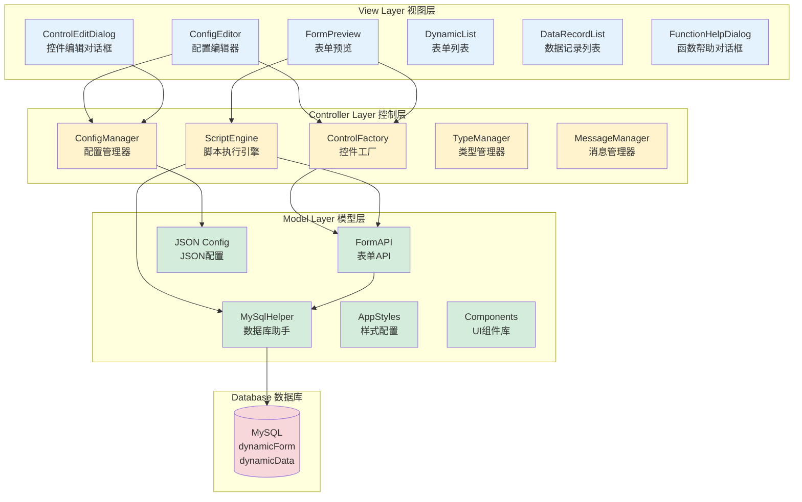
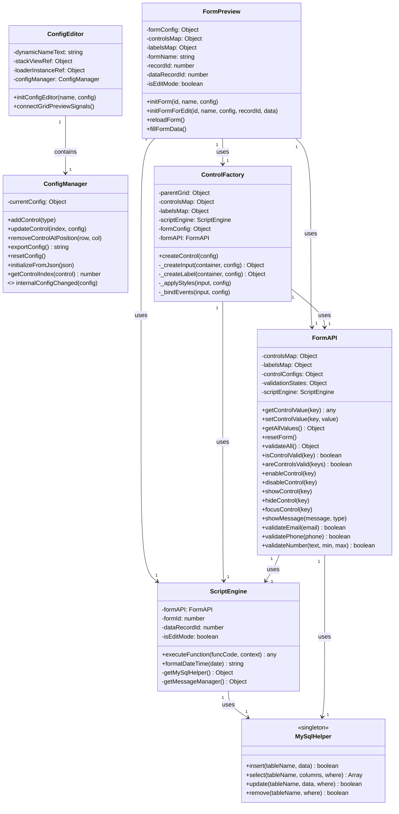
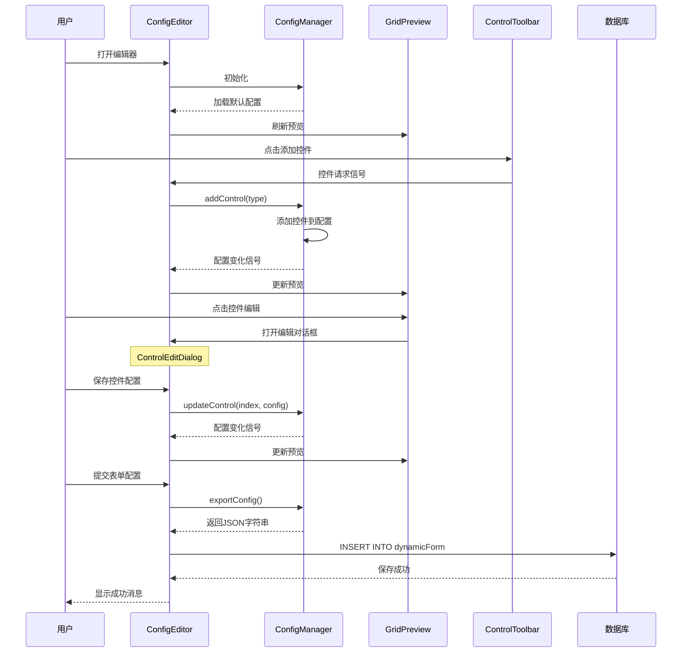
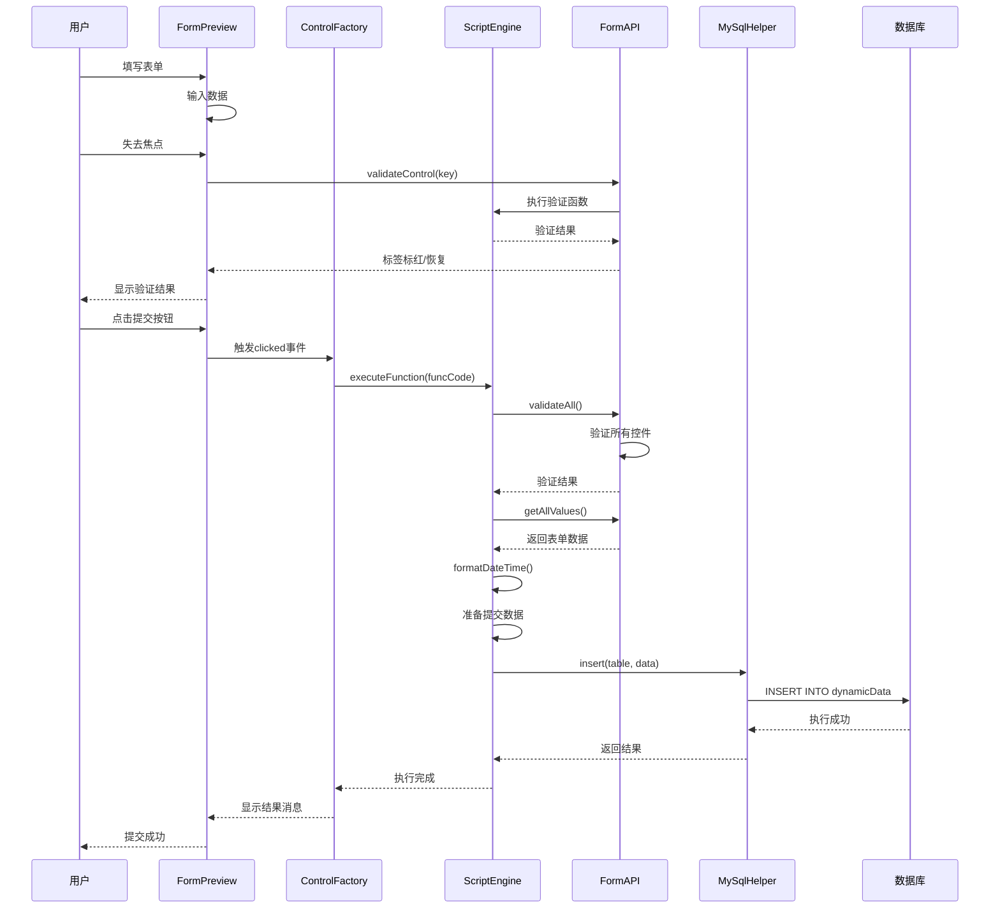
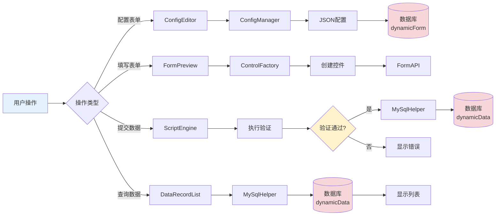

# 动态表单系统完整使用手�?

## 目录
1. [系统概述](#系统概述)
2. [快速开始](#快速开�?
3. [创建表单](#创建表单)
4. [控件类型详解](#控件类型详解)
5. [事件函数配置](#事件函数配置)
6. [验证功能](#验证功能)
7. [数据库操作](#数据库操�?
8. [设计思路与架构](#设计思路与架�?
9. [完整示例](#完整示例)

---

## 系统概述

### 什么是动态表单系统？

动态表单系统是一个基�?Qt QML 开发的可视化表单配置和渲染平台。它允许用户通过图形界面设计表单，无需编写代码即可创建复杂的数据录入界面�?

### 核心特�?

- **可视化设�?*：拖拽式表单设计，实时预�?
- **多种控件类型**：支持文本框、数字框、下拉框、复选框、单选框、按钮等
- **灵活布局**：网格布局系统，支持自定义行列数、间距、跨�?
- **事件驱动**：支持焦点丢失、值变化、按钮点击等事件
- **自定义验�?*：内置常用验证函数，支持自定义验证逻辑
- **数据库集�?*：直接操�?MySQL 数据库，支持增删改查
- **JavaScript 支持**：事件处理函数使�?JavaScript 编写，灵活强�?

### 技术栈

- **前端框架**：Qt Quick 6.5 (QML)
- **数据�?*：MySQL
- **脚本语言**：JavaScript
- **设计模式**：工厂模式、观察者模式、MVC 架构

---

## 快速开�?

### 第一步：启动应用

运行应用后，您将看到表单列表界面，显示所有已创建的表单�?


### 第二步：创建新表�?

1. 点击**"新增表单"**按钮
2. 进入表单配置编辑器界�?

### 第三步：配置表单基本信息

1. 输入**表单名称**（必填）
2. 配置网格布局（行数、列数、间距等�?

### 第四步：添加控件

1. 从控件工具栏选择需要的控件类型
2. 点击控件按钮，控件将自动添加到表单中
3. 点击控件进行编辑配置

### 第五步：保存表单

1. 点击**"提交表单配置"**按钮
2. 表单配置将保存到数据�?

### 第六步：使用表单

1. 返回表单列表
2. 点击**"新增"**按钮填写数据
3. 点击**"查询"**按钮查看已提交的数据

---

## 创建表单

### 表单配置界面说明

表单配置编辑器包含以下几个部分：

#### 1. 表单基本配置
- **表单名称**：用于标识表单，必填�?

#### 2. 网格配置面板
配置表单的布局结构�?


- **行数（Rows�?*：表单的行数，默�?4 �?
- **列数（Columns�?*：表单的列数，默�?2 �?
- **行间距（Row Spacing�?*：行与行之间的间距，单位像素
- **列间距（Column Spacing�?*：列与列之间的间距，单位像素
- **行高比例（Row Heights�?*：每行的高度比例，用逗号分隔，如 `1,1,1,2`
- **列宽比例（Column Widths�?*：每列的宽度比例，用逗号分隔，如 `1,2`

**示例配置�?*
```
行数: 5
列数: 2
行间�? 10
列间�? 15
行高比例: 1,1,1,1,2
列宽比例: 1,2
```

这将创建一�?5 �?2 列的表单，前 4 行高度相同，最后一行高度是前面�?2 倍；第一列宽度是第二列的一半�?

#### 3. 控件工具�?
提供多种控件类型供选择�?

- 📝 **文本框（Text�?*：单行文本输�?
- 🔢 **数字框（Number�?*：数字输入，支持增减按钮
- 🔽 **下拉框（Dropdown�?*：下拉选择列表
- ☑️ **复选框（Checkbox�?*：多选框�?
- 🔘 **单选框（Radio�?*：单选按钮组
- 🔘 **按钮（Button�?*：操作按�?
- 🔒 **密码框（Password�?*：密码输入框

#### 4. 控件预览区域
实时显示表单的布局和控件配置效果�?

**操作说明�?*
- **左键点击控件**：打开编辑对话�?
- **右键点击控件**：删除该控件

---

## 控件类型详解

### 1. 文本框（Text�?

**用�?*：输入单行文本，如姓名、地址等�?

**基本属性：**
- **Key**：控件唯一标识符，用于在代码中引用
- **Label**：控件标签文�?
- **Placeholder**：占位符提示文字
- **Default Value**：默认�?


**位置属性：**
- **Row**：所在行（从 0 开始）
- **Column**：所在列（从 0 开始）
- **Row Span**：跨越的行数
- **Column Span**：跨越的列数

**样式属性：**
- **Label Ratio**：标签宽度比例（0-1 之间�?
- **Label Color**：标签文字颜�?
- **Label Bold**：标签是否加�?
- **Input Color**：输入框文字颜色
- **Input Font Size**：输入框字体大小

**配置示例�?*
```
Key: name
Label: 姓名
Placeholder: 请输入姓�?
Row: 0, Column: 0
Label Ratio: 0.3
```

### 2. 数字框（Number�?

**用�?*：输入数字，如年龄、数量等�?

**特有属性：**
- **Minimum**：最小�?
- **Maximum**：最大�?
- **Step**：步进值（点击增减按钮时的变化量）
- **Default Value**：默认数�?

**配置示例�?*
```
Key: age
Label: 年龄
Minimum: 0
Maximum: 150
Step: 1
Default Value: 18
```

### 3. 下拉框（Dropdown�?

**用�?*：从预定义选项中选择一个值�?

**选项配置格式�?*

方式一：简单字符串数组
```json
["选项1", "选项2", "选项3"]
```

方式二：Label-Value 格式（推荐）
```json
[
  {"label": "�?, "value": "male"},
  {"label": "�?, "value": "female"}
]
```

使用 Label-Value 格式的好处：
- 显示友好的中文标�?
- 存储规范的英文�?
- 便于数据库查询和国际�?


**配置示例�?*
```
Key: gender
Label: 性别
Options: [{"label": "�?, "value": "male"}, {"label": "�?, "value": "female"}]
Default Value: male
```

### 4. 复选框（Checkbox�?

**用�?*：多选，可以同时选择多个选项�?

**特有属性：**
- **Direction**：布局方向（horizontal 水平 / vertical 垂直�?
- **Options**：选项列表（支持简单字符串�?Label-Value 格式�?

**配置示例�?*
```
Key: hobbies
Label: 爱好
Direction: horizontal
Options: [
  {"label": "阅读", "value": "reading"},
  {"label": "运动", "value": "sports"},
  {"label": "音乐", "value": "music"}
]
```

**获取值：**
复选框返回一个数组，包含所有选中项的 value 值�?
```javascript
var hobbies = getControlValue('hobbies');
// 结果: ["reading", "sports"]
```

### 5. 单选框（Radio�?

**用�?*：单选，只能选择一个选项�?

**配置示例�?*
```
Key: education
Label: 学历
Options: [
  {"label": "高中", "value": "high_school"},
  {"label": "本科", "value": "bachelor"},
  {"label": "硕士", "value": "master"},
  {"label": "博士", "value": "doctor"}
]
Default Value: bachelor
```

### 6. 按钮（Button�?

**用�?*：触发操作，如提交表单、重置表单、查询数据等�?

**特有属性：**
- **Button Text**：按钮显示文�?
- **Button Type**：按钮类�?
  - `submit`：提交按钮（点击时自动验证所有控件）
  - `reset`：重置按钮（点击时自动清空所有控件）
  - `normal`：普通按钮（仅执行自定义事件�?


**配置示例�?*
```
Key: submit_button
Label: 提交
Button Text: 提交表单
Button Type: submit
Row: 4, Column: 0
Column Span: 2
```

### 7. 密码框（Password�?

**用�?*：输入密码，输入内容会被隐藏�?

**配置示例�?*
```
Key: password
Label: 密码
Placeholder: 请输入密�?
Row: 2, Column: 0
```

---

## 事件函数配置

### 事件类型

系统支持三种主要事件类型�?

#### 1. 焦点丢失事件（Focus Lost�?

**触发时机**：当控件失去焦点时触�?

**适用控件**：文本框、数字框、密码框

**典型用�?*�?
- 验证输入内容
- 根据输入自动填充其他字段
- 实时保存数据

**示例：根据身份证号自动填充年�?*
```javascript
// 从身份证号提取出生年�?
var idCard = value;
if (idCard.length === 18) {
    var year = idCard.substring(6, 10);
    var birthYear = parseInt(year);
    var currentYear = new Date().getFullYear();
    var age = currentYear - birthYear;
    
    // 自动填充年龄字段
    setControlValue('age', age);
    showMessage('已自动计算年龄：' + age, 'info');
}
```

#### 2. 值变化事件（Value Changed�?

**触发时机**：当控件的值发生变化时立即触发

**适用控件**：所有输入控�?

**典型用�?*�?
- 实时验证
- 联动其他控件
- 动态计�?


**示例：根据单价和数量计算总价**
```javascript
// 获取单价和数�?
var price = getControlValue('price');
var quantity = getControlValue('quantity');

// 计算总价
var total = price * quantity;

// 更新总价字段
setControlValue('total', total);
```

#### 3. 按钮点击事件（Clicked�?

**触发时机**：当按钮被点击时触发

**适用控件**：按�?

**特殊说明**�?
- 如果按钮类型�?`submit`，点击时会先自动验证所有控件，验证通过后才执行自定义事�?
- 如果按钮类型�?`reset`，点击时会自动清空所有控件的�?

**典型用�?*�?
- 提交表单数据到数据库
- 查询数据
- 执行复杂业务逻辑

**示例：提交表单到数据�?*
```javascript
// 1. 验证所有字�?
var validation = validateAll();
if (!validation.valid) {
    return; // 验证失败，已自动提示
}

// 2. 准备提交数据
var submitData = {
    dynamicId: formId,
    data: JSON.stringify(formData),
    createTime: formatDateTime()
};

// 3. 提交到数据库
try {
    MySqlHelper.insert('dynamicData', submitData);
    showMessage('提交成功�?, 'success');
    resetForm();
} catch(e) {
    showMessage('提交失败: ' + e, 'error');
}
```

### 可用�?API 函数

在事件函数中，您可以使用以下 API�?

#### 1. 基础变量

| 变量�?| 类型 | 说明 | 示例 |
|--------|------|------|------|
| `self` | Object | 当前触发事件的控件对�?| `self.value` |
| `value` | any | 当前控件的值（主要用于验证函数�?| `if (value.length < 3) { ... }` |
| `formId` | number | 表单ID，用于标识当前表�?| `formId` |
| `formData` | Object | 表单所有数据的JSON对象 | `formData.username` |
| `isEditMode` | boolean | 是否为编辑模�?| `if (isEditMode) { ... }` |
| `dataRecordId` | number | 数据记录ID（仅编辑模式有效�?| `dataRecordId` |


#### 2. 获取控件值函�?

| 函数�?| 参数 | 返回�?| 说明 | 示例 |
|--------|------|--------|------|------|
| `getAllValues()` | �?| Object | 获取所有控件的值（不包括按钮） | `var data = getAllValues();` |
| `getControlValue(key)` | key: string | any | 获取指定控件的�?| `var name = getControlValue('username');` |

**详细说明�?*

**getAllValues()**
- 返回一个对象，key 为控件的 key，value 为控件的�?
- 自动排除按钮类型的控�?
- 支持所有输入控件类型（文本框、数字框、下拉框、复选框、单选框等）

```javascript
// 示例：获取所有表单数�?
var allData = getAllValues();
console.log('表单数据:', JSON.stringify(allData));
// 输出: {"username":"张三","age":25,"email":"zhangsan@example.com"}
```

**getControlValue(key)**
- 根据控件 key 获取单个控件的�?
- 如果控件不存在，返回空字符串
- 支持各种控件类型的值获�?

```javascript
// 示例：获取单个控件�?
var username = getControlValue('username');
var age = getControlValue('age');
console.log('用户�?', username, '年龄:', age);
```

#### 3. 设置控件值函�?

| 函数�?| 参数 | 返回�?| 说明 | 示例 |
|--------|------|--------|------|------|
| `getAllValues()` | �? | Object | 获取所有控件的值（不包括按钮） | `var data = getAllValues();` |
| `getControlValue(key)` | key: string | any | 获取指定控件的�? | `var name = getControlValue('username');` |
| `setControlValue(key, value)` | key: string, value: any | void | 设置指定控件的�?| `setControlValue('age', 25);` |
| `resetControl(key)` | key: string | void | 重置单个控件为默认�?| `resetControl('username');` |
| `resetForm()` | �?| void | 重置整个表单所有控�?| `resetForm();` |

**详细说明�?*

**setControlValue(key, value)**
- 设置指定控件的�?
- 自动适配不同类型的控件（文本框、数字框、下拉框等）
- 对于下拉框，会自动查找匹配的选项

```javascript
// 示例：设置控件�?
setControlValue('username', '张三');
setControlValue('age', 25);
setControlValue('gender', 'male'); // 下拉框会自动选中对应的选项
```

**resetControl(key)**
- 将指定控件重置为默认�?
- 文本框重置为空字符串
- 数字框重置为 0
- 复选框重置为未选中
- 下拉框重置为第一�?

```javascript
// 示例：重置单个控�?
resetControl('username'); // 清空用户名输入框
```

**resetForm()**
- 重置表单中所有控件（不包括按钮）
- 常用于提交成功后清空表单

```javascript
// 示例：提交成功后重置表单
MySqlHelper.insert('users', userData);
showMessage('提交成功�?, 'success');
resetForm(); // 清空所有输入框
```

#### 4. 控件状态控制函�?

| 函数�?| 参数 | 返回�?| 说明 | 示例 |
|--------|------|--------|------|------|
| `enableControl(key)` | key: string | void | 启用控件（可编辑/可点击） | `enableControl('submit_btn');` |
| `disableControl(key)` | key: string | void | 禁用控件（不可编�?不可点击�?| `disableControl('submit_btn');` |
| `showControl(key)` | key: string | void | 显示控件 | `showControl('email');` |
| `hideControl(key)` | key: string | void | 隐藏控件 | `hideControl('email');` |
| `focusControl(key)` | key: string | void | 让控件获得焦�?| `focusControl('username');` |

**详细说明�?*

**enableControl(key) / disableControl(key)**
- 控制控件的可用状�?
- 禁用的控件显示为灰色，无法编辑或点击
- 常用于条件控制，如：只有勾选协议才能提�?

```javascript
// 示例：根据复选框状态启�?禁用提交按钮
var agreed = getControlValue('agree_checkbox');
if (agreed) {
    enableControl('submit_btn');
} else {
    disableControl('submit_btn');
}
```

**showControl(key) / hideControl(key)**
- 控制控件的显�?隐藏
- 隐藏的控件不占用空间
- 常用于条件显示，如：根据学历显示不同的字�?

```javascript
// 示例：根据学历显�?隐藏相关字段
var education = getControlValue('education');
if (education === 'high_school') {
    hideControl('university');
    hideControl('major');
} else {
    showControl('university');
    showControl('major');
}
```

**focusControl(key)**
- 让指定控件获得焦�?
- 常用于验证失败后，自动聚焦到第一个错误字�?

```javascript
// 示例：验证失败后聚焦到错误字�?
if (!validateEmail(getControlValue('email'))) {
    focusControl('email');
    return false;
}
```

#### 6. 消息提示函数

| 函数�?| 参数 | 返回�?| 说明 | 示例 |
|--------|------|--------|------|------|
| `showMessage(message, type)` | message: string, type: string | void | 显示消息提示 | `showMessage('操作成功', 'success');` |

**详细说明�?*

**showMessage(message, type)**
- 在界面上显示消息提示
- type 参数决定消息的样式和图标
  - `'info'`：信息提示（蓝色�?
  - `'success'`：成功提示（绿色�?
  - `'warning'`：警告提示（黄色�?
  - `'error'`：错误提示（红色�?

```javascript
// 示例：不同类型的消息提示
showMessage('这是一条信�?, 'info');
showMessage('操作成功�?, 'success');
showMessage('请注意检�?, 'warning');
showMessage('操作失败', 'error');
```

#### 7. 工具函数

| 函数�?| 参数 | 返回�?| 说明 | 示例 |
|--------|------|--------|------|------|
| `formatDateTime(date)` | date: Date (可�? | string | 格式化日期时间为 MySQL DATETIME 格式 | `var now = formatDateTime();` |
| `showMessage(message, type)` | message: string, type: string | void | 显示消息提示 | `showMessage('操作成功', 'success');` |

**详细说明�?*

**formatDateTime(date)**
- �?JavaScript Date 对象格式化为 MySQL DATETIME 格式
- 如果不传参数，使用当前时�?
- 返回格式：`'YYYY-MM-DD HH:MM:SS'`，如 `'2025-11-18 13:31:33'`
- **重要**：提交到数据库的 DATETIME 字段必须使用此函数格式化

```javascript
// 示例1：获取当前时�?
var now = formatDateTime();
console.log(now); // 输出: '2025-11-18 13:31:33'

// 示例2：格式化指定日期
var customDate = new Date('2025-01-01');
var formatted = formatDateTime(customDate);
console.log(formatted); // 输出: '2025-01-01 00:00:00'

// 示例3：提交到数据�?
var submitData = {
    username: getControlValue('username'),
    email: getControlValue('email'),
    createTime: formatDateTime() // 使用格式化的当前时间
};
MySqlHelper.insert('users', submitData);
```

#### 5. 验证函数

| 函数�?| 参数 | 返回�?| 说明 | 示例 |
|--------|------|--------|------|------|
| `validateAll()` | �?| {valid: boolean, errors: Array} | 验证所有控�?| `var result = validateAll();` |
| `formAPI.isControlValid(key)` | key: string | boolean | 检查单个控件是否验证通过 | `if (formAPI.isControlValid('email')) { ... }` |
| `formAPI.areControlsValid(keys)` | keys: Array<string> | boolean | 检查多个控件是否都验证通过 | `if (formAPI.areControlsValid(['name', 'age'])) { ... }` |
| `validateEmail(email)` | email: string | boolean | 验证邮箱格式 | `if (!validateEmail(value)) { return false; }` |
| `validatePhone(phone)` | phone: string | boolean | 验证手机号格�?| `if (!validatePhone(value)) { return false; }` |
| `validateIdCard(idCard)` | idCard: string | boolean | 验证身份证号格式 | `if (!validateIdCard(value)) { return false; }` |
| `validateNumber(text, min, max)` | text: string, min: number, max: number | boolean | 验证数字范围 | `if (!validateNumber(value, 0, 100)) { return false; }` |
| `validateRegex(value, pattern, msg)` | value: string, pattern: string, msg: string | boolean | 正则表达式验�?| `validateRegex(value, '^\\d{6}$', '请输�?位数�?)` |

**详细说明�?*

**validateAll()**
- 验证表单中所有配置了验证函数的控�?
- 返回对象包含 `valid`（是否全部通过）和 `errors`（错误列表）
- 验证失败的控件标签会自动标红
- 自动显示错误提示消息

```javascript
// 示例：提交前验证所有字�?
var validation = validateAll();
if (!validation.valid) {
    // 验证失败，已自动提示错误
    return;
}
// 验证通过，继续提�?
MySqlHelper.insert('users', formData);
```

**formAPI.isControlValid(key)**
- 检查单个控件是否验证通过
- 必须先执行过验证（焦点丢失或 validateAll）才有效
- 返回 true 表示验证通过，false 表示验证失败或未验证

```javascript
// 示例：检查邮箱是否验证通过
if (formAPI.isControlValid('email')) {
    console.log('邮箱验证通过');
} else {
    showMessage('请先验证邮箱', 'warning');
}
```

**formAPI.areControlsValid(keys)**
- 检查多个控件是否都验证通过
- 常用于按钮点击前检查必填项
- 所有指定的控件都验证通过才返�?true

```javascript
// 示例：检查必填项是否都验证通过
if (formAPI.areControlsValid(['name', 'age', 'email'])) {
    // 所有必填项都验证通过，可以查询数据库
    var result = MySqlHelper.select('users', ['*'], 'name="' + getControlValue('name') + '"');
} else {
    showMessage('请先完成所有必填项', 'warning');
}
```

**validateEmail(email)**
- 验证邮箱格式是否正确
- 验证失败自动显示错误消息
- 返回 false 表示验证失败

```javascript
// 示例：在验证函数中使�?
if (!validateEmail(value)) {
    return false; // 自动显示"请输入有效的邮箱地址"
}
```

**validatePhone(phone)**
- 验证中国大陆手机号格式（11位，1开头）
- 验证失败自动显示错误消息

```javascript
// 示例：验证手机号
if (!validatePhone(value)) {
    return false; // 自动显示"请输入有效的手机号码"
}
```

**validateNumber(text, min, max)**
- 验证数字是否在指定范围内
- min �?max 参数可�?
- 验证失败自动显示错误消息

```javascript
// 示例：验证年龄在 18-65 之间
if (!validateNumber(value, 18, 65)) {
    return false; // 自动显示"数值不能小�?8"�?数值不能大�?5"
}
```

**validateRegex(value, pattern, errorMessage)**
- 使用正则表达式验�?
- pattern 使用 JavaScript 正则语法
- errorMessage 为验证失败时的提示消�?

```javascript
// 示例：验证邮政编码（6位数字）
if (!validateRegex(value, '^\\d{6}$', '请输�?位数字的邮政编码')) {
    return false;
}
```

#### 验证状态查询函�?
- `formAPI.isControlValid(key)`：检查单个控件是否验证通过
- `formAPI.areControlsValid([key1, key2, ...])`：检查多个控件是否都验证通过

**使用示例�?*
```javascript
// 检查姓名、年龄、邮箱是否都验证通过
if (formAPI.areControlsValid(['name', 'age', 'email'])) {
    // 所有字段都验证通过，可以执行数据库查询
    var result = MySqlHelper.select('users', ['*'], 'name="' + getControlValue('name') + '"');
    console.log('查询结果:', JSON.stringify(result));
} else {
    showMessage('请先完成所有必填项', 'warning');
}
```

#### 8. 数据库操作函�?

| 函数�?| 参数 | 返回�?| 说明 | 示例 |
|--------|------|--------|------|------|
| `MySqlHelper.insert(tableName, data)` | tableName: string, data: Object | boolean | 插入数据 | `MySqlHelper.insert('users', data);` |
| `MySqlHelper.select(tableName, columns, where)` | tableName: string, columns: Array, where: string | Array | 查询数据 | `MySqlHelper.select('users', ['*'], 'id=1');` |
| `MySqlHelper.update(tableName, data, where)` | tableName: string, data: Object, where: string | boolean | 更新数据 | `MySqlHelper.update('users', data, 'id=1');` |
| `MySqlHelper.remove(tableName, where)` | tableName: string, where: string | boolean | 删除数据 | `MySqlHelper.remove('users', 'id=1');` |

**详细说明�?*

**MySqlHelper.insert(tableName, data)**
- 向数据库表插入一条新记录
- tableName：表名（字符串）
- data：要插入的数据（对象，键值对�?
- 返回 true 表示插入成功，false 表示失败
- **重要**：DATETIME 字段必须使用 `formatDateTime()` 格式�?

```javascript
// 示例：插入用户数�?
var userData = {
    username: getControlValue('username'),
    email: getControlValue('email'),
    age: getControlValue('age'),
    createTime: formatDateTime() // 使用 formatDateTime 格式化时�?
};

try {
    var result = MySqlHelper.insert('users', userData);
    if (result) {
        showMessage('注册成功�?, 'success');
        resetForm();
    } else {
        showMessage('注册失败', 'error');
    }
} catch(e) {
    showMessage('注册失败: ' + e, 'error');
    console.error('Insert error:', e);
}
```

**MySqlHelper.select(tableName, columns, where)**
- 从数据库表查询数�?
- tableName：表名（字符串）
- columns：要查询的列（数组），`['*']` 表示查询所有列
- where：WHERE 条件（字符串），空字符串 `""` 表示无条�?
- 返回数组，每个元素是一个对象，表示一行数�?

```javascript
// 示例1：查询所有用�?
var allUsers = MySqlHelper.select('users', ['*'], '');
console.log('所有用�?', JSON.stringify(allUsers));

// 示例2：根据条件查�?
var username = getControlValue('username');
var result = MySqlHelper.select('users', ['*'], 'username="' + username + '"');
if (result.length > 0) {
    var user = result[0];
    showMessage('找到用户�? + user.email, 'success');
} else {
    showMessage('用户不存�?, 'warning');
}

// 示例3：查询特定列
var result = MySqlHelper.select('users', ['id', 'username', 'email'], 'age > 18');
```

**MySqlHelper.update(tableName, data, where)**
- 更新数据库表中的记录
- tableName：表名（字符串）
- data：要更新的数据（对象，键值对�?
- where：WHERE 条件（字符串），指定要更新哪些记�?
- 返回 true 表示更新成功，false 表示失败

```javascript
// 示例：更新用户信�?
var updateData = {
    email: getControlValue('email'),
    age: getControlValue('age')
};

var userId = 1; // 要更新的用户ID
var where = 'id=' + userId;

try {
    var result = MySqlHelper.update('users', updateData, where);
    if (result) {
        showMessage('更新成功�?, 'success');
    } else {
        showMessage('更新失败', 'error');
    }
} catch(e) {
    showMessage('更新失败: ' + e, 'error');
}
```

**MySqlHelper.remove(tableName, where)**
- 从数据库表删除记�?
- tableName：表名（字符串）
- where：WHERE 条件（字符串），指定要删除哪些记�?
- 返回 true 表示删除成功，false 表示失败
- **警告**：如�?where 为空，会删除表中所有数�?

```javascript
// 示例：删除指定用�?
var userId = getControlValue('user_id');
var where = 'id=' + userId;

try {
    var result = MySqlHelper.remove('users', where);
    if (result) {
        showMessage('删除成功�?, 'success');
    } else {
        showMessage('删除失败', 'error');
    }
} catch(e) {
    showMessage('删除失败: ' + e, 'error');
}
```


---

## 验证功能

### 自动验证机制

系统提供了强大的自动验证功能�?

1. **焦点丢失时自动验�?*：当用户离开输入框时，自动执行验证函�?
2. **验证失败标红**：验证失败时，标签文字自动变�?
3. **验证通过恢复**：验证通过时，标签颜色自动恢复
4. **提交前统一验证**：提交按钮（submit 类型）点击时自动验证所有控�?

### 配置验证函数

在控件编辑对话框中，找到**"验证配置"**面板�?

1. 点击**"编写验证函数"**按钮
2. 在代码编辑器中编写验证逻辑
3. 验证函数返回 `false` 表示验证失败，返�?`true` 或不返回表示验证通过

### 验证函数示例

#### 示例 1：验证邮箱格�?
```javascript
// 使用内置的邮箱验证函�?
if (!validateEmail(value)) {
    return false; // 自动显示错误消息
}
```

#### 示例 2：验证手机号格式
```javascript
// 使用内置的手机号验证函数
if (!validatePhone(value)) {
    return false; // 自动显示错误消息
}
```

#### 示例 3：验证年龄范�?
```javascript
// 验证年龄必须�?18-65 之间
if (!validateNumber(value, 18, 65)) {
    return false; // 自动显示错误消息
}
```

#### 示例 4：自定义正则验证
```javascript
// 验证邮政编码�?位数字）
if (!validateRegex(value, '^\\d{6}$', '请输�?位数字的邮政编码')) {
    return false;
}
```

#### 示例 5：复杂业务验�?
```javascript
// 验证用户名是否已存在
var username = value;

// 检查用户名长度
if (username.length < 3 || username.length > 20) {
    showMessage('用户名长度必须在3-20个字符之�?, 'error');
    return false;
}

// 检查用户名格式（只能包含字母、数字、下划线�?
if (!validateRegex(username, '^[a-zA-Z0-9_]+$', '用户名只能包含字母、数字和下划�?)) {
    return false;
}

// 查询数据库检查用户名是否已存�?
try {
    var result = MySqlHelper.select('users', ['id'], 'username="' + username + '"');
    if (result.length > 0) {
        showMessage('用户名已存在，请更换', 'error');
        return false;
    }
} catch(e) {
    showMessage('验证失败: ' + e, 'error');
    return false;
}

// 验证通过
return true;
```


### 验证状态查�?

在按钮点击事件中，您可以查询控件的验证状态：

```javascript
// 检查单个控件是否验证通过
if (formAPI.isControlValid('email')) {
    console.log('邮箱验证通过');
}

// 检查多个控件是否都验证通过
if (formAPI.areControlsValid(['name', 'age', 'email'])) {
    // 所有字段都验证通过，可以继续操�?
    showMessage('所有必填项验证通过', 'success');
} else {
    showMessage('请先完成所有必填项', 'warning');
}
```

---

## 数据库操�?

### 数据库表结构

系统使用两个主要数据表：

#### 1. dynamicForm 表（表单配置表）
```sql
CREATE TABLE dynamicForm (
    id INT PRIMARY KEY AUTO_INCREMENT,
    dynamicName VARCHAR(255) NOT NULL,
    dynamicConfig TEXT NOT NULL
);
```

#### 2. dynamicData 表（表单数据表）
```sql
CREATE TABLE dynamicData (
    id INT PRIMARY KEY AUTO_INCREMENT,
    dynamicId INT NOT NULL,
    data TEXT NOT NULL,
    createTime DATETIME
);
```

### 插入数据（INSERT�?

**语法�?*
```javascript
MySqlHelper.insert(tableName, data)
```

**参数�?*
- `tableName`：表名（字符串）
- `data`：数据对象（键值对�?

**示例 1：提交表单数据到 dynamicData �?*
```javascript
var submitData = {
    dynamicId: formId,
    data: JSON.stringify(formData),
    createTime: formatDateTime()
};

try {
    var result = MySqlHelper.insert('dynamicData', submitData);
    if (result) {
        showMessage('提交成功�?, 'success');
        resetForm();
    } else {
        showMessage('提交失败', 'error');
    }
} catch(e) {
    showMessage('提交失败: ' + e, 'error');
}
```

**示例 2：提交到自定义表**
```javascript
var userData = {
    username: getControlValue('username'),
    email: getControlValue('email'),
    age: getControlValue('age'),
    gender: getControlValue('gender')
};

try {
    MySqlHelper.insert('users', userData);
    showMessage('用户注册成功�?, 'success');
} catch(e) {
    showMessage('注册失败: ' + e, 'error');
}
```


### 查询数据（SELECT�?

**语法�?*
```javascript
MySqlHelper.select(tableName, columns, where)
```

**参数�?*
- `tableName`：表名（字符串）
- `columns`：要查询的列（数组），传 `['*']` 表示查询所有列
- `where`：WHERE 条件（字符串），传空字符�?`""` 表示无条�?

**返回值：**
返回一个数组，每个元素是一个对象，表示一行数据�?

**示例 1：查询所有数�?*
```javascript
var result = MySqlHelper.select('users', ['*'], '');
console.log('查询结果:', JSON.stringify(result));
// 结果: [{"id":1,"username":"张三","email":"zhangsan@example.com"}, ...]
```

**示例 2：根据条件查�?*
```javascript
var username = getControlValue('username');
var result = MySqlHelper.select('users', ['*'], 'username="' + username + '"');

if (result.length > 0) {
    showMessage('找到用户�? + result[0].email, 'success');
} else {
    showMessage('用户不存�?, 'warning');
}
```

**示例 3：查询特定列**
```javascript
var result = MySqlHelper.select('users', ['id', 'username', 'email'], 'age > 18');
console.log('成年用户:', JSON.stringify(result));
```

**示例 4：在按钮点击事件中查询并填充表单**
```javascript
// 根据用户名查询用户信息并自动填充表单
var username = getControlValue('search_username');

if (!username) {
    showMessage('请输入用户名', 'warning');
    return;
}

try {
    var result = MySqlHelper.select('users', ['*'], 'username="' + username + '"');
    
    if (result.length > 0) {
        var user = result[0];
        
        // 自动填充表单
        setControlValue('email', user.email);
        setControlValue('age', user.age);
        setControlValue('gender', user.gender);
        
        showMessage('查询成功', 'success');
    } else {
        showMessage('未找到该用户', 'warning');
    }
} catch(e) {
    showMessage('查询失败: ' + e, 'error');
}
```

### 更新数据（UPDATE�?

**语法�?*
```javascript
MySqlHelper.update(tableName, data, where)
```

**参数�?*
- `tableName`：表名（字符串）
- `data`：要更新的数据对象（键值对�?
- `where`：WHERE 条件（字符串�?


**示例 1：更新用户信�?*
```javascript
var updateData = {
    email: getControlValue('email'),
    age: getControlValue('age')
};

var userId = 1; // 假设要更�?ID �?1 的用�?
var where = 'id=' + userId;

try {
    MySqlHelper.update('users', updateData, where);
    showMessage('更新成功�?, 'success');
} catch(e) {
    showMessage('更新失败: ' + e, 'error');
}
```

**示例 2：编辑模式下更新数据记录**
```javascript
// 在编辑模式下，dataRecordId 包含当前记录�?ID
if (isEditMode) {
    var submitData = {
        data: JSON.stringify(formData)
    };
    
    var where = 'id=' + dataRecordId;
    
    try {
        MySqlHelper.update('dynamicData', submitData, where);
        showMessage('更新成功�?, 'success');
    } catch(e) {
        showMessage('更新失败: ' + e, 'error');
    }
}
```

### 删除数据（DELETE�?

**语法�?*
```javascript
MySqlHelper.remove(tableName, where)
```

**参数�?*
- `tableName`：表名（字符串）
- `where`：WHERE 条件（字符串�?

**示例�?*
```javascript
var userId = getControlValue('user_id');
var where = 'id=' + userId;

try {
    MySqlHelper.remove('users', where);
    showMessage('删除成功�?, 'success');
} catch(e) {
    showMessage('删除失败: ' + e, 'error');
}
```

---

## 设计思路与架�?

### 整体架构

系统采用 **MVC（Model-View-Controller�?* 架构模式�?

```
┌─────────────────────────────────────────────────�?
�?                  View Layer                     �?
�? (ConfigEditor, FormPreview, ControlEditDialog)  �?
└─────────────────┬───────────────────────────────�?
                  �?
┌─────────────────▼───────────────────────────────�?
�?               Controller Layer                  �?
�? (ConfigManager, ControlFactory, ScriptEngine)   �?
└─────────────────┬───────────────────────────────�?
                  �?
┌─────────────────▼───────────────────────────────�?
�?                 Model Layer                     �?
�?        (FormAPI, MySqlHelper, JSON Config)      �?
└──────────────────────────────────────────────────�?
```


### 核心设计模式

#### 1. 工厂模式（Factory Pattern�?

**应用场景**：`ControlFactory.qml` 根据控件类型动态创建不同的控件实例�?

**优点**�?
- 解耦控件创建逻辑
- 易于扩展新的控件类型
- 统一的创建接�?

**代码示例�?*
```javascript
function _createInput(container, config) {
    var input = null;
    
    switch(config.type) {
        case "text":
            input = textFieldComponent.createObject(container);
            break;
        case "number":
            input = spinBoxComponent.createObject(container);
            break;
        case "dropdown":
            input = comboBoxComponent.createObject(container);
            break;
        // ... 其他类型
    }
    
    return input;
}
```

#### 2. 观察者模式（Observer Pattern�?

**应用场景**：配置变化时自动更新预览界面�?

**实现方式**：使�?Qt 的信号槽机制�?

**代码示例�?*
```javascript
// ConfigManager 发出配置变化信号
signal internalConfigChanged(var newConfig)

// ConfigEditor 监听信号并更新预�?
item.internalConfigChanged.connect(function (newConfig) {
    if (gridPreviewLoader.item) {
        gridPreviewLoader.item.controls = newConfig.controls;
        gridPreviewLoader.item.gridConfig = newConfig.grid;
        gridPreviewLoader.item.refresh();
    }
});
```

#### 3. 策略模式（Strategy Pattern�?

**应用场景**：不同的验证策略（邮箱验证、手机号验证、自定义验证等）�?

**优点**�?
- 验证逻辑可插�?
- 易于添加新的验证规则
- 验证函数可复�?

#### 4. 单例模式（Singleton Pattern�?

**应用场景**：`MySqlHelper`、`MessageManager` 等全局服务�?

**优点**�?
- 全局唯一实例
- 统一的访问点
- 资源共享


### 核心组件说明

#### 1. ConfigEditor（配置编辑器�?
- **职责**：提供表单配置的可视化编辑界�?
- **功能**：网格配置、控件添加、实时预览、配置保�?
- **设计原则**：单一职责，将不同功能拆分到子组件

#### 2. ControlFactory（控件工厂）
- **职责**：根�?JSON 配置动态创建控�?
- **功能**：控件创建、样式应用、事件绑�?
- **设计模式**：工厂模�?

#### 3. FormAPI（表�?API�?
- **职责**：提供统一的表单操作接�?
- **功能**：获�?设置控件值、验证、重置等
- **设计原则**：封装复杂性，提供简洁的 API

#### 4. ScriptEngine（脚本引擎）
- **职责**：执行用户自定义�?JavaScript 代码
- **功能**：提供丰富的 API 环境、错误处�?
- **安全�?*：沙箱执行，防止恶意代码

#### 5. FormPreview（表单预览）
- **职责**：渲染表单并处理用户交互
- **功能**：表单渲染、数据填充、事件处�?
- **模式**：新增模式、编辑模�?

### 数据流转

```
用户操作 �?ConfigEditor �?ConfigManager �?JSON 配置
                                              �?
                                         数据库保�?
                                              �?
                                         FormPreview
                                              �?
                                      ControlFactory
                                              �?
                                         渲染控件
                                              �?
                                         用户交互
                                              �?
                                      ScriptEngine
                                              �?
                                         FormAPI
                                              �?
                                      数据库操�?
```

---

## 完整示例

### 示例 1：用户注册表�?

**需求：**
创建一个用户注册表单，包含用户名、密码、邮箱、年龄、性别等字段，并实现以下功能：
1. 用户名验证（3-20个字符，只能包含字母、数字、下划线�?
2. 邮箱格式验证
3. 年龄范围验证�?8-65岁）
4. 提交到数据库


**步骤 1：配置网格布局**
```
行数: 6
列数: 2
行间�? 10
列间�? 15
行高比例: 1,1,1,1,1,1
列宽比例: 1,2
```

**步骤 2：添加控�?*

| 控件类型 | Key | Label | Row | Column | 配置 |
|---------|-----|-------|-----|--------|------|
| 文本�?| username | 用户�?| 0 | 0 | Placeholder: 请输入用户名 |
| 密码�?| password | 密码 | 1 | 0 | Placeholder: 请输入密�?|
| 文本�?| email | 邮箱 | 2 | 0 | Placeholder: 请输入邮�?|
| 数字�?| age | 年龄 | 3 | 0 | Min: 18, Max: 65 |
| 下拉�?| gender | 性别 | 4 | 0 | Options: [{"label":"�?,"value":"male"},{"label":"�?,"value":"female"}] |
| 按钮 | submit | 提交 | 5 | 0 | Button Type: submit, Column Span: 2 |

**步骤 3：配置验证函�?*

**用户名验证：**
```javascript
// 检查用户名长度
if (value.length < 3 || value.length > 20) {
    showMessage('用户名长度必须在3-20个字符之�?, 'error');
    return false;
}

// 检查用户名格式
if (!validateRegex(value, '^[a-zA-Z0-9_]+$', '用户名只能包含字母、数字和下划�?)) {
    return false;
}

// 检查用户名是否已存�?
try {
    var result = MySqlHelper.select('users', ['id'], 'username="' + value + '"');
    if (result.length > 0) {
        showMessage('用户名已存在', 'error');
        return false;
    }
} catch(e) {
    console.error('验证失败:', e);
}

return true;
```

**邮箱验证�?*
```javascript
if (!validateEmail(value)) {
    return false;
}
```

**年龄验证�?*
```javascript
if (!validateNumber(value, 18, 65)) {
    return false;
}
```

**步骤 4：配置提交按钮点击事�?*
```javascript
// 1. 验证所有字段（submit 类型按钮会自动验证）
var validation = validateAll();
if (!validation.valid) {
    return;
}

// 2. 准备提交数据
var userData = {
    username: getControlValue('username'),
    password: getControlValue('password'),
    email: getControlValue('email'),
    age: getControlValue('age'),
    gender: getControlValue('gender'),
    createTime: formatDateTime()
};

// 3. 提交到数据库
try {
    var result = MySqlHelper.insert('users', userData);
    if (result) {
        showMessage('注册成功�?, 'success');
        resetForm();
    } else {
        showMessage('注册失败，请重试', 'error');
    }
} catch(e) {
    showMessage('注册失败: ' + e, 'error');
    console.error('Insert error:', e);
}
```


### 示例 2：订单计算表�?

**需求：**
创建一个订单表单，根据商品单价和数量自动计算总价�?

**步骤 1：添加控�?*

| 控件类型 | Key | Label | Row | Column |
|---------|-----|-------|-----|--------|
| 文本�?| product_name | 商品名称 | 0 | 0 |
| 数字�?| price | 单价 | 1 | 0 |
| 数字�?| quantity | 数量 | 2 | 0 |
| 数字�?| total | 总价 | 3 | 0 |
| 按钮 | submit | 提交订单 | 4 | 0 |

**步骤 2：配置单价的值变化事�?*
```javascript
// 当单价变化时，自动计算总价
var price = value;
var quantity = getControlValue('quantity');
var total = price * quantity;
setControlValue('total', total);
```

**步骤 3：配置数量的值变化事�?*
```javascript
// 当数量变化时，自动计算总价
var quantity = value;
var price = getControlValue('price');
var total = price * quantity;
setControlValue('total', total);
```

**步骤 4：配置提交按�?*
```javascript
// 验证并提交订�?
var validation = validateAll();
if (!validation.valid) {
    return;
}

var orderData = {
    productName: getControlValue('product_name'),
    price: getControlValue('price'),
    quantity: getControlValue('quantity'),
    total: getControlValue('total'),
    orderTime: formatDateTime()
};

try {
    MySqlHelper.insert('orders', orderData);
    showMessage('订单提交成功�?, 'success');
    resetForm();
} catch(e) {
    showMessage('提交失败: ' + e, 'error');
}
```

### 示例 3：用户查询表�?

**需求：**
根据用户名查询用户信息，并自动填充到表单中�?

**步骤 1：添加控�?*

| 控件类型 | Key | Label | Row | Column |
|---------|-----|-------|-----|--------|
| 文本�?| search_username | 查询用户�?| 0 | 0 |
| 按钮 | search_btn | 查询 | 0 | 1 |
| 文本�?| email | 邮箱 | 1 | 0 |
| 数字�?| age | 年龄 | 2 | 0 |
| 下拉�?| gender | 性别 | 3 | 0 |


**步骤 2：配置查询按钮点击事�?*
```javascript
// 获取查询条件
var username = getControlValue('search_username');

if (!username) {
    showMessage('请输入用户名', 'warning');
    return;
}

// 查询数据�?
try {
    var result = MySqlHelper.select('users', ['*'], 'username="' + username + '"');
    
    if (result.length > 0) {
        var user = result[0];
        
        // 自动填充表单
        setControlValue('email', user.email);
        setControlValue('age', user.age);
        setControlValue('gender', user.gender);
        
        showMessage('查询成功', 'success');
    } else {
        showMessage('未找到该用户', 'warning');
        
        // 清空表单
        setControlValue('email', '');
        setControlValue('age', 0);
        setControlValue('gender', '');
    }
} catch(e) {
    showMessage('查询失败: ' + e, 'error');
    console.error('Select error:', e);
}
```

### 示例 4：条件联动表�?

**需求：**
根据学历选择，动态显�?隐藏相关字段�?

**步骤 1：添加控�?*

| 控件类型 | Key | Label | Row | Column |
|---------|-----|-------|-----|--------|
| 下拉�?| education | 学历 | 0 | 0 |
| 文本�?| university | 毕业院校 | 1 | 0 |
| 文本�?| major | 专业 | 2 | 0 |

**步骤 2：配置学历下拉框的值变化事�?*
```javascript
// 根据学历显示/隐藏相关字段
var education = value;

if (education === 'high_school') {
    // 高中学历，隐藏大学和专业字段
    hideControl('university');
    hideControl('major');
} else {
    // 大学及以上学历，显示大学和专业字�?
    showControl('university');
    showControl('major');
}
```

---

## 常见问题

### Q1：如何在事件函数中访问其他控件的值？

**A�?* 使用 `getControlValue(key)` 函数�?

```javascript
var username = getControlValue('username');
var age = getControlValue('age');
```

### Q2：如何实现控件之间的联动�?

**A�?* 在一个控件的值变化事件中，使�?`setControlValue()` 修改其他控件的值�?

```javascript
// 在省份下拉框的值变化事件中
var province = value;

// 根据省份加载城市列表（示例）
if (province === 'guangdong') {
    // 这里可以查询数据库获取城市列�?
    // 然后更新城市下拉框的选项
}
```


### Q3：验证函数什么时候执行？

**A�?* 验证函数在以下情况下执行�?
1. 控件失去焦点时（自动执行�?
2. 点击 submit 类型的按钮时（自动验证所有控件）
3. 手动调用 `validateAll()` �?`validateControl(key)` �?

### Q4：如何在提交前检查某些字段是否验证通过�?

**A�?* 使用 `formAPI.areControlsValid()` 函数�?

```javascript
// 检查姓名、年龄、邮箱是否都验证通过
if (formAPI.areControlsValid(['name', 'age', 'email'])) {
    // 所有字段都验证通过，可以继续操�?
    var result = MySqlHelper.select('users', ['*'], 'name="' + getControlValue('name') + '"');
} else {
    showMessage('请先完成所有必填项', 'warning');
}
```

### Q5：如何实现编辑模式？

**A�?* 系统自动支持编辑模式。在编辑模式下：
- `isEditMode` 变量�?`true`
- `dataRecordId` 包含当前记录�?ID
- 表单会自动填充初始数�?

在提交按钮事件中判断模式�?

```javascript
if (isEditMode) {
    // 编辑模式：更新数�?
    var submitData = {
        data: JSON.stringify(formData)
    };
    var where = 'id=' + dataRecordId;
    MySqlHelper.update('dynamicData', submitData, where);
    showMessage('更新成功�?, 'success');
} else {
    // 新增模式：插入数�?
    var submitData = {
        dynamicId: formId,
        data: JSON.stringify(formData)
    };
    MySqlHelper.insert('dynamicData', submitData);
    showMessage('提交成功�?, 'success');
}
```

### Q6：如何调试事件函数？

**A�?* 使用 `console.log()` 输出调试信息�?

```javascript
console.log('当前�?', value);
console.log('表单数据:', JSON.stringify(formData));

var result = MySqlHelper.select('users', ['*'], '');
console.log('查询结果:', JSON.stringify(result));
```

调试信息会输出到应用程序的控制台�?

### Q7：数据库查询失败怎么办？

**A�?* 使用 try-catch 捕获错误�?

```javascript
try {
    var result = MySqlHelper.select('users', ['*'], 'id=1');
    console.log('查询成功:', JSON.stringify(result));
} catch(e) {
    showMessage('查询失败: ' + e, 'error');
    console.error('数据库错�?', e);
}
```

### Q8：如何实现复杂的业务逻辑�?

**A�?* 将复杂逻辑拆分成多个步骤，使用函数封装�?

```javascript
// 提交按钮点击事件
// 步骤1：验�?
var validation = validateAll();
if (!validation.valid) {
    return;
}

// 步骤2：检查用户名是否存在
var username = getControlValue('username');
var existingUsers = MySqlHelper.select('users', ['id'], 'username="' + username + '"');
if (existingUsers.length > 0) {
    showMessage('用户名已存在', 'error');
    return;
}

// 步骤3：准备数�?
var userData = {
    username: username,
    email: getControlValue('email'),
    age: getControlValue('age')
};

// 步骤4：提交到数据�?
try {
    MySqlHelper.insert('users', userData);
    showMessage('注册成功�?, 'success');
    resetForm();
} catch(e) {
    showMessage('注册失败: ' + e, 'error');
}
```


---

## 最佳实�?

### 1. 命名规范

**控件 Key 命名�?*
- 使用小写字母和下划线
- 语义化命�?
- 避免使用中文

```javascript
// 推荐
username, email, phone_number, birth_date

// 不推�?
用户�? e, pn, date1
```

**表名命名�?*
- 使用复数形式
- 小写字母和下划线
- 语义清晰

```javascript
// 推荐
users, orders, products

// 不推�?
user, Order, product_table
```

### 2. 验证策略

**原则�?*
- 前端验证为主，后端验证为�?
- 验证失败时给出明确的错误提示
- 使用内置验证函数，减少重复代�?

**示例�?*
```javascript
// 好的验证
if (!validateEmail(value)) {
    return false; // 自动显示"请输入有效的邮箱地址"
}

// 不好的验�?
if (value.indexOf('@') === -1) {
    showMessage('邮箱格式错误', 'error');
    return false;
}
```

### 3. 错误处理

**原则�?*
- 所有数据库操作都要使用 try-catch
- 给用户友好的错误提示
- 记录详细的错误日�?

**示例�?*
```javascript
try {
    MySqlHelper.insert('users', userData);
    showMessage('注册成功�?, 'success');
} catch(e) {
    showMessage('注册失败，请稍后重试', 'error');
    console.error('Insert error:', e);
    console.error('User data:', JSON.stringify(userData));
}
```

### 4. 性能优化

**原则�?*
- 避免在值变化事件中执行耗时操作
- 使用防抖（debounce）减少数据库查询
- 缓存查询结果

**示例�?*
```javascript
// 不推荐：每次输入都查询数据库
// 在文本框的值变化事件中
var result = MySqlHelper.select('users', ['*'], 'username="' + value + '"');

// 推荐：在焦点丢失时查�?
// 在文本框的焦点丢失事件中
var result = MySqlHelper.select('users', ['*'], 'username="' + value + '"');
```

### 5. 代码复用

**原则�?*
- 相同的验证逻辑使用内置函数
- 相同的业务逻辑提取到独立的函数
- 使用变量存储重复使用的�?

**示例�?*
```javascript
// 不推荐：重复代码
var username = getControlValue('username');
var email = getControlValue('email');
var age = getControlValue('age');

// 推荐：使�?getAllValues()
var formData = getAllValues();
var username = formData.username;
var email = formData.email;
var age = formData.age;
```

### 6. 用户体验

**原则�?*
- 验证失败时标签标红，提示明确
- 操作成功后给予反�?
- 长时间操作显示加载提�?
- 重要操作前进行确�?

**示例�?*
```javascript
// 提交成功后的反馈
MySqlHelper.insert('users', userData);
showMessage('注册成功�?, 'success');
resetForm(); // 清空表单，方便下次输�?

// 删除前确认（需要在界面层实现）
// MessageManager.showDialog('确定要删除吗�?, 'warning', callback);
```

---

## 附录

### A. 完整�?API 参�?

#### 表单操作 API
| 函数 | 参数 | 返回�?| 说明 |
|------|------|--------|------|
| getAllValues() | �?| Object | 获取所有控件的�?|
| getControlValue(key) | key: string | any | 获取指定控件的�?|
| setControlValue(key, value) | key: string, value: any | void | 设置指定控件的�?|
| resetForm() | �?| void | 重置整个表单 |
| resetControl(key) | key: string | void | 重置指定控件 |
| validateAll() | �?| {valid: boolean, errors: Array} | 验证所有控�?|


#### 控件状�?API
| 函数 | 参数 | 返回�?| 说明 |
|------|------|--------|------|
| enableControl(key) | key: string | void | 启用控件 |
| disableControl(key) | key: string | void | 禁用控件 |
| showControl(key) | key: string | void | 显示控件 |
| hideControl(key) | key: string | void | 隐藏控件 |
| focusControl(key) | key: string | void | 让控件获得焦�?|
| setControlColor(key, color) | key: string, color: string | void | 设置控件文字颜色 |

#### 验证 API
| 函数 | 参数 | 返回�?| 说明 |
|------|------|--------|------|
| validateEmail(email) | email: string | boolean | 验证邮箱格式 |
| validatePhone(phone) | phone: string | boolean | 验证手机号格�?|
| validateIdCard(idCard) | idCard: string | boolean | 验证身份证号格式 |
| validateChinese(text) | text: string | boolean | 验证是否为中�?|
| validateNumber(text, min, max) | text: string, min: number, max: number | boolean | 验证数字范围 |
| validateRegex(value, pattern, errorMessage) | value: string, pattern: string, errorMessage: string | boolean | 正则表达式验�?|
| formAPI.isControlValid(key) | key: string | boolean | 检查单个控件是否验证通过 |
| formAPI.areControlsValid(keys) | keys: Array<string> | boolean | 检查多个控件是否都验证通过 |

#### 数据�?API
| 函数 | 参数 | 返回�?| 说明 |
|------|------|--------|------|
| MySqlHelper.insert(tableName, data) | tableName: string, data: Object | boolean | 插入数据 |
| MySqlHelper.update(tableName, data, where) | tableName: string, data: Object, where: string | boolean | 更新数据 |
| MySqlHelper.select(tableName, columns, where) | tableName: string, columns: Array, where: string | Array | 查询数据 |
| MySqlHelper.remove(tableName, where) | tableName: string, where: string | boolean | 删除数据 |

#### 消息提示 API
| 函数 | 参数 | 返回�?| 说明 |
|------|------|--------|------|
| showMessage(message, type) | message: string, type: string | void | 显示消息提示 |

type 可选值：`'info'`, `'success'`, `'warning'`, `'error'`

### B. 控件配置 JSON 格式

```json
{
  "grid": {
    "rows": 4,
    "columns": 2,
    "rowSpacing": 10,
    "columnSpacing": 15,
    "rowHeights": [1, 1, 1, 2],
    "columnWidths": [1, 2]
  },
  "controls": [
    {
      "type": "text",
      "key": "username",
      "label": "用户�?,
      "placeholder": "请输入用户名",
      "value": "",
      "row": 0,
      "column": 0,
      "rowSpan": 1,
      "colSpan": 1,
      "labelRatio": 0.3,
      "style": {
        "labelColor": "#000000",
        "labelBold": false,
        "inputColor": "#000000",
        "inputFontSize": 12
      },
      "validationFunction": "if (value.length < 3) { showMessage('用户名至�?个字�?, 'error'); return false; }",
      "events": {
        "onFocusLost": "console.log('失去焦点:', value);",
        "onTextChanged": "console.log('文本变化:', value);"
      }
    }
  ]
}
```

### C. 数据库表结构

#### dynamicForm �?
```sql
CREATE TABLE `dynamicForm` (
  `id` int NOT NULL AUTO_INCREMENT,
  `dynamicName` varchar(255) NOT NULL COMMENT '表单名称',
  `dynamicConfig` text NOT NULL COMMENT '表单配置JSON',
  PRIMARY KEY (`id`)
) ENGINE=InnoDB DEFAULT CHARSET=utf8mb4;
```

#### dynamicData �?
```sql
CREATE TABLE `dynamicData` (
  `id` int NOT NULL AUTO_INCREMENT,
  `dynamicId` int NOT NULL COMMENT '表单ID',
  `data` text NOT NULL COMMENT '表单数据JSON',
  `createTime` datetime DEFAULT NULL COMMENT '创建时间',
  PRIMARY KEY (`id`),
  KEY `idx_dynamicId` (`dynamicId`)
) ENGINE=InnoDB DEFAULT CHARSET=utf8mb4;
```

---

## 总结

动态表单系统是一个功能强大、易于使用的表单配置和渲染平台。通过本手册，您应该能够：

1. �?创建和配置表�?
2. �?使用各种类型的控�?
3. �?编写事件处理函数
4. �?实现数据验证
5. �?操作数据�?
6. �?理解系统架构和设计模�?

如果您在使用过程中遇到问题，请参考本手册的相关章节，或查看系统自带的示例表单�?

祝您使用愉快�?

---

**文档版本**：v1.0  
**最后更�?*�?025-11-18  
**作�?*：Dynamic Form QML Team


---

## 附录 D. 系统架构详解（用于汇报）

### D.1 系统整体架构图

```
┌──────────────────────────────────────────────────────────────────────────┐
│                          用户界面层 (View Layer)                          │
│  ┌──────────────┐  ┌──────────────┐  ┌──────────────────────────────┐  │
│  │ ConfigEditor │  │ FormPreview  │  │ ControlEditDialog            │  │
│  │ 配置编辑器    │  │ 表单预览渲染  │  │ 控件编辑对话框                │  │
│  │              │  │              │  │                              │  │
│  │ • 网格配置    │  │ • 动态渲染    │  │ • 基本属性配置                │  │
│  │ • 控件添加    │  │ • 事件处理    │  │ • 类型特定属性                │  │
│  │ • 实时预览    │  │ • 数据填充    │  │ • 事件函数编写                │  │
│  │ • 配置导出    │  │ • 验证执行    │  │ • 验证函数配置                │  │
│  └──────────────┘  └──────────────┘  └──────────────────────────────┘  │
│  ┌──────────────┐  ┌──────────────┐  ┌──────────────────────────────┐  │
│  │ DynamicList  │  │DataRecordList│  │ FunctionHelpDialog           │  │
│  │ 表单列表      │  │ 数据记录列表  │  │ 函数帮助对话框                │  │
│  └──────────────┘  └──────────────┘  └──────────────────────────────┘  │
└────────────────────────────┬─────────────────────────────────────────────┘
                             │ 用户交互
┌────────────────────────────▼─────────────────────────────────────────────┐
│                        业务逻辑层 (Controller Layer)                       │
│  ┌──────────────┐  ┌──────────────┐  ┌──────────────────────────────┐  │
│  │ConfigManager │  │ControlFactory│  │ ScriptEngine                 │  │
│  │ 配置管理器    │  │ 控件工厂      │  │ 脚本执行引擎                  │  │
│  │              │  │              │  │                              │  │
│  │ • 配置增删改  │  │ • 控件创建    │  │ • JavaScript 执行            │  │
│  │ • 配置验证    │  │ • 样式应用    │  │ • API 环境注入               │  │
│  │ • JSON 导入导出│ │ • 事件绑定    │  │ • 错误处理                   │  │
│  │ • 信号通知    │  │ • 布局管理    │  │ • 安全沙箱                   │  │
│  └──────────────┘  └──────────────┘  └──────────────────────────────┘  │
│  ┌──────────────┐  ┌──────────────┐                                     │
│  │ TypeManager  │  │MessageManager│                                     │
│  │ 类型管理器    │  │ 消息管理器    │                                     │
│  └──────────────┘  └──────────────┘                                     │
└────────────────────────────┬─────────────────────────────────────────────┘
                             │ 数据操作
┌────────────────────────────▼─────────────────────────────────────────────┐
│                         数据模型层 (Model Layer)                          │
│  ┌──────────────┐  ┌──────────────┐  ┌──────────────────────────────┐  │
│  │   FormAPI    │  │  MySqlHelper │  │   JSON Config                │  │
│  │ 表单操作API   │  │ 数据库助手    │  │  JSON配置存储                 │  │
│  │              │  │              │  │                              │  │
│  │ • 获取/设置值 │  │ • INSERT     │  │ • 网格配置                   │  │
│  │ • 控件状态    │  │ • SELECT     │  │ • 控件配置                   │  │
│  │ • 表单验证    │  │ • UPDATE     │  │ • 样式配置                   │  │
│  │ • 重置表单    │  │ • DELETE     │  │ • 事件配置                   │  │
│  └──────────────┘  └──────────────┘  └──────────────────────────────┘  │
│  ┌──────────────┐  ┌──────────────┐                                     │
│  │   AppStyles  │  │  Components  │                                     │
│  │  样式配置     │  │  UI组件库     │                                     │
│  └──────────────┘  └──────────────┘                                     │
└──────────────────────────────────────────────────────────────────────────┘
                             │
                             ▼
                    ┌─────────────────┐
                    │   MySQL 数据库   │
                    │                 │
                    │ • dynamicForm   │
                    │ • dynamicData   │
                    │ • 自定义业务表   │
                    └─────────────────┘
```

### D.2 核心类关系图

```
┌─────────────────────────────────────────────────────────────────┐
│                         ConfigEditor                             │
│  职责：表单配置编辑器主界面                                        │
├─────────────────────────────────────────────────────────────────┤
│ 属性：                                                            │
│  - dynamicNameText: string          // 表单名称                   │
│  - stackViewRef: Object             // 页面栈引用                 │
│  - loaderInstanceRef: Object        // 加载器实例引用             │
│  - configManager: ConfigManager     // 配置管理器                 │
├─────────────────────────────────────────────────────────────────┤
│ 方法：                                                            │
│  + initConfigEditor(name, config)   // 初始化编辑器               │
│  + connectGridPreviewSignals()      // 连接预览信号               │
└────────────┬────────────────────────────────────────────────────┘
             │ 1:1 包含
             ▼
┌─────────────────────────────────────────────────────────────────┐
│                        ConfigManager                             │
│  职责：管理表单配置的增删改查                                      │
├─────────────────────────────────────────────────────────────────┤
│ 属性：                                                            │
│  - currentConfig: Object            // 当前配置对象               │
├─────────────────────────────────────────────────────────────────┤
│ 方法：                                                            │
│  + addControl(type)                 // 添加控件                   │
│  + updateControl(index, config)     // 更新控件                   │
│  + removeControlAtPosition(row,col) // 删除控件                   │
│  + exportConfig()                   // 导出JSON配置               │
│  + resetConfig()                    // 重置配置                   │
│  + initializeFromJson(json)         // 从JSON初始化               │
│  + getControlIndex(control)         // 获取控件索引               │
├─────────────────────────────────────────────────────────────────┤
│ 信号：                                                            │
│  signal internalConfigChanged(config) // 配置变化信号             │
└─────────────────────────────────────────────────────────────────┘

┌─────────────────────────────────────────────────────────────────┐
│                         FormPreview                              │
│  职责：根据配置动态渲染表单                                        │
├─────────────────────────────────────────────────────────────────┤
│ 属性：                                                            │
│  - formConfig: Object               // 表单配置                   │
│  - controlsMap: Object              // 控件映射表                 │
│  - labelsMap: Object                // 标签映射表                 │
│  - formName: string                 // 表单名称                   │
│  - recordId: number                 // 表单记录ID                 │
│  - dataRecordId: number             // 数据记录ID                 │
│  - isEditMode: boolean              // 是否编辑模式               │
├─────────────────────────────────────────────────────────────────┤
│ 方法：                                                            │
│  + initForm(id, name, config)       // 初始化新增表单             │
│  + initFormForEdit(...)             // 初始化编辑表单             │
│  + reloadForm()                     // 重新加载表单               │
│  + fillFormData()                   // 填充表单数据               │
└────────────┬────────────────────────────────────────────────────┘
             │ 1:1 使用
             ▼
┌─────────────────────────────────────────────────────────────────┐
│                       ControlFactory                             │
│  职责：根据配置创建控件实例（工厂模式）                            │
├─────────────────────────────────────────────────────────────────┤
│ 属性：                                                            │
│  - parentGrid: Object               // 父网格容器                 │
│  - controlsMap: Object              // 控件映射表                 │
│  - labelsMap: Object                // 标签映射表                 │
│  - scriptEngine: ScriptEngine       // 脚本引擎                   │
│  - formConfig: Object               // 表单配置                   │
│  - formAPI: FormAPI                 // 表单API                    │
├─────────────────────────────────────────────────────────────────┤
│ 方法：                                                            │
│  + createControl(config)            // 创建控件（公共接口）        │
│  - _createInput(container, config)  // 创建输入控件               │
│  - _createLabel(container, config)  // 创建标签                   │
│  - _applyStyles(input, config)      // 应用样式                   │
│  - _bindEvents(input, config)       // 绑定事件                   │
│  - _setRowHeight(container, config) // 设置行高                   │
│  - _setColumnWidth(container,config)// 设置列宽                   │
└─────────────────────────────────────────────────────────────────┘

┌─────────────────────────────────────────────────────────────────┐
│                          FormAPI                                 │
│  职责：提供统一的表单操作接口                                      │
├─────────────────────────────────────────────────────────────────┤
│ 属性：                                                            │
│  - controlsMap: Object              // 控件映射表                 │
│  - labelsMap: Object                // 标签映射表                 │
│  - controlConfigs: Object           // 控件配置映射               │
│  - validationStates: Object         // 验证状态缓存               │
│  - scriptEngine: ScriptEngine       // 脚本引擎引用               │
├─────────────────────────────────────────────────────────────────┤
│ 方法：                                                            │
│  + getControlValue(key): any        // 获取控件值                 │
│  + setControlValue(key, value)      // 设置控件值                 │
│  + getAllValues(): Object           // 获取所有值                 │
│  + resetForm()                      // 重置表单                   │
│  + resetControl(key)                // 重置控件                   │
│  + validateAll()                    // 验证所有控件               │
│  + validateControl(key,...)         // 验证单个控件               │
│  + isControlValid(key): boolean     // 检查验证状态               │
│  + areControlsValid(keys): boolean  // 检查多个验证状态           │
│  + enableControl(key)               // 启用控件                   │
│  + disableControl(key)              // 禁用控件                   │
│  + showControl(key)                 // 显示控件                   │
│  + hideControl(key)                 // 隐藏控件                   │
│  + focusControl(key)                // 聚焦控件                   │
│  + showMessage(message, type)       // 显示消息                   │
│  + validateEmail(email): boolean    // 验证邮箱                   │
│  + validatePhone(phone): boolean    // 验证手机号                 │
│  + validateNumber(text,min,max)     // 验证数字范围               │
│  + validateRegex(value,pattern,msg) // 正则验证                   │
└─────────────────────────────────────────────────────────────────┘

┌─────────────────────────────────────────────────────────────────┐
│                       ScriptEngine                               │
│  职责：执行用户自定义的JavaScript代码                             │
├─────────────────────────────────────────────────────────────────┤
│ 属性：                                                            │
│  - formAPI: FormAPI                 // 表单API引用                │
│  - formId: number                   // 表单ID                     │
│  - dataRecordId: number             // 数据记录ID                 │
│  - isEditMode: boolean              // 是否编辑模式               │
├─────────────────────────────────────────────────────────────────┤
│ 方法：                                                            │
│  + executeFunction(funcCode,context)// 执行函数                   │
│  + formatDateTime(date): string     // 格式化日期时间             │
│  - getMySqlHelper(): Object         // 获取数据库助手             │
│  - getMessageManager(): Object      // 获取消息管理器             │
└─────────────────────────────────────────────────────────────────┘

┌─────────────────────────────────────────────────────────────────┐
│                        MySqlHelper                               │
│  职责：封装数据库操作（单例模式）                                  │
├─────────────────────────────────────────────────────────────────┤
│ 方法：                                                            │
│  + insert(tableName, data): boolean // 插入数据                   │
│  + select(tableName,columns,where)  // 查询数据                   │
│  + update(tableName,data,where)     // 更新数据                   │
│  + remove(tableName, where): boolean// 删除数据                   │
└─────────────────────────────────────────────────────────────────┘
```


### D.3 数据流转图

#### 表单配置流程

```
用户操作                ConfigEditor              ConfigManager           数据库
   │                        │                         │                    │
   │  1. 点击"新增表单"      │                         │                    │
   ├───────────────────────>│                         │                    │
   │                        │  2. 初始化配置           │                    │
   │                        ├────────────────────────>│                    │
   │                        │                         │                    │
   │  3. 添加控件            │                         │                    │
   ├───────────────────────>│  4. addControl(type)    │                    │
   │                        ├────────────────────────>│                    │
   │                        │  5. 配置变化信号         │                    │
   │                        │<────────────────────────┤                    │
   │                        │  6. 更新预览             │                    │
   │  7. 实时预览更新        │                         │                    │
   │<───────────────────────┤                         │                    │
   │                        │                         │                    │
   │  8. 点击"提交配置"      │                         │                    │
   ├───────────────────────>│  9. exportConfig()      │                    │
   │                        ├────────────────────────>│                    │
   │                        │  10. 返回JSON字符串      │                    │
   │                        │<────────────────────────┤                    │
   │                        │  11. INSERT INTO dynamicForm                 │
   │                        ├─────────────────────────────────────────────>│
   │                        │  12. 保存成功            │                    │
   │  13. 显示成功消息       │<─────────────────────────────────────────────┤
   │<───────────────────────┤                         │                    │
```

#### 表单渲染流程

```
用户操作              FormPreview          ControlFactory        FormAPI
   │                      │                      │                  │
   │  1. 点击"新增记录"    │                      │                  │
   ├─────────────────────>│                      │                  │
   │                      │  2. 解析JSON配置      │                  │
   │                      │                      │                  │
   │                      │  3. 遍历控件配置      │                  │
   │                      │  createControl(cfg)  │                  │
   │                      ├─────────────────────>│                  │
   │                      │                      │  4. 创建控件实例  │
   │                      │                      │  5. 应用样式      │
   │                      │                      │  6. 绑定事件      │
   │                      │                      │  7. 注册到Map     │
   │                      │                      ├─────────────────>│
   │                      │  8. 控件创建完成      │                  │
   │                      │<─────────────────────┤                  │
   │  9. 表单渲染完成      │                      │                  │
   │<─────────────────────┤                      │                  │
   │                      │                      │                  │
   │  10. 用户输入数据     │                      │                  │
   ├─────────────────────>│                      │                  │
   │                      │  11. 失去焦点触发验证 │                  │
   │                      │  validateControl()   │                  │
   │                      ├──────────────────────────────────────────>│
   │                      │  12. 执行验证函数     │                  │
   │                      │  13. 标签标红/恢复    │                  │
   │  14. 显示验证结果     │<──────────────────────────────────────────┤
   │<─────────────────────┤                      │                  │
```

#### 事件执行流程

```
用户操作            ControlFactory      ScriptEngine        FormAPI        MySqlHelper
   │                    │                   │                 │                │
   │  1. 点击按钮        │                   │                 │                │
   ├───────────────────>│                   │                 │                │
   │                    │  2. 触发clicked   │                 │                │
   │                    │  executeFunction()│                 │                │
   │                    ├──────────────────>│                 │                │
   │                    │                   │  3. 注入API环境  │                │
   │                    │                   │  - formAPI      │                │
   │                    │                   │  - MySqlHelper  │                │
   │                    │                   │  - formData     │                │
   │                    │                   │  4. 执行用户代码 │                │
   │                    │                   │  validateAll()  │                │
   │                    │                   ├────────────────>│                │
   │                    │                   │  5. 验证所有控件 │                │
   │                    │                   │<────────────────┤                │
   │                    │                   │  6. 准备数据     │                │
   │                    │                   │  getAllValues() │                │
   │                    │                   ├────────────────>│                │
   │                    │                   │  7. 返回表单数据 │                │
   │                    │                   │<────────────────┤                │
   │                    │                   │  8. 提交数据库   │                │
   │                    │                   │  insert(table,data)              │
   │                    │                   ├─────────────────────────────────>│
   │                    │                   │  9. 执行SQL      │                │
   │                    │                   │  10. 返回结果    │                │
   │                    │                   │<─────────────────────────────────┤
   │                    │  11. 执行完成     │                 │                │
   │                    │<──────────────────┤                 │                │
   │  12. 显示结果消息   │                   │                 │                │
   │<───────────────────┤                   │                 │                │
```

### D.4 组件交互时序图

#### 创建表单配置时序图

```
用户    ConfigEditor    ConfigManager    GridPreview    ControlToolbar    数据库
 │           │               │               │                │            │
 │  打开编辑器│               │               │                │            │
 ├──────────>│               │               │                │            │
 │           │  初始化        │               │                │            │
 │           ├──────────────>│               │                │            │
 │           │  加载默认配置   │               │                │            │
 │           │<──────────────┤               │                │            │
 │           │  刷新预览       │               │                │            │
 │           ├──────────────────────────────>│                │            │
 │           │               │               │                │            │
 │  点击添加控件│               │               │                │            │
 ├──────────>│               │               │                │            │
 │           │  控件请求信号   │               │                │            │
 │           │<──────────────────────────────────────────────┤            │
 │           │  添加控件       │               │                │            │
 │           ├──────────────>│               │                │            │
 │           │  配置变化信号   │               │                │            │
 │           │<──────────────┤               │                │            │
 │           │  更新预览       │               │                │            │
 │           ├──────────────────────────────>│                │            │
 │           │               │               │                │            │
 │  点击控件编辑│               │               │                │            │
 ├──────────>│               │               │                │            │
 │           │  打开编辑对话框  │               │                │            │
 │           │  (ControlEditDialog)          │                │            │
 │           │               │               │                │            │
 │  保存控件配置│               │               │                │            │
 ├──────────>│               │               │                │            │
 │           │  更新控件       │               │                │            │
 │           ├──────────────>│               │                │            │
 │           │  配置变化信号   │               │                │            │
 │           │<──────────────┤               │                │            │
 │           │  更新预览       │               │                │            │
 │           ├──────────────────────────────>│                │            │
 │           │               │               │                │            │
 │  提交表单配置│               │               │                │            │
 ├──────────>│               │               │                │            │
 │           │  导出JSON      │               │                │            │
 │           ├──────────────>│               │                │            │
 │           │  返回JSON字符串 │               │                │            │
 │           │<──────────────┤               │                │            │
 │           │  INSERT INTO dynamicForm                       │            │
 │           ├───────────────────────────────────────────────────────────>│
 │           │  保存成功       │               │                │            │
 │           │<───────────────────────────────────────────────────────────┤
 │  显示成功消息│               │               │                │            │
 │<──────────┤               │               │                │            │
```

#### 表单提交数据时序图

```
用户    FormPreview    ControlFactory    ScriptEngine    FormAPI    MySqlHelper    数据库
 │          │               │                │            │            │            │
 │  填写表单 │               │                │            │            │            │
 ├─────────>│               │                │            │            │            │
 │          │  输入数据      │                │            │            │            │
 │          │               │                │            │            │            │
 │  失去焦点 │               │                │            │            │            │
 ├─────────>│               │                │            │            │            │
 │          │  触发验证      │                │            │            │            │
 │          ├──────────────────────────────────────────>│            │            │
 │          │  validateControl()             │            │            │            │
 │          │  执行验证函数   │                │            │            │            │
 │          │<──────────────────────────────────────────┤            │            │
 │  显示验证结果│               │                │            │            │            │
 │<─────────┤               │                │            │            │            │
 │          │               │                │            │            │            │
 │  点击提交按钮│               │                │            │            │            │
 ├─────────>│               │                │            │            │            │
 │          │  触发clicked   │                │            │            │            │
 │          ├──────────────>│                │            │            │            │
 │          │  executeFunction()             │            │            │            │
 │          │               ├───────────────>│            │            │            │
 │          │               │  validateAll() │            │            │            │
 │          │               ├────────────────────────────>│            │            │
 │          │               │  验证所有控件   │            │            │            │
 │          │               │<────────────────────────────┤            │            │
 │          │               │  getAllValues()│            │            │            │
 │          │               ├────────────────────────────>│            │            │
 │          │               │  返回表单数据   │            │            │            │
 │          │               │<────────────────────────────┤            │            │
 │          │               │  formatDateTime()           │            │            │
 │          │               │  准备提交数据   │            │            │            │
 │          │               │  insert(table,data)         │            │            │
 │          │               ├─────────────────────────────────────────>│            │
 │          │               │  INSERT INTO dynamicData    │            │            │
 │          │               │                │            │            ├───────────>│
 │          │               │  执行成功       │            │            │            │
 │          │               │<─────────────────────────────────────────┤            │
 │          │               │  showMessage() │            │            │            │
 │          │               │  resetForm()   │            │            │            │
 │          │               ├────────────────────────────>│            │            │
 │          │               │  清空所有控件   │            │            │            │
 │          │  执行完成      │<────────────────────────────┤            │            │
 │          │<──────────────┤                │            │            │            │
 │  显示成功消息│               │                │            │            │            │
 │<─────────┤               │                │            │            │            │
```

### D.5 设计模式应用总结

| 设计模式 | 应用场景 | 实现类/组件 | 优势 |
|---------|---------|-----------|------|
| **工厂模式** | 根据类型创建不同的控件实例 | ControlFactory | • 解耦控件创建逻辑<br>• 易于扩展新控件类型<br>• 统一的创建接口 |
| **观察者模式** | 配置变化时自动更新预览 | ConfigManager (信号槽) | • 松耦合<br>• 自动同步<br>• 易于维护 |
| **策略模式** | 不同的验证策略 | FormAPI (验证函数) | • 验证逻辑可插拔<br>• 易于添加新规则<br>• 函数可复用 |
| **单例模式** | 全局服务 | MySqlHelper, MessageManager | • 全局唯一实例<br>• 统一访问点<br>• 资源共享 |
| **MVC模式** | 整体架构 | View-Controller-Model 三层 | • 职责分离<br>• 易于测试<br>• 可维护性高 |
| **组合模式** | 控件树形结构 | GridLayout + Controls | • 统一处理单个和组合对象<br>• 灵活的层次结构 |
| **模板方法模式** | 控件创建流程 | ControlFactory._createControl | • 固定算法骨架<br>• 子步骤可定制 |

### D.6 系统特点与优势

#### 技术特点

1. **动态配置驱动**
   - 表单完全由 JSON 配置驱动
   - 无需编写代码即可创建表单
   - 配置可导入导出，便于复用

2. **实时预览**
   - 配置变化立即反映到预览
   - 所见即所得的设计体验
   - 降低设计错误率

3. **灵活的事件系统**
   - 支持多种事件类型
   - JavaScript 脚本自由编写
   - 丰富的 API 支持

4. **强大的验证机制**
   - 自动验证
   - 自定义验证函数
   - 实时反馈

5. **数据库直连**
   - 直接操作 MySQL
   - 无需后端接口
   - 简化开发流程

#### 业务优势

1. **快速开发**
   - 可视化设计，无需编码
   - 大幅缩短开发周期
   - 降低技术门槛

2. **易于维护**
   - 配置化管理
   - 修改无需重新编译
   - 版本控制友好

3. **高度可扩展**
   - 易于添加新控件类型
   - 支持自定义验证规则
   - 可集成第三方服务

4. **用户体验好**
   - 美观的界面
   - 流畅的交互
   - 友好的错误提示

---

**文档版本**：v2.0  
**最后更新**：2025-11-18  
**作者**：Dynamic Form QML Team  
**适用于**：技术汇报、系统设计文档、开发文档


---

## QML 深度学习指南

### QML 简介与学习成本

#### 什么是 QML？

QML (Qt Modeling Language) 是一种声明式语言，专门用于设计用户界面。它是 Qt Quick 框架的核心部分，提供了一种简洁、直观的方式来构建现代化的用户界面。

#### 学习成本评估

| 学习阶段 | 时间投入 | 难度 | 说明 |
|---------|---------|------|------|
| **基础语法** | 1-2天 | ⭐ | 类似 JSON，易于上手 |
| **基础控件** | 3-5天 | ⭐⭐ | 掌握常用控件的使用 |
| **布局系统** | 5-7天 | ⭐⭐⭐ | 理解锚点、布局管理器 |
| **属性绑定** | 3-5天 | ⭐⭐ | QML 的核心特性 |
| **信号槽机制** | 5-7天 | ⭐⭐⭐ | 事件处理和组件通信 |
| **JavaScript 集成** | 3-5天 | ⭐⭐ | 在 QML 中使用 JS |
| **C++ 交互** | 7-10天 | ⭐⭐⭐⭐ | 需要 C++ 和 Qt 基础 |
| **高级特性** | 15-30天 | ⭐⭐⭐⭐⭐ | 自定义组件、性能优化 |

**总体评估**：
- **入门难度**：⭐⭐ (较低)
- **精通难度**：⭐⭐⭐⭐ (中高)
- **学习曲线**：平缓，但深入需要时间
- **前置知识**：JavaScript 基础（必需）、C++ 基础（可选）

#### QML 的优势

| 优势 | 说明 | 适用场景 |
|------|------|---------|
| **声明式语法** | 代码简洁，易读易写 | 快速原型开发 |
| **实时预览** | 修改即可看到效果 | UI 设计迭代 |
| **跨平台** | 一次编写，多平台运行 | 桌面、移动、嵌入式 |
| **高性能** | 基于 OpenGL/Vulkan 渲染 | 动画、游戏、多媒体 |
| **组件化** | 易于复用和维护 | 大型项目 |
| **属性绑定** | 自动更新，减少代码 | 数据驱动的 UI |
| **丰富的控件库** | Qt Quick Controls 2 | 企业应用 |
| **C++ 集成** | 可调用 C++ 代码 | 性能关键部分 |

#### QML 的劣势

| 劣势 | 说明 | 解决方案 |
|------|------|---------|
| **学习曲线** | 需要理解声明式编程 | 循序渐进学习 |
| **调试困难** | 错误信息有时不够清晰 | 使用 console.log 和 Qt Creator 调试器 |
| **性能开销** | 比纯 C++ 稍慢 | 关键部分用 C++ 实现 |
| **生态系统** | 相比 Web 技术生态较小 | 利用 Qt 官方资源 |
| **文档质量** | 部分文档不够详细 | 参考示例代码和社区 |
| **版本兼容** | 不同版本语法有差异 | 固定 Qt 版本 |

#### 与其他技术对比

| 特性 | QML | HTML/CSS/JS | React Native | Flutter |
|------|-----|-------------|--------------|---------|
| **学习难度** | 中等 | 低 | 中等 | 中等 |
| **性能** | 高 | 中 | 中 | 高 |
| **跨平台** | ✅ | ✅ | ✅ | ✅ |
| **桌面应用** | ✅✅✅ | ✅ | ❌ | ✅ |
| **移动应用** | ✅✅ | ✅ | ✅✅✅ | ✅✅✅ |
| **嵌入式** | ✅✅✅ | ❌ | ❌ | ✅ |
| **生态系统** | 中 | 大 | 大 | 大 |
| **企业支持** | Qt Company | 多家 | Meta | Google |

---

### QML 基础语法

#### 1. 基本结构

QML 文件由对象树组成，每个对象都是一个类型的实例：

```qml
import QtQuick 6.5
import QtQuick.Controls 6.5

// 根对象
Rectangle {
    // 属性
    width: 400
    height: 300
    color: "lightblue"
    
    // 子对象
    Text {
        text: "Hello, QML!"
        anchors.centerIn: parent
        font.pixelSize: 24
    }
}
```

**语法规则**：
- 每个 QML 文件必须有一个根对象
- 对象类型首字母大写（如 `Rectangle`、`Text`）
- 属性名首字母小写（如 `width`、`color`）
- 使用冒号 `:` 设置属性值
- 使用花括号 `{}` 定义对象和代码块

#### 2. 导入语句

```qml
// 导入 Qt Quick 模块
import QtQuick 6.5

// 导入 Qt Quick Controls 模块
import QtQuick.Controls 6.5

// 导入 Qt Quick Layouts 模块
import QtQuick.Layouts 1.4

// 导入自定义模块
import "../components"

// 导入并命名空间
import "../config" as Config

// 导入 C++ 注册的模块
import mysqlhelper 1.0
```

#### 3. 注释

```qml
// 单行注释

/*
 * 多行注释
 * 可以跨越多行
 */

/**
 * 文档注释
 * 用于生成文档
 */
```

---

### QML 核心元素类型

#### 可视化元素

| 元素类型 | 用途 | 常用属性 | 示例 |
|---------|------|---------|------|
| **Item** | 基础容器，不可见 | `width`, `height`, `x`, `y`, `visible` | 布局容器 |
| **Rectangle** | 矩形，可设置颜色和边框 | `color`, `border`, `radius` | 背景、卡片 |
| **Text** | 显示文本 | `text`, `font`, `color` | 标签、标题 |
| **Image** | 显示图片 | `source`, `fillMode` | 图标、背景 |
| **MouseArea** | 鼠标交互区域 | `onClicked`, `onPressed` | 点击事件 |

**示例：**
```qml
Rectangle {
    width: 200
    height: 100
    color: "#3498db"
    border.color: "#2980b9"
    border.width: 2
    radius: 8
    
    Text {
        text: "点击我"
        anchors.centerIn: parent
        color: "white"
        font.pixelSize: 16
    }
    
    MouseArea {
        anchors.fill: parent
        onClicked: {
            console.log("被点击了！")
        }
    }
}
```

#### 控件元素 (Qt Quick Controls)

| 控件 | 用途 | 主要属性 | 主要信号 |
|------|------|---------|---------|
| **Button** | 按钮 | `text`, `enabled` | `clicked()` |
| **TextField** | 单行文本输入 | `text`, `placeholderText` | `textChanged()`, `editingFinished()` |
| **TextArea** | 多行文本输入 | `text`, `wrapMode` | `textChanged()` |
| **ComboBox** | 下拉框 | `model`, `currentIndex`, `currentText` | `currentIndexChanged()` |
| **CheckBox** | 复选框 | `checked`, `text` | `toggled()` |
| **RadioButton** | 单选按钮 | `checked`, `text` | `toggled()` |
| **Slider** | 滑块 | `value`, `from`, `to` | `valueChanged()` |
| **SpinBox** | 数字输入框 | `value`, `from`, `to` | `valueChanged()` |
| **Switch** | 开关 | `checked` | `toggled()` |
| **ProgressBar** | 进度条 | `value`, `from`, `to` | - |

**示例：**
```qml
import QtQuick.Controls 6.5

Column {
    spacing: 10
    
    TextField {
        id: nameInput
        placeholderText: "请输入姓名"
        onTextChanged: {
            console.log("输入:", text)
        }
    }
    
    ComboBox {
        model: ["选项1", "选项2", "选项3"]
        onCurrentIndexChanged: {
            console.log("选中:", currentText)
        }
    }
    
    Button {
        text: "提交"
        onClicked: {
            console.log("姓名:", nameInput.text)
        }
    }
}
```

#### 布局元素

| 布局类型 | 用途 | 特点 | 适用场景 |
|---------|------|------|---------|
| **Row** | 水平排列 | 子元素从左到右排列 | 工具栏、按钮组 |
| **Column** | 垂直排列 | 子元素从上到下排列 | 表单、列表 |
| **Grid** | 网格布局 | 固定行列数 | 图标网格 |
| **Flow** | 流式布局 | 自动换行 | 标签云 |
| **RowLayout** | 水平布局（更灵活） | 支持拉伸、对齐 | 复杂布局 |
| **ColumnLayout** | 垂直布局（更灵活） | 支持拉伸、对齐 | 复杂布局 |
| **GridLayout** | 网格布局（更灵活） | 支持跨行列 | 表单布局 |

**示例：**
```qml
import QtQuick.Layouts 1.4

ColumnLayout {
    spacing: 10
    
    RowLayout {
        spacing: 5
        
        Text { text: "姓名:" }
        TextField { 
            Layout.fillWidth: true
            placeholderText: "请输入"
        }
    }
    
    RowLayout {
        spacing: 5
        
        Text { text: "年龄:" }
        SpinBox { 
            from: 0
            to: 150
        }
    }
    
    Button {
        text: "提交"
        Layout.alignment: Qt.AlignRight
    }
}
```

---

### QML 属性系统

#### 1. 属性定义

```qml
Rectangle {
    // 内置属性
    width: 100
    height: 100
    color: "red"
    
    // 自定义属性
    property int count: 0
    property string userName: "张三"
    property bool isActive: true
    property real percentage: 0.5
    property color bgColor: "#3498db"
    property var data: ({name: "test", value: 123})
    property list<Item> items: []
    
    // 只读属性
    readonly property int maxCount: 100
    
    // 默认属性（子元素会自动添加到这个属性）
    default property alias content: container.children
}
```

#### 2. 属性类型

| 类型 | 说明 | 示例 |
|------|------|------|
| **int** | 整数 | `property int age: 25` |
| **real** | 浮点数 | `property real price: 99.99` |
| **bool** | 布尔值 | `property bool isVisible: true` |
| **string** | 字符串 | `property string name: "张三"` |
| **color** | 颜色 | `property color bg: "#ff0000"` |
| **date** | 日期 | `property date today: new Date()` |
| **var** | 任意类型 | `property var data: {x: 1, y: 2}` |
| **list<Type>** | 列表 | `property list<Item> items: []` |
| **Type** | 对象类型 | `property Rectangle rect: null` |

#### 3. 属性绑定

```qml
Rectangle {
    id: rect1
    width: 100
    height: width * 2  // height 绑定到 width
    
    Rectangle {
        id: rect2
        width: rect1.width / 2  // 绑定到父元素的 width
        height: parent.height   // 绑定到父元素的 height
    }
    
    Text {
        text: "宽度: " + rect1.width  // 绑定表达式
    }
}
```

**绑定规则**：
- 当绑定的属性变化时，依赖它的属性自动更新
- 绑定是单向的（从右到左）
- 可以使用复杂表达式
- 避免循环绑定

#### 4. 属性别名

```qml
Rectangle {
    id: container
    
    // 创建别名，暴露内部元素的属性
    property alias textContent: innerText.text
    property alias textColor: innerText.color
    
    Text {
        id: innerText
        text: "Hello"
        color: "black"
    }
}

// 使用别名
Container {
    textContent: "World"  // 实际设置的是 innerText.text
    textColor: "red"      // 实际设置的是 innerText.color
}
```

---

### QML 锚点布局 (Anchors)

#### 锚点系统

锚点是 QML 中最强大的布局机制之一，允许元素相对于其他元素定位。

```qml
Rectangle {
    id: parent
    width: 400
    height: 300
    
    Rectangle {
        id: child
        width: 100
        height: 50
        
        // 锚点到父元素
        anchors.left: parent.left
        anchors.top: parent.top
        anchors.margins: 10
        
        // 或者使用 fill
        // anchors.fill: parent
        
        // 或者居中
        // anchors.centerIn: parent
    }
}
```

#### 常用锚点属性

| 锚点属性 | 说明 | 示例 |
|---------|------|------|
| **left** | 左边缘 | `anchors.left: parent.left` |
| **right** | 右边缘 | `anchors.right: parent.right` |
| **top** | 上边缘 | `anchors.top: parent.top` |
| **bottom** | 下边缘 | `anchors.bottom: parent.bottom` |
| **horizontalCenter** | 水平中心 | `anchors.horizontalCenter: parent.horizontalCenter` |
| **verticalCenter** | 垂直中心 | `anchors.verticalCenter: parent.verticalCenter` |
| **centerIn** | 居中 | `anchors.centerIn: parent` |
| **fill** | 填充 | `anchors.fill: parent` |
| **margins** | 所有边距 | `anchors.margins: 10` |
| **leftMargin** | 左边距 | `anchors.leftMargin: 5` |

#### 锚点布局示例

```qml
Rectangle {
    width: 400
    height: 300
    color: "lightgray"
    
    // 顶部栏
    Rectangle {
        id: topBar
        height: 50
        color: "blue"
        anchors.left: parent.left
        anchors.right: parent.right
        anchors.top: parent.top
    }
    
    // 左侧栏
    Rectangle {
        id: leftBar
        width: 100
        color: "green"
        anchors.left: parent.left
        anchors.top: topBar.bottom
        anchors.bottom: parent.bottom
    }
    
    // 内容区域
    Rectangle {
        color: "white"
        anchors.left: leftBar.right
        anchors.right: parent.right
        anchors.top: topBar.bottom
        anchors.bottom: parent.bottom
        anchors.margins: 10
    }
}
```

**注意事项**：
- 不能在 Row、Column、Grid 等布局中使用锚点
- 避免循环锚点（A 锚点到 B，B 又锚点到 A）
- 使用 `anchors.fill` 时不要同时设置 width 和 height

---

### QML 信号与槽

#### 1. 信号定义

```qml
Rectangle {
    id: myRect
    
    // 定义自定义信号
    signal clicked()
    signal dataChanged(string newData)
    signal itemAdded(int index, var item)
    
    MouseArea {
        anchors.fill: parent
        onClicked: {
            // 发出信号
            myRect.clicked()
            myRect.dataChanged("新数据")
            myRect.itemAdded(0, {name: "test"})
        }
    }
}
```

#### 2. 信号连接

```qml
// 方式1：在 QML 中连接
Rectangle {
    id: sender
    signal mySignal(string msg)
}

Rectangle {
    id: receiver
    
    Component.onCompleted: {
        // 连接信号
        sender.mySignal.connect(function(msg) {
            console.log("收到消息:", msg)
        })
    }
}

// 方式2：使用 Connections 对象
Connections {
    target: sender
    function onMySignal(msg) {
        console.log("收到消息:", msg)
    }
}
```

#### 3. 内置信号处理器

```qml
Button {
    text: "点击我"
    
    // 信号处理器命名规则：on + 信号名（首字母大写）
    onClicked: {
        console.log("按钮被点击")
    }
    
    onPressed: {
        console.log("按钮被按下")
    }
    
    onReleased: {
        console.log("按钮被释放")
    }
}

TextField {
    onTextChanged: {
        console.log("文本变化:", text)
    }
    
    onEditingFinished: {
        console.log("编辑完成")
    }
}
```

#### 4. 属性变化信号

每个属性都有一个对应的变化信号：

```qml
Rectangle {
    width: 100
    
    // 属性变化信号：on + 属性名（首字母大写） + Changed
    onWidthChanged: {
        console.log("宽度变化为:", width)
    }
    
    onColorChanged: {
        console.log("颜色变化为:", color)
    }
}
```

---

### QML 中的 JavaScript

#### 1. 内联 JavaScript

```qml
Rectangle {
    width: 100
    height: 100
    
    // 属性中的表达式
    color: width > 50 ? "red" : "blue"
    
    // 信号处理器中的代码
    MouseArea {
        anchors.fill: parent
        onClicked: {
            // JavaScript 代码
            var result = calculateSomething()
            console.log("结果:", result)
            parent.color = "green"
        }
    }
    
    // 函数定义
    function calculateSomething() {
        var sum = 0
        for (var i = 0; i < 10; i++) {
            sum += i
        }
        return sum
    }
}
```

#### 2. JavaScript 函数

```qml
Item {
    // 普通函数
    function add(a, b) {
        return a + b
    }
    
    // 带默认参数的函数
    function greet(name) {
        name = name || "访客"
        return "你好, " + name
    }
    
    // 使用 JavaScript 对象
    function processData() {
        var data = {
            name: "张三",
            age: 25,
            hobbies: ["阅读", "运动"]
        }
        
        // JSON 操作
        var jsonString = JSON.stringify(data)
        var parsed = JSON.parse(jsonString)
        
        return parsed
    }
    
    // 数组操作
    function arrayOperations() {
        var arr = [1, 2, 3, 4, 5]
        
        // 遍历
        arr.forEach(function(item) {
            console.log(item)
        })
        
        // 过滤
        var filtered = arr.filter(function(item) {
            return item > 2
        })
        
        // 映射
        var mapped = arr.map(function(item) {
            return item * 2
        })
        
        return {filtered: filtered, mapped: mapped}
    }
}
```

#### 3. 外部 JavaScript 文件

**utils.js:**
```javascript
// 工具函数
function formatDate(date) {
    var year = date.getFullYear()
    var month = String(date.getMonth() + 1).padStart(2, '0')
    var day = String(date.getDate()).padStart(2, '0')
    return year + '-' + month + '-' + day
}

function validateEmail(email) {
    var regex = /^[^\s@]+@[^\s@]+\.[^\s@]+$/
    return regex.test(email)
}
```

**main.qml:**
```qml
import QtQuick 6.5
import "utils.js" as Utils

Rectangle {
    Component.onCompleted: {
        var today = new Date()
        console.log("今天:", Utils.formatDate(today))
        
        var email = "test@example.com"
        console.log("邮箱有效:", Utils.validateEmail(email))
    }
}
```

---

### QML 组件化开发

#### 1. 创建自定义组件

**MyButton.qml:**
```qml
import QtQuick 6.5
import QtQuick.Controls 6.5

Button {
    id: root
    
    // 自定义属性
    property string buttonType: "primary"
    property color primaryColor: "#3498db"
    property color secondaryColor: "#95a5a6"
    
    // 根据类型设置样式
    background: Rectangle {
        color: buttonType === "primary" ? primaryColor : secondaryColor
        radius: 4
    }
    
    contentItem: Text {
        text: root.text
        color: "white"
        horizontalAlignment: Text.AlignHCenter
        verticalAlignment: Text.AlignVCenter
    }
}
```

**使用自定义组件:**
```qml
import QtQuick 6.5

Column {
    spacing: 10
    
    MyButton {
        text: "主要按钮"
        buttonType: "primary"
        onClicked: console.log("主要按钮被点击")
    }
    
    MyButton {
        text: "次要按钮"
        buttonType: "secondary"
        onClicked: console.log("次要按钮被点击")
    }
}
```

#### 2. 组件通信

```qml
// 父组件
Rectangle {
    width: 400
    height: 300
    
    // 子组件
    MyButton {
        id: btn
        text: "点击我"
        
        // 监听子组件信号
        onClicked: {
            console.log("按钮被点击")
            resultText.text = "按钮被点击了"
        }
    }
    
    Text {
        id: resultText
        anchors.top: btn.bottom
        anchors.topMargin: 10
    }
}
```

---

### QML 最佳实践

#### 1. 性能优化

```qml
// ❌ 不好的做法
Repeater {
    model: 10000  // 创建大量元素
    delegate: Rectangle {
        width: 100
        height: 50
    }
}

// ✅ 好的做法
ListView {
    model: 10000  // 只创建可见的元素
    delegate: Rectangle {
        width: 100
        height: 50
    }
    cacheBuffer: 500  // 缓存额外的元素
}
```

#### 2. 避免循环依赖

```qml
// ❌ 错误：循环绑定
Rectangle {
    width: height + 10
    height: width - 10  // 循环依赖！
}

// ✅ 正确
Rectangle {
    width: 100
    height: width * 2
}
```

#### 3. 使用 Loader 延迟加载

```qml
Loader {
    id: heavyComponentLoader
    active: false  // 初始不加载
    source: "HeavyComponent.qml"
}

Button {
    text: "加载组件"
    onClicked: {
        heavyComponentLoader.active = true
    }
}
```

#### 4. 合理使用 ID

```qml
// ✅ 好的做法：只在需要引用时使用 id
Rectangle {
    id: container  // 需要被其他元素引用
    
    Text {
        // 不需要 id，因为不会被引用
        text: "Hello"
    }
}
```

---

### QML 学习资源

#### 官方资源

1. **Qt 官方文档**
   - 网址：https://doc.qt.io/qt-6/
   - 内容：完整的 API 文档和教程

2. **Qt Quick 示例**
   - 位置：Qt Creator → 欢迎 → 示例
   - 内容：官方提供的示例代码

3. **Qt 论坛**
   - 网址：https://forum.qt.io/
   - 内容：社区问答和讨论

#### 学习路径建议

**第一阶段：基础入门（1-2周）**
1. 学习 QML 基本语法
2. 掌握常用控件
3. 理解属性绑定
4. 练习简单布局

**第二阶段：进阶学习（2-4周）**
1. 深入学习布局系统
2. 掌握信号槽机制
3. 学习组件化开发
4. 理解 JavaScript 集成

**第三阶段：高级应用（1-2个月）**
1. 学习 C++ 与 QML 交互
2. 掌握性能优化技巧
3. 学习自定义控件
4. 实践完整项目

**第四阶段：精通（持续）**
1. 深入理解 Qt Quick 架构
2. 学习高级动画和特效
3. 掌握多线程和异步编程
4. 贡献开源项目

#### 实践项目建议

1. **待办事项应用** - 练习列表、数据绑定
2. **计算器** - 练习布局、事件处理
3. **天气应用** - 练习网络请求、JSON 解析
4. **音乐播放器** - 练习多媒体、复杂 UI
5. **动态表单系统** - 综合应用（本项目）

---


## 系统架构详解（Mermaid 图表）

### 整体架构图



### 核心类图



### 创建表单配置时序图



### 表单提交数据时序图



### 数据流转图



---

## API 完整参考手册

### 1. 基础变量

| 变量名 | 类型 | 作用域 | 说明 | 示例 |
|--------|------|--------|------|------|
| `self` | Object | 事件函数 | 当前触发事件的控件对象 | `self.value` |
| `value` | any | 验证函数 | 当前控件的值 | `if (value.length < 3) { ... }` |
| `formId` | number | 事件函数 | 表单ID，用于标识当前表单 | `formId` |
| `formData` | Object | 事件函数 | 表单所有数据的JSON对象 | `formData.username` |
| `isEditMode` | boolean | 事件函数 | 是否为编辑模式 | `if (isEditMode) { ... }` |
| `dataRecordId` | number | 事件函数 | 数据记录ID（仅编辑模式有效） | `dataRecordId` |

### 2. 获取控件值函数

#### getAllValues()

**功能**：获取表单中所有控件的值（不包括按钮）

**参数**：无

**返回值**：`Object` - 键值对对象，key 为控件的 key，value 为控件的值

**示例**：
```javascript
var allData = getAllValues();
console.log('表单数据:', JSON.stringify(allData));
// 输出: {"username":"张三","age":25,"email":"zhangsan@example.com"}
```

#### getControlValue(key)

**功能**：获取指定控件的值

**参数**：
- `key` (string) - 控件的唯一标识符

**返回值**：`any` - 控件的值，如果控件不存在返回空字符串

**示例**：
```javascript
var username = getControlValue('username');
var age = getControlValue('age');
console.log('用户名:', username, '年龄:', age);
```

### 3. 设置控件值函数

#### setControlValue(key, value)

**功能**：设置指定控件的值

**参数**：
- `key` (string) - 控件的唯一标识符
- `value` (any) - 要设置的值

**返回值**：无

**示例**：
```javascript
setControlValue('username', '张三');
setControlValue('age', 25);
setControlValue('gender', 'male'); // 下拉框会自动选中对应的选项
```

#### resetControl(key)

**功能**：将指定控件重置为默认值

**参数**：
- `key` (string) - 控件的唯一标识符

**返回值**：无

**说明**：
- 文本框重置为空字符串
- 数字框重置为 0
- 复选框重置为未选中
- 下拉框重置为第一项

**示例**：
```javascript
resetControl('username'); // 清空用户名输入框
```

#### resetForm()

**功能**：重置表单中所有控件（不包括按钮）

**参数**：无

**返回值**：无

**示例**：
```javascript
// 提交成功后重置表单
MySqlHelper.insert('users', userData);
showMessage('提交成功！', 'success');
resetForm(); // 清空所有输入框
```

### 4. 控件状态控制函数

#### enableControl(key) / disableControl(key)

**功能**：启用/禁用控件

**参数**：
- `key` (string) - 控件的唯一标识符

**返回值**：无

**示例**：
```javascript
// 根据复选框状态启用/禁用提交按钮
var agreed = getControlValue('agree_checkbox');
if (agreed) {
    enableControl('submit_btn');
} else {
    disableControl('submit_btn');
}
```

#### showControl(key) / hideControl(key)

**功能**：显示/隐藏控件

**参数**：
- `key` (string) - 控件的唯一标识符

**返回值**：无

**示例**：
```javascript
// 根据学历显示/隐藏相关字段
var education = getControlValue('education');
if (education === 'high_school') {
    hideControl('university');
    hideControl('major');
} else {
    showControl('university');
    showControl('major');
}
```

#### focusControl(key)

**功能**：让指定控件获得焦点

**参数**：
- `key` (string) - 控件的唯一标识符

**返回值**：无

**示例**：
```javascript
// 验证失败后聚焦到错误字段
if (!validateEmail(getControlValue('email'))) {
    focusControl('email');
    return false;
}
```

### 5. 验证函数

#### validateAll()

**功能**：验证表单中所有配置了验证函数的控件

**参数**：无

**返回值**：`Object` - `{valid: boolean, errors: Array}`

**示例**：
```javascript
var validation = validateAll();
if (!validation.valid) {
    return; // 验证失败，已自动提示错误
}
// 验证通过，继续提交
MySqlHelper.insert('users', formData);
```

#### formAPI.isControlValid(key)

**功能**：检查单个控件是否验证通过

**参数**：
- `key` (string) - 控件的唯一标识符

**返回值**：`boolean`

**示例**：
```javascript
if (formAPI.isControlValid('email')) {
    console.log('邮箱验证通过');
}
```

#### formAPI.areControlsValid(keys)

**功能**：检查多个控件是否都验证通过

**参数**：
- `keys` (Array<string>) - 控件 key 的数组

**返回值**：`boolean`

**示例**：
```javascript
if (formAPI.areControlsValid(['name', 'age', 'email'])) {
    // 所有必填项都验证通过
    var result = MySqlHelper.select('users', ['*'], 'name="' + getControlValue('name') + '"');
} else {
    showMessage('请先完成所有必填项', 'warning');
}
```

#### validateEmail(email)

**功能**：验证邮箱格式

**参数**：
- `email` (string) - 要验证的邮箱地址

**返回值**：`boolean`

**示例**：
```javascript
if (!validateEmail(value)) {
    return false; // 自动显示"请输入有效的邮箱地址"
}
```

#### validatePhone(phone)

**功能**：验证中国大陆手机号格式

**参数**：
- `phone` (string) - 要验证的手机号

**返回值**：`boolean`

**示例**：
```javascript
if (!validatePhone(value)) {
    return false; // 自动显示"请输入有效的手机号码"
}
```

#### validateNumber(text, min, max)

**功能**：验证数字范围

**参数**：
- `text` (string) - 要验证的数字字符串
- `min` (number, 可选) - 最小值
- `max` (number, 可选) - 最大值

**返回值**：`boolean`

**示例**：
```javascript
// 验证年龄在 18-65 之间
if (!validateNumber(value, 18, 65)) {
    return false;
}
```

#### validateRegex(value, pattern, errorMessage)

**功能**：使用正则表达式验证

**参数**：
- `value` (string) - 要验证的值
- `pattern` (string) - 正则表达式模式
- `errorMessage` (string) - 验证失败时的提示消息

**返回值**：`boolean`

**示例**：
```javascript
// 验证邮政编码（6位数字）
if (!validateRegex(value, '^\\d{6}$', '请输入6位数字的邮政编码')) {
    return false;
}
```

### 6. 消息提示函数

#### showMessage(message, type)

**功能**：在界面上显示消息提示

**参数**：
- `message` (string) - 消息内容
- `type` (string) - 消息类型：`'info'`, `'success'`, `'warning'`, `'error'`

**返回值**：无

**示例**：
```javascript
showMessage('操作成功！', 'success');
showMessage('请注意检查', 'warning');
showMessage('操作失败', 'error');
```

### 7. 工具函数

#### formatDateTime(date)

**功能**：将 Date 对象格式化为 MySQL DATETIME 格式

**参数**：
- `date` (Date, 可选) - Date 对象，如果不传则使用当前时间

**返回值**：`string` - 格式为 `'YYYY-MM-DD HH:MM:SS'`

**示例**：
```javascript
var now = formatDateTime();
console.log(now); // 输出: '2025-11-19 13:31:33'

var submitData = {
    username: getControlValue('username'),
    createTime: formatDateTime()
};
MySqlHelper.insert('users', submitData);
```

### 8. 数据库操作函数

#### MySqlHelper.insert(tableName, data)

**功能**：向数据库表插入一条新记录

**参数**：
- `tableName` (string) - 表名
- `data` (Object) - 要插入的数据（键值对）

**返回值**：`boolean` - true 表示成功，false 表示失败

**示例**：
```javascript
var userData = {
    username: getControlValue('username'),
    email: getControlValue('email'),
    createTime: formatDateTime()
};

try {
    var result = MySqlHelper.insert('users', userData);
    if (result) {
        showMessage('注册成功！', 'success');
        resetForm();
    } else {
        showMessage('注册失败', 'error');
    }
} catch(e) {
    showMessage('注册失败: ' + e, 'error');
}
```

#### MySqlHelper.select(tableName, columns, where)

**功能**：从数据库表查询数据

**参数**：
- `tableName` (string) - 表名
- `columns` (Array) - 要查询的列，`['*']` 表示所有列
- `where` (string) - WHERE 条件，空字符串表示无条件

**返回值**：`Array` - 查询结果数组

**示例**：
```javascript
// 查询所有用户
var allUsers = MySqlHelper.select('users', ['*'], '');

// 根据条件查询
var username = getControlValue('username');
var result = MySqlHelper.select('users', ['*'], 'username="' + username + '"');
if (result.length > 0) {
    showMessage('找到用户：' + result[0].email, 'success');
}
```

#### MySqlHelper.update(tableName, data, where)

**功能**：更新数据库表中的记录

**参数**：
- `tableName` (string) - 表名
- `data` (Object) - 要更新的数据
- `where` (string) - WHERE 条件

**返回值**：`boolean`

**示例**：
```javascript
var updateData = {
    email: getControlValue('email'),
    age: getControlValue('age')
};

var where = 'id=' + dataRecordId;
MySqlHelper.update('users', updateData, where);
```

#### MySqlHelper.remove(tableName, where)

**功能**：从数据库表删除记录

**参数**：
- `tableName` (string) - 表名
- `where` (string) - WHERE 条件

**返回值**：`boolean`

**示例**：
```javascript
var userId = getControlValue('user_id');
var where = 'id=' + userId;
MySqlHelper.remove('users', where);
```

---

**文档版本**：v4.0 (整合版)  
**最后更新**：2025-11-19  
**作者**：Dynamic Form QML Team  
**适用于**：开发文档、技术汇报、用户手册、学习教程
