# 动态表单系统核心概念（补充章节）

> 本文档包含需要添加到主手册"系统概述"之前的内容

---

## 💡 一句话总结

**动态表单系统是什么？**

动态表单系统是一个零代码的表单配置平台，通过可视化界面设计表单并保存为 JSON 配置，系统在运行时动态渲染表单界面，从而将传统需要 2-3 天开发周期的表单需求缩短至 10 分钟配置完成，彻底解决了表单开发效率低、维护成本高、需求响应慢的问题。

**核心价值**：
- 🚀 **效率提升 80%**：从编写代码到可视化配置，10 分钟完成表单设计
- 💰 **成本降低 83%**：无需编译部署，配置即上线，节省大量开发和维护成本
- ⚡ **即时响应**：需求变更时无需开发人员介入，业务人员可直接调整配置
- 🔧 **灵活扩展**：通过 JavaScript 脚本支持复杂业务逻辑，满足各种定制需求

---

## 🎯 动态表单系统解决什么问题

### 传统表单开发的痛点

在传统的软件开发中，表单的创建和维护面临以下问题：

#### 1. 开发成本高
- 每个表单都需要编写大量代码（UI + 逻辑 + 验证）
- 简单的表单也需要几百行代码
- 开发周期长，效率低

#### 2. 维护困难
- 需求变更时需要修改代码、重新编译、重新部署
- 一个字段的增删改都需要开发人员介入
- 版本管理复杂，容易出错

#### 3. 灵活性差
- 无法快速响应业务需求变化
- 用户无法自定义表单
- 扩展性受限

#### 4. 重复劳动
- 相似的表单需要重复开发
- 验证逻辑、数据库操作代码重复
- 浪费开发资源

### 动态表单系统的解决方案

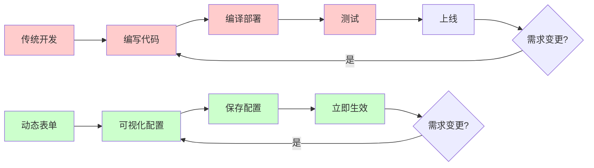

#### 核心优势

1. **零代码配置**
   - 通过可视化界面设计表单
   - 无需编写 UI 代码
   - 实时预览效果

2. **即时生效**
   - 配置保存后立即可用
   - 无需编译和部署
   - 快速响应需求变化

3. **高度灵活**
   - 支持动态添加/删除字段
   - 自定义验证规则
   - 灵活的事件处理

4. **降低成本**
   - 减少 80% 的开发工作量
   - 降低维护成本
   - 提高开发效率

---

## 📊 动态表单系统主要流程

### 整体流程图

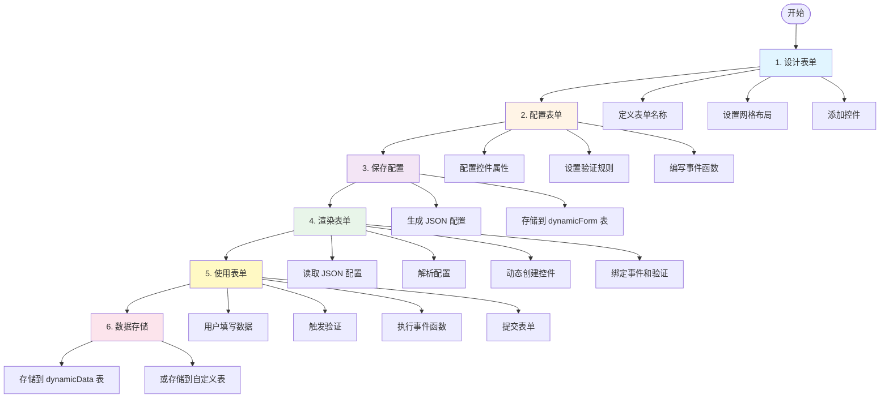

### 详细流程说明

#### 阶段 1：设计表单

**目的**：定义表单的基本结构

**操作**：
1. 输入表单名称（如"用户注册表单"）
2. 设置网格布局（行数、列数、间距）
3. 从工具栏添加控件（文本框、下拉框等）

**输出**：表单的基本框架

#### 阶段 2：配置表单

**目的**：配置控件的详细属性和行为

**操作**：
1. 设置控件属性（标签、占位符、默认值等）
2. 配置验证规则（必填、格式验证等）
3. 编写事件函数（JavaScript 代码）

**输出**：完整的表单配置

#### 阶段 3：保存配置

**目的**：将表单配置持久化到数据库

**流程**：
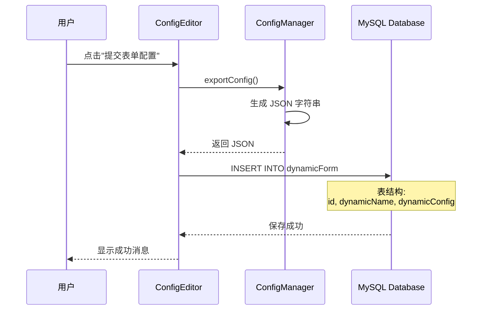

**数据结构**：
```json
{
  "grid": {
    "rows": 5,
    "columns": 2,
    "rowSpacing": 10,
    "columnSpacing": 15,
    "rowHeights": [1, 1, 1, 1, 2],
    "columnWidths": [1, 2]
  },
  "controls": [
    {
      "type": "text",
      "key": "username",
      "label": "用户名",
      "row": 0,
      "column": 0,
      "validationFunction": "if(value.length<3){return false;}",
      "events": {
        "onFocusLost": "console.log(value);"
      }
    }
  ]
}
```

#### 阶段 4：渲染表单

**目的**：根据配置动态生成表单界面

**流程**：
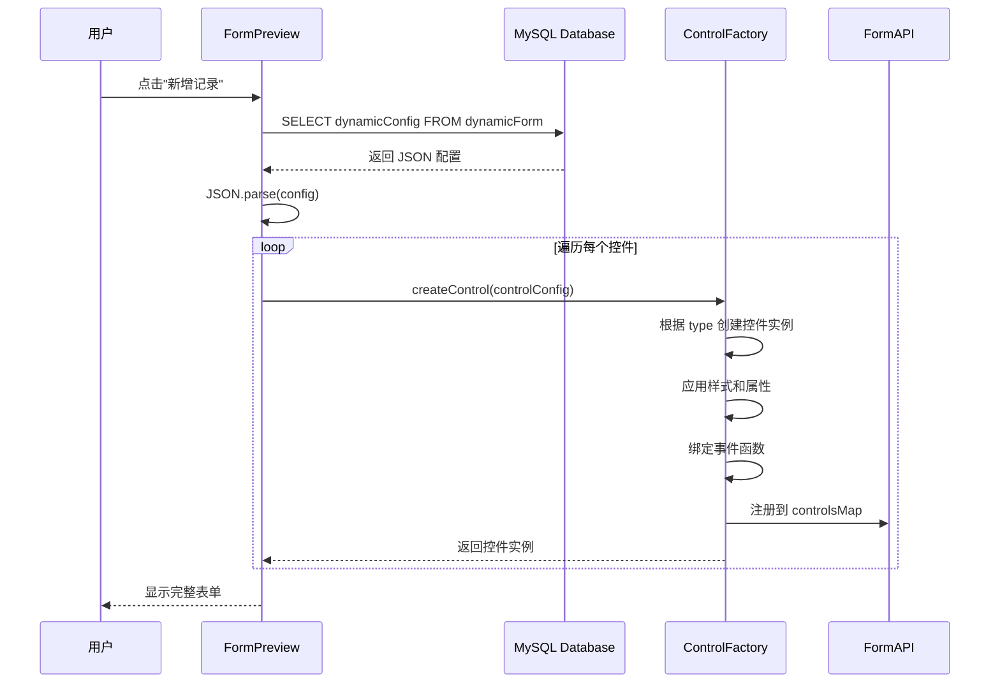

**关键技术**：
- **工厂模式**：根据 type 动态创建不同类型的控件
- **反射机制**：通过配置动态设置属性
- **事件绑定**：将 JavaScript 代码绑定到控件事件

#### 阶段 5：使用表单

**目的**：用户填写数据并提交

**交互流程**：

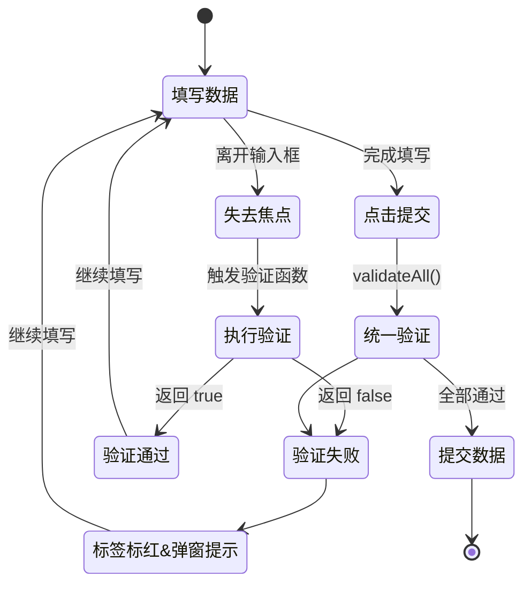

#### 阶段 6：数据存储

**目的**：将用户填写的数据保存到数据库

**存储方式**：

**方式 1：存储到 dynamicData 表（默认）**
```javascript
var submitData = {
    dynamicId: formId,
    data: JSON.stringify(formData),
    createTime: formatDateTime()
};
MySqlHelper.insert('dynamicData', submitData);
```

**方式 2：存储到自定义表**
```javascript
var userData = {
    username: getControlValue('username'),
    email: getControlValue('email'),
    age: getControlValue('age')
};
MySqlHelper.insert('users', userData);
```

---

## ❌ 不使用动态表单的问题

### 传统开发流程

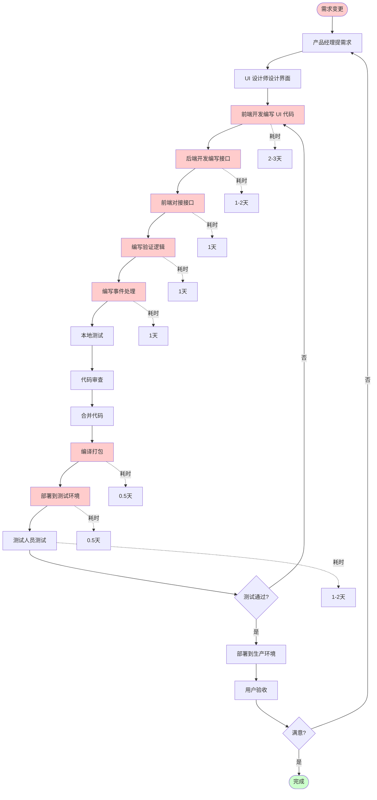

**总耗时**：约 8-12 天

### 传统开发的问题

#### 1. 开发周期长

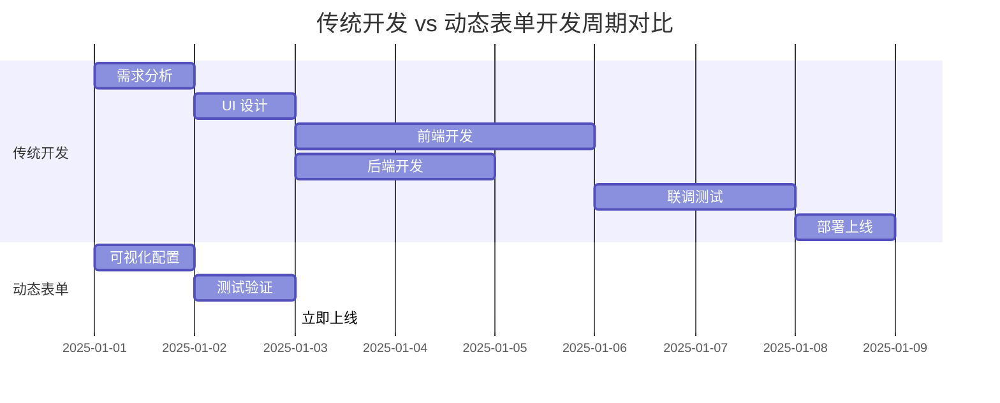

#### 2. 维护成本高

**场景**：需要在表单中添加一个"手机号"字段

**传统方式**：


**动态表单方式**：


#### 3. 代码重复

**传统方式**：每个表单都需要重复编写

```
用户注册表单.qml (300 行)
├── UI 布局代码 (100 行)
├── 验证逻辑 (80 行)
├── 事件处理 (60 行)
└── 数据提交 (60 行)

订单录入表单.qml (350 行)
├── UI 布局代码 (120 行)
├── 验证逻辑 (90 行)
├── 事件处理 (70 行)
└── 数据提交 (70 行)

客户信息表单.qml (280 行)
├── UI 布局代码 (90 行)
├── 验证逻辑 (70 行)
├── 事件处理 (60 行)
└── 数据提交 (60 行)

总计：930 行重复代码
```

**动态表单方式**：复用核心组件

```
FormPreview.qml (核心渲染引擎，500 行)
ControlFactory.qml (控件工厂，300 行)
FormAPI.qml (表单 API，400 行)
ScriptEngine.qml (脚本引擎，200 行)

总计：1400 行核心代码，支持无限个表单
```

#### 4. 灵活性差

**传统方式的限制**：
- ❌ 用户无法自定义表单
- ❌ 需求变更需要开发人员介入
- ❌ 无法快速响应业务变化
- ❌ 扩展新功能需要修改代码

**动态表单的优势**：
- ✅ 用户可以自己配置表单
- ✅ 业务人员可以直接调整
- ✅ 立即响应需求变化
- ✅ 通过配置扩展功能

---

## 🏗️ 动态表单系统总体框架

### 设计目标

本系统的设计目标是构建一个零代码、高灵活、易扩展的表单配置平台，通过"配置即代码"的理念，让非技术人员也能快速创建和调整表单，同时保证系统的性能、稳定性和可维护性。核心目标是将表单开发从"编写代码"转变为"配置参数"，从"编译部署"转变为"即时生效"，最终实现表单需求的快速响应和零成本维护。

### 核心思想

**配置驱动 + 动态渲染 + 事件驱动**

系统的核心思想是将传统的"硬编码"开发模式转变为"配置化"开发模式。通过可视化界面设计表单并生成 JSON 配置，系统在运行时根据配置动态创建界面和绑定逻辑，从而实现"一次开发，无限复用"。配置驱动使得表单结构可以灵活调整，动态渲染保证了运行时的高效创建，事件驱动则通过 JavaScript 脚本提供了强大的业务逻辑扩展能力，三者结合形成了一个完整的低代码开发平台。

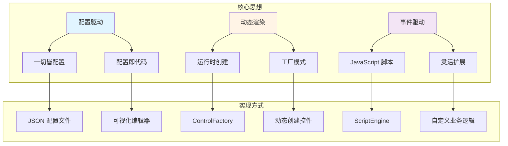

### 系统分层架构

系统采用经典的四层架构设计，从上到下依次是表现层、业务逻辑层、数据访问层和数据层。表现层负责用户交互和界面展示，业务逻辑层封装核心功能和业务规则，数据访问层提供统一的数据操作接口，数据层负责数据持久化。这种分层设计使得各层职责清晰、耦合度低，便于维护和扩展。每一层都可以独立测试和优化，当需求变更时只需修改对应层的代码，不会影响其他层，大大提高了系统的可维护性和可扩展性。

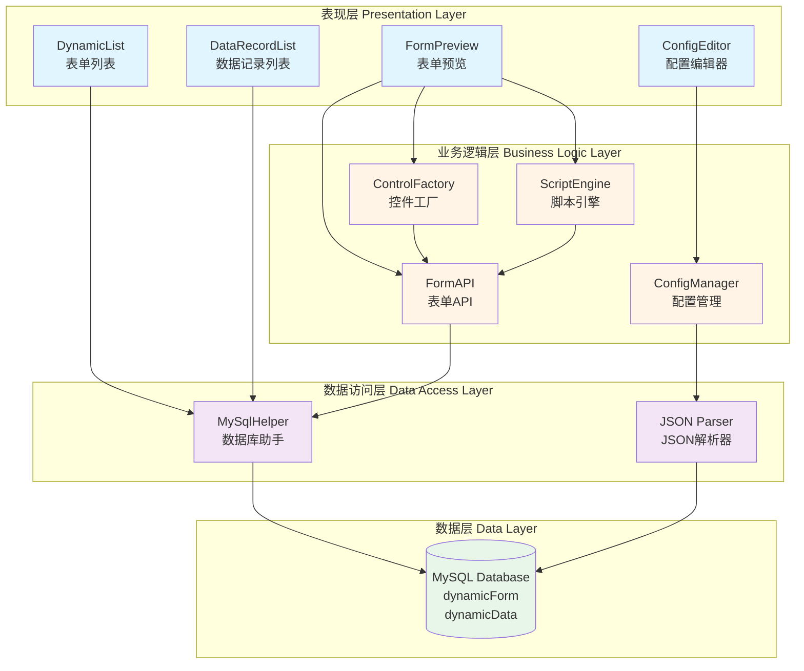

### 核心组件职责

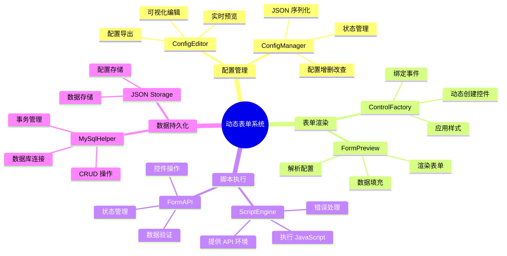

### 简化协作图

这是一个简化的系统协作流程图，展示了从表单配置到数据录入的完整过程：

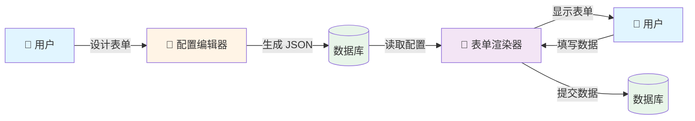

**流程说明**：

1. **设计表单**：用户通过可视化界面设计表单（添加控件、配置属性）
2. **生成 JSON**：系统将表单配置序列化为 JSON 并存储到 dynamicForm 表
3. **读取配置**：需要使用表单时，从数据库读取 JSON 配置
4. **显示表单**：表单渲染器根据 JSON 配置动态创建界面
5. **填写数据**：用户在动态生成的表单中填写数据
6. **提交数据**：用户数据以 JSON 格式存储到 dynamicData 表

### 详细数据流转

```mermaid
flowchart LR
    subgraph "配置阶段"
        A1[用户配置] --> A2[ConfigEditor]
        A2 --> A3[ConfigManager]
        A3 --> A4[JSON 配置]
        A4 --> A5[(dynamicForm 表)]
    end
    
    subgraph "渲染阶段"
        B1[(dynamicForm 表)] --> B2[读取配置]
        B2 --> B3[JSON.parse]
        B3 --> B4[ControlFactory]
        B4 --> B5[创建控件]
        B5 --> B6[FormPreview]
    end
    
    subgraph "使用阶段"
        C1[用户输入] --> C2[触发事件]
        C2 --> C3[ScriptEngine]
        C3 --> C4[执行脚本]
        C4 --> C5[FormAPI]
        C5 --> C6[验证/提交]
    end
    
    subgraph "存储阶段"
        D1[表单数据] --> D2[MySqlHelper]
        D2 --> D3[(dynamicData 表)]
        D2 --> D4[(自定义表)]
    end
    
    A5 --> B1
    B6 --> C1
    C6 --> D1
    
    style A2 fill:#e1f5ff
    style A3 fill:#fff4e6
    style B4 fill:#fff4e6
    style C3 fill:#f3e5f5
    style C5 fill:#f3e5f5
    style D2 fill:#f3e5f5
```

### 关键技术点

#### 1. 配置驱动

**核心**：将表单的结构、样式、行为都抽象为配置

```json
{
  "type": "text",           // 控件类型
  "key": "username",        // 唯一标识
  "label": "用户名",        // 显示标签
  "placeholder": "请输入",  // 占位符
  "validationFunction": "", // 验证函数
  "events": {}              // 事件处理
}
```

**优势**：
- 配置即代码
- 易于存储和传输
- 支持版本管理
- 可以动态修改

#### 2. 工厂模式

**核心**：根据配置动态创建不同类型的控件

```javascript
function createControl(config) {
    switch(config.type) {
        case "text":
            return createTextField(config);
        case "number":
            return createSpinBox(config);
        case "dropdown":
            return createComboBox(config);
        // ...
    }
}
```

**优势**：
- 解耦创建逻辑
- 易于扩展新类型
- 统一的创建接口

#### 3. 脚本引擎

**核心**：在运行时执行用户自定义的 JavaScript 代码

```javascript
function executeFunction(funcCode, context) {
    // 注入 API 环境
    var formAPI = this.formAPI;
    var MySqlHelper = getMySqlHelper();
    var formData = formAPI.getAllValues();
    
    // 执行用户代码
    eval(funcCode);
}
```

**优势**：
- 灵活的业务逻辑
- 无需重新编译
- 支持复杂场景

#### 4. 数据绑定

**核心**：配置和 UI 的双向绑定

```qml
// 配置 → UI
onGridConfigChanged: {
    rowsSpinBox.value = gridConfig.rows;
}

// UI → 配置
onValueChanged: {
    gridConfig.rows = rowsSpinBox.value;
}
```

**优势**：
- 自动同步
- 减少手动更新
- 提高一致性

---

## 📈 系统优势总结

### 开发效率提升

| 指标 | 传统开发 | 动态表单 | 提升 |
|------|---------|---------|------|
| 单个表单开发时间 | 2-3 天 | 0.5 天 | 80% ↑ |
| 需求变更响应时间 | 1-2 天 | 10 分钟 | 99% ↑ |
| 代码量 | 300 行/表单 | 0 行/表单 | 100% ↓ |
| 部署时间 | 0.5 天 | 0 秒 | 100% ↓ |

### 成本节约

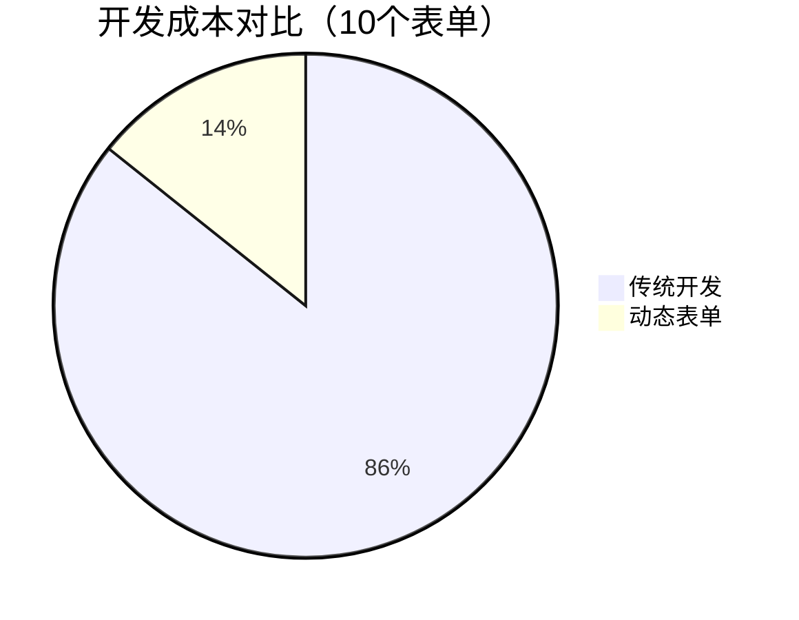

**传统开发**：30 人天
- UI 开发：15 人天
- 后端开发：10 人天
- 测试部署：5 人天

**动态表单**：5 人天
- 配置表单：3 人天
- 测试验证：2 人天

**节约**：25 人天（83%）

### 质量提升

- ✅ **一致性**：所有表单使用统一的组件和逻辑
- ✅ **可靠性**：核心代码经过充分测试
- ✅ **可维护性**：配置化管理，易于维护
- ✅ **可扩展性**：通过配置扩展功能

---

**本章节应插入到主手册"系统概述"之前**


---

## 💾 数据存储结构详解

### 数据库表结构

系统使用两个核心数据表来存储表单配置和数据：

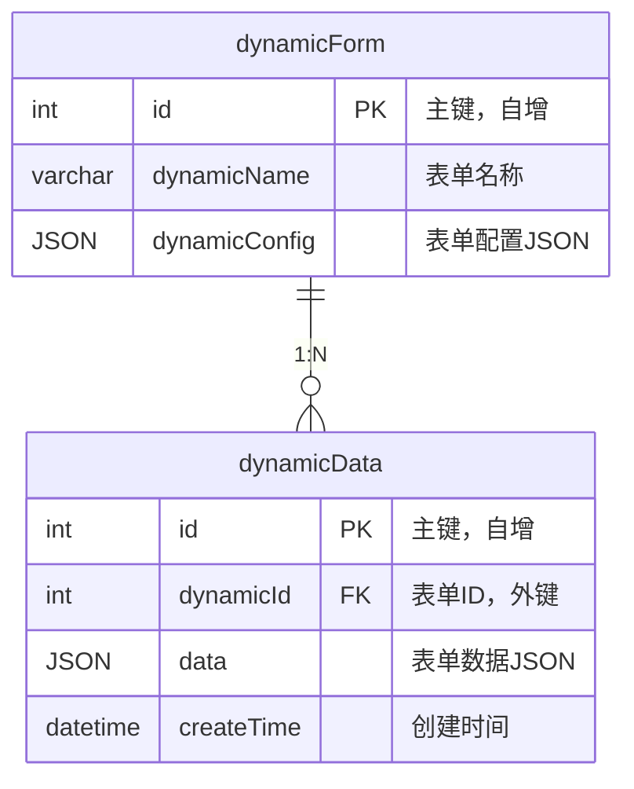

### 表单配置 JSON 结构

#### 完整结构示例

```json
{
  "grid": {
    "rows": 5,
    "columns": 2,
    "rowSpacing": 10,
    "columnSpacing": 15,
    "rowHeights": [1, 1, 1, 1, 2],
    "columnWidths": [1, 2]
  },
  "controls": [
    {
      "type": "text",
      "key": "username",
      "label": "用户名",
      "placeholder": "请输入用户名",
      "value": "",
      "row": 0,
      "column": 0,
      "rowSpan": 1,
      "colSpan": 1,
      "labelRatio": 0.3,
      "style": {
        "labelColor": "#000000",
        "labelBold": false,
        "inputColor": "#000000",
        "inputFontSize": 12
      },
      "validationFunction": "if(value.length<3){showMessage('用户名至少3个字符','error');return false;}",
      "events": {
        "onFocusLost": "console.log('用户名:', value);",
        "onTextChanged": ""
      }
    },
    {
      "type": "number",
      "key": "age",
      "label": "年龄",
      "value": 18,
      "minimum": 0,
      "maximum": 150,
      "step": 1,
      "row": 1,
      "column": 0,
      "rowSpan": 1,
      "colSpan": 1,
      "validationFunction": "if(!validateNumber(value,18,65)){return false;}"
    },
    {
      "type": "dropdown",
      "key": "gender",
      "label": "性别",
      "options": [
        {"label": "男", "value": "male"},
        {"label": "女", "value": "female"}
      ],
      "value": "male",
      "row": 2,
      "column": 0
    },
    {
      "type": "button",
      "key": "submit_btn",
      "label": "提交",
      "buttonText": "提交表单",
      "buttonType": "submit",
      "row": 4,
      "column": 0,
      "colSpan": 2,
      "events": {
        "onClicked": "var validation=validateAll();if(!validation.valid){return;}var submitData={dynamicId:formId,data:JSON.stringify(formData),createTime:formatDateTime()};try{MySqlHelper.insert('dynamicData',submitData);showMessage('提交成功','success');resetForm();}catch(e){showMessage('提交失败:'+e,'error');}"
      }
    }
  ]
}
```

#### 配置结构图（树形展示）

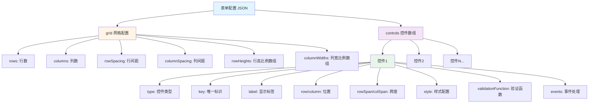

#### 配置结构图（清晰展示）

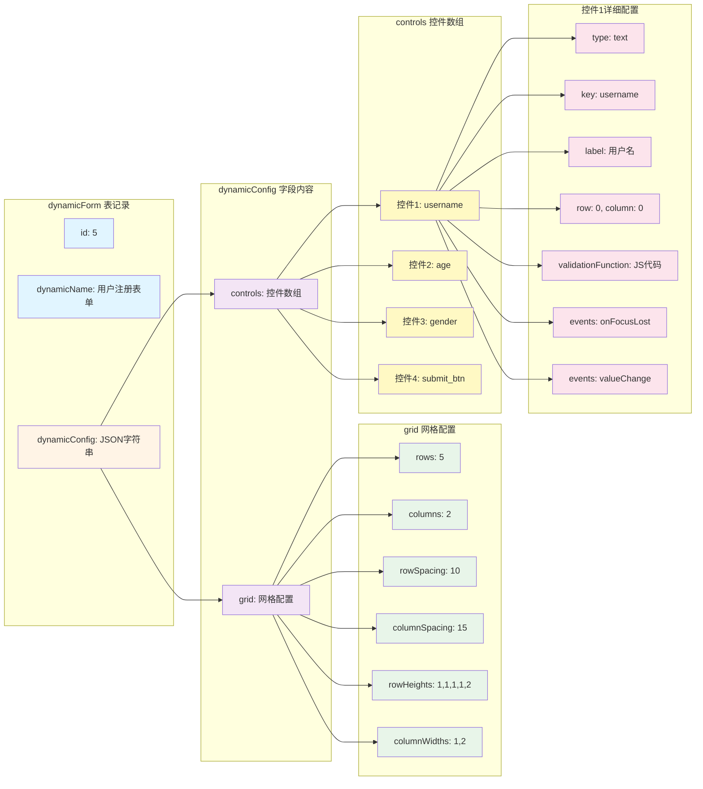

### 表单数据 JSON 结构

#### 存储到 dynamicData 表

```json
{
  "id": 1,
  "dynamicId": 5,
  "data": "{\"username\":\"zhangsan\",\"age\":25,\"gender\":\"male\",\"email\":\"zhangsan@example.com\"}",
  "createTime": "2025-11-19 14:30:00"
}
```

#### data 字段解析后的结构

```json
{
  "username": "zhangsan",
  "age": 25,
  "gender": "male",
  "email": "zhangsan@example.com",
  "phone": "13800138000",
  "address": "北京市朝阳区"
}
```

#### 数据结构图

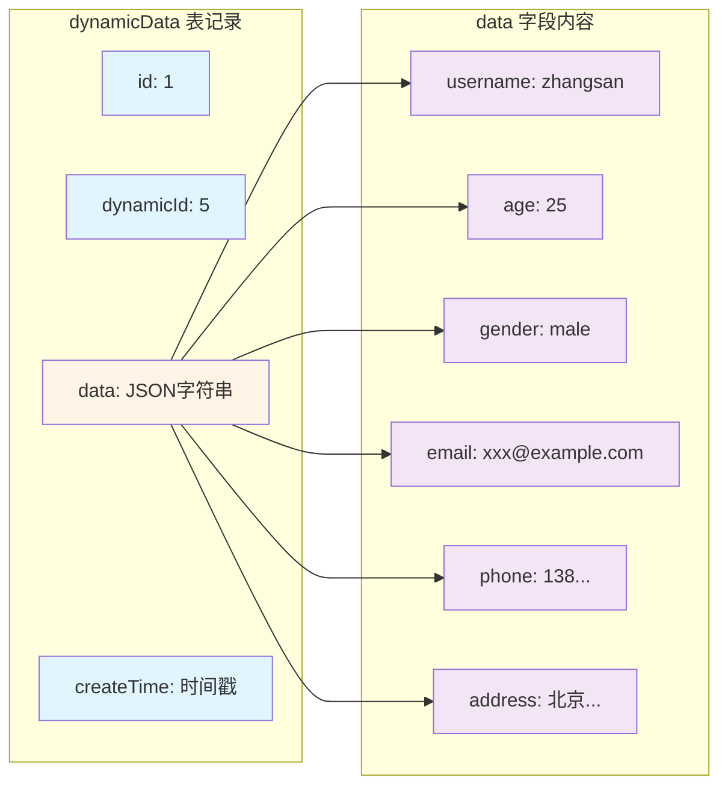


    

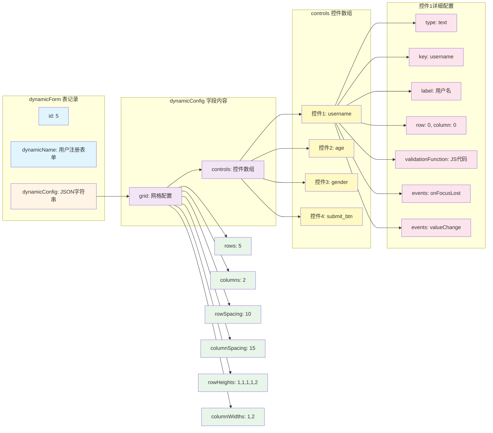


### 数据流转完整流程

```mermaid
sequenceDiagram
    participant U as 用户
    participant CE as ConfigEditor
    participant CM as ConfigManager
    participant DB1 as dynamicForm表
    participant FP as FormPreview
    participant CF as ControlFactory
    participant SE as ScriptEngine
    participant DB2 as dynamicData表
    
    rect rgb(225, 245, 255)
        Note over U,DB1: 阶段1：配置表单
        U->>CE: 设计表单
        CE->>CM: 添加控件、配置属性
        U->>CE: 点击"提交配置"
        CE->>CM: exportConfig()
        CM->>CM: 生成 JSON 字符串
        CM-->>CE: 返回 JSON
        CE->>DB1: INSERT INTO dynamicForm<br/>(dynamicName, dynamicConfig)
        Note over DB1: 存储表单配置<br/>{"grid":{...},"controls":[...]}
        DB1-->>CE: 保存成功
    end
    
    rect rgb(255, 244, 230)
        Note over U,CF: 阶段2：渲染表单
        U->>FP: 点击"新增记录"
        FP->>DB1: SELECT dynamicConfig<br/>FROM dynamicForm<br/>WHERE id=?
        DB1-->>FP: 返回 JSON 配置
        FP->>FP: JSON.parse(config)
        loop 遍历 controls
            FP->>CF: createControl(controlConfig)
            CF->>CF: 根据 type 创建控件
            CF-->>FP: 返回控件实例
        end
        FP-->>U: 显示完整表单
    end
    
    rect rgb(243, 229, 245)
        Note over U,SE: 阶段3：填写数据
        U->>FP: 输入数据
        FP->>SE: 触发验证事件
        SE->>SE: 执行 validationFunction
        SE-->>FP: 返回验证结果
        FP-->>U: 显示验证反馈
    end
    
    rect rgb(232, 245, 233)
        Note over U,DB2: 阶段4：提交数据
        U->>FP: 点击"提交"按钮
        FP->>SE: 执行 onClicked 事件
        SE->>SE: validateAll()
        SE->>SE: 收集表单数据<br/>getAllValues()
        SE->>SE: 构造提交数据<br/>{dynamicId, data, createTime}
        SE->>DB2: MySqlHelper.insert('dynamicData', data)
        Note over DB2: 存储表单数据<br/>data: JSON字符串
        DB2-->>SE: 插入成功
        SE-->>U: 显示成功消息
    end
```

### 控件类型配置详解

#### 文本框（text）

```json
{
  "type": "text",
  "key": "username",
  "label": "用户名",
  "placeholder": "请输入用户名",
  "value": "",
  "row": 0,
  "column": 0,
  "rowSpan": 1,
  "colSpan": 1,
  "labelRatio": 0.3,
  "style": {
    "labelColor": "#000000",
    "labelBold": false,
    "inputColor": "#000000",
    "inputFontSize": 12
  },
  "validationFunction": "if(value.length<3){return false;}",
  "events": {
    "onFocusLost": "console.log(value);",
    "onTextChanged": ""
  }
}
```

#### 数字框（number）

```json
{
  "type": "number",
  "key": "age",
  "label": "年龄",
  "value": 18,
  "minimum": 0,
  "maximum": 150,
  "step": 1,
  "row": 1,
  "column": 0
}
```

#### 下拉框（dropdown）

```json
{
  "type": "dropdown",
  "key": "gender",
  "label": "性别",
  "options": [
    {"label": "男", "value": "male"},
    {"label": "女", "value": "female"}
  ],
  "value": "male",
  "row": 2,
  "column": 0
}
```

#### 复选框（checkbox）

```json
{
  "type": "checkbox",
  "key": "hobbies",
  "label": "爱好",
  "direction": "horizontal",
  "options": [
    {"label": "阅读", "value": "reading"},
    {"label": "运动", "value": "sports"},
    {"label": "音乐", "value": "music"}
  ],
  "value": ["reading"],
  "row": 3,
  "column": 0
}
```

#### 按钮（button）

```json
{
  "type": "button",
  "key": "submit_btn",
  "label": "提交",
  "buttonText": "提交表单",
  "buttonType": "submit",
  "row": 4,
  "column": 0,
  "colSpan": 2,
  "events": {
    "onClicked": "var validation=validateAll();if(!validation.valid){return;}MySqlHelper.insert('dynamicData',{dynamicId:formId,data:JSON.stringify(formData),createTime:formatDateTime()});showMessage('提交成功','success');resetForm();"
  }
}
```

### 配置字段说明

#### 通用字段

| 字段 | 类型 | 必填 | 说明 | 示例 |
|------|------|------|------|------|
| type | string | ✅ | 控件类型 | "text", "number", "dropdown" |
| key | string | ✅ | 唯一标识符 | "username", "age" |
| label | string | ✅ | 显示标签 | "用户名", "年龄" |
| row | number | ✅ | 所在行（从0开始） | 0, 1, 2 |
| column | number | ✅ | 所在列（从0开始） | 0, 1 |
| rowSpan | number | ❌ | 跨越行数 | 1, 2（默认1） |
| colSpan | number | ❌ | 跨越列数 | 1, 2（默认1） |
| value | any | ❌ | 默认值 | "", 0, "male" |
| validationFunction | string | ❌ | 验证函数（JavaScript代码） | "if(value.length<3){return false;}" |
| events | object | ❌ | 事件处理函数 | {"onFocusLost": "..."} |

#### 样式字段（style）

| 字段 | 类型 | 说明 | 默认值 |
|------|------|------|--------|
| labelColor | string | 标签文字颜色 | "#000000" |
| labelBold | boolean | 标签是否加粗 | false |
| inputColor | string | 输入框文字颜色 | "#000000" |
| inputFontSize | number | 输入框字体大小 | 12 |

#### 类型特定字段

**数字框（number）**：
- minimum: 最小值
- maximum: 最大值
- step: 步进值

**下拉框（dropdown）**：
- options: 选项数组 `[{"label":"显示文本","value":"值"}]`

**复选框（checkbox）**：
- options: 选项数组
- direction: 布局方向（"horizontal" 或 "vertical"）

**按钮（button）**：
- buttonText: 按钮显示文字
- buttonType: 按钮类型（"submit", "reset", "normal"）

### 数据查询示例

#### 查询表单配置

```sql
-- 查询所有表单
SELECT id, dynamicName, dynamicConfig 
FROM dynamicForm;

-- 查询特定表单
SELECT dynamicConfig 
FROM dynamicForm 
WHERE id = 5;

-- 查询表单名称包含"用户"的表单
SELECT id, dynamicName 
FROM dynamicForm 
WHERE dynamicName LIKE '%用户%';
```

#### 查询表单数据

```sql
-- 查询某个表单的所有数据记录
SELECT id, data, createTime 
FROM dynamicData 
WHERE dynamicId = 5 
ORDER BY createTime DESC;

-- 查询最近提交的10条记录
SELECT d.id, f.dynamicName, d.data, d.createTime
FROM dynamicData d
JOIN dynamicForm f ON d.dynamicId = f.id
ORDER BY d.createTime DESC
LIMIT 10;

-- 解析 JSON 数据（MySQL 5.7+）
SELECT 
    id,
    JSON_EXTRACT(data, '$.username') as username,
    JSON_EXTRACT(data, '$.age') as age,
    createTime
FROM dynamicData
WHERE dynamicId = 5;
```

### 数据备份与恢复

#### 备份表单配置

```sql
-- 导出表单配置
SELECT dynamicName, dynamicConfig 
FROM dynamicForm 
INTO OUTFILE '/tmp/form_backup.json';

-- 或使用 mysqldump
mysqldump -u root -p database_name dynamicForm > form_backup.sql
```

#### 恢复表单配置

```sql
-- 从备份恢复
LOAD DATA INFILE '/tmp/form_backup.json' 
INTO TABLE dynamicForm 
(dynamicName, dynamicConfig);

-- 或使用 mysql
mysql -u root -p database_name < form_backup.sql
```

---

**本章节应添加到主手册的"数据库操作"章节之后**
