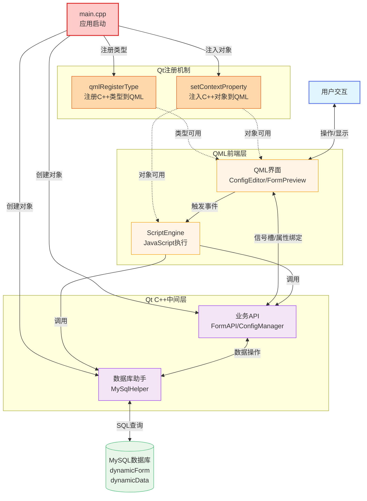

# 动态表单系统 - 技术栈协作图

## 系统技术栈交互关系

本图展示了动态表单系统中各技术组件之间的协作关系和数据流向。

---

## 技术栈协作图（简化版）



---

## 详细交互说明

### 0. 应用启动与Qt注册机制

**main.cpp 启动流程：**
1. 创建 QApplication 应用实例
2. 创建 QQmlApplicationEngine QML引擎
3. 注册C++类型到QML（qmlRegisterType）
4. 创建C++对象实例（MySqlHelper、MessageManager等）
5. 注入C++对象到QML上下文（setContextProperty）
6. 加载主QML文件
7. 启动事件循环

**Qt注册机制详解：**

**方式1：qmlRegisterType - 注册类型**
```cpp
// 在main.cpp中注册C++类型，使其可在QML中实例化
qmlRegisterType<MySqlHelper>("com.myapp", 1, 0, "MySqlHelper");

// QML中使用
import com.myapp 1.0
MySqlHelper {
    id: dbHelper
}
```

**方式2：setContextProperty - 注入对象**
```cpp
// 在main.cpp中创建C++对象并注入到QML上下文
MySqlHelper* helper = new MySqlHelper();
engine.rootContext()->setContextProperty("MySqlHelper", helper);

// QML中直接使用（无需import）
MySqlHelper.insert("table", data);
```

**方式3：Q_PROPERTY - 属性暴露**
```cpp
// C++类中定义属性
class FormAPI : public QObject {
    Q_OBJECT
    Q_PROPERTY(QString formName READ formName WRITE setFormName NOTIFY formNameChanged)
};

// QML中绑定属性
Text { text: formAPI.formName }
```

**方式4：Q_INVOKABLE - 方法暴露**
```cpp
// C++类中定义可调用方法
class MySqlHelper : public QObject {
    Q_OBJECT
public:
    Q_INVOKABLE bool insert(QString table, QVariantMap data);
};

// QML中调用方法
MySqlHelper.insert("dynamicData", {id: 1, name: "test"});
```

---

### 1. 用户层 ↔ QML前端层

**交互方式：**
- 用户通过界面操作控件（点击、输入、选择）
- QML界面实时响应用户操作，更新显示状态
- 双向数据绑定实现界面与数据同步

**关键技术：**
- QML属性绑定
- 信号槽机制
- 事件处理

---

### 2. QML前端层内部协作

**QML界面组件 ↔ QML控件**
- ConfigEditor创建和管理各种控件
- FormPreview动态渲染表单控件
- ControlEditDialog编辑控件属性

**QML控件 → QML脚本引擎**
- 控件事件触发JavaScript代码执行
- onFocusLost、onValueChanged、onClicked等事件

**QML界面组件 → QML脚本引擎**
- 调用ScriptEngine执行用户自定义脚本
- 传递执行上下文和参数

---

### 3. QML前端层 ↔ Qt C++中间层

**QML ↔ Qt对象模型**
- QML通过Q_PROPERTY暴露C++对象属性
- 信号槽机制实现QML与C++的双向通信
- QML可以直接调用C++对象的Q_INVOKABLE方法

**QML脚本引擎 ↔ MySqlHelper**
- JavaScript代码中调用MySqlHelper进行数据库操作
- insert、select、update、delete等方法

**QML脚本引擎 ↔ FormAPI**
- JavaScript代码中调用FormAPI操作表单
- getControlValue、setControlValue、validateAll等方法

---

### 4. Qt C++中间层内部协作

**Qt对象模型 ↔ 业务逻辑**
- QObject信号槽机制实现组件间通信
- ConfigManager管理配置变更通知
- FormAPI协调控件状态管理

**业务逻辑 ↔ 数据库接口**
- FormAPI通过MySqlHelper访问数据库
- ConfigManager保存和加载表单配置
- 数据验证和转换

---

### 5. Qt C++中间层 ↔ 数据层

**MySqlHelper ↔ MySQL数据库**
- QSqlDatabase建立数据库连接
- QSqlQuery执行SQL语句
- 事务管理和错误处理

**业务逻辑 ↔ JSON配置**
- 解析JSON配置生成表单结构
- 将表单配置序列化为JSON
- 配置验证和默认值处理

**JSON配置 ↔ MySQL数据库**
- dynamicForm表存储JSON配置字符串
- dynamicData表存储表单数据JSON
- 配置版本管理

---

### 6. 系统 ↔ 外部系统

**QML脚本引擎 → 外部API**
- JavaScript中发起HTTP请求
- 调用第三方服务接口
- 数据格式转换

**数据库接口 → 外部系统**
- 数据同步和备份
- 与其他系统的数据交换
- 定时任务和批处理

---

## Qt与QML集成代码示例

### main.cpp 完整示例

```cpp
#include <QGuiApplication>
#include <QQmlApplicationEngine>
#include <QQmlContext>
#include "mysql/MySqlHelper/MySqlHelper.h"
#include "MessageManager.h"

int main(int argc, char *argv[])
{
    QGuiApplication app(argc, argv);
    QQmlApplicationEngine engine;
    
    // 1. 创建C++对象实例
    MySqlHelper* mySqlHelper = new MySqlHelper();
    MessageManager* messageManager = MessageManager::instance();
    
    // 2. 注入对象到QML上下文（全局可用）
    engine.rootContext()->setContextProperty("MySqlHelper", mySqlHelper);
    engine.rootContext()->setContextProperty("MessageManager", messageManager);
    
    // 3. 注册C++类型到QML（可实例化）
    // qmlRegisterType<FormAPI>("com.myapp", 1, 0, "FormAPI");
    
    // 4. 加载主QML文件
    const QUrl url(QStringLiteral("qrc:/qml/main.qml"));
    engine.load(url);
    
    // 5. 启动事件循环
    return app.exec();
}
```

### QML中使用C++对象

```qml
// qml/dynamic/dynamicList.qml
import QtQuick 6.5
import QtQuick.Controls 6.5

Item {
    Component.onCompleted: {
        // 直接调用注入的C++对象
        var result = MySqlHelper.select(
            "dynamicForm", 
            ["id", "dynamicName", "dynamicConfig"], 
            ""
        );
        
        if (result.success) {
            listModel.clear();
            for (var i = 0; i < result.data.length; i++) {
                listModel.append(result.data[i]);
            }
        } else {
            MessageManager.showMessage("查询失败: " + result.error, "error");
        }
    }
    
    Button {
        text: "保存数据"
        onClicked: {
            // 调用C++方法
            var success = MySqlHelper.insert("dynamicData", {
                dynamicId: formId,
                data: JSON.stringify(formData),
                createTime: new Date().toISOString()
            });
            
            if (success) {
                MessageManager.showMessage("保存成功", "success");
            }
        }
    }
}
```

### C++类定义示例

```cpp
// MySqlHelper.h
#ifndef MYSQLHELPER_H
#define MYSQLHELPER_H

#include <QObject>
#include <QVariantMap>
#include <QVariantList>

class MySqlHelper : public QObject
{
    Q_OBJECT
    
public:
    explicit MySqlHelper(QObject *parent = nullptr);
    
    // Q_INVOKABLE 使方法可在QML中调用
    Q_INVOKABLE bool insert(const QString &tableName, const QVariantMap &data);
    Q_INVOKABLE QVariantMap select(const QString &tableName, 
                                    const QStringList &columns, 
                                    const QString &where);
    Q_INVOKABLE bool update(const QString &tableName, 
                           const QVariantMap &data, 
                           const QString &where);
    Q_INVOKABLE bool remove(const QString &tableName, 
                           const QString &where);
    
signals:
    // 信号可在QML中连接
    void dataChanged();
    void errorOccurred(const QString &error);
};

#endif // MYSQLHELPER_H
```

---

## 数据流转示例

### 示例1：用户创建表单

```
用户 → QML界面(ConfigEditor) 
    → Qt业务逻辑(ConfigManager) 
    → JSON配置生成 
    → MySqlHelper 
    → MySQL数据库(dynamicForm表)
```

### 示例2：用户填写表单

```
用户 → QML控件(TextField) 
    → 触发事件 
    → QML脚本引擎(ScriptEngine) 
    → FormAPI(验证) 
    → MySqlHelper 
    → MySQL数据库(dynamicData表)
```

### 示例3：加载表单配置

```
MySQL数据库(dynamicForm表) 
    → MySqlHelper 
    → JSON配置解析 
    → Qt业务逻辑(ConfigManager) 
    → QML界面(FormPreview) 
    → 动态创建QML控件 
    → 显示给用户
```

### 示例4：事件脚本执行

```
用户操作 
    → QML控件事件 
    → QML脚本引擎 
    → 调用FormAPI(获取其他控件值) 
    → 调用MySqlHelper(查询数据库) 
    → 更新QML控件显示 
    → 用户看到结果
```

---

## 技术栈职责划分

| 技术层 | 主要职责 | 关键组件 |
|--------|---------|---------|
| **QML前端** | 界面渲染、用户交互、事件处理 | ConfigEditor, FormPreview, ScriptEngine |
| **Qt C++中间层** | 业务逻辑、数据处理、对象管理 | FormAPI, ConfigManager, MySqlHelper |
| **数据层** | 数据持久化、配置存储 | MySQL数据库, JSON配置 |
| **外部系统** | 第三方服务、数据同步 | REST API, 外部数据库 |

---

## 关键技术点

### 1. QML与C++的绑定机制

- **Q_PROPERTY**：将C++属性暴露给QML
- **Q_INVOKABLE**：将C++方法暴露给QML
- **信号槽**：实现双向通信
- **QQmlContext**：注入C++对象到QML上下文

### 2. 数据绑定

- **属性绑定**：QML属性自动跟踪依赖变化
- **双向绑定**：Binding对象实现双向同步
- **信号通知**：属性变化自动触发信号

### 3. 脚本引擎集成

- **QJSEngine**：JavaScript引擎
- **上下文注入**：将C++对象注入到JS环境
- **异步执行**：避免阻塞UI线程

### 4. 数据库操作

- **连接池**：复用数据库连接
- **预编译语句**：提高查询性能
- **事务管理**：保证数据一致性

---

## 性能优化策略

1. **QML层面**
   - 使用Loader延迟加载
   - 避免复杂的属性绑定
   - 使用ListView/GridView虚拟化

2. **C++层面**
   - 减少QML与C++的频繁调用
   - 使用智能指针管理内存
   - 批量数据操作

3. **数据库层面**
   - 建立合适的索引
   - 使用连接池
   - 缓存常用查询结果

4. **整体架构**
   - 异步操作避免阻塞
   - 事件驱动架构
   - 模块化设计降低耦合

---

## 总结

动态表单系统通过QML、Qt C++、MySQL的紧密协作，实现了：

- ✅ **灵活的界面**：QML提供声明式UI和动态渲染
- ✅ **强大的逻辑**：C++处理复杂业务和数据操作
- ✅ **可靠的存储**：MySQL保证数据持久化和一致性
- ✅ **可扩展性**：模块化设计便于功能扩展
- ✅ **高性能**：多层架构优化提升系统响应速度

这种多角度的协作关系使得系统既保持了灵活性，又具备了良好的性能和可维护性。
