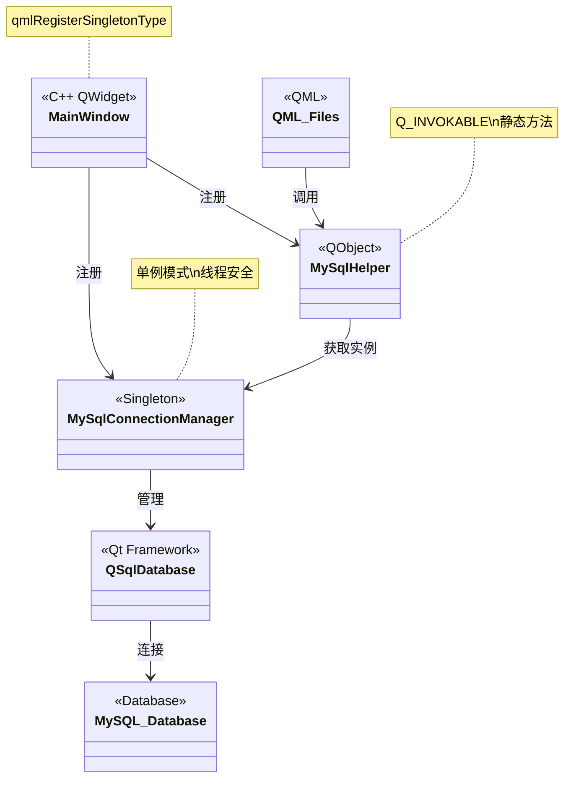
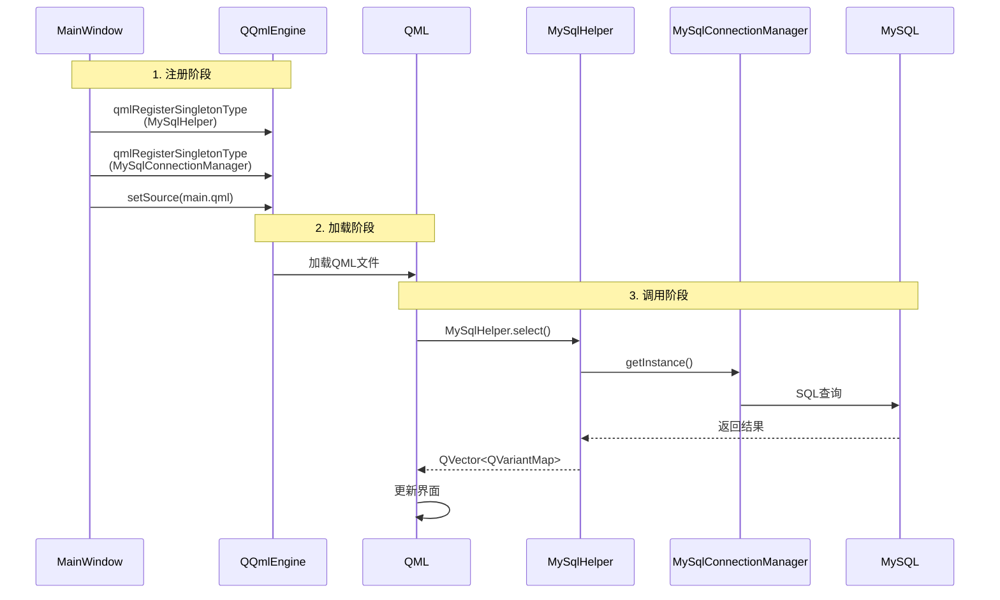

# 数据库访问层类图与调用关系

## 系统概述

本文档展示了动态表单系统中数据库访问层的架构设计，包括MySqlHelper、MySqlConnectionManager与QML的集成方式。

---

## 类图（简化版）



---

## 注册与调用流程图（简化版）



---

## 详细注册代码

### 1. MainWindow中的注册代码

```cpp
// mainwindow.cpp
MainWindow::MainWindow(QWidget *parent)
    : QMainWindow(parent)
    , ui(new Ui::MainWindow)
{
    ui->setupUi(this);
    this->showMaximized();

    // 创建QQuickWidget
    QQuickWidget *quickWidget = new QQuickWidget(this);
    quickWidget->setResizeMode(QQuickWidget::SizeRootObjectToView);
    setCentralWidget(quickWidget);
    
    // 获取QQmlEngine
    QQmlEngine *engine = quickWidget->engine();
    engine->addImportPath("qrc:/qml");

    // ========== 关键：注册C++单例到QML ==========
    
    // 方式1：注册MySqlHelper为单例
    qmlRegisterSingletonType<MySqlHelper>(
        "mysqlhelper",           // 模块名
        1, 0,                    // 版本号
        "MySqlHelper",           // QML中的类型名
        [](QQmlEngine *, QJSEngine *) -> QObject * {
            return new MySqlHelper;  // 返回新实例
        }
    );
    
    // 方式2：注册MySqlConnectionManager为单例
    qmlRegisterSingletonType<MySqlConnectionManager>(
        "mysqlconnectionmanager",  // 模块名
        1, 0,                       // 版本号
        "MySqlConnectionManager",   // QML中的类型名
        [](QQmlEngine *, QJSEngine *) -> QObject * {
            return MySqlConnectionManager::getInstance();  // 返回单例实例
        }
    );
    
    // 设置上下文属性（可选）
    quickWidget->rootContext()->setContextProperty("formJson", jsonStr);
    
    // 加载QML文件
    quickWidget->setSource(QUrl("qrc:/qml/main.qml"));
}
```

### 2. MySqlConnectionManager单例实现

```cpp
// MySqlConnectionManager.h
class MySqlConnectionManager : public QObject {
    Q_OBJECT
private:
    static MySqlConnectionManager* mySqlConnectionManager;
    static std::mutex mtx;
    QSqlDatabase db;
    
    MySqlConnectionManager();   // 私有构造函数
    ~MySqlConnectionManager();  // 私有析构函数
    
public:
    // 获取单例实例（线程安全）
    static MySqlConnectionManager* getInstance();
    
    // 获取数据库连接
    QSqlDatabase& getDatabase() { return db; }
};

// MySqlConnectionManager.cpp
MySqlConnectionManager* MySqlConnectionManager::mySqlConnectionManager = nullptr;
std::mutex MySqlConnectionManager::mtx;

MySqlConnectionManager* MySqlConnectionManager::getInstance() {
    if (mySqlConnectionManager == nullptr) {
        std::lock_guard<std::mutex> lock(mtx);  // 线程安全
        if (mySqlConnectionManager == nullptr) {
            mySqlConnectionManager = new MySqlConnectionManager();
        }
    }
    return mySqlConnectionManager;
}

MySqlConnectionManager::MySqlConnectionManager() {
    if (QSqlDatabase::contains("qt_mysql_connection")) {
        db = QSqlDatabase::database("qt_mysql_connection");
    } else {
        db = QSqlDatabase::addDatabase("QMYSQL", "qt_mysql_connection");
        db.setHostName("127.0.0.1");
        db.setPort(3306);
        db.setDatabaseName("test");
        db.setUserName("root");
        db.setPassword("123456");
        
        if (!db.open()) {
            qCritical() << "Database open failed";
        } else {
            qDebug() << "Database connected successfully!";
        }
    }
}
```

### 3. MySqlHelper实现

```cpp
// MySqlHelper.h
class MySqlHelper : public QObject {
    Q_OBJECT
public:
    MySqlHelper();
    ~MySqlHelper();
    
    // Q_INVOKABLE使方法可在QML中调用
    Q_INVOKABLE static bool insert(
        const QString &tableName, 
        const QMap<QString, QVariant> &data
    );
    
    Q_INVOKABLE static bool update(
        const QString &tableName, 
        const QMap<QString, QVariant> &data, 
        const QString &where
    );
    
    Q_INVOKABLE static QVector<QVariantMap> select(
        const QString &tableName, 
        const QStringList &columns, 
        const QString &where
    );
    
    Q_INVOKABLE static bool remove(
        const QString &tableName, 
        const QString &where
    );
};

// MySqlHelper.cpp
bool MySqlHelper::insert(const QString& tableName, const QMap<QString, QVariant>& data) {
    if (data.isEmpty()) return false;
    
    // 获取数据库连接
    QSqlDatabase& db = MySqlConnectionManager::getInstance()->getDatabase();
    QSqlQuery query(db);
    
    // 构建SQL语句
    QStringList keys, placeholders;
    for (auto i = data.constBegin(); i != data.constEnd(); ++i) {
        keys << i.key();
        placeholders << ":" + i.key();
    }
    
    QString sql = QString("INSERT INTO %1 (%2) VALUES (%3)")
        .arg(tableName)
        .arg(keys.join(","))
        .arg(placeholders.join(","));
    
    query.prepare(sql);
    
    // 绑定参数
    for (auto i = data.constBegin(); i != data.constEnd(); ++i) {
        query.bindValue(":" + i.key(), i.value());
    }
    
    // 执行查询
    if (!query.exec()) {
        qCritical() << "Insert failed:" << query.lastError().text();
        return false;
    }
    return true;
}

QVector<QVariantMap> MySqlHelper::select(
    const QString& tableName, 
    const QStringList& columns, 
    const QString& where
) {
    QVector<QVariantMap> results;
    QSqlDatabase& db = MySqlConnectionManager::getInstance()->getDatabase();
    QSqlQuery query(db);
    
    QString columnString = columns.isEmpty() ? "*" : columns.join(",");
    QString sql = QString("SELECT %1 FROM %2").arg(columnString).arg(tableName);
    if (!where.isEmpty()) {
        sql += " WHERE " + where;
    }
    
    if (!query.exec(sql)) {
        qCritical() << "Select failed";
        return results;
    }
    
    QSqlRecord record = query.record();
    int fieldCount = record.count();
    
    while (query.next()) {
        QVariantMap row;
        for (int i = 0; i < fieldCount; ++i) {
            QString fieldName = record.fieldName(i);
            QVariant value = query.value(i);
            
            // 处理JSON字段
            if (value.metaType().id() == QMetaType::QByteArray) {
                QByteArray raw = value.toByteArray();
                QJsonParseError err;
                QJsonDocument doc = QJsonDocument::fromJson(raw, &err);
                if (err.error == QJsonParseError::NoError) {
                    if (doc.isObject())
                        row[fieldName] = doc.object().toVariantMap();
                    else if (doc.isArray())
                        row[fieldName] = doc.array().toVariantList();
                } else {
                    row[fieldName] = QString::fromUtf8(raw);
                }
            } else {
                row[fieldName] = value;
            }
        }
        results.append(row);
    }
    
    return results;
}
```

---

## QML中的使用方式

### 1. 导入模块

```qml
// dynamicList.qml
import QtQuick 6.5
import QtQuick.Controls 6.5
import mysqlhelper 1.0  // 导入MySqlHelper模块
```

### 2. 调用数据库操作

```qml
Item {
    Component.onCompleted: {
        // 查询数据
        var results = MySqlHelper.select(
            "dynamicForm",                          // 表名
            ["id", "dynamicName", "dynamicConfig"], // 列名
            ""                                       // WHERE条件
        );
        
        // 处理结果
        for (var i = 0; i < results.length; i++) {
            console.log("ID:", results[i].id);
            console.log("Name:", results[i].dynamicName);
            listModel.append(results[i]);
        }
    }
    
    Button {
        text: "保存数据"
        onClicked: {
            // 插入数据
            var success = MySqlHelper.insert(
                "dynamicData",
                {
                    "dynamicId": formId,
                    "data": JSON.stringify(formData),
                    "createTime": new Date().toISOString()
                }
            );
            
            if (success) {
                console.log("保存成功");
            }
        }
    }
    
    Button {
        text: "更新数据"
        onClicked: {
            // 更新数据
            var success = MySqlHelper.update(
                "dynamicData",
                {
                    "data": JSON.stringify(newFormData)
                },
                "id = " + recordId
            );
        }
    }
    
    Button {
        text: "删除数据"
        onClicked: {
            // 删除数据
            var success = MySqlHelper.remove(
                "dynamicData",
                "id = " + recordId
            );
        }
    }
}
```

---

## 架构设计要点

### 1. 单例模式

**MySqlConnectionManager采用单例模式的原因：**
- 数据库连接是昂贵的资源
- 避免多次创建连接
- 全局共享同一个连接
- 线程安全（使用mutex）

**实现方式：**
- 双重检查锁定（Double-Checked Locking）
- 私有构造函数和析构函数
- 静态getInstance()方法

### 2. 静态方法设计

**MySqlHelper使用静态方法的原因：**
- 无需维护状态
- 简化QML调用
- 每次调用都通过ConnectionManager获取连接

### 3. Qt与QML集成

**qmlRegisterSingletonType的作用：**
- 将C++类注册为QML单例类型
- QML中可以直接使用类名调用方法
- 不需要创建实例

**Q_INVOKABLE的作用：**
- 标记方法可被QML调用
- 支持参数传递和返回值
- 自动类型转换（QVariant）

### 4. 数据类型转换

**C++ ↔ QML类型映射完整表：**

| C++类型 | QML类型 | 说明 | 示例 |
|---------|---------|------|------|
| **基本类型** |
| `bool` | `bool` | 布尔值 | `true`, `false` |
| `int` | `number` | 整数 | `42`, `-10` |
| `unsigned int` | `number` | 无符号整数 | `100` |
| `double` | `number` | 浮点数 | `3.14`, `2.5` |
| `float` | `number` | 单精度浮点 | `1.5` |
| `qreal` | `number` | Qt实数类型 | `2.718` |
| **字符串类型** |
| `QString` | `string` | Qt字符串 | `"Hello"` |
| `QByteArray` | `string` | 字节数组 | `"data"` |
| `const char*` | `string` | C字符串 | `"text"` |
| `std::string` | `string` | C++字符串 | `"content"` |
| **容器类型** |
| `QVariantList` | `array` | 变体列表 | `[1, "a", true]` |
| `QList<T>` | `array` | 泛型列表 | `[1, 2, 3]` |
| `QVector<T>` | `array` | 向量 | `["a", "b"]` |
| `QStringList` | `array` | 字符串列表 | `["one", "two"]` |
| `QVariantMap` | `object` | 变体映射 | `{key: "value"}` |
| `QMap<QString, T>` | `object` | 泛型映射 | `{id: 1}` |
| `QHash<QString, T>` | `object` | 哈希表 | `{name: "test"}` |
| **Qt对象类型** |
| `QObject*` | `object` | Qt对象指针 | QML对象引用 |
| `QVariant` | `var` | 变体类型 | 任意类型 |
| `QJsonObject` | `object` | JSON对象 | `{a: 1}` |
| `QJsonArray` | `array` | JSON数组 | `[1, 2]` |
| `QJsonValue` | `var` | JSON值 | 任意JSON值 |
| **日期时间类型** |
| `QDateTime` | `date` | 日期时间 | `new Date()` |
| `QDate` | `date` | 日期 | `new Date()` |
| `QTime` | `date` | 时间 | `new Date()` |
| **几何类型** |
| `QPoint` | `point` | 点 | `Qt.point(x, y)` |
| `QPointF` | `point` | 浮点点 | `Qt.point(x, y)` |
| `QSize` | `size` | 尺寸 | `Qt.size(w, h)` |
| `QSizeF` | `size` | 浮点尺寸 | `Qt.size(w, h)` |
| `QRect` | `rect` | 矩形 | `Qt.rect(x,y,w,h)` |
| `QRectF` | `rect` | 浮点矩形 | `Qt.rect(x,y,w,h)` |
| **颜色类型** |
| `QColor` | `color` | 颜色 | `"#FF0000"` |
| **URL类型** |
| `QUrl` | `url` | URL | `"http://..."` |
| **枚举类型** |
| `enum` | `number` | 枚举值 | `0`, `1`, `2` |
| `Q_ENUM` | `number` | Qt枚举 | 可用枚举名 |
| **特殊类型** |
| `void` | `undefined` | 无返回值 | - |
| `nullptr` | `null` | 空指针 | `null` |

**类型转换注意事项：**

1. **自动转换**：Qt会自动处理基本类型的转换
2. **QVariant**：作为通用容器，可以存储任何Qt支持的类型
3. **指针类型**：C++对象指针在QML中作为对象引用
4. **容器嵌套**：支持嵌套容器，如 `QList<QVariantMap>`
5. **JSON支持**：QJsonObject/QJsonArray可以直接与QML对象/数组互转

**实际使用示例：**

```cpp
// C++端
Q_INVOKABLE QVariantMap getData() {
    return {
        {"id", 1},                          // int → number
        {"name", "Test"},                   // QString → string
        {"active", true},                   // bool → bool
        {"price", 99.99},                   // double → number
        {"tags", QStringList{"a", "b"}},    // QStringList → array
        {"meta", QVariantMap{{"key", "val"}}} // QVariantMap → object
    };
}
```

```qml
// QML端
var data = MySqlHelper.getData();
console.log(data.id);        // number: 1
console.log(data.name);      // string: "Test"
console.log(data.active);    // bool: true
console.log(data.price);     // number: 99.99
console.log(data.tags[0]);   // string: "a"
console.log(data.meta.key);  // string: "val"
```

---

## 调用链路总结

```
QML界面
  ↓ 调用
MySqlHelper (静态方法)
  ↓ 获取连接
MySqlConnectionManager (单例)
  ↓ 返回
QSqlDatabase
  ↓ 执行SQL
MySQL数据库
  ↓ 返回结果
QSqlQuery
  ↓ 解析
QVector<QVariantMap>
  ↓ 返回
QML界面
```

---

## 优势与特点

1. **解耦设计**：数据库连接管理与业务逻辑分离
2. **单例模式**：确保全局唯一的数据库连接
3. **线程安全**：使用mutex保护单例创建
4. **类型安全**：使用QVariant进行类型转换
5. **易于使用**：QML中直接调用，无需创建实例
6. **JSON支持**：自动解析JSON字段为QML对象
7. **错误处理**：完善的错误日志记录

这种架构设计使得数据库操作既安全又高效，同时保持了代码的简洁性和可维护性。
