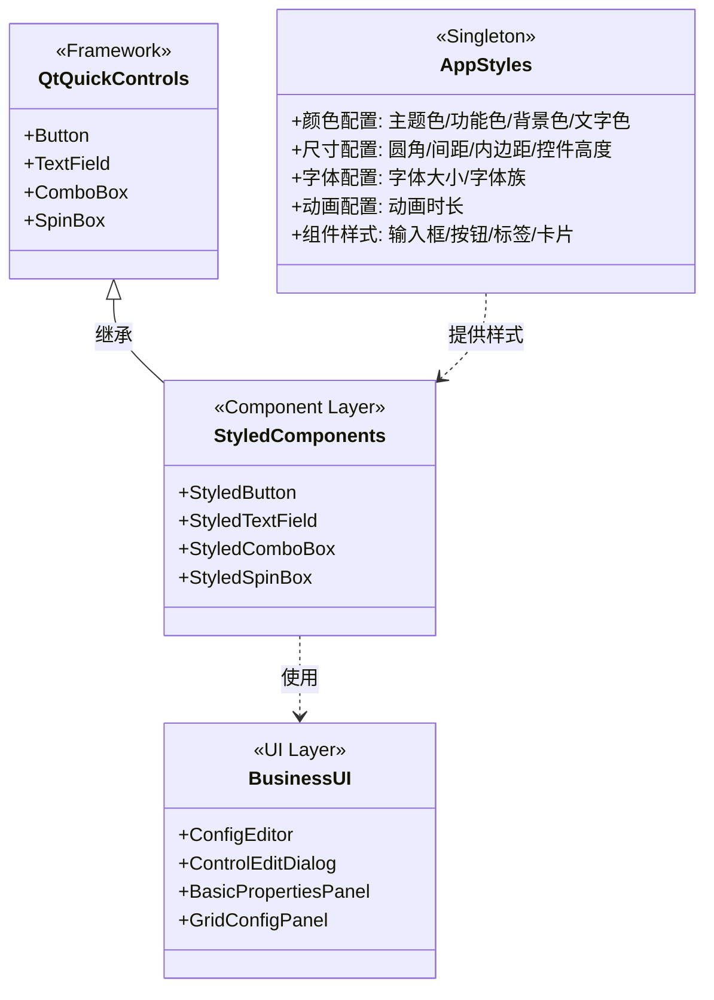
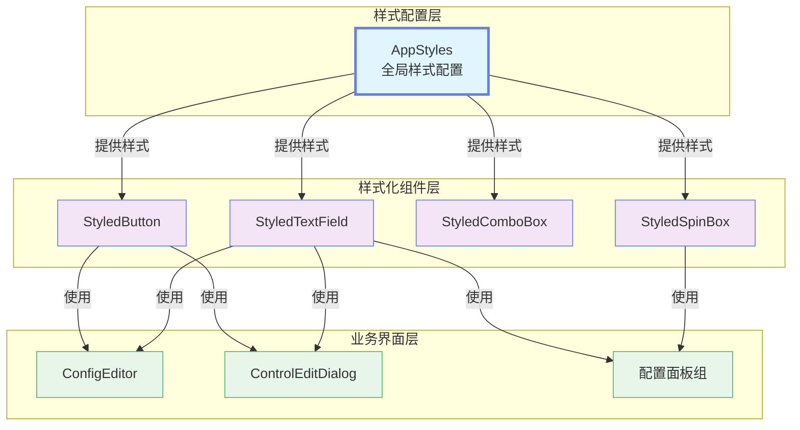
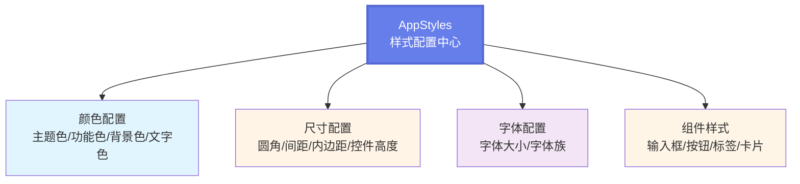
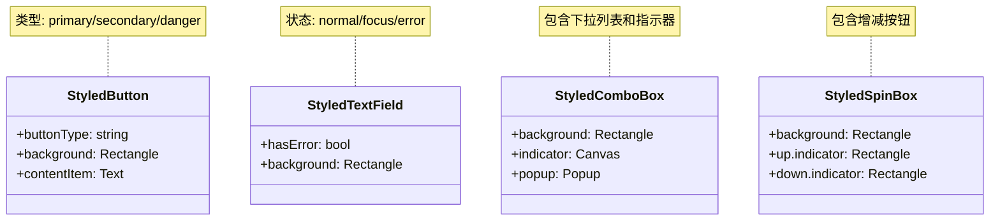
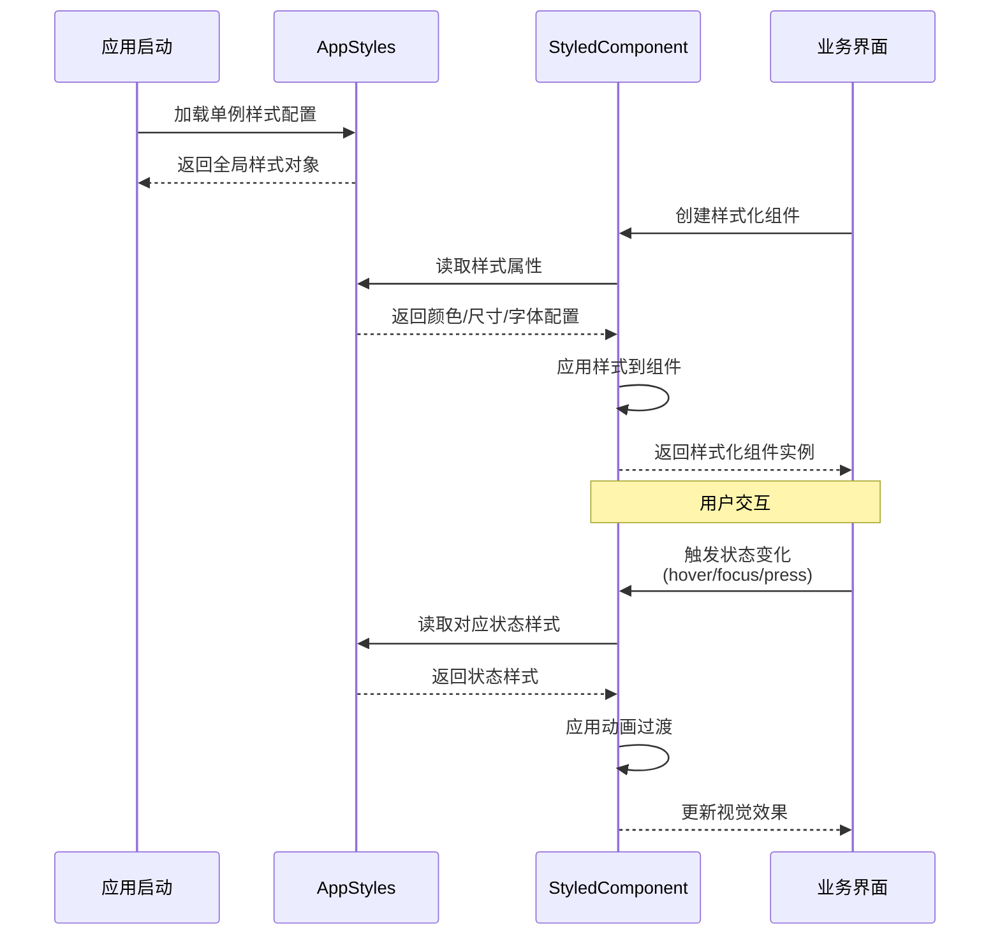

# 动态表单系统 - 样式系统类图

## 样式系统架构概述

动态表单系统采用统一的样式管理方案，通过单例模式的 `AppStyles` 提供全局样式配置，所有样式化组件继承自 Qt Quick Controls 基础控件并应用统一样式。

---

## 样式系统类图（简化版）



---

## 样式系统组件关系图（简化版）



---

## 样式属性分类图（简化版）



---

## 样式化组件结构（简化版）



---

## 样式应用流程图



---

## 样式系统数据字典

### AppStyles 配置属性表

| 分类 | 属性名 | 类型 | 默认值 | 说明 |
|------|--------|------|--------|------|
| **主题色** | primaryColor | color | #667eea | 主色调（紫色） |
| | primaryDark | color | #5568d3 | 主色调深色 |
| | primaryLight | color | #7c8ef5 | 主色调浅色 |
| **功能色** | accentColor | color | #48bb78 | 强调色（绿色） |
| | dangerColor | color | #f56565 | 危险色（红色） |
| | warningColor | color | #ed8936 | 警告色（橙色） |
| | infoColor | color | #4299e1 | 信息色（蓝色） |
| **背景色** | backgroundColor | color | #f7fafc | 背景色 |
| | surfaceColor | color | #ffffff | 表面色 |
| | borderColor | color | #e2e8f0 | 边框色 |
| **文字色** | textPrimary | color | #2d3748 | 主要文字 |
| | textSecondary | color | #718096 | 次要文字 |
| | textDisabled | color | #a0aec0 | 禁用文字 |
| **圆角** | radiusSmall | int | 4 | 小圆角 |
| | radiusMedium | int | 8 | 中圆角 |
| | radiusLarge | int | 12 | 大圆角 |
| **间距** | spacingSmall | int | 8 | 小间距 |
| | spacingMedium | int | 12 | 中间距 |
| | spacingLarge | int | 16 | 大间距 |
| **字体** | fontSizeSmall | int | 12 | 小字体 |
| | fontSizeMedium | int | 14 | 中字体 |
| | fontSizeLarge | int | 16 | 大字体 |
| | fontFamily | string | Microsoft YaHei | 字体族 |
| **控件** | controlHeightMedium | int | 40 | 中控件高度 |
| | inputHeight | int | 40 | 输入框高度 |
| | buttonHeight | int | 40 | 按钮高度 |
| **动画** | animationDuration | int | 200 | 动画时长（毫秒） |

### 样式化组件属性表

| 组件 | 特有属性 | 类型 | 说明 |
|------|---------|------|------|
| **StyledButton** | buttonType | string | 按钮类型：primary/secondary/danger |
| **StyledTextField** | hasError | bool | 是否显示错误状态 |
| **StyledComboBox** | - | - | 无特有属性 |
| **StyledSpinBox** | - | - | 无特有属性 |

---

## 样式系统设计原则

### 1. 单一数据源
- 所有样式配置集中在 `AppStyles` 单例中
- 避免硬编码样式值，统一从 AppStyles 读取

### 2. 组件化封装
- 每个样式化组件继承自 Qt Quick Controls 基础控件
- 封装样式逻辑，对外提供简洁的 API

### 3. 状态驱动
- 根据组件状态（normal/hover/focus/pressed/disabled）动态应用样式
- 使用 Behavior 实现平滑的状态过渡动画

### 4. 主题一致性
- 统一的颜色方案、字体、间距、圆角
- 保证整个应用的视觉一致性

### 5. 可扩展性
- 易于添加新的样式化组件
- 易于修改全局样式配置

---

## 使用示例

### 在 QML 中使用样式化组件

```qml
import QtQuick 6.5
import QtQuick.Controls 6.5
import Common 1.0  // 导入 AppStyles

Rectangle {
    width: 400
    height: 300
    color: AppStyles.backgroundColor
    
    Column {
        anchors.centerIn: parent
        spacing: AppStyles.spacingMedium
        
        // 使用样式化文本框
        StyledTextField {
            width: 300
            placeholderText: "请输入用户名"
            hasError: false
        }
        
        // 使用样式化按钮
        StyledButton {
            width: 300
            text: "提交"
            buttonType: "primary"
            onClicked: {
                console.log("按钮被点击")
            }
        }
        
        // 使用样式化下拉框
        StyledComboBox {
            width: 300
            model: ["选项1", "选项2", "选项3"]
        }
        
        // 使用样式化数字框
        StyledSpinBox {
            width: 300
            from: 0
            to: 100
            value: 50
        }
    }
}
```

### 直接使用 AppStyles 配置

```qml
Rectangle {
    color: AppStyles.surfaceColor
    border.color: AppStyles.borderColor
    border.width: 1
    radius: AppStyles.radiusMedium
    
    Text {
        text: "标题"
        font.pixelSize: AppStyles.fontSizeLarge
        font.family: AppStyles.fontFamily
        color: AppStyles.textPrimary
    }
}
```

---

## 总结

动态表单系统的样式系统具有以下特点：

1. **集中管理**：通过 AppStyles 单例统一管理所有样式配置
2. **组件封装**：提供 StyledButton、StyledTextField 等样式化组件
3. **状态响应**：根据交互状态动态应用样式，提供流畅的视觉反馈
4. **易于维护**：修改 AppStyles 即可全局更新样式
5. **一致性强**：保证整个应用的视觉风格统一

这种设计使得样式管理变得简单高效，同时保持了良好的可扩展性和可维护性。
